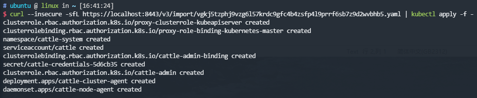
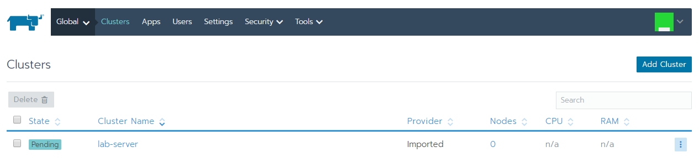
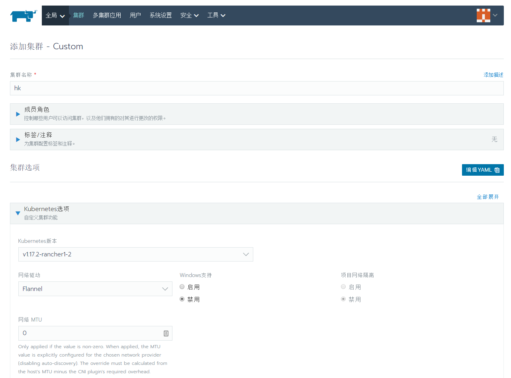
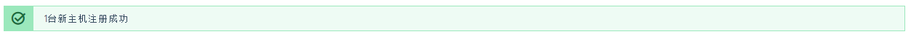
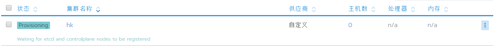

# 使用 Rancher 部署

Rancher 是在 Kubernetes 更上层的管理框架，Rancher 是图形化的，有着比较傻瓜式的操作，只有少量一两处地方（如导入集群）需要用到 Kubernetes 命令行。也由于它提供了一系列容器模版、应用商店等的高层功能，使得要在 Kubernetes 上部署一个新应用，简化到甚至只需要点几下鼠标即可，因此用户们都爱使用它。

Rancher 还推出了 RancherOS（极致精简专为容器定制的 Linux，尤其适合边缘计算环境）、K3S（Kubernetes as a Service，5 Less Than K8S，一个大约只有 40MB，可以运行在 x86 和 ARM 架构上的极小型 Kubernetes 发行版）这样的定制产品，用以在用户心中暗示、强化比 K8S 更小、更简单、更易用的主观印象。

不过也由于 Rancher 入门容易，基础性的应用需求解决起来很方便，也导致了不少人一开始使用它之后，就陷入了先入为主的印象，后期再接触 Kubernetes 时，便觉得学习曲线特别陡峭，反而限制了某些用户对底层问题的进一步深入。

在本文中，笔者以截图为主，展示如何使用 Rancher 来导入或者创建 Kubernetes 集群的过程。

## 安装 Rancher

前置条件：已经[安装好 Docker](../setup-docker.md)。

使用 Docker 执行 Rancher 镜像，执行以下命令即可：

```bash
$ sudo docker run -d --restart=unless-stopped -p 8080:80 -p 8443:443 rancher/rancher
```

## 使用 Rancher 管理现有 Kubernetes 集群

前置条件：已经[安装好了 Kubernetes 集群](setup-kubeadm.md)。

使用 Rancher 的导入功能将已部署的 Kubernetes 集群纳入其管理。登陆 Rancher 主界面（首次登陆会要求设置 admin 密码和 Rancher 在集群中可访问的路径，后者尤其不能乱设，否则 Kubernetes 无法访问到 Rancher 会一直处于 Pending 等待状态）之后，点击右上角的 Add Cluster，然后有下面几个添加集群的选择：

:::center

:::

- 要从某台机器中新安装 Kubernetes 集群选择“From existing nodes \(Custom\)”
- 要导入某个已经安装好的 Kubernetes 集群选择“Import an existing cluster”
- 要从各种云服务商的 RKE（Rancher Kubernetes Engine）环境中创建，就选择下面那排厂商的按钮，没有的话（譬如国内的阿里云之类的），请先到 Tools-&gt;Driver 中安装对应云服务厂商的驱动。

这里选择“Import an existing cluster”，然后给集群起个名字以便区分（由于 Rancher 支持多集群管理，所以集群得有个名字以示区别），之后就看见这个界面：
:::center

:::
Rancher 自动生成了加入集群的命令，这行命令其实就是部署一个运行在 Kubernetes 中的代理（Agent），在 Kubernetes 的命令行中执行以上自动生成的命令。

最后那条命令意思是怕由于部署的 Rancher 服务没有申请 SSL 证书，导致 HTTPS 域名验证过不去，kubectl 下载不下来 yaml。如果你的 Rancher 部署在已经申请了证书的 HTTPS 地址上那可以用前面的，否则还是直接用 curl --insecure 命令来绕过 HTTPS 证书查验吧，譬如以下命令所示：

```bash
$ curl --insecure -sfL https://localhost:8443/v3/import/vgkj5tzphj9vzg6l57krdc9gfc4b4zsfp4l9prrf6sb7z9d2wvbhb5.yaml | kubectl apply -f -
```

多说一句，用哪条命令安装的 Agent 只决定了 yaml 文件是如何下载获得的，对后续其他事情是毫无影响的，所以怎么简单怎么来，别折腾。

执行结果类似如下所示，一堆 secret、deployment、daementset 创建成功，就代表顺利完成了：
:::center

:::
然后回到 Rancher 网页，点击界面上的“Done”按钮。可以看到集群正处于 Pending 状态：
:::center

:::
如果 Agent 成功到达 Running 状态的话，这里也会很快就变成 Waiting 状态，然后再变为 Active 状态，导入工作即宣告胜利结束。

而如果一直持续 Pending 状态，说明安装的 Agent 运行失败。典型的原因是无法访问到 Rancher 的服务器，这时可以通过 kubectl logs 命令查看一下 cattle-cluster-agent-xxx 的日志，通常会看见"XXX is not accessible"，其中的 XXX 是 Rancher 第一次进入时跟你确认过的访问地址，假如你乱填了，或者该地址被防火墙挡掉，又或者因为证书限制等其他原因导致 Agent 无法访问，Rancher 就会一直 Pending。

最后再提一句，Rancher 与 Kubernetes 集群之间是被动链接的，即由 Kubernetes 去主动找 Rancher，这意味着部署在外网的 Rancher，可以无障碍地管理处于内网（譬如 NAT 后）的 Kubernetes 集群，这对于大量没有公网 IP 的集群来说是很方便的事情。

## 使用 Rancher 创建 Kubernetes 集群

也可以直接使用 Rancher 直接在裸金属服务器上创建 Kubernetes 集群，此时在添加集群中选择 From existing nodes \(Custom\)，在自定义界面中，设置要安装的集群名称、Kubernetes 版本、CNI 网络驱动、私有镜像库以及其他一些集群的参数选项。

:::center

:::

下一步确认该主机在 Kubernetes 中扮演的角色，每台主机可以扮演多个角色。但至少要保证每个集群都有一个 Etcd 角色、一个 Control 角色、一个 Worker 角色。

:::center

:::

复制生成的命令，在要安装集群的每一台主机的 SSH 中执行。此时 Docker 会下载运行 Rancher 的 Agent 镜像，当执行成功后，Rancher 界面会有提示新主机注册成功。

:::center

:::

点击完成，将会在集群列表中看见正在 Provisioning 的新集群，稍后将变为 Active 状态.

:::center

:::

安装完成后你就可以在 Rancher 的图形界面管理 Kubernetes 集群了，如果还需要在命令行中工作，kubectl、kubeadm 等工具是没有安装的，可参考“[使用 Kubeadm 部署 Kubernetes 集群](setup-kubeadm)”的内容安装使用。
