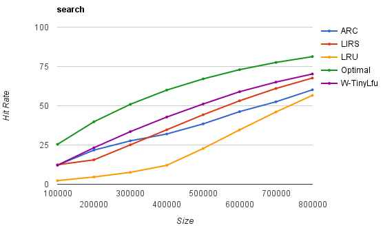
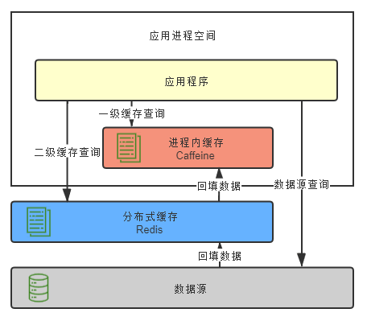

# 服务端缓存

::: tip 缓存（Cache）

软件开发中的缓存并非多多益善，它有收益，也有风险。

:::

笔者介绍透明多级分流系统的逻辑脉络，是以流量从客户端中发出为起始，以流量到达服务器集群中真正处理业务的节点为终结，探索该过程中与业务无关的通用组件。很难清楚界定服务端缓存到底算不算与业务逻辑无关，不过，既然本章以“客户端缓存”为开篇，那“服务端缓存”作为结束，倒是十分合适的，在这一节里，笔者所说的“缓存”，均特指服务端缓存。

为系统引入缓存之前，第一件事情是确认你的系统是否真的需要缓存。很多人会有意无意地把硬件里那种常用于区分不同产品档次、“多多益善”的缓存（如 CPU L1/2/3 缓存、磁盘缓存，等等）代入软件开发中去，实际上这两者差别很大，在软件开发中引入缓存的负面作用要明显大于硬件的缓存：从开发角度来说，引入缓存会提高系统复杂度，因为你要考虑缓存的失效、更新、一致性等问题（硬件缓存也有这些问题，只是不需要由你去考虑，主流的 ISA 也都没有提供任何直接操作缓存的指令）；从运维角度来说，缓存会掩盖掉一些缺陷，让问题在更久的时间以后，出现在距离发生现场更远的位置上；从安全角度来说，缓存可能泄漏某些保密数据，也是容易受到攻击的薄弱点。冒着上述种种风险，仍能说服你引入缓存的理由，总结起来无外乎以下两种：

- 为缓解 CPU 压力而做缓存：譬如把方法运行结果存储起来、把原本要实时计算的内容提前算好、把一些公用的数据进行复用，这可以节省 CPU 算力，顺带提升响应性能。
- 为缓解 I/O 压力而做缓存：譬如把原本对网络、磁盘等较慢介质的读写访问变为对内存等较快介质的访问，将原本对单点部件（如数据库）的读写访问变为到可扩缩部件（如缓存中间件）的访问，顺带提升响应性能。

请注意，缓存虽然是典型以空间换时间来提升性能的手段，但它的出发点是缓解 CPU 和 I/O 资源在峰值流量下的压力，“顺带”而非“专门”地提升响应性能。这里的言外之意是如果可以通过增强 CPU、I/O 本身的性能（譬如扩展服务器的数量）来满足需要的话，那升级硬件往往是更好的解决方案，即使需要一些额外的投入成本，也通常要优于引入缓存后可能带来的风险。

## 缓存属性

有不少软件系统最初的缓存功能是以 HashMap 或者 ConcurrentHashMap 为起点演进的。当开发人员发现系统中某些资源的构建成本比较高，而这些资源又有被重复使用的可能性时，会很自然地产生“循环再利用”的想法，将它们放到 Map 容器中，下次需要时取出重用，避免重新构建，这种原始朴素的复用就是最基本的缓存了。不过，一旦我们专门把“缓存”看作一项技术基础设施，一旦它有了通用、高效、可统计、可管理等方面的需求，其中要考虑的因素就变得复杂起来。通常，我们设计或者选择缓存至少会考虑以下四个维度的属性：

- **吞吐量**：缓存的吞吐量使用 OPS 值（每秒操作数，Operations per Second，ops/s）来衡量，反映了对缓存进行**并发**读、写操作的效率，即缓存本身的工作效率高低。
- **命中率**：缓存的命中率即成功从缓存中返回结果次数与总请求次数的比值，反映了引入缓存的价值高低，命中率越低，引入缓存的收益越小，价值越低。
- **扩展功能**：缓存除了基本读写功能外，还提供哪些额外的管理功能，譬如最大容量、失效时间、失效事件、命中率统计，等等。
- **分布式支持**：缓存可分为“进程内缓存”和“分布式缓存”两大类，前者只为节点本身提供服务，无网络访问操作，速度快但缓存的数据不能在各个服务节点中共享，后者则相反。

### 吞吐量

缓存的吞吐量只在并发场景中才有统计的意义，因为不考虑并发的话，即使是最原始的、以 HashMap 实现的缓存，访问效率也已经是常量时间复杂度，即 O(1)，其中涉及到碰撞、扩容等场景的处理属于数据结构基础，这里不展开。但 HashMap 并不是线程安全的容器，如果要让它在多线程并发下能正确地工作，就要用 Collections.synchronizedMap 进行包装，这相当于给 Map 接口的所有访问方法都自动加全局锁；或者改用 ConcurrentHashMap 来实现，这相当于给 Map 的访问分段加锁（从 JDK 8 起已取消分段加锁，改为 CAS+Synchronized 锁单个元素）。无论采用怎样的实现方法，线程安全措施都会带来一定的吞吐量损失。

进一步说，如果只比较吞吐量，完全不去考虑命中率、淘汰策略、缓存统计、过期失效等功能该如何实现，那也不必选择，JDK 8 改进之后的 ConcurrentHashMap 基本上就是你能找到的吞吐量最高的缓存容器了。可是很多场景里，以上提及的功能至少有部分一两项是必须的，不可能完全不考虑，这才涉及到不同缓存方案的权衡问题。

根据 Caffeine 给出的一组目前业界主流进程内缓存实现方案，包括有 Caffeine、ConcurrentLinkedHashMap、LinkedHashMap、Guava Cache、Ehcache 和 Infinispan Embedded 的对比，从[Benchmarks](https://github.com/ben-manes/caffeine/wiki/Benchmarks?spm=a2c4e.10696291.0.0.319f19a4dRjjn6#read-100-1)中体现出的它们在 8 线程、75%读操作、25%写操作下的吞吐量来看，各种缓存组件库的性能差异还是十分明显的，最高与最低的相差了足有一个数量级，具体如图 4-12 所示。
:::center

图 4-12 8 线程、75%读、25%写的吞吐量比较（图片来自[Caffeine](https://github.com/ben-manes/caffeine/wiki/Benchmarks)）
:::

这种并发读写的场景中，吞吐量受多方面因素的共同影响，譬如，怎样设计数据结构以尽可能避免数据竞争，存在竞争风险时怎样处理同步（主要有使用锁实现的悲观同步和使用[CAS](https://en.wikipedia.org/wiki/Compare-and-swap)实现的乐观同步）、如何避免[伪共享现象](https://en.wikipedia.org/wiki/False_sharing)（False Sharing，这也算是典型缓存提升开发复杂度的例子）发生，等等。其中第一点尽可能避免竞争是最关键的，无论如何实现同步都不会比直接无须同步更快，笔者下面以 Caffeine 为例，介绍一些缓存如何避免竞争、提高吞吐量的设计。

缓存中最主要的数据竞争源于读取数据的同时，也会伴随着对数据状态的写入操作，写入数据的同时，也会伴随着数据状态的读取操作。譬如，读取时要同时更新数据的最近访问时间和访问计数器的状态（后文会提到，为了追求高效，可能不会记录时间和次数，譬如通过调整链表顺序来表达时间先后、通过 Sketch 结构来表达热度高低），以实现缓存的淘汰策略；又或者读取时要同时判断数据的超期时间等信息，以实现失效重加载等其他扩展功能。对以上伴随读写操作而来的状态维护，有两种可选择的处理思路，一种是以 Guava Cache 为代表的同步处理机制，即在访问数据时一并完成缓存淘汰、统计、失效等状态变更操作，通过分段加锁等优化手段来尽量减少竞争。另一种是以 Caffeine 为代表的异步日志提交机制，这种机制参考了经典的数据库设计理论，将对数据的读、写过程看作是日志（即对数据的操作指令）的提交过程。尽管日志也涉及到写入操作，有并发的数据变更就必然面临锁竞争，但异步提交的日志已经将原本在 Map 内的锁转移到日志的追加写操作上，日志里腾挪优化的余地就比在 Map 中要大得多。

在 Caffeine 的实现中，设有专门的[环形缓存区](https://en.wikipedia.org/wiki/Circular_buffer)（Ring Buffer，也常称作 Circular Buffer）来记录由于数据读取而产生的状态变动日志。为进一步减少竞争，Caffeine 给每条线程（对线程取 Hash，哈希值相同的使用同一个缓冲区）都设置一个专用的环形缓冲。

:::quote 额外知识：环形缓冲

所谓环形缓冲，并非 Caffeine 的专有概念，它是一种拥有读、写两个指针的数据复用结构，在计算机科学中有非常广泛的应用。举个具体例子，譬如一台计算机通过键盘输入，并通过 CPU 读取“HELLO WIKIPEDIA”这个长 14 字节的单词，通常需要一个至少 14 字节以上的缓冲区才行。但如果是环形缓冲结构，读取和写入就应当一起进行，在读取指针之前的位置均可以重复使用，理想情况下，只要读取指针不落后于写入指针一整圈，这个缓冲区就可以持续工作下去，能容纳无限多个新字符。否则，就必须阻塞写入操作去等待读取清空缓冲区。

:::center

环形缓存区工作原理（图片来自[维基百科](https://en.wikipedia.org/wiki/File:Circular_Buffer_Animation.gif)）
:::

从 Caffeine 读取数据时，数据本身会在其内部的 ConcurrentHashMap 中直接返回，而数据的状态信息变更就存入环形缓冲中，由后台线程异步处理。如果异步处理的速度跟不上状态变更的速度，导致缓冲区满了，那此后接收的状态的变更信息就会直接被丢弃掉，直至缓冲区重新富余。通过环形缓冲和容忍有损失的状态变更，Caffeine 大幅降低了由于数据读取而导致的垃圾收集和锁竞争，因此 Caffeine 的读取性能几乎能与 ConcurrentHashMap 的读取性能相同。

向 Caffeine 写入数据时，将使用传统的有界队列（ArrayQueue）来存放状态变更信息，写入带来的状态变更是无损的，不允许丢失任何状态，这是考虑到许多状态的默认值必须通过写入操作来完成初始化，因此写入会有一定的性能损失。根据 Caffeine 官方给出的数据，相比 ConcurrentHashMap，Caffeine 在写入时大约会慢 10%左右。

### 命中率与淘汰策略

有限的物理存储决定了任何缓存的容量都不可能是无限的，所以缓存需要在消耗空间与节约时间之间取得平衡，这要求缓存必须能够自动或者由人工淘汰掉缓存中的低价值数据，由人工管理的缓存淘汰主要取决于开发者如何编码，不能一概而论，这里只讨论由缓存自动进行淘汰的情况。笔者所说的“缓存如何自动地实现淘汰低价值目标”，现在被称为缓存的淘汰策略，也常称作替换策略或者清理策略。

缓存实现自动淘汰低价值数据的容器之前，首先要定义怎样的数据才算是“低价值”？由于缓存的通用性，这个问题的答案必须是与具体业务逻辑是无关的，只能从缓存工作过程收集到的统计结果来确定数据是否有价值，通用的统计结果包括但不限于数据何时进入缓存、被使用过多少次、最近什么时候被使用，等等。由此决定了一旦确定选择何种统计数据，及如何通用地、自动地判定缓存中每个数据价值高低，也相当于决定了缓存的淘汰策略是如何实现的。目前，最基础的淘汰策略实现方案有以下三种：

- **FIFO**（First In First Out）：优先淘汰最早进入被缓存的数据。FIFO 实现十分简单，但一般来说它并不是优秀的淘汰策略，越是频繁被用到的数据，往往会越早被存入缓存之中。如果采用这种淘汰策略，很可能会大幅降低缓存的命中率。
- **LRU**（Least Recent Used）：优先淘汰最久未被使用访问过的数据。LRU 通常会采用 HashMap 加 LinkedList 双重结构（如 LinkedHashMap）来实现，以 HashMap 来提供访问接口，保证常量时间复杂度的读取性能，以 LinkedList 的链表元素顺序来表示数据的时间顺序，每次缓存命中时把返回对象调整到 LinkedList 开头，每次缓存淘汰时从链表末端开始清理数据。对大多数的缓存场景来说，LRU 都明显要比 FIFO 策略合理，尤其适合用来处理短时间内频繁访问的热点对象。但相反，它的问题是如果一些热点数据在系统中经常被频繁访问，但最近一段时间因为某种原因未被访问过，此时这些热点数据依然要面临淘汰的命运，LRU 依然可能错误淘汰价值更高的数据。
- **LFU**（Least Frequently Used）：优先淘汰最不经常使用的数据。LFU 会给每个数据添加一个访问计数器，每访问一次就加 1，需要淘汰时就清理计数器数值最小的那批数据。LFU 可以解决上面 LRU 中热点数据间隔一段时间不访问就被淘汰的问题，但同时它又引入了两个新的问题，首先是需要对每个缓存的数据专门去维护一个计数器，每次访问都要更新，在上一节“吞吐量”里解释了这样做会带来高昂的维护开销；另一个问题是不便于处理随时间变化的热度变化，譬如某个曾经频繁访问的数据现在不需要了，它也很难自动被清理出缓存。

缓存淘汰策略直接影响缓存的命中率，没有一种策略是完美的、能够满足全部系统所需的。不过，随着淘汰算法的发展，近年来的确出现了许多相对性能要更好的，也更为复杂的新算法。以 LFU 分支为例，针对它存在的两个问题，近年来提出的 TinyLFU 和 W-TinyLFU 算法就往往会有更好的效果。

- **TinyLFU**（Tiny Least Frequently Used）：TinyLFU 是 LFU 的改进版本。为了缓解 LFU 每次访问都要修改计数器所带来的性能负担，TinyLFU 会首先采用 Sketch 对访问数据进行分析，所谓 Sketch 是统计学上的概念，指用少量的样本数据来估计全体数据的特征，这种做法显然牺牲了一定程度的准确性，但是只要样本数据与全体数据具有相同的概率分布，Sketch 得出的结论仍不失为一种高效与准确之间权衡的有效结论。借助[Count–Min Sketch](https://en.wikipedia.org/wiki/Count%E2%80%93min_sketch)算法（可视为[布隆过滤器](https://en.wikipedia.org/wiki/Bloom_filter)的一种等价变种结构），TinyLFU 可以用相对小得多的记录频率和空间来近似地找出缓存中的低价值数据。为了解决 LFU 不便于处理随时间变化的热度变化问题，TinyLFU 采用了基于“滑动时间窗”（在“[流量控制](/distribution/traffic-management/traffic-control.html)”中我们会更详细地分析这种算法）的热度衰减算法，简单理解就是每隔一段时间，便会把计数器的数值减半，以此解决“旧热点”数据难以清除的问题。
- **[W-TinyLFU](https://arxiv.org/pdf/1512.00727.pdf)**（Windows-TinyLFU）：W-TinyLFU 又是 TinyLFU 的改进版本。TinyLFU 在实现减少计数器维护频率的同时，也带来了无法很好地应对稀疏突发访问的问题，所谓稀疏突发访问是指有一些绝对频率较小，但突发访问频率很高的数据，譬如某些运维性质的任务，也许一天、一周只会在特定时间运行一次，其余时间都不会用到，此时 TinyLFU 就很难让这类元素通过 Sketch 的过滤，因为它们无法在运行期间积累到足够高的频率。应对短时间的突发访问是 LRU 的强项，W-TinyLFU 就结合了 LRU 和 LFU 两者的优点，从整体上看是 LFU 策略，从局部实现上看又是 LRU 策略。具体做法是将新记录暂时放入一个名为 Window Cache 的前端 LRU 缓存里面，让这些对象可以在 Window Cache 中累积热度，如果能通过 TinyLFU 的过滤器，再进入名为 Main Cache 的主缓存中存储，主缓存根据数据的访问频繁程度分为不同的段（LFU 策略，实际上 W-TinyLFU 只分了两段），但单独某一段局部来看又是基于 LRU 策略去实现的（称为 Segmented LRU）。每当前一段缓存满了之后，会将低价值数据淘汰到后一段中去存储，直至最后一段也满了之后，该数据就彻底清理出缓存。

仅靠以上简单的、有限的介绍，你不一定能完全理解 TinyLFU 和 W-TinyLFU 的工作原理，但肯定能看出这些改进算法比起原来基础版本的 LFU 要复杂了许多。有时候为了取得理想的效果，采用较为复杂的淘汰策略是不得已的选择，Caffeine 官方给出的 W-TinyLFU 以及另外两种高级淘汰策略[ARC](https://en.wikipedia.org/wiki/Adaptive_replacement_cache)（Adaptive Replacement Cache）、[LIRS](https://en.wikipedia.org/wiki/LIRS_caching_algorithm)（Low Inter-Reference Recency Set）与基础的 LFU 策略之间的对比，如图 4-13 所示。

:::center

图 4-13 几种淘汰算法在搜索场景下的命中率对比（图片来自[Caffeine](https://github.com/ben-manes/caffeine/wiki/Efficiency)）
:::

在搜索场景中，三种高级策略的命中率较为接近于理想曲线（Optimal），而 LRU 则差距最远，[Caffeine 官方给出的](https://github.com/ben-manes/caffeine/wiki/Efficiency)数据库、网站、分析类等应用场景中，这几种策略之间的绝对差距不尽相同，但相对排名基本上没有改变，最基础的淘汰策略的命中率是最低的。对其他缓存淘汰策略感兴趣的读者可以参考维基百科中对[Cache Replacement Policies](https://en.wikipedia.org/wiki/Cache_replacement_policies)的介绍。

### 扩展功能

一般来说，一套标准的 Map 接口（或者来自[JSR 107](https://jcp.org/en/jsr/detail?id=107)的 javax.cache.Cache 接口）就可以满足缓存访问的基本需要，不过在“访问”之外，专业的缓存往往还会提供很多额外的功能。笔者简要列举如下：

- **加载器**：许多缓存都有“CacheLoader”之类的设计，加载器可以让缓存从只能被动存储外部放入的数据，变为能够主动通过加载器去加载指定 Key 值的数据，加载器也是实现自动刷新功能的基础前提。
- **淘汰策略**：有的缓存淘汰策略是固定的，也有一些缓存能够支持用户自己根据需要选择不同的淘汰策略。
- **失效策略**：要求缓存的数据在一定时间后自动失效（移除出缓存）或者自动刷新（使用加载器重新加载）。
- **事件通知**：缓存可能会提供一些事件监听器，让你在数据状态变动（如失效、刷新、移除）时进行一些额外操作。有的缓存还提供了对缓存数据本身的监视能力（Watch 功能）。
- **并发级别**：对于通过分段加锁来实现的缓存（以 Guava Cache 为代表），往往会提供并发级别的设置。可以简单将其理解为缓存内部是使用多个 Map 来分段存储数据的，并发级别就用于计算出使用 Map 的数量。如果将这个参数设置过大，会引入更多的 Map，需要额外维护这些 Map 而导致更大的时间和空间上的开销；如果设置过小，又会导致在访问时产生线程阻塞，因为多个线程更新同一个 ConcurrentMap 的同一个值时会产生锁竞争。
- **容量控制**：缓存通常都支持指定初始容量和最大容量，初始容量目的是减少扩容频率，这与 Map 接口本身的初始容量含义是一致的。最大容量类似于控制 Java 堆的-Xmx 参数，当缓存接近最大容量时，会自动清理掉低价值的数据。
- **引用方式**：支持将数据设置为软引用或者弱引用，提供引用方式的设置是为了将缓存与 Java 虚拟机的垃圾收集机制联系起来。
- **统计信息**：提供诸如缓存命中率、平均加载时间、自动回收计数等统计。
- **持久化**：支持将缓存的内容存储到数据库或者磁盘中，进程内缓存提供持久化功能的作用不是太大，但分布式缓存大多都会考虑提供持久化功能。

至此，本节已简要介绍了缓存的三项属性：吞吐量、命中率和扩展功能，笔者将几款主流进程内缓存方案整理成表 4-4，供读者参考。

:::center

表 4-4 几款主流进程内缓存方案对比

:::

|          | ConcurrentHashMap    | Ehcache                                                                 | Guava Cache | Caffeine                          |
| -------- | -------------------- | ----------------------------------------------------------------------- | ----------- | --------------------------------- |
| 访问性能 | 最高                 | 一般                                                                    | 良好        | 优秀 接近于 ConcurrentHashMap |
| 淘汰策略 | 无                   | 支持多种淘汰策略 FIFO、LRU、LFU 等                                  | LRU         | W-TinyLFU                         |
| 扩展功能 | 只提供基础的访问接口 | 并发级别控制 失效策略 容量控制 事件通知 统计信息 …… | 大致同左    | 大致同左                          |

### 分布式缓存

相比起缓存数据在进程内存中读写的速度，一旦涉及网络访问，由网络传输、数据复制、序列化和反序列化等操作所导致的延迟要比内存访问高得多，所以对分布式缓存来说，处理与网络有相关的操作是对吞吐量影响更大的因素，往往也是比淘汰策略、扩展功能更重要的关注点，这决定了尽管也有 Ehcache、Infinispan 这类能同时支持分布式部署和进程内嵌部署的缓存方案，但通常进程内缓存和分布式缓存选型时会有完全不同的候选对象及考察点。我们决定使用哪种分布式缓存前，首先必须确认自己需求是什么？

- 从访问的角度来说，如果是频繁更新但甚少读取的数据，通常是不会有人把它拿去做缓存的，因为这样做没有收益。对于甚少更新但频繁读取的数据，理论上更适合做复制式缓存；对于更新和读取都较为频繁的数据，理论上就更适合做集中式缓存。笔者简要介绍这两种分布式缓存形式的差别与代表性产品：
  - **复制式缓存**：复制式缓存可以看作是“能够支持分布式的进程内缓存”，它的工作原理与 Session 复制类似。缓存中所有数据在分布式集群的每个节点里面都存在有一份副本，读取数据时无须网络访问，直接从当前节点的进程内存中返回，理论上可以做到与进程内缓存一样高的读取性能；当数据发生变化时，就必须遵循复制协议，将变更同步到集群的每个节点中，复制性能随着节点的增加呈现平方级下降，变更数据的代价十分高昂。 复制式缓存的代表是[JBossCache](https://jbosscache.jboss.org/)，这是 JBoss 针对企业级集群设计的缓存方案，支持 JTA 事务，依靠 JGroup 进行集群节点间数据同步。以 JBossCache 为典型的复制式缓存曾有一段短暂的兴盛期，但今天基本上已经很难再见到使用这种缓存形式的大型信息系统了，JBossCache 被淘汰的主要原因是写入性能实在差到不堪入目的程度，它在小规模集群中同步数据尚算差强人意，但在大规模集群下，很容易就因网络同步的速度跟不上写入速度，进而导致在内存中累计大量待重发对象，最终引发 OutOfMemory 崩溃。如果对 JBossCache 没有足够了解的话，稍有不慎就要被埋进坑里。 为了缓解复制式同步的写入效率问题，JBossCache 的继任者[Infinispan](https://infinispan.org/)提供了另一种分布式同步模式（这种同步模式的名字就叫做“分布式”），允许用户配置数据需要复制的副本数量，譬如集群中有八个节点，可以要求每个数据只保存四份副本，此时，缓存的总容量相当于是传统复制模式的一倍，如果要访问的数据在本地缓存中没有存储，Infinispan 完全有能力感知网络的拓扑结构，知道应该到哪些节点中寻找数据。
  - **集中式缓存**：集中式缓存是目前分布式缓存的主流形式，集中式缓存的读、写都需要网络访问，其好处是不会随着集群节点数量的增加而产生额外的负担，其坏处自然是读、写都不再可能达到进程内缓存那样的高性能。 集中式缓存还有一个必须提到的关键特点，它与使用缓存的应用分处在独立的进程空间中，其好处是它能够为异构语言提供服务，譬如用 C 语言编写的[Memcached](https://memcached.org/)完全可以毫无障碍地为 Java 语言编写的应用提供缓存服务；但其坏处是如果要缓存对象等复杂类型的话，基本上就只能靠序列化来支撑具体语言的类型系统（支持 Hash 类型的缓存，可以部分模拟对象类型），不仅有序列化的成本，还很容易导致传输成本也显著增加。举个例子，假设某个有 100 个字段的大对象变更了其中 1 个字段的值，通常缓存也不得不把整个对象所有内容重新序列化传输出去才能实现更新，因此，一般集中式缓存更提倡直接缓存原始数据类型而不是对象。相比之下，JBossCache 通过它的字节码自审（Introspection）功能和树状存储结构（TreeCache），做到了自动跟踪、处理对象的部分变动，用户修改了对象中哪些字段的数据，缓存就只会同步对象中真正变更那部分数据。 如今[Redis](https://redis.io/)广为流行，基本上已经打败了 Memcached 及其他集中式缓存框架，成为集中式缓存的首选，甚至可以说成为了分布式缓存的实质上的首选，几乎到了不必管读取、写入哪种操作更频繁，都可以无脑上 Redis 的程度。也因如此，之前说到哪些数据适合用复制式缓存、哪些数据适合集中式缓存时，笔者都在开头加了个拗口的“理论上”。尽管 Redis 最初设计的本意是 NoSQL 数据库而不是专门用来做缓存的，可今天它确实已经成为许多分布式系统中无可或缺的基础设施，广泛用作缓存的实现方案。
- 从数据一致性角度说，缓存本身也有集群部署的需求，理论上你应该认真考虑一下是否能接受不同节点取到的缓存数据有可能存在差异。譬如刚刚放入缓存中的数据，另外一个节点马上访问发现未能读到；刚刚更新缓存中的数据，另外一个节点访问在短时间内读取到的仍是旧的数据，等等。根据分布式缓存集群是否能保证数据一致性，可以将它分为 AP 和 CP 两种类型（在“[分布式事务](/architect-perspective/general-architecture/transaction/distributed.html)”中已介绍过 CAP 各自的含义）。此处又一次出现了“理论上”，是因为我们实际开发中通常不太会把追求强一致性的数据使用缓存来处理，可以这样做，但是没必要（可类比 MESI 等缓存一致性协议）。譬如，Redis 集群就是典型的 AP 式，有着高性能高可用等特点，却并不保证强一致性。而能够保证强一致性的 ZooKeeper、Doozerd、Etcd 等分布式协调框架，通常不会有人将它们当为“缓存框架”来使用，这些分布式协调框架的吞吐量相对 Redis 来说是非常有限的。不过 ZooKeeper、Doozerd、Etcd 倒是常与 Redis 和其他分布式缓存搭配工作，用来实现其中的通知、协调、队列、分布式锁等功能。

分布式缓存与进程内缓存各有所长，也有各有局限，它们是互补而非竞争的关系，如有需要，完全可以同时把进程内缓存和分布式缓存互相搭配，构成透明多级缓存（Transparent Multilevel Cache，TMC），如图 4-14 所示。先不考虑“透明”的话，多级缓存是很好理解的，使用进程内缓存做一级缓存，分布式缓存做二级缓存，如果能在一级缓存中查询到结果就直接返回，否则便到二级缓存中去查询，再将二级缓存中的结果回填到一级缓存，以后再访问该数据就没有网络请求了。如果二级缓存也查询不到，就发起对最终数据源的查询，将结果回填到一、二级缓存中去。

:::center

图 4-14 多级缓存
:::

尽管多级缓存结合了进程内缓存和分布式缓存的优点，但它的代码侵入性较大，需要由开发者承担多次查询、多次回填的工作，也不便于管理，如超时、刷新等策略都要设置多遍，数据更新更是麻烦，很容易会出现各个节点的一级缓存、以及二级缓存里数据互相不一致的问题。必须“透明”地解决以上问题，多级缓存才具有实用的价值。一种常见的设计原则是变更以分布式缓存中的数据为准，访问以进程内缓存的数据优先。大致做法是当数据发生变动时，在集群内发送推送通知（简单点的话可采用 Redis 的 PUB/SUB，求严谨的话引入 ZooKeeper 或 Etcd 来处理），让各个节点的一级缓存自动失效掉相应数据。当访问缓存时，提供统一封装好的一、二级缓存联合查询接口，接口外部是只查询一次，接口内部自动实现优先查询一级缓存，未获取到数据再自动查询二级缓存的逻辑。

## 缓存风险

本节开篇就提到，缓存不是多多益善，它属于有利有弊，是真正到必须使用时才考虑的解决方案。本节将介绍使用几种常见的缓存风险及其应对办法。

### 缓存穿透

缓存的目的是为了缓解 CPU 或者 I/O 的压力，譬如对数据库做缓存，大部分流量都从缓存中直接返回，只有缓存未能命中的数据请求才会流到数据库中，这样数据库压力自然就减小了。但是如果查询的数据在数据库中根本不存在的话，缓存里自然也不会有，这类请求的流量每次都不会命中，每次都会触及到末端的数据库，缓存就起不到缓解压力的作用了，这种查询不存在数据的现象被称为缓存穿透。

缓存穿透有可能是业务逻辑本身就存在的固有问题，也有可能是被恶意攻击的所导致，为了解决缓存穿透，通常会采取下面两种办法：

1. 对于业务逻辑本身就不能避免的缓存穿透，可以约定在一定时间内对返回为空的 Key 值依然进行缓存（注意是正常返回但是结果为空，不应把抛异常的也当作空值来缓存了），使得在一段时间内缓存最多被穿透一次。如果后续业务在数据库中对该 Key 值插入了新记录，那应当在插入之后主动清理掉缓存的 Key 值。如果业务时效性允许的话，也可以将对缓存设置一个较短的超时时间来自动处理。
2. 对于恶意攻击导致的缓存穿透，通常会在缓存之前设置一个布隆过滤器来解决。所谓恶意攻击是指请求者刻意构造数据库中肯定不存在的 Key 值，然后发送大量请求进行查询。布隆过滤器是用最小的代价来判断某个元素是否存在于某个集合的办法。如果布隆过滤器给出的判定结果是请求的数据不存在，那就直接返回即可，连缓存都不必去查。虽然维护布隆过滤器本身需要一定的成本，但比起攻击造成的资源损耗仍然是值得的。

### 缓存击穿

我们都知道缓存的基本工作原理是首次从真实数据源加载数据，完成加载后回填入缓存，以后其他相同的请求就从缓存中获取数据，缓解数据源的压力。如果缓存中某些热点数据忽然因某种原因失效了，譬如典型地由于超期而失效，此时又有多个针对该数据的请求同时发送过来，这些请求将全部未能命中缓存，都到达真实数据源中去，导致其压力剧增，这种现象被称为缓存击穿。要避免缓存击穿问题，通常会采取下面的两种办法：

1. 加锁同步，以请求该数据的 Key 值为锁，使得只有第一个请求可以流入到真实的数据源中，其他线程采取阻塞或重试策略。如果是进程内缓存出现问题，施加普通互斥锁即可，如果是分布式缓存中出现的问题，就施加分布式锁，这样数据源就不会同时收到大量针对同一个数据的请求了。
2. 热点数据由代码来手动管理，缓存击穿是仅针对热点数据被自动失效才引发的问题，对于这类数据，可以直接由开发者通过代码来有计划地完成更新、失效，避免由缓存的策略自动管理。

### 缓存雪崩

缓存击穿是针对单个热点数据失效，由大量请求击穿缓存而给真实数据源带来压力。有另一种可能是更普遍的情况，不需要是针对单个热点数据的大量请求，而是由于大批不同的数据在短时间内一起失效，导致了这些数据的请求都击穿了缓存到达数据源，同样令数据源在短时间内压力剧增。

出现这种情况，往往是系统有专门的缓存预热功能，也可能大量公共数据是由某一次冷操作加载的，这样都可能出现由此载入缓存的大批数据具有相同的过期时间，在同一时刻一起失效。还有一种情况是缓存服务由于某些原因崩溃后重启，此时也会造成大量数据同时失效，这种现象被称为缓存雪崩。要避免缓存雪崩问题，通常会采取下面的三种办法：

1. 提升缓存系统可用性，建设分布式缓存的集群。
2. 启用透明多级缓存，各个服务节点一级缓存中的数据通常会具有不一样的加载时间，也就分散了它们的过期时间。
3. 将缓存的生存期从固定时间改为一个时间段内的随机时间，譬如原本是一个小时过期，那可以缓存不同数据时，设置生存期为 55 分钟到 65 分钟之间的某个随机时间。

### 缓存污染

缓存污染是指缓存中的数据与真实数据源中的数据不一致的现象。尽管笔者在前面是说过缓存通常不追求强一致性，但这显然不能等同于缓存和数据源间连最终的一致性都可以不要求了。

缓存污染多数是由开发者更新缓存不规范造成的，譬如你从缓存中获得了某个对象，更新了对象的属性，但最后因为某些原因，譬如后续业务发生异常回滚了，最终没有成功写入到数据库，此时缓存的数据是新的，数据库中的数据是旧的。为了尽可能的提高使用缓存时的一致性，已经总结不少更新缓存可以遵循设计模式，譬如 Cache Aside、Read/Write Through、Write Behind Caching 等。其中最简单、成本最低的 Cache Aside 模式是指：

- 读数据时，先读缓存，缓存没有的话，再读数据源，然后将数据放入缓存，再响应请求。
- 写数据时，先写数据源，然后失效（而不是更新）掉缓存。

读数据方面一般没什么出错的余地，但是写数据时，就有必要专门强调两点：一是先后顺序是先数据源后缓存。试想一下，如果采用先失效缓存后写数据源的顺序，那一定存在一段时间缓存已经删除完毕，但数据源还未修改完成，此时新的查询请求到来，缓存未能命中，就会直接流到真实数据源中。这样请求读到的数据依然是旧数据，随后又重新回填到缓存中。当数据源的修改完成后，结果就成了数据在数据源中是新的，在缓存中是老的，两者就会有不一致的情况。另一点是应当失效缓存，而不是去尝试更新缓存，这很容易理解，如果去更新缓存，更新过程中数据源又被其他请求再次修改的话，缓存又要面临处理多次赋值的复杂时序问题。所以直接失效缓存，等下次用到该数据时自动回填，期间无论数据源中的值被改了多少次都不会造成任何影响。

Cache Aside 模式依然是不能保证在一致性上绝对不出问题的，否则就无须设计出[Paxos](/distribution/consensus/paxos.html)这样复杂的共识算法了。典型的出错场景是如果某个数据是从未被缓存过的，请求会直接流到真实数据源中，如果数据源中的写操作发生在查询请求之后，结果回填到缓存之前，也会出现缓存中回填的内容与数据库的实际数据不一致的情况。但这种情况的概率是很低的，Cache Aside 模式仍然是以低成本更新缓存，并且获得相对可靠结果的解决方案。
