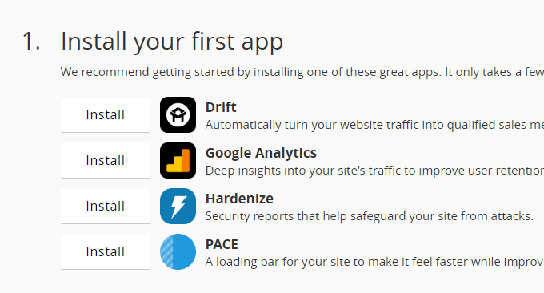

# 内容分发网络

::: tip 内容分发网络（Content Distribution Network）

CDN是一种十分古老而又十分透明，没什么存在感的分流系统，许多人都说听过它，但真正了解过它的人却很少。

:::

前面几个小节介绍了缓存、域名解析、链路优化，这节我们来讨论它们的一个经典的综合运用案例：内容分发网络（Content Distribution Network，CDN）。

CDN是一种十分古老的应用，以至于笔者相信阅读本文的受众至少有八、九成应该对它有不同程度的了解的——起码是听说过它的名字的。如果把某个互联网系统比喻为一家开门营业的企业，那CDN就是它遍布世界各地的分支销售机构，客户要买一块CPU就订机票飞到美国加州Intel总部去那肯定是不合适的，到本地电脑城找个装机铺才是正常人类的做法，CDN就相当于电脑城那吆喝着CPU三十块钱一斤的本地经销商。

CDN又是一种十分透明的应用，以至于笔者相信阅读本文的受众至少有八、九成应该对它是如何为互联网站点分流、对它的工作原理并没有什么系统性的概念——起码没有自己亲自使用过。如果抛却其他影响服务质量的因素，仅从网络角度看，一个互联网系统的速度快慢取决于以下四点因素：

1. 网站服务器接入网络运营商的链路所能提供的出口带宽。
2. 用户客户端接入网络运营商的链路所能提供的入口带宽。
3. 从网站到用户之间经过的不同运营商之间互联节点的带宽，一般来说两个运营商之间只有固定的若干个点是互通的，所有跨运营商之间的交互都要经过这些点。
4. 从网站到用户之间的物理链路传输时延。打游戏的同学都清楚，ping比流量更重要。

以上四个网络问题，除了第二个只能由用户掏腰包装个更好的宽带才能够解决之外，其余三个都能通过内容分发网络来显著改善的。一个工作良好的CDN，能为互联网系统解决跨运营商、跨地域物理距离所导致的时延问题，能为网站流量带宽起到分流、减负的作用。如果不是有遍布全国的阿里云CDN网络支持，哪怕把整个杭州所有市民上网的权力都剥夺，带宽全部让给淘宝，恐怕也撑不住双十一全国乃至全球用户的疯狂围攻。

CDN的工作过程，主要涉及到路由解析、内容分发、负载均衡（由于后面专门有一节讨论负载均衡的内容，所以这部分在CDN中就暂不涉及）和所能支持的应用内容四个方面，下面我们来逐一了解。

## 路由解析

根据我们在第二节中对DNS系统的介绍，一个未使用CDN的用户访问网站的过程应该是这样的：

<mermaid style="margin-bottom: 0px">
sequenceDiagram
    浏览器 ->> 本地DNS: 查询网站icyfenix.cn
    loop 递归查询
	    本地DNS ->> 权威DNS: 查询网站icyfenix.cn
	end
	权威DNS -->> 本地DNS: 地址:xx.xx.xx.xx
	本地DNS -->> 浏览器: 地址:xx.xx.xx.xx
	浏览器 ->> 网站服务器: 请求
	网站服务器 -->> 浏览器: 响应
</mermaid>

以上时序所表达的内容跟第二节中讲述的没有差异，这里仅列作对比，不再赘述。下面分析使用了CDN的DNS查询过程之前，我们先来看一段对本站进行DNS查询的实际应答。通过dig或者host命令，可以很方便地得到DNS服务器的返回结果（结果中头4个IP的地址是我手工加入的，后面的就不一个一个查了），如下所示：

```bash
$ dig icyfenix.cn

; <<>> DiG 9.11.3-1ubuntu1.8-Ubuntu <<>> icyfenix.cn
;; global options: +cmd
;; Got answer:
;; ->>HEADER<<- opcode: QUERY, status: NOERROR, id: 60630
;; flags: qr rd ra; QUERY: 1, ANSWER: 17, AUTHORITY: 0, ADDITIONAL: 1

;; OPT PSEUDOSECTION:
; EDNS: version: 0, flags:; udp: 65494
;; QUESTION SECTION:
;icyfenix.cn.                   IN      A

;; ANSWER SECTION:
icyfenix.cn.            600     IN      CNAME   icyfenix.cn.cdn.dnsv1.com.
icyfenix.cn.cdn.dnsv1.com. 599  IN      CNAME   4yi4q4z6.dispatch.spcdntip.com.
4yi4q4z6.dispatch.spcdntip.com.	60 IN	A	101.71.72.192      #浙江宁波市
4yi4q4z6.dispatch.spcdntip.com.	60 IN	A	113.200.16.234     #陕西省榆林市
4yi4q4z6.dispatch.spcdntip.com.	60 IN	A	116.95.25.196      #内蒙古自治区呼和浩特市
4yi4q4z6.dispatch.spcdntip.com.	60 IN	A	116.178.66.65      #新疆维吾尔自治区乌鲁木齐市
4yi4q4z6.dispatch.spcdntip.com.	60 IN	A	118.212.234.144
4yi4q4z6.dispatch.spcdntip.com.	60 IN	A	211.91.160.228
4yi4q4z6.dispatch.spcdntip.com.	60 IN	A	211.97.73.224
4yi4q4z6.dispatch.spcdntip.com.	60 IN	A	218.11.8.232
4yi4q4z6.dispatch.spcdntip.com.	60 IN	A	221.204.166.70
4yi4q4z6.dispatch.spcdntip.com.	60 IN	A	14.204.74.140
4yi4q4z6.dispatch.spcdntip.com.	60 IN	A	43.242.166.88
4yi4q4z6.dispatch.spcdntip.com.	60 IN	A	59.80.39.110
4yi4q4z6.dispatch.spcdntip.com.	60 IN	A	59.83.204.12
4yi4q4z6.dispatch.spcdntip.com.	60 IN	A	59.83.204.14
4yi4q4z6.dispatch.spcdntip.com.	60 IN	A	59.83.218.235

;; Query time: 74 msec
;; SERVER: 127.0.0.53#53(127.0.0.53)
;; WHEN: Sat Apr 11 22:33:56 CST 2020
;; MSG SIZE  rcvd: 152
```

根据以上信息，查询“icyfenix.cn.”的查询结果首先返回了一个[CNAME记录](https://zh.wikipedia.org/wiki/CNAME%E8%AE%B0%E5%BD%95)（icyfenix.cn.cdn.dnsv1.com.），递归查询该CNAME时候，返回了另一个看起来更奇怪的CNAME（4yi4q4z6.dispatch.spcdntip.com.），最后，这个CNAME返回了十几个位于全国不同地区的A记录，很明显，那些A记录就是存有本站缓存的CDN节点。CDN路由解析的工作过程是：

1. 架设好服务器后，将服务器的IP地址在你的CDN服务商上注册为“源站”，注册后你会得到一个CNAME，即本例中的“icyfenix.cn.cdn.dnsv1.com.”。
2. 将得到的CNAME在你购买域名的DNS服务商上注册为一条CNAME记录。
3. 当发生一次未命中缓存的DNS查询时，域名服务商解析出CNAME后，返回给本地DNS，至此之后链路解析的主导权就开始由CDN的调度服务接管了。
4. 本地DNS查询CNAME时，能解析该CNAME的权威服务器只有CDN服务商的权威DNS，该DNS会根据一定的均衡策略和参数，如拓扑结构、容量、时延等，在全国各地能提供服务的CDN节点中挑选一个适合的，将它的IP返回给本地DNS。
5. 浏览器从本地DNS拿到IP，将该IP当作源站服务器来进行访问，此时该IP的CDN服务上可能有，也可能没有缓存源站的资源，这点将在稍后“内容分发”部分讨论。
6. CDN代替源站向用户提供所需的资源。

以上步骤反映在时序图上，将如下图所示：

<mermaid style="margin-bottom: 0px">
sequenceDiagram
    浏览器 ->> 本地DNS: 查询网站icyfenix.cn
    loop 递归查询
	    本地DNS ->> 域名的权威DNS: 查询网站icyfenix.cn
	end
	域名的权威DNS -->> 本地DNS: CNAME:icyfenix.cn.cdn.dnsv1.com.
	本地DNS -->> CNAME的权威DNS: 查询CNAME：icyfenix.cn.cdn.dnsv1.com.
	loop 递归查询
		CNAME的权威DNS ->> CNAME的权威DNS: 经过递归查询和负载均衡，确定合适的CDN
	end
	CNAME的权威DNS -->> 本地DNS: 地址:xx.xx.xx.xx
	本地DNS -->> 浏览器: 地址:xx.xx.xx.xx
	浏览器 ->> CDN服务器: 请求
	CDN服务器 ->> 源站服务器: 请求
	源站服务器 -->> CDN服务器: 响应
	CDN服务器 -->> 浏览器: 缓存并响应
</mermaid>

## 内容分发

通过智能化的路由解析，CDN节点实现了无论是对用户端还是服务端，都完全透明地中间接管了用户向服务发出的资源请求，后面随之而来的下一个问题就是CDN中必须缓存有用户想要请求的资源，然后才能代替源站来满足用户的资源请求。这包括了两个大的问题：“如何获取源站资源”和“如何管理（更新）资源”。

CDN获取源站资源的过程被称为“内容分发”，目前主要有两种主流的内容分发方式：

- **主动分发**（Push）：分发由源站主动发起，将内容从源站或者其他资源库推送到各边缘的CDN节点上。这个推送的过程没有什么技术标准，可以采用任何传输方式（HTTP、FTP、P2P，等等）、任何推送策略（满足特定条件、定时、人工，等等）、任何推送时间，只要与后面说的更新策略先匹配即可。由于主动分发（通常）需要源站、CDN服务双方提供程序API接层面的配合，它并不是透明的，一般用于系统预载大量数据资源。譬如双十一之前一段时间内，淘宝、京东等各个网络商城就会开始把未来活动中所需用到的资源推送到CDN上，特别常用的资源甚至会直接缓存到你的手机APP、你浏览器的localStorage上。
- **被动回源**（Pull）：回源由用户访问触发，由CDN服务发起。当某资源第一次被用户访问的时候，CDN会实时从源站获取，这时资源的响应时间可粗略认为是资源从源站到CDN的时间加上CDN到用户的时间之和，因此，被动回源的首次访问通常是比较慢（但并不一定比你直接访问源站慢）的， 不适合应用于大量的数据资源。但被动回源可以做到完全透明，不需要源站在程序上做任何的配合，使用起来较为方便，这种是小型站点使用CDN服务的主流选择（不是自建CDN，购买阿里云、腾讯云的CDN服务，多数就是这种方式）。

:::center

阿里云官网上的的CDN介绍
:::

对于“CDN如何管理（更新）资源”这个问题，同样没有统一的标准可言，尽管在HTTP协议中关于缓存的Header定义中确实是有对CDN这类共享缓存的一些指引性参数（如Cache-Control的s-maxage），但是否要遵循，完全取决于CDN本身的策略。更令人无奈的是，由于大多数网站的开发和运维本身并不了解HTTP缓存机制，所以CDN如果完全照着HTTP Header来控制缓存失效和更新，效果也会相当的差，还可能引发其他问题。因此，CDN缓存的管理并不存在通用的准则。

## CDN应用

CDN是为了快速分发静态资源而设计的，但今天的CDN所能做的事情已经远远超越了开始建设时的目标，这部分无法展开逐一细说，只对现在CDN可以做的事情简要列举，以便有个总体认知：

- 加速静态资源：这是CDN本职工作。
- 安全防御：CDN在广义上可以视作你网站的堡垒机，源站只对CDN提供服务，由CDN来对外界其他用户服务，这样恶意攻击者就不容易直接威胁源站，CDN对防御某些攻击手段，如[DDoS攻击](https://zh.wikipedia.org/zh-tw/%E9%98%BB%E6%96%B7%E6%9C%8D%E5%8B%99%E6%94%BB%E6%93%8A)的尤其有效。但需注意，将安全都寄托在CDN上本身是不安全的，一旦源站真实IP被泄漏，就会面临很高风险。
- 协议升级：不少CDN提供商都同时对接（代售CA的）SSL证书服务，可以实现源站是HTTP的，而对外开放的网站是基于HTTPS的。同理，可以实现源站到CDN是HTTP/1.x协议，CDN提供的外部服务是HTTPS/2.0协议、实现源站是基于IPv4网络的，CDN提供的外部服务支持IPv6网络，等等。
- 状态缓存：第一节介绍缓存时简要提到了一下状态缓存，CDN不仅可以缓存源站的资源，还可以缓存源站的状态，譬如源站的301/302转向，可以缓存起来，让客户端直接跳转、可以通过CDN开启HSTS、可以通过CDN进行[OCSP装订](https://zh.wikipedia.org/wiki/OCSP%E8%A3%85%E8%AE%A2)加速SSL证书访问，等等。有一些情况下甚至可以配置CDN对任意状态码（譬如404）进行一定时间的缓存，以减轻源站压力，但这个操作应当慎重。
- 修改资源：CDN可以在返回资源给用户的时候修改它的任何内容，以实现不同的目的。譬如，可以对源站未压缩的资源自动压缩并修改Content-Encoding，以节省用户的网络带宽消耗、可以对源站未启用客户端缓存的内容加上缓存Header，以启用客户端缓存，可以修改[CORS](https://developer.mozilla.org/zh-CN/docs/Glossary/CORS)的相关Header，将源站不支持跨域的资源提供跨域能力，等等。
- 访问控制：CDN可以实现IP黑/白名单，根据不同的来访IP提供不同的响应结果，根据IP的访问流量来实现QoS控制、根据HTTP的Referer来实现防盗链，等等。
- 注入功能：CDN可以在不修改源站代码的前提下，为源站注入各种功能，下图是国际CDN巨头CloudFlare提供的Google Analytics、PACE、Hardenize等第三方应用，均无需修改源站任何代码。
- 绕过某些不存在的网络措施，这也是在国内申请CDN也必须实名备案的原因，就不细说了。
- …………
