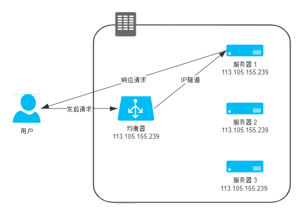
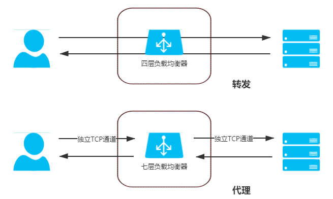

# 负载均衡

::: tip 负载均衡（Load Balancing）

调度后方的多台机器，以统一的接口对外提供服务，承担此职责的技术组件被称为“负载均衡”。

:::

在互联网时代的早期，网站流量还相对较小，并且业务也比较简单，单台服务器便有可能满足访问需要，但时至今日，互联网也好，企业级也好，一般实际用于生产的系统，几乎都离不开集群部署了。信息系统不论是采用单体架构多副本部署还是微服务架构，不论是为了实现高可用还是为了获得高性能，都需要利用到多台机器来扩展服务能力，希望用户的请求不管连接到哪台机器上，都能得到相同的处理。另一方面，如何构建和调度服务集群这事情，又必须对用户一侧保持足够的透明，即使请求背后是由一千台、一万台机器来共同响应的，也绝非用户所关心的事情，用户需记住的只有一个域名地址而已。调度后方的多台机器，以统一的接口对外提供服务，承担此职责的技术组件被称为“负载均衡”（Load Balancing）。

真正大型系统的负载均衡过程往往是多级的。譬如，在各地建有多个机房，或机房有不同网络链路入口的大型互联网站，会从DNS解析开始，通过“域名” → “CNAME” → “负载调度服务” → “就近的数据中心入口”的路径，先将来访地用户根据IP地址（或者其他条件）分配到一个合适的数据中心中，然后才到稍后将要讨论的各式负载均衡。在DNS层面的负载均衡与前面介绍的DNS智能线路、内容分发网络等，在工作原理上是类似的，其差别只是数据中心能提供的不仅有缓存，而是全方位的服务能力。由于这种方式此前已经详细讲解过，后续我们所讨论的“负载均衡”就只聚焦于网络请求进入数据中心入口之后的其他级次的负载均衡。

无论在网关内部建立了多少级的负载均衡，从形式上来说都可以分为两种：四层负载均衡和七层负载均衡。在详细介绍它们是什么、如何工作之前，我们先来建立两个总体的、概念性的印象：

- 四层负载均衡优势是性能高，七层负载均衡的优势功能强。
- 做多级混合负载均衡，通常应是低层的负载均衡在前，高层的负载均衡在后（想一想为什么？）。

我们所说的“四层”、“七层”，指的是经典的[OSI七层模型](https://en.wikipedia.org/wiki/OSI_model)中第四层传输层和第七层应用层，下表是来自于维基百科上对OSI七层模型的介绍（笔者做了简单的中文翻译），这部分属于网络基础知识，这里就不多解释了。后面我们会多次使用到这张表，如你对网络知识并不是特别了解的，可通过[维基百科](https://en.wikipedia.org/wiki/OSI_model)上的连接获得进一步的资料。

|      | 
**层**
                          | 
**数据单元**
        | **功能**                                                     |
| ---- | ------------------------------- | ------------------- | ------------------------------------------------------------ |
| 7    | 应用层   Application Layer  | 数据 Data       | 提供为应用软件提供服务的接口，用于与其他应用软件之间的通信。典型协议：HTTP、HTTPS、FTP、Telnet、SSH、SMTP、POP3等 |
| 6    | 表达层 Presentation Layer   | 数据   Data     | 把数据转换为能与接收者的系统格式兼容并适合传输的格式。       |
| 5    | 会话层   Session Layer      | 数据   Data     | 负责在数据传输中设置和维护计算机网络中两台计算机之间的通信连接。 |
| 4    | 传输层   Transport Layer    | 数据段 Segments | 把传输表头加至数据以形成数据包。传输表头包含了所使用的协议等发送信息。典型协议：TCP、UDP、RDP、SCTP、FCP等 |
| 3    | 网络层   Network Layer      | 数据包 Packets  | 决定数据的传输路径选择和转发，将网络表头附加至数据段后以形成报文（即数据包）。典型协议：IPv4/IPv6、IGMP、ICMP、EGP、RIP等 |
| 2    | 数据链路层  Data Link Layer | 数据帧 Frame    | 负责点对点的网络寻址、错误侦测和纠错。当表头和表尾被附加至数据包后，就形成数据帧（Frame）。典型协议：WiFi（802.11）、Ethernet（802.3）、PPP等。 |
| 1    | 物理层 Physical Layer       | 比特流 Bit      | 在局域网上传送数据帧，它负责管理电脑通信设备和网络媒体之间的互通。包括了针脚、电压、线缆规范、集线器、中继器、网卡、主机接口卡等。 |

现在所说的“四层负载均衡”其实是多种均衡器工作模式的统称，“四层”的意思是说这些工作模式的共同特点是都维持着同一个TCP连接，而不是说它就只工作在第四层。事实上，这些模式主要都是工作在二层（数据链路层，改写MAC地址）和三层（网络层，改写IP地址）上的，单纯只处理第四层（传输层，可以改写TCP、UDP等协议的内容和端口）的数据无法做到负载均衡的转发，因为OSI的下三层是媒体层（Media Layers），上四层是主机层（Host Layers），既然流量都已经到达目标主机上了，也就谈不上什么流量转发，最多只能做代理了。但出于习惯和方便，现在几乎所有的资料都把它们统称为四层负载均衡，笔者也同样称呼它为四层负载均衡，如果读者在某些资料上看见“二层负载均衡”、“三层负载均衡”的表述，这就真的是描述它们工作的层次，和这里说的“四层负载均衡”并不是同一类意思。下面笔者介绍几种常见的四层负载均衡的工作模式。

## 数据链路层负载均衡

参考上面OSI模型的表格，数据链路层传输的内容是数据帧（Frame），譬如以常见的太网帧、ADSL宽带的PPP帧等。我们讨论的具体上下文里，目标必定就是以太网帧了，按照[IEEE 802.3](https://en.wikipedia.org/wiki/IEEE_802.3)标准，以最典型的1500 Bytes MTU的以太网帧结构如下表所示：

| **数据项**                                               | **取值**     |
| ------------------------------------------------------------ | ---------------- |
| 前导码                                                   | 10101010 7 Bytes |
| 帧开始符                                                 | 10101011 1 Byte  |
| MAC 目标地址                                         | 6 Bytes          |
| MAC 源地址                                           | 6 Bytes          |
| [802.1Q](https://zh.wikipedia.org/wiki/IEEE_802.1Q)标签（可选） | 4 Bytes          |
| [以太类型](https://zh.wikipedia.org/wiki/Ethertype)      | 2 Bytes          |
| 有效负载                                                 | 1500 Bytes       |
| [冗余校验](https://zh.wikipedia.org/wiki/冗余校验)       | 4 Bytes          |
| [帧间距](https://zh.wikipedia.org/w/index.php?title=帧间距&action=edit&redlink=1) | 12 Bytes         |

帧结构中其他数据项的含义在本节中可以暂时不去理会，只需注意到“MAC目标地址”和“MAC源地址”两项即可。我们知道每一块网卡都有独立的MAC地址，以太帧上这两个地址告诉了交换机，此帧应该是从连接在交换机上的哪个端口的网卡发出，送至哪块网卡的。

数据链路层负载均衡所做的工作，是修改请求的数据帧中的MAC目标地址，让用户原本是发送给负载均衡器的请求的数据帧，被二层交换机根据新的MAC目标地址转发到服务器集群中对应的服务器（后文称为“真实服务器”，Real Server）的网卡上，这样真实服务器就获得了一个原本目标并不是发送给它的数据帧。

由于二层负载均衡器在转发请求过程中只修改了帧的MAC目标地址，不涉及更上层协议（没有修改Payload的数据），所以在更上层（第三层）看来，所有数据都是未曾被改变过的。由于第三层的数据包，即IP数据包中包含了源（客户端）和目标（均衡器）的IP地址，只有真实服务器保证自己的IP地址与数据包中的目标IP地址一致，这个数据包才能被正确处理。因此，使用这种负载均衡模式时，需要把真实物理服务器集群所有机器的[虚拟IP地址](https://en.wikipedia.org/wiki/Virtual_IP_address)（Virtual IP Address，VIP）配置成与负载均衡器的虚拟IP一样，这样经均衡器转发后的数据包就能在真实服务器中顺利地使用。也正是因为实际处理请求的真实物理服务器IP和数据请求中的目的IP是一致的，所以响应结果就不再需要通过负载均衡服务器进行地址交换，可将响应结果的数据包直接从真实服务器返回给用户的客户端，避免负载均衡器网卡带宽成为瓶颈，因此数据链路层的负载均衡效率是相当高的。整个请求到响应的过程如下图所示：

:::center

数据链路层负载均衡
:::

上述只有请求经过负载均衡器，而服务的响应无需从负载均衡器原路返回的工作模式，整个请求、转发、响应的链路形成一个“三角关系”，所以这种负载均衡模式也常被很形象地称为“三角传输模式”（Direct Server Return，DSR），也有叫“单臂模式”（Single Legged Mode）或者“直接路由”（Direct Routing）。

虽然数据链路层负载均衡效率很高，但它并不能适用于所有的场合，除了那些需要感知应用层协议信息的负载均衡场景它无法胜任外（所有的四层负载均衡器都无法胜任，将在后续介绍七层均衡器时一并解释），它在网络一侧受到的约束也很大。二层负载均衡器直接改写目标MAC地址的工作原理决定了它与真实的服务器的通讯必须是二层可达的，通俗地说就是必须位于同一个子网当中，无法跨VLAN。优势（效率高）和劣势（不能跨子网）共同决定了数据链路层负载均衡最适合用来做数据中心的第一级均衡设备，用来连接其他的下级负载均衡器。

## 网络层负载均衡

根据OSI七层模型，在第三层网络层传输的单位是分组数据包（Packets），这是一种在[分组交换网络](https://en.wikipedia.org/wiki/Packet_switching)（Packet Switching Network，PSN）中传输的结构化数据单位。以IP协议为例，一个IP数据包由Headers和Payload两部分组成， Headers长度最大为60 Bytes，其中包括了20 Bytes的固定数据和最长不超过40 Bytes的可选的额外设置组成。按照IPv4标准，一个典型的分组数据包的Headers部分具有如下表所示的结构：

| 长度        | 存储信息                                                     |
| ----------- | ------------------------------------------------------------ |
| 0-4 Bytes   | 版本号（4 Bits）、首部长度（4 Bits）、分区类型（8 Bits)、总长度（16 Bits） |
| 5-8 Bytes   | 报文计数标识（16 Bits）、标志位（4 Bits）、片偏移（12 Bits） |
| 9-12 Bytes  | TTL生存时间（8 Bits）、上层协议代号（8 Bits）、首部校验和（16 Bits） |
| 13-16 Bytes | 源地址（32 Bits）                                            |
| 17-20 Bytes | 目标地址（32 Bits）                                          |
| 20-64 Bytes | 可选字段                                                     |

本节中对于表格中其他信息也无需过多关注，只要知道在IP分组数据包的Headers带有源和目标的IP地址即可。源和目标IP地址代表了数据是从分组交换网络中哪台机器发送到哪台机器的，我们就可以沿用与二层改写MAC地址相似的思路，通过改变这里面的IP地址来实现数据包的转发。具体有两种常见的修改方式：第一种是保持原来的数据包不变，新创建一个数据包，把原来数据包的Headers和Payload整体作为另一个新的数据包的Payload，在这个新数据包的Headers中写入真实服务器的IP作为目标地址，然后把它发送出去。经过三层交换机的转发，真实服务器收到数据包后，必须在接收入口处设计一个针对性的拆包机制，把由负载均衡器自动添加的那层Headers扔掉，还原出原来的数据包来进行使用。这样，真实服务器就同样拿到了一个原本不是发给它（目标IP不是它）的数据包，达到了流量转发的目的。那时候还没有流行起“禁止套娃”的梗，所以设计者给这种“套娃式”的传输起名叫做“[IP隧道](https://en.wikipedia.org/wiki/IP_tunnel)”（IP Tunnel）传输，也还是相当的形象。

尽管因为要封装新的数据包，IP隧道的转发模式比起直接路由模式效率会有所下降，但由于并没有修改原有数据包中的任何信息，所以IP隧道的转发模式仍然具备三角传输的特性，即负载均衡器转发来的请求，可以由真实服务器去直接应答，无需在经过均衡器原路返回。而且由于IP隧道工作在网络层，所以可以跨越VLAN，因此摆脱了直接路由模式中网络侧的约束。此模式从请求到响应的过程如下图所示：

:::center

IP隧道模式的负载均衡
:::

而这种转发方式的缺点是它要求真实服务器必须得支持“[IP隧道协议](https://en.wikipedia.org/wiki/Encapsulation_(networking))”（IP Encapsulation），就是它得学会自己拆包扔掉一层Headers，这个其实并不是什么大问题，现在几乎所有的Linux系统都支持IP隧道想协议。另外一个问题是这种模式仍必须通过专门的配置，必须保证所有的真实服务器与均衡器有着相同的虚拟IP地址，因为回复该数据包时，需要使用这个虚拟IP作为响应数据包的源地址，这样客户端收到这个数据包时才能正确解析。这个限制就相对麻烦一些，它与“透明”的原则冲突，需由系统管理员去专门介入。

而且，对服务器进行虚拟IP的配置并不是在任何情况下都可行的，尤其是当有好几个服务共用一台物理服务器的时候。此时就必须考虑另一种改变目标数据包的方式：直接把数据包Headers中的目标地址改掉，修改后原本由用户发给均衡器的数据包，也会被三层交换机转发送到真实服务器的网卡上，而且因为没有经过IP隧道的额外包装，也就无需再拆包了。但问题是这种模式修改了目标IP地址才到达真实服务器的，如果真实服务器直接将应答包发回给客户端的话，这个应答数据包的源IP是真实服务器的IP，也即是均衡器修改以后的IP地址，客户端不可能认识该IP，自然就无法再正常处理这个应答。因此，只能让应答流量继续回到负载均衡，负载均衡把应答包的源IP改回自己的IP，然后再发给客户端，这样才能保证客户端与真实服务器之间正常通信。如果你对网络知识有些了解的话，肯定会觉得这种处理似曾相识，这不就是在家里、公司、学校上网时，由一台路由器带着一群内网机器上网的“[网络地址转换](https://en.wikipedia.org/wiki/Network_address_translation)”（Network Address Translation，NAT）操作吗？这种负载均衡的模式的确就被称为是NAT模式，此时，负载均衡器就是充当了家里、公司、学校的上网路由器的作用。NAT模式的负载均衡器运维起来十分简单，只要机器将自己的网关地址设置为均衡器地址，就无需再进行任何额外设置了。此模式从请求到响应的过程如下图所示：

:::center

NAT模式的负载均衡
:::

在流量压力比较大的时候，NAT模式的负载均衡会带来较大的性能损失，比起直接路由和IP隧道模式，甚至会出现数量级上的下降。这点是显而易见的，由负载均衡器代表整个服务集群来进行应答，各个服务器的响应数据都会互相挣抢均衡器的出口带宽，这就好比在家里用NAT上网的话，如果有人在下载，你打游戏可能就会觉得卡顿是一个道理，此时整个系统的瓶颈很容易就出现在负载均衡器上。

还有一种更加彻底的NAT模式，均衡器在转发时，不仅修改目标IP地址，连源IP地址也一起改了，源地址就改成均衡器自己的IP，称作Source NAT（SNAT）。这样好处是真实服务器连网关都无需配置了，能够让应答流量经过正常的三层路由回到负载均衡器上，做到了彻底的透明。但是缺点是由于做了SNAT，真实服务器处理请求时就无法拿到客户端的IP地址了，在真实服务器的视角看来，所有的流量都来自于负载均衡器，这样有一些需要根据目标IP进行控制的业务逻辑就无法进行。

## 应用层负载均衡

前面介绍的四层负载均衡工作模式都属于“转发”，即直接将承载着TCP报文的底层数据格式（IP数据包或以太网帧）转发到真实服务器上，此时客户端到响应请求的真实服务器维持着同一条TCP通道。但工作在四层之后的负载均衡模式就无法再进行转发了，只能进行代理，此时正式服务器、负载均衡器、客户端三者之间由两条独立的TCP通道来维持通讯，转发与代理的区别如下图所示：

:::center

转发与代理
:::

“代理”这个词，根据“哪一方能感知到”的原则，可以分为“正向代理”、“反向代理”和“透明代理”三类。正向代理就是我们通常简称的代理，指在客户端设置的、代表客户端与服务器通讯的代理服务，它是客户端可知，而对服务器透明的。反向代理是指在设置在服务器这一侧，代表真实服务器来与客户端通讯的代理服务，此时它对客户端来说是透明的。至于透明代理是指对双方都透明的，配置在网络中间设备上的代理服务，譬如，架设在路由器上的透明翻墙代理。

根据以上定义，很显然，七层负载均衡器它就属于反向代理中的一种，如果只论网络性能，七层均衡器肯定是无论如何比不过四层均衡器的，它比四层均衡器至少多一轮TCP握手，有着跟NAT转发模式一样的带宽问题，而且通常要耗费更多的CPU，因为可用的解析规则远比四层丰富。所以如果用七层均衡器去做下载站、视频站这种流量应用是不合适的，起码不能作为第一级均衡器。但是，如果网站的性能瓶颈并不在于网络性能，要论整个服务集群对外所体现出来的服务性能，七层均衡器就有它的用武之地了。这里面七层均衡器的底气就是来源于它工作在应用层，可以感知应用层通讯的具体内容，往往能够做出更明智的决策，玩出更多的花样来。

举个生活中的例子，四层均衡器就像银行的自助排号机，转发效率高且不知疲倦，每一个达到银行的客户根据排号机的顺序，选择对应的窗口接受服务；而七层均衡器就像银行大堂经理，他会先确认客户需要办理的业务，再安排排号。这样办理理财、存取款等业务的客户，会根据银行内部资源得到统一协调处理，加快客户业务办理流程，有一些无需柜台办理的业务，由大堂经理直接就可以解决了，譬如，反向代理的就能够实现静态资源缓存，对于静态资源的请求就可以在反向代理上直接返回，无需转发到真实服务器。

代理的工作模式相信大家应该是比较熟悉的，因此关于七层均衡器如何工作的就不像上节介绍四层均衡器那样逐个详细展开了，笔者仅列举了一些七层代理可以实现的功能，以便读者对它“功能强大”有个直观的感受：

- 前面介绍CDN应用时，所有CDN可以做的缓存方面的工作（就是除去CDN根据物理位置就近返回这种优化链路的工作外），七层均衡器全都可以实现，譬如静态资源缓存、协议升级、安全防护、访问控制，等等。
- 七层均衡器可以实现更智能化的路由。譬如，根据Session路由，以实现亲和性的集群；根据URL路由，实现专职化服务（此时就相当于网关的职责）；甚至根据用户身份路由，实现对部分用户的特殊服务（如某些站点的贵宾服务器），等等。
- 某些安全攻击可以由七层均衡器来抵御，譬如一种常见的DDoS手段是SYN Flood攻击，即攻击者控制众多客户端，使用虚假IP地址对同一目标大量发送SYN报文。从技术原理上看，由于四层均衡器无法感知上层协议的内容，这些SYN攻击都会被转发到后端的真实服务器上；而七层均衡器下这些SYN攻击自然在负载均衡设备上就被过滤掉，不会影响到后面服务器的正常运行。类似地，可以在七层均衡器上设定多种策略，譬如过滤特定报文，以防御如SQL注入等应用层面的特定攻击手段。
- 很多微服务架构的系统中，链路治理措施都需要在七层中进行，譬如服务降级、熔断、异常注入，等等。譬如，一台服务器只有出现物理层面或者系统层面的故障，导致无法应答TCP请求才能被四层均衡器所感知，进而剔除出服务集群，如果一台服务器能够应答，只是一直在报500错，那四层均衡器对此是完全无能力的，只能由七层均衡器来解决。

## 均衡策略与实现

负载均衡的两大职责是“选择谁来处理用户请求”和“将用户请求转发过去”。到此我们仅介绍了后者，即请求的转发或代理过程。前者是指均衡器所采取的均衡策略，这一块由于均衡算法太多，笔者无法逐一展开，仅从功能和应用的角度去介绍一些常见的均衡策略：

- **轮循均衡**（Round Robin）：每一次来自网络的请求轮流分配给内部中的服务器，从1至N然后重新开始。此种均衡算法适合于服务器组中的所有服务器都有相同的软硬件配置并且平均服务请求相对均衡的情况。
- **权重轮循均衡**（Weighted Round Robin）：根据服务器的不同处理能力，给每个服务器分配不同的权值，使其能够接受相应权值数的服务请求。譬如：服务器A的权值被设计成1，B的权值是3，C的权值是6，则服务器A、B、C将分别接收到10%、30％、60％的服务请求。此种均衡算法能确保高性能的服务器得到更多的使用率，避免低性能的服务器负载过重。
- **随机均衡**（Random）：把来自客户端的请求随机分配给内部中的多个服务器，在数据足够大的场景下能达到相对均衡的分布。
- **权重随机均衡**（Weighted Random）：此种均衡算法类似于权重轮循算法，不过在处理请求分担时是个随机选择的过程。
- **一致性哈希均衡**（Consistency Hash）：根据请求中某一些数据（可以是MAC、IP地址，也可以是更上层协议中的某些参数信息）作为特征值来计算需要落在的节点上，算法一般会保证同一个特征值每次都一定落在相同的服务器上。一致性的意思是保证当服务集群某个真实服务器出现故障，只影响该服务器的哈希，而不会导致整个服务集群的哈希键值重新分布。
- **响应速度均衡**（Response Time）：负载均衡设备对内部各服务器发出一个探测请求（例如Ping），然后根据内部中各服务器对探测请求的最快响应时间来决定哪一台服务器来响应客户端的服务请求。此种均衡算法能较好的反映服务器的当前运行状态，但这最快响应时间仅仅指的是负载均衡设备与服务器间的最快响应时间，而不是客户端与服务器间的最快响应时间。
- **最少连接数均衡**（Least Connection）：客户端的每一次请求服务在服务器停留的时间可能会有较大的差异，随着工作时间加长，如果采用简单的轮循或随机均衡算法，每一台服务器上的连接进程可能会产生极大的不平衡，并没有达到真正的负载均衡。最少连接数均衡算法对内部中需负载的每一台服务器都有一个数据记录，记录当前该服务器正在处理的连接数量，当有新的服务连接请求时，将把当前请求分配给连接数最少的服务器，使均衡更加符合实际情况，负载更加均衡。此种均衡策略适合长时处理的请求服务，如FTP传输。
- …………

从实现角度来看，负载均衡器的实现有“软件均衡器”和“硬件均衡器”两类。在软件均衡器方面，又分为直接建设在操作系统内核的均衡器和应用程序形式的均衡器两种。前者的代表是LVS（Linux Virtual Server），后者的代表有Nginx、HAProxy、KeepAlived等，前者性能会更好，因为无需在内核空间和应用空间中来回复制数据包；而后者的优势是选择广泛，使用方便，功能不受限于内核版本。

在硬件均衡器方面，往往会直接采用[应用专用集成电路](https://en.wikipedia.org/wiki/Application-specific_integrated_circuit)（Application Specific Integrated Circuit，ASIC）来实现，有专用处理芯片的支持，避免操作系统层面的损耗，得以达到最高的性能。这类的代表就是著名的F5和A10公司的负载均衡产品。