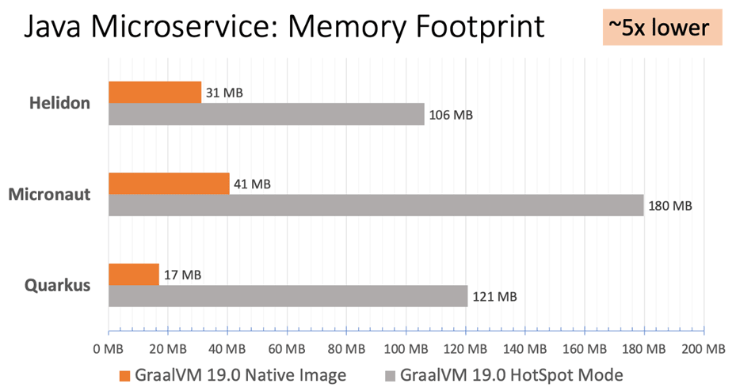

# GraalVM

网上每隔一段时间就能见到几条“未来X语言将会取代Java”的新闻，此处“X”可以用Kotlin、Golang、Dart、JavaScript、Python……等各种编程语言来代入。这大概就是长期占据[编程语言榜单](https://www.tiobe.com/tiobe-index/)第一位的烦恼，天下第一总避免不了挑战者相伴。

如果Java有拟人化的思维，它应该从来没有惧怕过被哪一门语言所取代，Java“天下第一”的底气不在于语法多么先进好用，而是来自它庞大的用户群和极其成熟的软件生态，这在朝夕之间难以撼动。不过，既然有那么多新、旧编程语言的兴起躁动，说明必然有其需求动力所在，譬如互联网之于JavaScript、人工智能之于Python，微服务风潮之于Golang等等。大家都清楚不太可能有哪门语言能在每一个领域都尽占优势，Java已是距离这个目标最接近的选项，但若“天下第一”还要百尺竿头更进一步的话，似乎就只能忘掉Java语言本身，踏入无招胜有招的境界。

2018年4月，Oracle Labs新公开了一项黑科技：[Graal VM](https://www.graalvm.org/)，从它的口号“Run Programs Faster Anywhere”就能感觉到一颗蓬勃的野心，这句话显然是与1995年Java刚诞生时的“Write Once，Run Anywhere”在遥相呼应。

:::center

Graal VM
:::

Graal VM被官方称为“Universal VM”和“Polyglot VM”，这是一个在HotSpot虚拟机基础上增强而成的跨语言全栈虚拟机，可以作为“任何语言”的运行平台使用，这里“任何语言”包括了Java、Scala、Groovy、Kotlin等基于Java虚拟机之上的语言，还包括了C、C++、Rust等基于LLVM的语言，同时支持其他像JavaScript、Ruby、Python和R语言等等。Graal VM可以无额外开销地混合使用这些编程语言，支持不同语言中混用对方的接口和对象，也能够支持这些语言使用已经编写好的本地库文件。

Graal VM的基本工作原理是将这些语言的源代码（例如JavaScript）或源代码编译后的中间格式（例如LLVM字节码）通过解释器转换为能被Graal VM接受的[中间表示](https://zh.wikipedia.org/wiki/%E4%B8%AD%E9%96%93%E8%AA%9E%E8%A8%80)（Intermediate Representation，IR），譬如设计一个解释器专门对LLVM输出的字节码进行转换来支持C和C++语言，这个过程称为“[程序特化](https://en.wikipedia.org/wiki/Partial_evaluation)”（Specialized，也常称为Partial Evaluation）。Graal VM提供了[Truffle工具集](https://github.com/oracle/graal/tree/master/truffle)来快速构建面向一种新语言的解释器，并用它构建了一个称为[Sulong](https://github.com/oracle/graal/tree/master/sulong)的高性能LLVM字节码解释器。

以更严格的角度来看，Graal VM才是真正意义上与物理计算机相对应的高级语言虚拟机，理由是它与物理硬件的指令集一样，做到了只与机器特性相关而不与某种高级语言特性相关。Oracle Labs的研究总监Thomas Wuerthinger在接受[InfoQ采访](https://www.infoq.com/news/2018/04/oracle-graalvm-v1/)时谈到：“随着GraalVM 1.0的发布，我们已经证明了拥有高性能的多语言虚拟机是可能的，并且实现这个目标的最佳方式不是通过类似Java虚拟机和微软CLR那样带有语言特性的字节码”。对于一些本来就不以速度见长的语言运行环境，由于Graal VM本身能够对输入的中间表示进行自动优化，在运行时还能进行即时编译优化，往往使用Graal VM实现能够获得比原生编译器更优秀的执行效率，譬如Graal.js要优于Node.js、Graal.Python要优于CPtyhon，TruffleRuby要优于Ruby MRI，FastR要优于R语言等等。

针对Java而言，Graal VM本来就是在HotSpot基础上诞生的，天生就可作为一套完整的符合Java SE 8标准Java虚拟机来使用。它和标准的HotSpot差异主要在即时编译器上，其执行效率、编译质量目前与标准版的HotSpot相比也是互有胜负。但现在Oracle Labs和美国大学里面的研究院所做的最新即时编译技术的研究全部都迁移至基于Graal VM之上进行了，其发展潜力令人期待。如果Java语言或者HotSpot虚拟机真的有被取代的一天，那从现在看来Graal VM是希望最大的一个候选项，这场革命很可能会在Java使用者没有明显感觉的情况下悄然而来，Java世界所有的软件生态都没有发生丝毫变化，但天下第一的位置已经悄然更迭。

## 新一代即时编译器

对需要长时间运行的应用来说，由于经过充分预热，热点代码会被HotSpot的探测机制准确定位捕获，并将其编译为物理硬件可直接执行的机器码，在这类应用中Java的运行效率很大程度上是取决于即时编译器所输出的代码质量。

HotSpot虚拟机中包含有两个即时编译器，分别是编译时间较短但输出代码优化程度较低的客户端编译器（简称为C1）以及编译耗时长但输出代码优化质量也更高的服务端编译器（简称为C2），通常它们会在分层编译机制下与解释器互相配合来共同构成HotSpot虚拟机的执行子系统的。

自JDK 10起，HotSpot中又加入了一个全新的即时编译器：Graal编译器，看名字就可以联想到它是来自于前一节提到的Graal VM。Graal编译器是作为C2编译器替代者的角色登场的。C2的历史已经非常长了，可以追溯到Cliff Click大神读博士期间的作品，这个由C++写成的编译器尽管目前依然效果拔群，但已经复杂到连Cliff Click本人都不愿意继续维护的程度。而Graal编译器本身就是由Java语言写成，实现时又刻意与C2采用了同一种名为“Sea-of-Nodes”的高级中间表示（High IR）形式，使其能够更容易借鉴C2的优点。Graal编译器比C2编译器晚了足足二十年面世，有着极其充沛的后发优势，在保持能输出相近质量的编译代码的同时，开发效率和扩展性上都要显著优于C2编译器，这决定了C2编译器中优秀的代码优化技术可以轻易地移植到Graal编译器上，但是反过来Graal编译器中行之有效的优化在C2编译器里实现起来则异常艰难。这种情况下，Graal的编译效果短短几年间迅速追平了C2，甚至某些测试项中开始逐渐反超C2编译器。Graal能够做比C2更加复杂的优化，如“[部分逃逸分析](http://www.ssw.uni-linz.ac.at/Research/Papers/Stadler14/Stadler2014-CGO-PEA.pdf)”（Partial Escape Analysis），也拥有比C2更容易使用“[激进预测性优化](http://citeseerx.ist.psu.edu/viewdoc/summary?doi=10.1.1.78.6063)”（Aggressive Speculative Optimization）的策略，支持自定义的预测性假设等等。

今天的Graal编译器尚且年幼，还未经过足够多的实践验证，所以仍然带着“实验状态”的标签，需要用开关参数去激活，这让笔者不禁联想起JDK 1.3时代，HotSpot虚拟机刚刚横空出世时的场景，同样也是需要用开关激活，也是作为Classic虚拟机的替代品的一段历史。

Graal编译器未来的前途可期，作为Java虚拟机执行代码的最新引擎，它的持续改进，会同时为HotSpot与Graal VM注入更快更强的驱动力。

## 向原生迈进

对不需要长时间运行的，或者小型化的应用而言，Java（而不是指Java ME）天生就带有一些劣势，这里并不光是指跑个HelloWorld也需要百多兆的JRE之类的问题，而更重要的是指近几年从大型单体应用架构向小型微服务应用架构发展的技术潮流下，Java表现出来的不适应。

在微服务架构的视角下，应用拆分后，单个微服务很可能就不再需要再面对数十、数百GB乃至TB的内存，有了高可用的服务集群，也无须追求单个服务要7×24小时不可间断地运行，它们随时可以中断和更新；但相应地，Java的启动时间相对较长、需要预热才能达到最高性能等特点就显得相悖于这样的应用场景。在无服务架构中，矛盾则可能会更加突出，比起服务，一个函数的规模通常会更小，执行时间会更短，当前最热门的无服务运行环境AWS Lambda所允许的最长运行时间仅有15分钟。

一直把软件服务作为重点领域的Java自然不可能对此视而不见，在最新的几个JDK版本的功能清单中，已经陆续推出了跨进程的、可以面向用户程序的类型信息共享（Application Class Data Sharing，AppCDS，允许把加载解析后的类型信息缓存起来，从而提升下次启动速度，原本CDS只支持Java标准库，在JDK 10时的AppCDS开始支持用户的程序代码）、无操作的垃圾收集器（Epsilon，只做内存分配而不做回收的收集器，对于运行完就退出的应用十分合适）等改善措施。而酝酿中的一个更彻底的解决方案，是逐步开始对提前编译（Ahead of Time Compilation，AOT）提供支持。

提前编译是相对于即时编译的概念，提前编译能带来的最大好处是Java虚拟机加载这些已经预编译成二进制库之后就能够直接调用，而无须再等待即时编译器在运行时将其编译成二进制机器码。理论上，提前编译可以减少即时编译带来的预热时间，减少Java应用长期给人带来的“第一次运行慢”不良体验，可以放心地进行很多全程序的分析行为，可以使用时间压力更大的优化措施。

但是提前编译的坏处也很明显，它破坏了Java“一次编写，到处运行”的承诺，必须为每个不同的硬件、操作系统去编译对应的发行包。也显著降低了Java链接过程的动态性，必须要求加载的代码在编译期就是全部已知的，而不能再是运行期才确定，否则就只能舍弃掉已经提前编译好的版本，退回到原来的即时编译执行状态。

早在JDK 9时期，Java 就提供了实验性的Jaotc命令来进行提前编译，不过多数人试用过后都颇感失望，大家原本期望的是类似于Excelsior JET那样的编译过后能生成本地代码完全脱离Java虚拟机运行的解决方案，但Jaotc其实仅仅是代替掉即时编译的一部分作用而已，仍需要运行于HotSpot之上。

直到[Substrate VM](https://github.com/oracle/graal/tree/master/substratevm)出现，才算是满足了人们心中对Java提前编译的全部期待。Substrate VM是在Graal VM 0.20版本里新出现的一个极小型的运行时环境，包括了独立的异常处理、同步调度、线程管理、内存管理（垃圾收集）和JNI访问等组件，目标是代替HotSpot用来支持提前编译后的程序执行。它还包含了一个本地镜像的构造器（Native Image Generator）用于为用户程序建立基于Substrate VM的本地运行时镜像。这个构造器采用指针分析（Points-To Analysis）技术，从用户提供的程序入口出发，搜索所有可达的代码。在搜索的同时，它还将执行初始化代码，并在最终生成可执行文件时，将已初始化的堆保存至一个堆快照之中。这样一来，Substrate VM就可以直接从目标程序开始运行，而无须重复进行Java虚拟机的初始化过程。但相应地，原理上也决定了Substrate VM必须要求目标程序是完全封闭的，即不能动态加载其他编译期不可知的代码和类库。基于这个假设，Substrate VM才能探索整个编译空间，并通过静态分析推算出所有虚方法调用的目标方法。

Substrate VM带来的好处是能显著降低了内存占用及启动时间，由于HotSpot本身就会有一定的内存消耗（通常约几十MB），这对最低也从几GB内存起步的大型单体应用来说并不算什么，但在微服务下就是一笔不可忽视的成本。根据Oracle官方给出的[测试数据](https://www.infoq.com/presentations/graalvm-performance/)，运行在Substrate VM上的小规模应用，其内存占用和启动时间与运行在HotSpot相比有了5倍到50倍的下降，具体结果如下图所示：

:::center

内存占用对比

启动时间对比
:::

Substrate VM补全了Graal VM“Run Programs Faster Anywhere”愿景蓝图里最后的一块拼图，让Graal VM支持其他语言时不会有重量级的运行负担。譬如运行JavaScript代码，Node.js的V8引擎执行效率非常高，但即使是最简单的HelloWorld，它也要使用约20MB的内存，而运行在Substrate VM上的Graal.js，跑一个HelloWorld则只需要4.2MB内存而已，且运行速度与V8持平。Substrate VM 的轻量特性，使得它十分适合于嵌入至其他系统之中，譬如[Oracle自家的数据库](https://oracle.github.io/oracle-db-mle)就已经开始使用这种方式支持用不同的语言代替PL/SQL来编写存储过程。

## 漫漫前路

尽管Java已经看清楚了在微服务中前进的目标，但是，由于Java天生的语言特性所限，通往这个目标的道路注定会是充满荆棘的。尽管已经有了放弃“一次编写，到处运行”、放弃Java语言动态性的思想准备，但这些特性是Java语言诞生之初就植入到基因里面的，当GraalVM打破它们的同时，也受到了Java语言和在其之上的Java生态的强烈反噬，笔者选择其中最主要的一些困难列举如下：

- Java语言的反射特性，使得GraalVM编译本地镜像时处理起来极为痛苦。除非使用[安全管理器](/architect-perspective/general-architecture/system-security/authentication.html)去专门进行认证许可，否则，反射具有在运行期动态调用几乎所有API接口的能力。为此，必须有由程序的设计者明确地告知GraalVM有哪些代码可能被发射调用（通过JSON配置文件的形式），GraalVM才能在编译本地程序时将它们囊括进来。这是一项可操作性极其低下却又无可奈何的解决方案，即时你能不厌其烦地列举出自己代码中所用到的反射API，但又如何能保证程序所引用的其他类库的反射行为都已被你所知，其中不会有遗漏？与此类似的，动态代理和一切非程序性质的资源，如最典型的配置文件等，都必须明确加入配置中才能被GraalVM编译打包。
- 一切运行期对字节码的生成和修改操作，在GraalVM看来都是无法接受的。请不要觉得直接操作字节码很罕见，导致的影响应该不大。举个例子，CGLIB这种通过运行时产生字节码来做动态代理的方式，长期以来都是Java世界里进行类增强的最主流形式。由于CGLIB是Spring的默认的类增强方式，而GraalVM明确表示是不会支持CGLIB的，因此从SpringBoot 2.2起，在SpringBootApplication注解中增加了proxyBeanMethods参数，用于全局切换类型增强的方式。
- 一切HotSpot虚拟机本身的内部接口，譬如JVMTI、JVMCI等，都不复存在了——在本地镜像中，连HotSpot本身都被消灭了，这些接口自然成了无根之木。这对使用者一侧的最大影响是再也无法进行Java语言层次的远程调试了，最多只能进行汇编层次的调试。
- GraalVM放弃了一部分的语言和平台层面的特性，譬如Finalizer、安全管理器、InvokeDynamic指令和MethodHandles，等等，在GraalVM中都被声明为不支持的，这部分倒大多并非全然无法解决，主要是基于工作量性价比的原因。能够被放弃的语言特性，说明确实是影响非常小的，这个问题对使用者倒的确是影响不会太大。
- ……

## Spring over Graal <Badge text="编写中" type="warning"/>