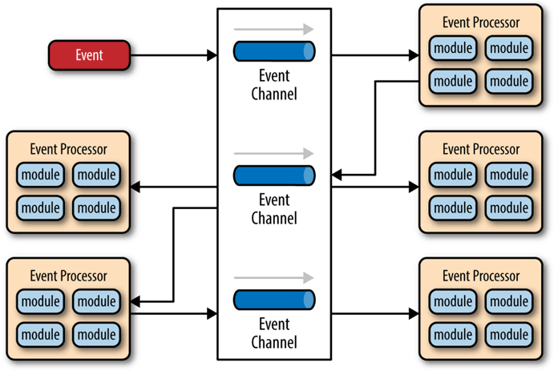

# 服务架构演进史

服务架构的演进历史这一章，我们借讨论历史之名，来梳理微服务发展里程中出现的大量名词、概念，借着微服务的演变过程，我们将从这些概念起源的最初，去分析它们是什么、它们取代了什么、以及它们为什么能够在斗争中取得成功，为什么变得不可或缺的支撑，又或者它们为什么会失败，在竞争中被淘汰，或逐渐湮灭于历史的烟尘当中。

## 原始分布式时代

可能与绝大多数人心中的认知会有差异，“使用多个独立的分布式服务共同构建一个更大型系统”的设想与实际尝试，要比今天大家所了解的大型单体系统出现的时间更早。

在20世纪的70年代末期到80年代初，计算机科学刚经历了从以大型机为主向以微型机为主的蜕变，计算机逐渐从一种存在于研究机构、实验室当中的科研设备，转变为存在于商业企业中甚至家庭用户的生产设备。此时的计算机系统通常具有16位、5MB Hz频率以下的处理器和64KB左右的内存地址空间，譬如，著名的[Intel 80286处理器](https://zh.wikipedia.org/wiki/Intel_80286)就是在1982年发布，流行于80年代中后期到90年代初期。当时计算机的硬件水平的局限性，直接影响到了单台机器服务的最大规模，为了突破算力限制，Unix系统标准化组织[开放软件基金会](https://zh.wikipedia.org/wiki/%E9%96%8B%E6%94%BE%E8%BB%9F%E9%AB%94%E5%9F%BA%E9%87%91%E6%9C%83)（Open Software Foundation，OSF，也即后来的“国际开放标准组织”）制订了一种名为“[分布式运算环境](https://zh.wikipedia.org/wiki/%E5%88%86%E6%95%A3%E5%BC%8F%E9%81%8B%E7%AE%97%E7%92%B0%E5%A2%83)”（Distributed Computing Environment，DCE）的软件架构，其中包括了一整套完整的分布式服务组件与规范，其中很多技术概念对今天的微服务都产生了巨大而深远的影响，譬如远程服务调用（Remote Procedure Call，当时被称为[DCE/RPC](https://zh.wikipedia.org/wiki/DCE/RPC)，后来Sun向IEFT提交了不限于Unix系统的、基于TCP/IP更开放的远程服务调用标准[ONC RPC](https://zh.wikipedia.org/wiki/%E9%96%8B%E6%94%BE%E7%B6%B2%E8%B7%AF%E9%81%8B%E7%AE%97%E9%81%A0%E7%AB%AF%E7%A8%8B%E5%BA%8F%E5%91%BC%E5%8F%AB)），分布式文件系统（Distributed File System，当时被称为[DCE/DFS](DCE/DFS)）、时间服务、授权服务，等等。

这些技术的主旨是都让分布式环境中的过程调用、存储等操作透明化（这件事情很困难，实际上远没有做到透明），使开发人员不必关心他们调用的过程调用或其他资源是位于本地还是远程。这是计算机科学中第一次有组织领导、有标准可循、有巨大投入的分布式计算的尝试，但无论是DCE还是稍后出现的CORBA，都并没有取得成功，将一个系统直接拆分到不同的机器之中，这样做带来的网络传输问题、数据一致性问题和编码复杂度等方面付出的代价远远超过了分布式所取得的收益，这次尝试最大的收获就是对RPC、DFS等概念的开创，以及收获了一个价值千金的教训：“**某个功能能够进行分布式，并不意味着它就应该进行分布式，强行这么做，只会自寻苦果**”。

:::quote Observation about distributed computing

Just because something **can** be distributed doesn’t mean it **should** be distributed. Trying to make a distributed call act like a local call always ends in tears

:::right 

—— [Kyle Brown](https://en.wikipedia.org/wiki/Kyle_Brown_(computer_scientist))，IBM Fellow，[Beyond buzzwords](https://developer.ibm.com/technologies/microservices/articles/cl-evolution-microservices-patterns/)

:::

这个时间段正是[摩尔定律](https://zh.wikipedia.org/wiki/%E6%91%A9%E5%B0%94%E5%AE%9A%E5%BE%8B)最稳定发挥的黄金时期，微型计算机的性能以每两年增长一倍的速度提升。硬件算力束缚软件规模的铁链很快变得松动，信息系统开始了以单台或少数几台微机即可作为服务器的单体系统时代，尽管如此，对分布式计算、远程服务调用的研究从未有中断，关于这条分支早期的发展，笔者已在服务设计风格中“[远程服务调用](/architect-perspective/general-architecture/api-style/rpc.html)”一节有过介绍。

## 单体系统时代

单体系统是绝大部软件从业者都学习、实践过的架构形式，许多介绍微服务的书籍和技术资料中也把这种架构形式称作“巨石系统”，且某些文章中为对比展示出微服务架构的优点，往往会或有意或无意地强调、放大这种架构形式的缺点，以至于让人获得某种巨石系统就“人如其名”是铁板一块无可拆分也不可伸缩的，单体架构就不如微服务架构先进好用的潜在暗示。

如果说单体架构是一块巨石，不可拆分的显然有失偏颇，“单体”只是表明系统中主要的过程调用（不算数据库、文件、缓存等这类资源访问）都是进程内调用，不会发生[进程间通讯](https://zh.wikipedia.org/wiki/%E8%A1%8C%E7%A8%8B%E9%96%93%E9%80%9A%E8%A8%8A)（Inter-Process Communication，IPC。RPC属于IPC的一种特例，但请注意这里两个“PC”不是同个单词的缩写）。事实上，笔者从来没有见过生产环境中的哪个大型的系统是全不分层的，分层架构（Layered Architecture）已是现在大多数系统建设中普遍认可、普遍采用的方式，无论是单体还是微服务，都会对代码进行横向拆分，收到的外部的请求在各层之间以不同形式的对象进行流转传递，触及最末端的数据库后依次返回响应。在这个意义上的“拆分”，单体架构完全不会展露出丝毫的弱势，反而还可能会因更容易开发、部署、测试而获得一些便捷性上的好处。

:::center

图片来自O'Reilly的开放文档《[Software Architecture Patterns](https://www.oreilly.com/programming/free/files/software-architecture-patterns.pdf)》
:::

至于比较微服务、单体架构哪种先进，笔者认为“先进”不能是绝对的，这点可以举一个非常浅显的例子来说明。譬如，沃尔玛将超市分为仓储部、采购部、安保部、库存管理部、巡检部、质量管理部、市场营销部，等等，可以划分职责，明确边界，让管理能力能支持企业的成长规模；但如果你家楼下开的小卖部，爸妈加儿子再算上看家的中华田园犬小黄一共也就四名员工，也去划分仓储部、采购部、库存管理部……那纯粹是给自己找麻烦。

单体系统真正体现弱势的地方在于垂直切分上，哪怕是信息系统中两个相互毫无关联的子系统，也必须部署到一起。当系统规模小时这是优势，但系统规模大的时候，修改时候的部署成本、技术升级时的迁移成本都会变得高昂。按前面的例子来说，就是当公司小时，让安保部和质检部两个不相干的部门在同一栋大楼中办公是节约资源，但当公司人数增加，办公室已经拥挤不堪，也最多只能在楼顶加盖新楼层（相当于增强硬件性能），而不能让安保、质检分开地方办公，这才是缺陷所在。

不过，为了实现垂直拆分，并不意味着一定要依靠微服务架构才能解决，在新旧世纪之交，人们曾经探索过几种服务垂直拆分的方法，这些架构方法后来导致了面向服务架构（Service-Oriented Architecture）的一段兴盛期，我们称其为“SOA时代”。

## SOA时代

当系统规模变大后，为了能对系统进行垂直拆分、复用，人们尝试过多种途径，笔者列举以下三种较有代表性的架构模式，分别为：

- [烟囱式架构](https://en.wikipedia.org/wiki/Information_silo)（Information Silo Architecture）：信息烟囱又名信息孤岛（Information Island），使用这种架构的系统也被称为孤岛式信息系统或者烟囱式信息系统。它指的是一种完全不与其他相关信息系统之间进行互操作或者说协调工作的信息系统。这样的系统其实并没有什么“架构”可言，如果两个部门真的完全不会发生交互，就并没有什么理由强迫把它们必须在一栋楼里办公；两个不发生交互的信息系统，让他它们使用独立的数据库、服务器即可完成拆分，而唯一的问题，也是致命的问题是，企业中真的存在完全不发生交互的部门？对于两个信息系统来说，哪怕真的毫无业务往来关系，但系统的人员、组织、权限等等主数据，会是完全独立、没有任何重叠的吗？这样“独立拆分”、“老死不相往来”的系统，显然不可能是企业所希望见到的。

- [微内核架构](https://zh.wikipedia.org/wiki/%E5%BE%AE%E5%85%A7%E6%A0%B8)（Microkernel Architecture）：微内核架构也被称为插件式架构（Plug-in Architecture）。既然烟囱式架构中，两个没有业务往来关系的系统也可能需要共享一部分的公共的主数据，那不妨就将这些主数据，连同其他可能被所有系统使用到的公共服务、数据、资源集中到一块，成为一个被所有业务系统共同依赖的核心系统（Kernel，也称为Core System），具体的业务系统就以插件模块（Plug-in Modules）的形式存在，这样便可提供可扩展的，灵活的，天然隔离的功能特性。 
这种模式很适合桌面应用程序，也可以在Web应用程序中使用。事实上，本文列举的各种不同的架构模式一般都可视为整个系统的一种插件。对于产品型应用程序来说，如果我们想将新特性和功能及时加入系统，微内核架构是一种不错的选择。微内核的架构也可以嵌入到其它的架构模式之中，通过插件还可以提供逐步演化的功能和增量开发。所以如果你实现能够支持二次开发的软件系统，微内核是一种良好的架构模式。 
不过，微内核架构也有它的局限和前提，这便是它假设各个插件模块之间是互不认识（不可预知系统会安装哪些模块），不会发生交互的，但无论在企业还是互联网，这一前提假设却通常并不成立，我们必须找到办法，既能垂直拆分系统，也能让拆分后的子系统之间可以互相调用通讯。

- [事件驱动架构](https://en.wikipedia.org/wiki/Event-driven_architecture)（Event-Driven Architecture）：为了能让子系统互相通讯，一种可行的方案是在子系统之间建立一套事件队列管道（Event Queues），来自系统外部的消息将以事件的形式发送至管道中，各个子系统可以从管道里获取自己感兴趣、可以处理的事件消息，可以为事件新增或者修改其中的附加信息，甚至可以自己发布一些新的事件到管道队列中去，如此，每一个消息的处理者都是独立的，高度解耦的，但又能与其他处理者（如果存在该消息处理者的话）通过事件管道进行互动。

:::center

图片来自O'Reilly的开放文档《[Software Architecture Patterns](https://www.oreilly.com/programming/free/files/software-architecture-patterns.pdf)》
:::

当系统演化至事件驱动架构时，第一节提到的仍在并行发展的远程服务调用也来到了SOAP时代（详见[远程服务调用](/architect-perspective/general-architecture/api-style/rpc.html)一文），此时SOA已经有了它登场所需要的全部前置条件。尽管SOA仍是抽象概念，而不是指代某一种具体的技术，但它已经比前面所说的三种架构模式要相对具体了很多，已经可以称为是一种软件设计的方法论了。它制订了软件架构的一些指导原则，譬如服务的封装性、自治、松耦合、可重用、可组合、无状态，等等；明确了采用SOAP作为远程调用的协议，依靠SOAP协议族（WSDL、UDDI和一大票WS-*协议）来完成服务的发布、发现和治理；利用一个被称为“[企业服务总线](https://zh.wikipedia.org/zh-hans/%E4%BC%81%E4%B8%9A%E6%9C%8D%E5%8A%A1%E6%80%BB%E7%BA%BF)”（Enterprise Service Bus，ESB）的消息管道来实现各个子系统之间的通讯交互，在SOA中服务间不会直接交互，而是由企业服务总线来扮演消息调度者（Broker）的角色，这样既带来了服务松耦合的好处，也为以后可以进一步实现[业务流程编排](https://zh.wikipedia.org/wiki/%E4%B8%9A%E5%8A%A1%E6%B5%81%E7%A8%8B%E7%AE%A1%E7%90%86)（Business Process Management，BPM）提供了基础。

当软件架构发展至SOA时代，其中的许多思想已经有了今天微服务的身影，譬如，服务之间的松散耦合、服务注册、发现、治理，等等。这些今天微服务中耳熟能详的概念，在SOA时代就已经出现；今天微服务面临的问题，在SOA架构中就尝试去解决过，甚至如果仅从技术可行性这一个角度来评判的话，SOA可以说基本成功地解决了这些问题。

但是，SOA仍然没有彻底解决的问题是三十年前原始分布式时代时提出的“如何使用多个独立的分布式服务共同构建一个更大型系统”——这本该是SOA的首要目标。笔者曾在[远程服务调用](/architect-perspective/general-architecture/api-style/rpc.html)一文中提到SOAP协议被逐渐边缘化的本质原因：过于严格的规范定义。而构建在SOAP之上的ESB、BPM、SOA等诸多上层建筑，进一步加剧了这种复杂性。SOA诞生的那一天起，就已经注定了它只能是少数系统阳春白雪式的精致奢侈品，它可以实现多个异构大型系统之间的复杂集成交互，却很难作为一种具有广泛普适性的服务架构来推广。SOA最终没有成功的致命伤与当年的[EJB](https://zh.wikipedia.org/wiki/EJB)如出一辙，尽管有Sun Microsystems和IBM等一众巨头在背后力挺，EJB仍然败于以Spring、Hibernate为代表的“草根框架”，可见一旦脱离人民群众，终究会淹没在群众的海洋之中，连信息技术也不曾例外。

当你读到这一段的时候，不妨重新翻到开头，看看“如何使用多个独立的分布式服务共同构建一个更大型系统”这个问题，更要看看“原始分布式时代”一节中提出分布式服务的主旨：“让开发人员不必关心服务是远程还是本地，透明地调用服务或者访问资源”。经过了二十多年的技术进步，信息系统经历了巨石、烟囱、微内核、事件驱动、SOA等等的架构模式，受复杂度的牵绊越来越大，已经距离“透明”二字越来越远，这是否算不自觉间忘记掉了当年的初心？接下来我们所谈论的微服务时代，似乎正是带着这样的自省式的问句而开启的。

## 微服务时代

“微服务”这个名词最早在2005年就已经被提出，它是由Peter Rodgers博士在2005年度的云计算博览会（Web Services Edge 2005）上首次使用，当时的说法是“Micro-Web-Service”，指的是一种专注于单一职责的、语言无关的、细粒度Web服务（Granular Web Services）。“微服务”的也并不是Peter Rodgers直接凭空创造出来的东西，当时的微服务可以说是SOA催生的产物，就如同EJB催生了Spring和Hibernate那样。这时候的微服务是作为一种SOA的轻量化方案出现的——时至今日，在英文版的维基百科上，仍然将微服务定义为一种SOA的变种形式，所以微服务在最初阶段与SOA、Web Service这些概念有所牵扯也可以理解，但现在来看，维基百科对微服务的定义已经颇有些过时了。

:::quote 维基百科上的微服务概念

Microservices is a software development technique — a variant of the service-oriented architecture (SOA) structural style.

:::right

 —— Wikipedia  [Microservices](https://en.wikipedia.org/wiki/Microservices) 

:::

微服务真正的兴起在2014年，相信阅读此文的大多数读者，也是从Martin Flower与James Lewis合写的文章《[Microservices:a definition of this new architectural term](https://martinfowler.com/articles/microservices.html)》中首次了解到微服务的，或者准确地说，各位所了解的“微服务”是这篇文章中提出的“微服务”。在此文中，不仅明确定义了微服务的概念，并给出了微服务的几个核心的业务与技术特征，如分散管理（Decentralized Governance，表达允许技术异构的意思）、数据去中心化、面向失败而设计（Design for failure，笔者认为微服务最大的价值，也是这部开源文档标题的含义），等等。另外，此文中定义的微服务已经明确地与SOA划清了界线，拒绝再贴上SOA的标签。如此，微服务的概念才算真正丰满、具体起来，为它在未来的几年时间里如明星一般闪耀崛起于技术舞台铺下了厚实基础。

:::quote Martin Flower与James Lewis所述的微服务

This common manifestation of SOA has led some microservice advocates to reject the SOA label entirely, although others consider microservices to be one form of SOA , perhaps service orientation done right. 

:::right

—— Martin Flower / James Lewis，[Microservices](https://martinfowler.com/articles/microservices.html)

:::

TBD

## 后微服务时代

TBD：不可变且无侵入的基础设施

## 无服务时代

TBD