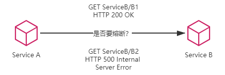
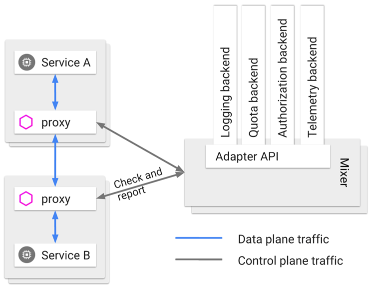

# 后微服务时代

:::tip 后微服务时代（Cloud Native）

从软件层面独力应对微服务架构问题，发展到软、硬一体，合力应对架构问题的时代，此即为“后微服务时代”。

:::

上节提到的分布式架构中出现的问题，如注册发现、跟踪治理、负载均衡、传输通信等，其实在 SOA 时代甚至可以说从原始分布式时代起就已经存在了，只要是分布式架构的系统，就无法完全避免，但我们不妨换个思路来想一下，这些问题一定要由软件系统自己来解决吗？

如果不局限于采用软件的方式，这些问题几乎都有对应的硬件解决方案。譬如，某个系统需要伸缩扩容，通常会购买新的服务器，部署若干副本实例来分担压力；如果某个系统需要解决负载均衡问题，通常会布置负载均衡器，选择恰当的均衡算法来分流；如果需要解决传输安全问题，通常会布置 TLS 传输链路，配置好 CA 证书以保证通信不被窃听篡改；如果需要解决服务发现问题，通常会设置 DNS 服务器，让服务访问依赖稳定的记录名而不是易变的 IP 地址，等等。经过计算机科学多年的发展，这些问题大多有了专职化的基础设施去解决，而之所以微服务时代，人们选择在软件的代码层面而不是硬件的基础设施层面去解决这些分布式问题，很大程度上是因为由硬件构成的基础设施，跟不上由软件构成的应用服务的灵活性的无奈之举。软件可以只使用键盘命令就能拆分出不同的服务，只通过拷贝、启动就能够伸缩扩容服务，硬件难道就不可以通过敲键盘就变出相应的应用服务器、负载均衡器、DNS 服务器、网络链路这些设施吗？

行文至此，估计大家已经听出下面要说的是[虚拟化](https://en.wikipedia.org/wiki/Virtualization)技术和[容器化](https://en.wikipedia.org/wiki/OS-level_virtualization)技术了。微服务时代所取得的成就，本身就离不开以 Docker 为代表的早期容器化技术的巨大贡献。在此之前，笔者从来没有提起过“容器”二字，这并不是刻意冷落，而是早期的容器只被简单地视为一种可快速启动的服务运行环境，目的是方便程序的分发部署，这个阶段针对单个应用进行封装的容器并未真正参与到分布式问题的解决之中。尽管 2014 年微服务开始崛起的时候，Docker Swarm（2013 年）和 Apache Mesos（2012 年）就已经存在，更早之前也出现了[软件定义网络](https://en.wikipedia.org/wiki/Software-defined_networking)（Software-Defined Networking，SDN）、[软件定义存储](https://en.wikipedia.org/wiki/Software-defined_storage)（Software-Defined Storage，SDS）等技术，但是，被业界广泛认可、普遍采用的通过虚拟化基础设施去解决分布式架构问题的开端，应该要从 2017 年 Kubernetes 赢得容器战争的胜利开始算起。

2017 年是容器生态发展历史中具有里程碑意义的一年。在这一年，长期作为 Docker 竞争对手的[RKT 容器](https://coreos.com/rkt/docs/latest/)一派的领导者 CoreOS 宣布放弃自己的容器管理系统 Fleet，未来将会把所有容器管理的功能移至 Kubernetes 之上去实现。在这一年，容器管理领域的独角兽 Rancher Labs 宣布放弃其内置了数年的容器管理系统 Cattle，提出了“All-in-Kubernetes”战略，把 1.x 版本时就能够支持多种容器编排系统的管理工具 Rancher，从 2.0 版本开始“反向升级”为完全绑定于 Kubernetes 这单一种系统。在这一年，Kubernetes 的主要竞争者 Apache Mesos 在 9 月正式宣布了“[Kubernetes on Mesos](https://k8smeetup.github.io/docs/getting-started-guides/mesos/)”集成计划，由竞争关系转为对 Kubernetes 提供支持，使其能够与 Mesos 的其他一级框架（如[HDFS](https://docs.mesosphere.com/latest/usage/service-guides/hdfs/)、[Spark](https://docs.mesosphere.com/latest/usage/service-guides/spark/) 和[Chronos](https://mesos.github.io/chronos/docs/getting-started.html)等）进行集群资源动态共享、分配与隔离。在这一年，Kubernetes 的最大竞争者 Docker Swarm 的母公司 Docker，终于在 10 月被迫宣布 Docker 要同时支持 Swarm 与 Kubernetes 两套容器管理系统，也即在事实上承认了 Kubernetes 的统治地位。这场已经持续了三、四年时间，以 Docker Swarm、Apache Mesos 与 Kubernetes 为主要竞争者的“容器编排战争”终于有了明确的结果，Kubernetes 登基加冕是容器发展中一个时代的终章，也将是软件架构发展下一个纪元的开端。笔者在表 1-1 列出了在同一个分布式服务的问题在传统 Spring Cloud 中提供的应用层面的解决方案与在 Kubernetes 中提供的基础设施层面的解决方案，尽管因为各自出发点不同，解决问题的方法和效果都有所差异，但这无疑是提供了一条全新的、前途更加广阔的解题思路。

:::center

表 1-1 传统 Spring Cloud 与 Kubernetes 提供的解决方案对比

:::

|          | Kubernetes              | Spring Cloud          |
| -------- | ----------------------- | --------------------- |
| 弹性伸缩 | Autoscaling             | N/A                   |
| 服务发现 | KubeDNS / CoreDNS       | Spring Cloud Eureka   |
| 配置中心 | ConfigMap / Secret      | Spring Cloud Config   |
| 服务网关 | Ingress Controller      | Spring Cloud Zuul     |
| 负载均衡 | Load Balancer           | Spring Cloud Ribbon   |
| 服务安全 | RBAC API                | Spring Cloud Security |
| 跟踪监控 | Metrics API / Dashboard | Spring Cloud Turbine  |
| 降级熔断 | N/A                     | Spring Cloud Hystrix  |

“前途广阔”不仅仅是一句恭维赞赏的客气话，当虚拟化的基础设施从单个服务的容器扩展至由多个容器构成的服务集群、通信网络和存储设施时，软件与硬件的界限便已经模糊。一旦虚拟化的硬件能够跟上软件的灵活性，那些与业务无关的技术性问题便有可能从软件层面剥离，悄无声息地解决于硬件基础设施之内，让软件得以只专注业务，真正“围绕业务能力构建”团队与产品。如此，DCE 中未能实现的“透明的分布式应用”成为可能，Martin Fowler 设想的“[凤凰服务器](https://martinfowler.com/bliki/PhoenixServer.html)“成为可能，Chad Fowler 提出的“[不可变基础设施](http://chadfowler.com/2013/06/23/immutable-deployments.html)”也成为可能，从软件层面独力应对分布式架构所带来的各种问题，发展到应用代码与基础设施软、硬一体，合力应对架构问题的时代，现在常被媒体冠以“云原生”这个颇为抽象的名字加以宣传。云原生时代与此前微服务时代中追求的目标并没有本质改变，在服务架构演进的历史进程中，笔者更愿意称其为“后微服务时代”。

Kubernetes 成为容器战争胜利者标志着后微服务时代的开端，但 Kubernetes 仍然没有能够完美解决全部的分布式问题——“不完美”的意思是，仅从功能上看，单纯的 Kubernetes 反而不如之前的 Spring Cloud 方案。这是因为有一些问题处于应用系统与基础设施的边缘，使得完全在基础设施层面中确实很难精细化地处理。举个例子，微服务 A 调用了微服务 B 的两个服务，称为 B~1~和 B~2~，假设 B~1~表现正常但 B~2~出现了持续的 500 错，那在达到一定阈值之后就应该对 B~2~进行熔断，以避免产生[雪崩效应](https://en.wikipedia.org/wiki/Snowball_effect)。如果仅在基础设施层面来处理，这会遇到一个两难问题，切断 A 到 B 的网络通路则会影响到 B~1~的正常调用，不切断的话则持续受 B~2~的错误影响。

:::center

图 1-4 是否要熔断对服务 B 的访问？
:::

以上问题在通过 Spring Cloud 这类应用代码实现的微服务中并不难处理，既然是使用程序代码来解决问题，只要合乎逻辑，想要实现什么功能，只受限于开发人员的想象力与技术能力，但基础设施是针对整个容器来管理的，粒度相对粗旷，只能到容器层面，对单个远程服务就很难有效管控。类似的情况不仅仅在断路器上出现，服务的监控、认证、授权、安全、负载均衡等都有可能面临细化管理的需求，譬如服务调用时的负载均衡，往往需要根据流量特征，调整负载均衡的层次、算法，等等，而 DNS 尽管能实现一定程度的负载均衡，但通常并不能满足这些额外的需求。

为了解决这一类问题，虚拟化的基础设施很快完成了第二次进化，引入了今天被称为“[服务网格](https://en.wikipedia.org/wiki/Service_mesh)”（Service Mesh）的“边车代理模式”（Sidecar Proxy），如图 1-5 所示。所谓的“边车”是一种带垮斗的三轮摩托，我小时候还算常见，现在基本就只在影视剧中才会看到了。这个场景里指的具体含义是由系统自动在服务容器（通常是指 Kubernetes 的 Pod）中注入一个通信代理服务器，相当于那个挎斗，以类似网络安全里中间人攻击的方式进行流量劫持，在应用毫无感知的情况下，悄然接管应用所有对外通信。这个代理除了实现正常的服务间通信外（称为数据平面通信），还接收来自控制器的指令（称为控制平面通信），根据控制平面中的配置，对数据平面通信的内容进行分析处理，以实现熔断、认证、度量、监控、负载均衡等各种附加功能。这样便实现了既不需要在应用层面加入额外的处理代码，也提供了几乎不亚于程序代码的精细管理能力。

:::center

图 1-5 边车代理流量示意 
图来自 Istio 的[配置文档](https://istio.io/docs/reference/config/policy-and-telemetry/mixer-overview/)，图中的 Mixer 在 Istio 1.5 之后已经取消，这里仅作示意
:::

很难从概念上判定清楚一个与应用系统运行于同一资源容器之内的代理服务到底应该算软件还是算基础设施，但它对应用是透明的，不需要改动任何软件代码就可以实现服务治理，这便足够了。服务网格在 2018 年才火起来，今天它仍然是个新潮的概念，仍然未完全成熟，甚至连 Kubernetes 也还算是个新生事物。但笔者相信，未来 Kubernetes 将会成为服务器端标准的运行环境，如同现在 Linux 系统；服务网格将会成为微服务之间通信交互的主流模式，把“选择什么通信协议”、“怎样调度流量”、“如何认证授权”之类的技术问题隔离于程序代码之外，取代今天 Spring Cloud 全家桶中大部分组件的功能，微服务只需要考虑业务本身的逻辑，这才是最理想的[Smart Endpoints](https://martinfowler.com/articles/microservices.html#SmartEndpointsAndDumbPipes)解决方案。

上帝的归上帝，凯撒的归凯撒，业务与技术完全分离，远程与本地完全透明，也许这就是最好的时代了吧？
