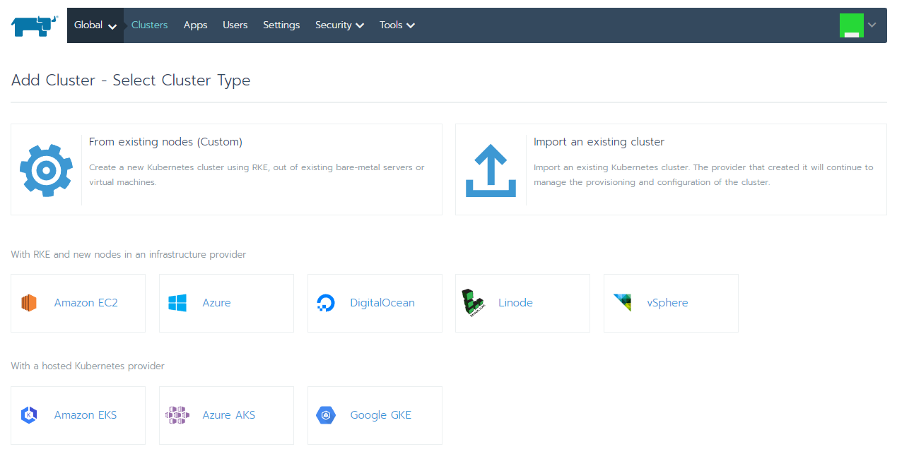

# 使用Rancher建立Kubernetes集群

Rancher是在Kubernetes更上层的管理框架，Rancher是图形化的，有着比较傻瓜式的操作，只有少量一两处地方（如导入集群）需要用到Kubernetes命令行。也由于它提供了一系列容器模版、应用商店等的高层功能，使得要在Kubernetes上部署一个新应用，简化到甚至只需要点几下鼠标即可，因此用户们都爱使用它。

Rancher还推出了RancherOS（极致精简专为容器定制的Linux，尤其适合边缘计算环境）、K3S（Kubernetes as a Service，5 Less Than K8S，一个大约只有40MB，可以运行在x86和ARM架构上的极小型Kubernetes发行版）这样的定制产品，用以在用户心中暗示、强化比K8S更小、更简单、更易用的主观印象。

不过也由于Rancher入门容易，基础性的应用需求解决起来很方便，也导致了不少人一开始使用它之后，就陷入了先入为主的印象，后期再接触Kubernetes时，便觉得学习曲线特别陡峭，反而限制了某些用户对底层问题的进一步深入。

在本文中，笔者以截图为主，展示如何使用Rancher来导入或者创建Kubernetes集群的过程。

## 安装Rancher

前置条件：已经[安装好Docker](../setup-docker.md)。

使用Docker执行Rancher镜像，执行以下命令即可：

```bash
$ sudo docker run -d --restart=unless-stopped -p 8080:80 -p 8443:443 rancher/rancher
```

## 使用Rancher管理现有Kubernetes集群

前置条件：已经[安装好了Kubernetes集群](setup-kubeadm.md)。

使用Rancher的导入功能将已部署的Kubernetes集群纳入其管理。登陆Rancher主界面（首次登陆会要求设置admin密码和Rancher在集群中可访问的路径，后者尤其不能乱设，否则Kubernetes无法访问到Rancher会一直处于Pending等待状态）之后，点击右上角的Add Cluster，然后有下面几个添加集群的选择：



- 要从某台机器中新安装Kubernetes集群选择“From existing nodes (Custom)”
- 要导入某个已经安装好的Kubernetes集群选择“Import an existing cluster”
- 要从各种云服务商的RKE（Rancher Kubernetes Engine）环境中创建，就选择下面那排厂商的按钮，没有的话（譬如国内的阿里云之类的），请先到Tools->Driver中安装对应云服务厂商的驱动。

这里选择“Import an existing cluster”，然后给集群起个名字以便区分（由于Rancher支持多集群管理，所以集群得有个名字以示区别），之后就看见这个界面：


Rancher自动生成了加入集群的命令，这行命令其实就是部署一个运行在Kubernetes中的代理（Agent），在Kubernetes的命令行中执行以上自动生成的命令。

最后那条命令意思是怕由于部署的Rancher服务没有申请SSL证书，导致HTTPS域名验证过不去，kubectl下载不下来yaml。如果你的Rancher部署在已经申请了证书的HTTPS地址上那可以用前面的，否则还是直接用curl --insecure命令来绕过HTTPS证书查验吧，譬如以下命令所示：

```bash
$ curl --insecure -sfL https://localhost:8443/v3/import/vgkj5tzphj9vzg6l57krdc9gfc4b4zsfp4l9prrf6sb7z9d2wvbhb5.yaml | kubectl apply -f -
```

多说一句，用哪条命令安装的Agent只决定了yaml文件是如何下载获得的，对后续其他事情是毫无影响的，所以怎么简单怎么来，别折腾。

执行结果类似如下所示，一堆secret、deployment、daementset创建成功，就代表顺利完成了：


然后回到Rancher网页，点击界面上的“Done”按钮。可以看到集群正处于Pending状态：


如果Agent成功到达Running状态的话，这里也会很快就变成Waiting状态，然后再变为Active状态，导入工作即宣告胜利结束。

而如果一直持续Pending状态，说明安装的Agent运行失败。典型的原因是无法访问到Rancher的服务器，这时可以通过kubectl logs命令查看一下cattle-cluster-agent-xxx的日志，通常会看见"XXX is not accessible"，其中的XXX是Rancher第一次进入时跟你确认过的访问地址，假如你乱填了，或者该地址被防火墙挡掉，又或者因为证书限制等其他原因导致Agent无法访问，Rancher就会一直Pending。

最后再提一句，Rancher与Kubernetes集群之间是被动链接的，即由Kubernetes去主动找Rancher，这意味着部署在外网的Rancher，可以无障碍地管理处于内网（譬如NAT后）的Kubernetes集群，这对于大量没有公网IP的集群来说是很方便的事情。

## 使用Rancher创建Kubernetes集群
