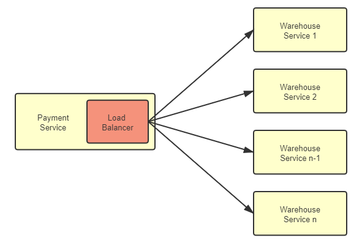
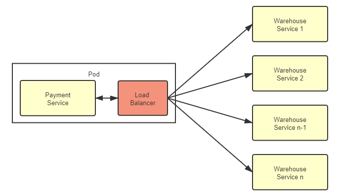

# 客户端负载均衡

:::tip 前置知识

关于经典的集中式负载均衡的工作原理，笔者已在“[负载均衡](/architect-perspective/general-architecture/diversion-system/load-balancing.html)”一节中介绍过，其中许多知识是相通的，笔者在本篇中将不再重复，建议读者先行阅读。

:::

在正式开始讨论之前，我们先来明确区分清楚几个容易混淆的相似概念，分别是本章节中频繁提到的**服务发现**、**网关路由**、**负载均衡**以及在服务流量治理章节中将会介绍的**服务容错**。这几个技术名词都带有着“从服务集群中寻找到一个合适的服务来调用”的含义，笔者通过以下具体场景来说明它们之间的差别：

> **案例场景：**
>
> 假设你身处广东，要上 Fenix's Boosstore 购买一本书，在程序业务逻辑里，购书其中一个关键步骤是调用商品出库服务来完成货物准备，在代码中该服务的调用请求为：
>
> ```http
> PATCH https://warehouse:8080/restful/stockpile/3
>
> {amount: -1}
> ```
>
> 又假设 Fenix's Boosstore 是个大书店，在北京、武汉、广州的机房均部署有服务集群，你的购物请求从浏览器发出后，服务端按顺序发生了如下事件：
>
> 1. 首先是将`warehouse`这个服务名称转换为恰当的服务地址，“恰当”是个宽泛的描述，一种典型的“恰当”便是因调用请求来自广东，优先分配给传输距离最短的广州机房来应答。其实按常理来说这次出库服务的调用应该是集群内的流量，而不是用户浏览器直接发出的请求，所以尽管结果没有不同，但更接近实际的的情况是用户访问首页时已经被 DNS 服务器分配到了广州机房，请求出库服务时，应优先选择同机房的服务进行调用，此时请求变为：
>
>    ```http
>    PATCH https://guangzhou-ip-wan:8080/restful/stockpile/3
>    ```
>
> 2. 广州机房的服务网关将该请求与配置中的特征进行比对，由 URL 中的`/restful/stockpile/**`得知该请求访问的是商品出库服务，因此，将请求的 IP 地址转换为内网中 warehouse 服务集群的入口地址：
>
>    ```http
>    PATCH https://warehouse-gz-lan:8080/restful/stockpile/3
>    ```
>
> 3. 集群中部署有多个 warehouse 服务，收到调用请求后，负载均衡器要在多个服务中根据某种标准——可能是随机挑选，也可能是按顺序轮询，抑或是选择此前调用次数最少那个，等等。根据均衡策略找出要响应本次调用的服务，称其为`warehouse-gz-lan-node1`。
>
>    ```http
>    PATCH https://warehouse-gz-lan-node1:8080/restful/stockpile/3
>    ```
>
> 4. 如果访问`warehouse-gz-lan-node1`服务，没有返回需要的结果，而是抛出 500 错。
>
>    ```http
>    HTTP/1.1 500 Internal Server Error
>    ```
>
> 5. 根据预置的[故障转移](/distribution/traffic-management/failure.html)（Failover）策略，重试将调用分配给能够提供该服务的其他节点，称其为`warehouse-gz-lan-node2`。
>
>    ```http
>    PATCH https://warehouse-gz-lan-node2:8080/restful/stockpile/3
>    ```
>
> 6. `warehouse-gz-lan-node2`服务返回商品出库成功。
>
>    ```http
>    HTTP/1.1 200 OK
>    ```

以上过程从整体上看，步骤 1、2、3、5，分别对应了**服务发现**、**网关路由**、**负载均衡**和**服务容错**，在细节上看，其中部分职责又是有交叉的，并不是服务注册中心就只关心服务发现，网关只关心路由，均衡器只关心流量负载均衡。譬如，步骤 1 服务发现的过程中，“根据请求来源的物理位置来分配机房”这个操作本质上是根据请求中的特征（地理位置）进行流量分发，这实际是一种路由行为。实际系统中，在 DNS 服务器（DNS 智能线路）、服务注册中心（如 Eureka 等框架中的 Region、Zone 概念）或者负载均衡器（可用区负载均衡，如 AWS 的 NLB，或 Envoy 的 Region、Zone、Sub-zone）中都有可能实现。

此外，你是否感觉到以上网络调用过程似乎过于烦琐了，一个从广州机房内网发出的服务请求，绕到了网络边缘的网关、负载均衡器这些设施上，再被分配回内网中另外一个服务去响应，不仅消耗了带宽，降低了性能，也增加了链路上的风险和运维的复杂度。可是，如果流量不经过这些设施，它们相应的职责就无法发挥作用，譬如不经过负载均衡器的话，连请求应该具体交给哪一个服务去处理都无法确定，这有办法简化吗？

## 客户端负载均衡器

对于任何一个大型系统，负载均衡器都是必不可少的设施。以前，负载均衡器大多只部署在整个服务集群的前端，将用户的请求分流到各个服务进行处理，这种经典的部署形式现在被称为集中式的负载均衡。随着微服务日渐流行，服务集群的收到的请求来源不再局限于外部，越来越多的访问请求是由集群内部的某个服务发起，由集群内部的另一个服务进行响应的，对于这类流量的负载均衡，既有的方案依然是可行的，但针内部流量的特点，直接在服务集群内部消化掉，肯定是更合理更受开发者青睐的办法。由此一种全新的、独立位于每个服务前端的、分散式的负载均衡方式正逐渐变得流行起来，这就是本节我们要讨论的主角：客户端负载均衡器（Client-Side Load Balancer），如图 7-4 所示：

:::center

图 7-4 客户端负载均衡器
:::

客户端负载均衡器的理念提出以后，此前的集中式负载均衡器也有了一个方便与它对比的名字“服务端负载均衡器”（Server-Side Load Balancer）。从图中能够清晰地看到客户端负载均衡器的特点，也是它与服务端负载均衡器的关键差别所在：客户端均衡器是和服务实例一一对应的，而且与服务实例并存于同一个进程之内。这个特点能为它带来很多好处，如：

- 均衡器与服务之间信息交换是进程内的方法调用，不存在任何额外的网络开销。
- 不依赖集群边缘的设施，所有内部流量都仅在服务集群的内部循环，避免了出现前文那样，集群内部流量要“绕场一周”的尴尬局面。
- 分散式的均衡器意味着天然避免了集中式的单点问题，它的带宽资源将不会像集中式均衡器那样敏感，这在以七层均衡器为主流、不能通过 IP 隧道和三角传输这样方式节省带宽的微服务环境中显得更具优势。
- 客户端均衡器要更加灵活，能够针对每一个服务实例单独设置均衡策略等参数，访问某个服务，是不是需要具备亲和性，选择服务的策略是随机、轮询、加权还是最小连接等等，都可以单独设置而不影响其它服务。
- ……

但是，客户端均衡器也不是银弹，它得到上述诸多好处的同时，缺点同样也是不少的：

- 它与服务运行于同一个进程之内，意味着它的选型受到服务所使用的编程语言的限制，譬如用 Golang 开发的微服务就不太可能搭配 Spring Cloud Load Balancer 来使用，要为每种语言都实现对应的能够支持复杂网络情况的均衡器是非常难的。客户端均衡器的这个缺陷有违于微服务中技术异构不应受到限制的原则。
- 从个体服务来看，由于是共用一个进程，均衡器的稳定性会直接影响整个服务进程的稳定性，消耗的 CPU、内存等资源也同样影响到服务的可用资源。从集群整体来看，在服务数量达成千乃至上万规模时，客户端均衡器消耗的资源总量是相当可观的。
- 由于请求的来源可能是来自集群中任意一个服务节点，而不再是统一来自集中式均衡器，这就使得内部网络安全和信任关系变得复杂，当攻破任何一个服务时，更容易通过该服务突破集群中的其他部分。
- 服务集群的拓扑关系是动态的，每一个客户端均衡器必须持续跟踪其他服务的健康状况，以实现上线新服务、下线旧服务、自动剔除失败的服务、自动重连恢复的服务等均衡器必须具备的功能。由于这些操作都需要通过访问服务注册中心来完成，数量庞大的客户端均衡器一直持续轮询服务注册中心，也会为它带来不小的负担。
- ……

## 代理负载均衡器

在 Java 领域，客户端均衡器中最具代表性的产品是 Netflix Ribbon 和 Spring Cloud Load Balancer，随着微服务的流行，它们在 Java 微服务中已积聚了相当可观的使用者。直到最近两三年，服务网格（Service Mesh）开始逐渐盛行，另外一种被称为“代理客户端负载均衡器”（Proxy Client-Side Load Balancer，后文简称“代理均衡器”）的客户端均衡器变体形式开始引起不同编程语言的微服务开发者共同关注，它解决了此前客户端均衡器的大多数缺陷。代理均衡器对此前的客户端负载均衡器的改进是将原本嵌入在服务进程中的均衡器提取出来，作为一个进程之外，同一 Pod 之内的特殊服务，放到[边车代理](/architecture/architect-history/post-microservices.html)中去实现，它的流量关系如图 7-5 所示。

:::center

图 7-5 代理负载均衡器
:::

虽然代理均衡器与服务实例不再是进程内通信，而是通过网络协议栈进行数据交换的，数据要经过操作系统的协议栈，要进行打包拆包、计算校验和、维护序列号等网络数据的收发步骤，流量比起之前的客户端均衡器确实多增加了一系列处理步骤。不过，Kubernetes 严格保证了同一个 Pod 中的容器不会跨越不同的节点，这些容器共享着同一个网络名称空间，因此代理均衡器与服务实例的交互，实质上是对本机回环设备的访问，仍然要比真正的网络交互高效且稳定得多。代理均衡器付出的代价较小，但从服务进程中分离出来所获得的收益却是非常显著的：

- 代理均衡器不再受编程语言的限制。发展一个支持 Java、Golang、Python 等所有微服务应用服务的通用的代理均衡器具有很高的性价比。集中不同编程语言的使用者的力量，更容易打造出能面对复杂网络情况的、高效健壮的均衡器。即使退一步说，独立于服务进程的均衡器也不会由于自身的稳定性影响到服务进程的稳定。

- 在服务拓扑感知方面代理均衡器也要更有优势。由于边车代理接受控制平面的统一管理，当服务节点拓扑关系发生变化时，控制平面就会主动向边车代理发送更新服务清单的控制指令，这避免了此前客户端均衡器必须长期主动轮询服务注册中心所造成的浪费。

- 在安全性、可观测性上，由于边车代理都是一致的实现，有利于在服务间建立双向 TLS 通信，也有利于对整个调用链路给出更详细的统计信息。

- ……

总体而言，边车代理这种通过同一个 Pod 的独立容器实现的负载均衡器是目前处理微服务集群内部流量最理想的方式，只是服务网格本身仍是初生事物，还不足够成熟，对操作系统、网络和运维方面的知识要求也较高，但有理由相信随着时间的推移，未来这将会是微服务的主流通信方式。

## 地域与区域

最后，借助前文已经铺设好的上下文场景，笔者想再谈一个与负载均衡相关，但又不仅仅应用于负载均衡的概念：**地域**与**区域**。你是否有注意到在微服务相关的许多设施中，都带有着 Region、Zone 参数，如前文中提到过的服务注册中心 Eureka 的 Region、Zone、边车代理 Envoy 中的 Region、Zone、Sub-zone，如果你有云计算 IaaS 的使用经历，也会发现几乎所有云计算设备都有类似的概念。Region 和 Zone 是公有云计算先驱亚马逊 AWS[提出的概念](https://docs.aws.amazon.com/AWSEC2/latest/UserGuide/using-regions-availability-zones.html)，它们的含义是指：

- Region 是**地域**的意思，譬如华北、东北、华东、华南，这些都是地域范围。面向全球或全国的大型系统的服务集群往往会部署在多个不同地域，譬如本节开头列举的案例场景，大型系统就是通过不同地域的机房来缩短用户与服务器之间的物理距离，提升响应速度，对于小型系统，地域一般就只在异地容灾时才会涉及到。需要注意，不同地域之间是没有内网连接的，所有流量都只能经过公众互联网相连，如果微服务的流量跨越了地域，实际就跟调用外部服务商提供的互联网服务没有任何差别了。所以集群内部流量是不会跨地域的，服务发现、负载均衡器默认也是不会支持跨地域的服务发现和负载均衡。
- Zone 是**区域**的意思，它是**可用区域**（Availability Zones）的简称，区域指在地理上位于同一地域内，但电力和网络是互相独立的物理区域，譬如在华东的上海、杭州、苏州的不同机房就是同一个地域的几个可用区域。同一个地域的可用区域之间具有内网连接，流量不占用公网带宽，因此区域是微服务集群内流量能够触及的最大范围。但你的应用是只部署在同一区域内，还是部署到几个不同可用区域中，要取决于你是否有做异地双活的需求，以及对网络延时的容忍程度。

  - 如果你追求高可用，譬如希望系统即使在某个地区发生电力或者骨干网络中断时仍然可用，那可以考虑将系统部署在多个区域中。注意异地容灾和异地双活的差别：容灾是非实时的同步，而双活是实时或者准实时的，跨地域或者跨区域做容灾都可以，但一般只能跨区域做双活，当然也可以将它们结合起来同时使用，即“两地三中心”模式。
  - 如果你追求低延迟，譬如对时间有高要求的[SLA 应用](https://en.wikipedia.org/wiki/Service-level_agreement)，或者网络游戏服务器等，那就应该考虑将系统的所有服务都只部署在同一个区域中，因为尽管内网连接不受限于公网带宽，但毕竟机房之间的专线容量也是有限的，难以跟机房内部的交换机相比，延时也受物理距离、[网络跳点](<https://en.wikipedia.org/wiki/Hop_(networking)>)数量等因素的影响。

- 可用区域对应于城市级别的区域的范围，一些场景中仍是过大了一些，即使是同一个区域中的机房，也可能存在具有差异的不同子网络，所以在部分微服务框架也提供了 Group、Sub-zone 等做进一步的细分控制，这些参数的意思通常是加权或优先访问同一个子区域的服务，但如果子区域中没有合适的，仍然会访问到可用区域中的其他服务。
- 地域和区域原本是云计算中的概念，对于一些中小型的微服务系统，尤其是非互联网的企业信息系统，很多仍然没有使用云计算设施，只部署在某个专有机房内部，只为特定人群提供服务，这就不需要涉及地理上地域、区域的概念了。此时完全可以自己灵活延拓 Region、Zone 参数的含义，达到优化虚拟化基础设施流量的目的。譬如，将服务发现的区域设置与 Kubernetes 的标签、选择器配合，实现内部服务请求其他服务时，优先使用同一个 Node 中提供的服务进行应答，以降低真实的网络消耗。
