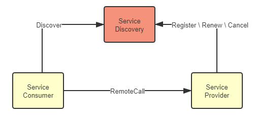

# 服务发现

类库封装被大规模使用，令计算机实现了通过位于不同模块的方法调用来组装复用指令序列，打开了软件达到更大规模的一扇大门。无论是编译期链接的 C、C++语言，抑或是运行期链接的 Java 语言，都要通过[链接器](<https://en.wikipedia.org/wiki/Linker_(computing)>)（Linker）将代码里的[符号引用](https://en.wikipedia.org/wiki/Debug_symbol)转换为模块入口或进程内存地址的直接引用。而服务化的普及，令软件系统得以通过分布于网络中不同机器的互相协作来复用功能，这是软件发展规模的第二次飞跃，此时，如何确定目标方法的确切位置，便是与编译链接有着等同意义的研究课题，解决该问题的过程便被称作“[服务发现](https://en.wikipedia.org/wiki/Service_discovery)”（Service Discovery）。

## 服务发现的意义

所有的远程服务调用都是使用**全限定名**（Fully Qualified Domain Name，[FQDN](https://en.wikipedia.org/wiki/Fully_qualified_domain_name)）、**端口号**与**服务标识**所构成的三元组来确定一个远程服务的精确坐标的。全限定名代表了网络中某台主机的精确位置，端口代表了主机上某一个提供了 TCP/UDP 网络服务的程序，服务标识则代表了该程序所提供的某个具体的方法入口。其中“全限定名、端口号”的含义对所有的远程服务来说都一致，而“服务标识”则与具体的应用层协议相关，不同协议具有不同形式的标识，譬如 REST 的远程服务，标识是 URL 地址；RMI 的远程服务，标识是 Stub 类中的方法；SOAP 的远程服务，标识是 WSDL 中定义方法，等等。远程服务标识的多样性，决定了“服务发现”也可以有两种不同的理解，一种是以 UDDI 为代表的“百科全书式”的服务发现，上至提供服务的企业信息（企业实体、联系地址、分类目录等等），下至服务的程序接口细节（方法名称、参数、返回值、技术规范等等）都在服务发现的管辖范围之内；另一种是类似于 DNS 这样“门牌号码式”的服务发现，只满足从某个代表服务提供者的全限定名到服务实际主机 IP 地址的翻译转换，并不关心服务具体是哪个厂家提供的，也不关心服务有几个方法，各自由什么参数构成，默认这些细节信息是服务消费者本身已完全了解的，此时服务坐标就可以退化为更简单的“全限定名+端口号”。当今，后一种服务发现占主流地位，本文后续所说的服务发现，如无说明，均是特指的是后者。

原本服务发现只依赖 DNS 将一个全限定名翻译为一至多个 IP 地址或者 SRV 等其他类型的记录便可，位于 DNS 之后的负载均衡器也实质上承担了一部分服务发现的职责，完成了外部 IP 地址到各个服务内部实际 IP 的转换，这些内容笔者在“[透明多级分流系统](/architect-perspective/general-architecture/diversion-system/)”一节中曾经详细解析过。这种做法在软件追求不间断长时间运行的时代是很合适的，但随着微服务的逐渐流行，服务的非正常宕机、重启和正常的上线、下线变得越发频繁，仅靠着 DNS 服务器和负载均衡器等基础设施就显得逐渐疲于应对，无法跟上服务变动的步伐了。人们最初是尝试使用 ZooKeeper 这样的分布式 K/V 框架，通过软件自身来完成服务注册与发现，ZooKeeper 也的确曾短暂统治过远程服务发现，是微服务早期的主流选择，但毕竟 ZooKeeper 是很底层的分布式工具，用户自己还需要做相当多的工作才能满足服务发现的需求。到了 2014 年，在 Netflix 内部经受过长时间实际考验的、专门用于服务发现的 Eureka 宣布开源，并很快被纳入 Spring Cloud，成为 Spring 默认的远程服务发现的解决方案。从此 Java 程序员再无须再在服务注册这件事情上花费太多的力气。到 2018 年，Spring Cloud Eureka 进入维护模式以后，HashiCorp 的 Consul 和阿里巴巴的 Nacos 很就快从 Eureka 手上接过传承的衣钵。

到这个阶段，服务发现框架已经发展得相当成熟，考虑到几乎方方面面的问题，不仅支持通过 DNS 或者 HTTP 请求进行符号与实际地址的转换，还支持各种各样的服务健康检查方式，支持集中配置、K/V 存储、跨数据中心的数据交换等多种功能，可算是应用自身去解决服务发现的一个顶峰。如今，云原生时代来临，基础设施的灵活性得到大幅度的增强，最初的使用基础设施来透明化地做服务发现的方式又重新被人们所重视，如何在基础设施和网络协议层面，对应用尽可能无感知、方便地实现服务发现是目前服务发现的一个主要发展方向。

## 可用与可靠

本章笔者并不打算介绍具体某一种服务发现工具的具体功能与操作，而是会去分析服务发现的通用的共性设计，探讨对比时下服务发现最常见的不同形式。这里要讨论的第一个问题是“服务发现”具体是指进行过什么操作？这其实包含三个必须的过程。

- **服务的注册**（Service Registration）：当服务启动的时候，它应该通过某些形式（如调用 API、产生事件消息、在 ZooKeeper/Etcd 的指定位置记录、存入数据库，等等）将自己的坐标信息通知到服务注册中心，这个过程可能由应用程序本身来完成，称为自注册模式，譬如 Spring Cloud 的@EnableEurekaClient 注解；也可能有容器编排框架或第三方注册工具来完成，称为第三方注册模式，譬如 Kubernetes 和 Registrator。
- **服务的维护**（Service Maintaining）：尽管服务发现框架通常都有提供下线机制，但并没有什么办法保证每次服务都能[优雅地下线](https://whatis.techtarget.com/definition/graceful-shutdown-and-hard-shutdown)（Graceful Shutdown）而不是由于宕机、断网等原因突然失联。所以服务发现框架必须要自己去保证所维护的服务列表的正确性，以避免告知消费者服务的坐标后，得到的服务却不能使用的尴尬情况。现在的服务发现框架，往往都能支持多种协议（HTTP、TCP 等）、多种方式（长连接、心跳、探针、进程状态等）去监控服务是否健康存活，将不健康的服务自动从服务注册表中剔除。
- **服务的发现**（Service Discovery）：这里的发现是特指狭义上消费者从服务发现框架中，把一个符号（譬如 Eureka 中的 ServiceID、Nacos 中的服务名、或者通用的 FQDN）转换为服务实际坐标的过程，这个过程现在一般是通过 HTTP API 请求或者通过 DNS Lookup 操作来完成，也还有一些相对少用的方式，譬如 Kubernetes 也支持注入环境变量来做服务发现。

以上三点只是列举了服务发现必须提供的功能，在此之余还会有一些可选的扩展功能，譬如在服务发现时进行的负载均衡、流量管控、键值存储、元数据管理、业务分组，等等，这部分后续章节会有专门介绍，不在此展开。这里，笔者想借服务发现为样本，展示分布式环境里可用性与一致性的矛盾。从 CAP 定理开始，到分布式共识算法，我们已在理论上探讨过多次服务的可用和数据的可靠之间需有所取舍，但服务发现却面临着两者都难以舍弃的困境。

服务发现既要高可用，也要高可靠是由它在整个系统中所处的位置所决定的。在概念模型里，服务发现的位置是如图 7-1 所示这样的：服务提供者在服务注册中心中注册、续约和下线自己的真实坐标，服务消费者根据某种符号从服务注册中心中获取到真实坐标，无论是服务注册中心、服务提供者还是服务消费者，它们都是系统服务中的一员，相互间的关系应是对等的。

:::center

图 7-1 概念模型中的服务发现

:::

但在真实的系统里，注册中心的地位是特殊的，不能为完全视其为一个普通的服务。注册中心不依赖其他服务，但被所有其他服务共同依赖，是系统中最基础的服务（类似地位的大概就数配置中心了，现在服务发现框架也开始同时提供配置中心的功能，以避免配置中心又去专门摆弄出一集群的节点来），几乎没有可能在业务层面进行容错。这意味着服务注册中心一旦崩溃，整个系统都不再可用，因此，必须尽最大努力保证服务发现的可用性。实际用于生产的分布式系统，服务注册中心都是以集群的方式进行部署的，通常使用三个或者五个节点（通常最多七个，一般也不会更多了，否则日志复制的开销太高）来保证高可用，如图 7-2 所示：

:::center

图 7-2 真实系统中的服务发现

:::

同时，也请注意到上图中各服务注册中心节点之间的“Replicate”字样，作为用户，我们当然期望服务注册中心一直可用永远健康的同时，也能够在访问每一个节点中都能取到可靠一致的数据，而不是从注册中心拿到的服务地址可能已经下线，这两个需求就构成了 CAP 矛盾，不可能同时满足。以最有代表性的 Netflix Eureka 和 Hashicorp Consul 为例：

Eureka 的选择是优先保证高可用性，相对牺牲系统中服务状态的一致性。Eureka 的各个节点间采用异步复制来交换服务注册信息，当有新服务注册进来时，并不需要等待信息在其他节点复制完成，而是马上在该服务发现节点宣告服务可见，只是不保证在其他节点上多长时间后才会可见。同时，当有旧的服务发生变动，譬如下线或者断网，只会由超时机制来控制何时从哪一个服务注册表中移除，变动信息不会实时的同步给所有服务端与客户端。这样的设计使得不论是 Eureka 的服务端还是客户端，都能够持有自己的服务注册表缓存，并以 TTL（Time to Live）机制来进行更新，哪怕服务注册中心完全崩溃，客户端在仍然可以维持最低限度的可用。Eureka 的服务发现模型对节点关系相对固定，服务一般不会频繁上下线的系统是很合适的，以较小的同步代价换取了最高的可用性；Eureka 能够选择这种模型的底气在于万一客户端拿到了已经发生变动的错误地址，也能够通过 Ribbon 和 Hystrix 模块配合来兜底，实现故障转移（Failover）或者快速失败（Failfast）。

Consul 的选择是优先保证高可靠性，相对牺牲系统服务发现的可用性。Consul 采用[Raft 算法](/distribution/consensus/raft.html)，要求多数派节点写入成功后服务的注册或变动才算完成，严格地保证了在集群外部读取到的服务发现结果必定是一致的；同时采用 Gossip 协议，支持多数据中心之间更大规模的服务同步。Consul 优先保证高可靠性一定程度上是基于产品现实情况而做的技术决策，它不像 Netflix OSS 那样有着全家桶式的微服务组件，万一从服务发现中取到错误地址，就没有其他组件为它兜底了。Eureka 与 Consul 的差异带来的影响主要不在于服务注册的快慢（当然，快慢确实是有差别），而在于你如何看待以下这件事情：

> 假设系统形成了 A、B 两个网络分区后，A 区的服务只能从区域内的服务发现节点获取到 A 区的服务坐标，B 区的服务只能取到在 B 区的服务坐标，这对你的系统会有什么影响？

- 如果这件事情对你并没有太大的影响，甚至有可能还是有益的，就应该倾向于选择 AP 式的服务发现。譬如假设 A、B 就是不同的机房，是机房间的网络交换机导致服务发现集群出现的分区问题，但每个分区中的服务仍然能独立提供完整且正确的服务能力，此时尽管不是有意而为，但网络分区在事实上避免了跨机房的服务请求，反而还带来了服务调用链路优化的效果。
- 如果这件事情也可能对你影响非常之大，甚至可能带来比整个系统宕机更坏的结果，就应该倾向于选择 CP 式的服务发现。譬如系统中大量依赖了集中式缓存、消息总线、或者其他有状态的服务，一旦这些服务全部或者部分被分隔到某一个分区中，会对整个系统的操作的正确性产生直接影响的话，那与其最后弄出一堆数据错误，还不如直接停机来得痛快。

## 注册中心实现

可用性与一致性的矛盾，是分布式系统永恒的话题，在服务发现这个场景里，权衡的主要关注点是相对更能容忍出现服务列表不可用的后果，还是出现服务数据不准确的后果，其次才到性能高低，功能是否强大，使用是否方便等因素。有了选择权衡，很自然就引来了一下个“务实”的话题，现在那么多的服务发现框架，哪一款最好？或者说应该如何挑选适合的？当下，直接以服务发现、服务注册中心为目标的组件库，或者间接用来实现这个目标的工具主要有以下三类：

- 在分布式 K/V 存储框架上自己开发的服务发现，这类的代表是 ZooKeeper、Doozerd、Etcd。 这些 K/V 框架提供了分布式环境下读写操作的共识算法，Etcd 采用的是我们学习过的 Raft 算法，ZooKeeper 采用的是 ZAB 算法，这也是一种 Multi Paxos 的派生算法，所以采用这种方案，就不必纠结 CP 还是 AP 的问题，它们都是 CP 的（也曾有公司采用 Redis 来做服务发现，这种自然是 AP 的）。这类框架的宣传语中往往会主动提及“高可用性”，潜台词其实是“在保证一致性和分区容忍性的前提下，尽最大努力实现最高的可用性”，譬如 Etcd 的宣传语就是“高可用的集中配置和服务发现”（Highly-Available Key Value Store for Shared Configuration and Service Discovery）。这些 K/V 框架的一个共同特点是在整体较高复杂度的架构和算法的外部，维持着极为简单的应用接口，只有基本的 CRUD 和 Watch 等少量 API，所以要在上面完成功能齐全的服务发现，很多基础的能力，譬如服务如何注册、如何做健康检查，等等都必须自己去实现，如今一般也只有“大厂”才会直接基于这些框架去做服务发现了。
- 以基础设施（主要是指 DNS 服务器）来实现服务发现，这类的代表是 SkyDNS、CoreDNS。 在 Kubernetes 1.3 之前的版本使用 SkyDNS 作为默认的 DNS 服务，其工作原理是从 API Server 中监听集群服务的变化，然后根据服务生成 NS、SRV 等 DNS 记录存放到 Etcd 中，kubelet 会为每个 Pod 设置 DNS 服务的地址为 SkyDNS 的地址，需要调用服务时，只需查询 DNS 把域名转换成 IP 列表便可实现分布式的服务发现。在 Kubernetes 1.3 之后，SkyDNS 不再是默认的 DNS 服务器，而是由不使用 Etcd，只将 DNS 记录存储在内存中的 KubeDNS 代替，到了 1.11 版，就更推荐采用扩展性很强的 CoreDNS，此时可以通过各种插件来决定是否要采用 Etcd 存储、重定向、定制 DNS 记录、记录日志，等等。 采用这种方案，是 CP 还是 AP 就取决于后端采用何种存储，如果是基于 Etcd 实现的，那自然是 CP 的，如果是基于内存异步复制的方案实现的，那就是 AP 的（仅针对 DNS 服务器本身，不考虑本地 DNS 缓存的 TTL 刷新）。以基础设施来做服务发现，好处是对应用透明，任何语言、框架、工具都肯定是支持 HTTP、DNS 的，所以完全不受程序技术选型的约束，但坏处是透明的并不一定是简单的，你必须自己考虑如何去做客户端负载均衡、如何调用远程方法等这些问题，而且必须遵循或者说受限于这些基础设施本身所采用的实现机制，譬如服务健康检查里，服务的缓存期限就应该由 TTL 来决定，这是 DNS 协议所规定的，如果想改用 KeepAlive 长连接来实时判断服务是否存活就相对麻烦。
- 专门用于服务发现的框架和工具，这类的代表是 Eureka、Consul 和 Nacos。 这一类框架中，你可以自己决定是 CP 还是 AP 的问题，譬如 CP 的 Consul、AP 的 Eureka，还有同时支持 CP 和 AP 的 Nacos（Nacos 采用类 Raft 协议做的 CP，采用自研的 Distro 协议做的 AP，这里“同时”是“都支持”的意思，它们必须二取其一，不是说 CAP 全能满足）。将它们划归一类是由于它们对应用并不是透明的，尽管 Consul 的主体逻辑是在服务进程之外，以边车的形式提供的，尽管 Consul、Nacos 也支持基于 DNS 的服务发现，尽管这些框架都基本上做到了以声明代替编码，譬如在 Spring Cloud 中只改动 pom.xml、配置文件和注解即可实现，但它们依然是可以被应用程序感知的。所以或多或少还需要考虑你所用的程序语言、技术框架的集成问题。但这个特点其实并不见得全是坏处，譬如采用 Eureka 做服务注册，那在远程调用服务时你就可以用 OpenFeign 做客户端，它们本身就已做好了集成，写个声明式接口就能跑；在做负载均衡时你就可以采用 Ribbon 做客户端，要换均衡算法改个配置就成，这些“不透明”实际上都为编码开发带来了一定便捷，而前提是你选用的语言和框架必须支持。如果老板提出要在 Rust 上用 Eureka，那就只能无奈叹息了（原本这里我写的是 Node、Go、Python 等，查了一下这些居然都有非官方的 Eureka 客户端，用的人多什么问题都会有解决方案）。
