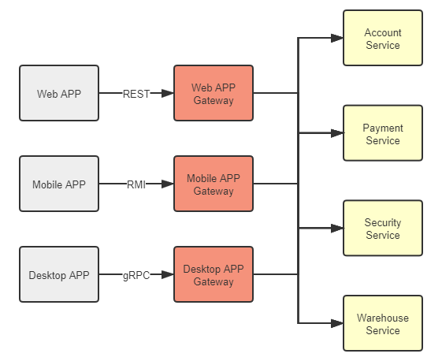

# 网关路由

网关（Gateway）这个词在计算机科学中，尤其是计算机网络中很常见，它用来表示位于内部区域边缘，与外界进行交互的某个物理或逻辑设备，譬如你家里的路由器就属于家庭内网与互联网之间的网关。

## 网关的职责

在单体架构下，我们一般不太强调“网关”这个概念，为各个单体系统的副本分发流量的负载均衡器实质上承担了内部服务与外部请求之间的网关角色。在微服务环境中，网关的存在感就极大地增强了，甚至成为了微服务集群中必不可少的设施之一。其中原因并不难理解：微服务架构下，每个服务节点都可能由不同团队负责，都有着自己独立的、互不相同的接口，如果服务集群缺少一个统一对外交互的代理人角色，那外部的服务消费者就必须知道所有微服务节点在集群中的精确坐标（在[服务发现](/distribution/connect/service-discovery.html)中解释过“服务坐标”的概念），这样，消费者不仅会受到服务集群的网络限制（不能确保集群中每个节点都有外网连接）、安全限制（不仅是服务节点的安全，外部自身也会受到如浏览器[同源策略](https://en.wikipedia.org/wiki/Same-origin_policy)的约束）、依赖限制（服务坐标这类信息不属于对外接口承诺的内容，随时可能变动，不应该依赖它），就算是调用服务的程序员，自己也不会愿意记住每一个服务的坐标位置来编写代码。由此可见，微服务中网关的首要职责就是作为统一的出口对外提供服务，将外部访问网关地址的流量，根据适当的规则路由到内部集群中正确的服务节点之上，因此，微服务中的网关，也常被称为“服务网关”或者“API 网关”，微服务中的网关首先应该是个路由器，在满足此前提的基础上，网关还可以根据需要作为流量过滤器来使用，提供某些额外的可选的功能，譬如安全、认证、授权、限流、监控、缓存，等等（这部分内容在后续章节中有专门讲解，这里不会涉及）。简而言之：

:::center

> 网关 = 路由器（基础职能） + 过滤器（可选职能）

:::

针对“路由”这个基础职能，服务网关主要考量的是能够支持路由的“网络协议层次”和“性能与可用性”两方面的因素。网络协议层次是指[负载均衡](/architect-perspective/general-architecture/diversion-system/load-balancing.html)中介绍过的四层流量转发与七层流量代理，仅从技术实现角度来看，对于路由这项工作，负载均衡器与服务网关在实现上是没有什么差别的，很多服务网关本身就是基于老牌的负载均衡器来实现的，譬如基于 Nginx、HAProxy 开发的 Ingress Controller，基于 Netty 开发的 Zuul 2.0 等；但从目的角度看，负载均衡器与服务网关会有一些区别，具体在于前者是为了根据均衡算法对流量进行平均地路由，后者是为了根据流量中的某种特征进行正确地路由。网关必须能够识别流量中的特征，这意味着网关能够支持的网络通信协议的层次将会直接限制后端服务节点能够选择的服务通信方式。如果服务集群只提供像 Etcd 这样直接基于 TCP 的访问的服务，那只部署四层网关便可满足，网关以 IP 报文中源地址、目标地址为特征进行路由；如果服务集群要提供 HTTP 服务的话，那就必须部署一个七层网关，网关根据 HTTP 报文中的 URL、Header 等信息为特征进行路由；如果服务集群还要提供更上层的 WebSocket、SOAP 等服务，那就必须要求网关同样能够支持这些上层协议，才能从中提取到特征。

举个例子，以下是一段[基于 SpringCloud 实现的 Fenix's Bootstore](/exploration/projects/microservice_arch_springcloud.html)中用到的 Netflix Zuul 网关的配置，Zuul 是 HTTP 网关，`/restful/accounts/**`和`/restful/pay/**`是 HTTP 中 URL 的特征，而配置中的`serviceId`就是路由的目标服务。

```yaml
  routes:
    account:
      path: /restful/accounts/**
      serviceId: account
      stripPrefix: false
      sensitiveHeaders: "*"

    payment:
      path: /restful/pay/**
      serviceId: payment
      stripPrefix: false
      sensitiveHeaders: "*"
```

今天围绕微服务的各种技术仍处于快速发展期，笔者不提倡针对每一种工具、框架本身去记忆配置细节，就是无须纠结上面代码清单中配置的确切写法、每个指令的含义。如果你从根本上理解了网关的原理，参考一下技术手册，很容易就能够将上面的信息改写成 Kubernetes Ingress Controller、Istio VirtualServer 或者其他服务网关所需的配置形式。

网关的另一个主要关注点是它的性能与可用性。由于网关是所有服务对外的总出口，是流量必经之地，所以网关的路由性能将导致全局的、系统性的影响，如果经过网关路由会有 1 毫秒的性能损失，就意味着整个系统所有服务的响应延迟都会增加 1 毫秒。网关的性能与它的工作模式和自身实现算法都有关系，但毫无疑问工作模式是最关键的因素，如果能够采用 DSR 三角传输模式，原理上就决定了性能一定会比代理模式来的强（DSR、IP Tunnel、NAT、代理等这些都是网络基础知识，笔者曾在介绍[负载均衡器](/architect-perspective/general-architecture/diversion-system/load-balancing.html)时详细讲解过）。不过，因为今天 REST 和 JSON-RPC 等基于 HTTP 协议的服务接口在对外部提供的服务中占绝对主流的地位，所以我们所讨论的服务网关默认都必须支持七层路由，通常就默认无法直接进行流量转发，只能采用代理模式。在这个前提约束下，网关的性能主要取决于它们如何代理网络请求，也即它们的网络 I/O 模型，下面笔者正好借这个场景介绍一下网络 I/O 的基础知识。

## 网络 I/O 模型

在套接字接口抽象下，网络 I/O 的出入口就是 Socket 的读和写，Socket 在操作系统接口中被抽象为数据流，网络 I/O 可以理解为对流的操作。每一次网络访问，从远程主机返回的数据会先存放到操作系统内核的缓冲区中，然后内核的缓冲区复制到应用程序的地址空间，所以当发生一次网络请求发生后，将会按顺序经历“等待数据从远程主机到达缓冲区”和“将数据从缓冲区拷贝到应用程序地址空间”两个阶段，根据实现这两个阶段的不同方法，人们把网络 I/O 模型总结为两类、五种模型：两类是指**同步 I/O**与**异步 I/O**，五种是指在同步 IO 中又分有划分出**阻塞 I/O**、**非阻塞 I/O**、**多路复用 I/O**和**信号驱动 I/O**四种细分模型。这里笔者先解释一下同步和异步、阻塞和非阻塞的概念。同步是指调用端发出请求之后，得到结果之前必须一直等待，与之相对的就是异步，发出调用请求之后将立即返回，不会马上得到处理结果，结果将通过状态变化和回调来通知调用者。阻塞和非阻塞是针对请求处理过程，指收到调用请求之后，返回结果之前，当前处理线程是否会被挂起。这种概念上的叙述估计还是不太好理解的，笔者以“你如何领到盒饭”为情景，将之类比解释如下：

- **异步 I/O**（Asynchronous I/O）：好比你在美团外卖订了个盒饭，付款之后你自己该干嘛还干嘛去，饭做好了骑手自然会到门口打电话通知你。异步 I/O 中数据到达缓冲区后，不需要由调用进程主动进行从缓冲区复制数据的操作，而是复制完成后由操作系统向线程发送信号，所以它一定是非阻塞的。
- **同步 I/O**（Synchronous I/O）：好比你自己去饭堂打饭，这时可能有如下情形发生：
  - **阻塞 I/O**（Blocking I/O）：你去到饭堂，发现饭还没做好，你也干不了别的，只能打个瞌睡（线程休眠），直到饭做好，这就是被阻塞了。阻塞 I/O 是最直观的 I/O 模型，逻辑清晰，也比较节省 CPU 资源，但缺点就是线程休眠所带来的上下文切换，这是一种需要切换到内核态的重负载操作，不应当频繁进行。
  - **非阻塞 I/O**（Non-Blocking I/O）：你去到饭堂，发现饭还没做好，你就回去了，然后每隔 3 分钟来一次饭堂看饭做好了没，直到饭做好。非阻塞 I/O 能够避免线程休眠，对于一些很快就能返回结果的请求，非阻塞 I/O 可以节省切换上下文切换的消耗，但是对于较长时间才能返回的请求，非阻塞 I/O 反而白白浪费了 CPU 资源，所以目前并不常用。
  - **多路复用 I/O**（Multiplexing I/O）：多路复用 I/O 本质上是阻塞 I/O 的一种，但是它的好处是可以在同一条阻塞线程上处理多个不同端口的监听。类比的情景是你名字叫雷锋，代表整个宿舍去饭堂打饭，去到饭堂，发现饭还没做好，还是继续打瞌睡，但哪个舍友的饭好了，你就马上把那份饭送回去，然后继续打着瞌睡哼着歌等待其他的饭做好。多路复用 I/O 是目前的高并发网络应用的主流，它下面还可以细分 select、epoll、kqueue 等不同实现，这里就不作展开了。
  - **信号驱动 I/O**（Signal-Driven I/O）：你去到饭堂，发现饭还没做好，但你跟厨师熟，跟他说饭做好了叫你，然后回去该干嘛干嘛，等收到厨师通知后，你把饭从饭堂拿回宿舍。这里厨师的通知就是那个“信号”，信号驱动 I/O 与异步 I/O 的区别是“从缓冲区获取数据”这个步骤的处理，前者收到的通知是可以开始进行复制操作了，即要你自己从饭堂拿回宿舍，在复制完成之前线程处于阻塞状态，所以它仍属于同步 I/O 操作，而后者收到的通知是复制操作已经完成，即外卖小哥已经把饭送到了。

显而易见，异步 I/O 模型是最方便的，毕竟能叫外卖谁愿意跑饭堂啊，但前提是你学校里有开展外卖业务。同样，异步 I/O 受限于操作系统，Windows NT 内核早在 3.5 以后，就通过[IOCP](https://zh.wikipedia.org/wiki/IOCP)实现了真正的异步 I/O 模型。而 Linux 系统下，是在 Linux Kernel 2.6 才首次引入，目前也还并不算很完善，因此在 Linux 下实现高并发网络编程时仍是以多路复用 I/O 模型模式为主。

回到服务网关的话题上，有了网络 I/O 模型的知识，我们就可以在理论上定性分析不同七层网关的性能差异了。七层服务网关处理一次请求代理时，包含了两组网络操作，分别是作为服务端对外部请求的应答，和作为客户端对内部服务的请求，理论上这两组网络操作可以采用不同的模型去完成，但一般来说并没有必要这样做。

以 Zuul 网关为例，在 Zuul 1.0 时，它采用的是阻塞 I/O 模型来进行最经典的“一条线程对应一个连接”（Thread-per-Connection）的方式来代理流量，采用阻塞 I/O 意味着它会有线程休眠，就有上下文切换的成本，所以如果后端服务普遍属于计算密集型（CPU Bound，可以通俗理解为服务耗时比较长，主要消耗在 CPU 上）时，这种模式能够相对节省网关的 CPU 资源，但如果后端服务普遍都是 I/O 密集型（I/O Bound，可以理解服务都很快返回，主要消耗在 I/O 上），它就会由于频繁的上下文切换而降低性能。在 Zuul 的 2.0 版本，最大的改进就是基于 Netty Server 实现了异步 I/O 模型来处理请求，大幅度减少了线程数，获得了更高的性能和更低的延迟。根据 Netflix 官方自己给出的数据，Zuul 2.0 大约要比 Zuul 1.0 快上 20%左右。甚至还有一些网关，支持自行配置，或者根据环境选择不同的网络 I/O 模型，典型的就是 Nginx，可以支持在配置文件中指定 select、poll、epoll、kqueue 等并发模型。

网关的性能高低一般只去定性分析，要定量地说哪一种网关性能最高、高多少是很困难的，就像我们都认可 Chrome 要比 IE 快，但脱离了具体场景，快上多少就很难说的清楚。尽管笔者上面引用了 Netflix 官方对 Zuul 两个版本的量化对比，网络上也有不少关于各种网关的性能对比数据，但要是脱离具体应用场景去定量地比较不同网关的性能差异还是难以令人信服，不同的测试环境和后端服务都会直接影响结果。

网关还有最后一点必须关注的是它的可用性问题。任何系统的网络调用过程中都至少会有一个单点存在，这是由用户只通过唯一的一个地址去访问系统所决定的。即使是淘宝、亚马逊这样全球多数据中心部署的大型系统也不例外。对于更普遍的小型系统（小型是相对淘宝这些而言）来说，作为后端对外服务代理人角色的网关经常被视为整个系统的入口，往往很容易成为网络访问中的单点，这时候它的可用性就尤为重要。由于网关的地址具有唯一性，就不像之前[服务发现](/distribution/connect/service-discovery.html)那些注册中心那样直接做个集群，随便访问哪一台都可以解决问题。为此，对网关的可用性方面，我们应该考虑到以下几点：

- 网关应尽可能轻量，尽管网关作为服务集群统一的出入口，可以很方便地做安全、认证、授权、限流、监控，等等的功能，但给网关附加这些能力时还是要仔细权衡，取得功能性与可用性之间的平衡，过度增加网关的职责是危险的。
- 网关选型时，应该尽可能选择较成熟的产品实现，譬如 Nginx Ingress Controller、KONG、Zuul 这些经受过长期考验的产品，而不能一味只考虑性能选择最新的产品，性能与可用性之间的平衡也需要权衡。
- 在需要高可用的生产环境中，应当考虑在网关之前部署负载均衡器或者[等价路由器](https://en.wikipedia.org/wiki/Equal-cost_multi-path_routing)（ECMP），让那些更成熟健壮的设施（往往是硬件物理设备）去充当整个系统的入口地址，这样网关也可以进行扩展了。

## BFF 网关

提到网关的唯一性、高可用与扩展，笔者顺带也说一下近年来随着微服务一起火起来的概念“BFF”（Backends for Frontends）。这个概念目前还没有权威的中文翻译，在我们讨论的上下文里，它的意思是，网关不必为所有的前端提供无差别的服务，而是应该针对不同的前端，聚合不同的服务，提供不同的接口和网络访问协议支持。譬如，运行于浏览器的 Web 程序，由于浏览器一般只支持 HTTP 协议，服务网关就应提供 REST 等基于 HTTP 协议的服务，但同时我们亦可以针对运行于桌面系统的程序部署另外一套网关，它能与 Web 网关有完全不同的技术选型，能提供出基于更高性能协议（如 gRPC）的接口来获得更好的体验。在网关这种边缘节点上，针对同一样的后端集群，裁剪、适配、聚合出适应不一样的前端的服务，有助于后端的稳定，也有助于前端的赋能。

:::center

图 7-3 BFF 网关
:::
