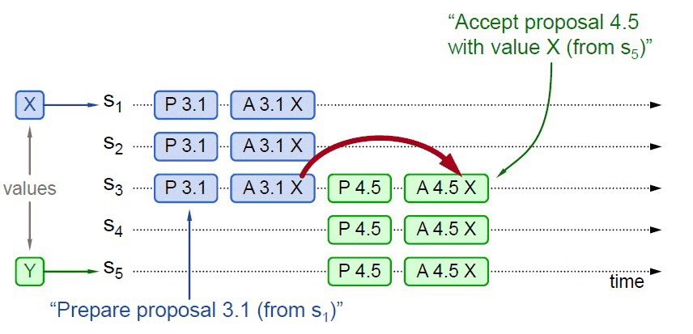

# Paxos

:::tip Distributed Consensus Algorithm

There is only one consensus protocol, and that's “Paxos” — all other approaches are just broken versions of Paxos

世界上只有一种共识协议，就是 Paxos，其他所有共识算法都是 Paxos 的退化版本。

:::right

—— [Mike Burrows](https://en.wikipedia.org/wiki/Michael_Burrows)，Inventor of Google Chubby

:::

Paxos 是由[Leslie Lamport](https://en.wikipedia.org/wiki/Leslie_Lamport)（就是大名鼎鼎的[LaTeX](https://en.wikipedia.org/wiki/LaTeX)中的“La”）提出的一种基于消息传递的协商共识算法，现已是当今分布式系统最重要的理论基础，几乎就是“共识”二字的代名词。这个极高的评价出自于提出 Raft 算法的[论文](https://web.stanford.edu/~ouster/cgi-bin/papers/raft-atc14)，更是显得分量十足。虽然笔者认为并没有 Mike Burrows 说的“世界上只有 Paxos 一种分布式共识算法”那么夸张，但是如果没有 Paxos，那后续的 Raft、ZAB 等算法，ZooKeeper、Etcd 这些分布式协调框架、Hadoop、Consul 这些在此基础上的各类分布式应用都很可能会延后好几年面世。

## Paxos 的诞生

为了解释清楚 Paxos 算法，Lamport 虚构了一个名为“Paxos”的希腊城邦，这个城邦按照民主制度制定法律，却又不存在一个中心化的专职立法机构，立法靠着“兼职议会”（Part-Time Parliament）来完成，无法保证所有城邦居民都能够及时地了解新的法律提案、也无法保证居民会及时为提案投票。Paxos 算法的目标就是让城邦能够在每一位居民都不承诺一定会及时参与的情况下，依然可以按照少数服从多数的原则，最终达成一致意见。但是 Paxos 算法并不考虑[拜占庭将军](https://en.wikipedia.org/wiki/Byzantine_fault)问题，即假设信息可能丢失也可能延迟，但不会被错误传递。

Lamport 最初在 1990 年首次发表了 Paxos 算法，选的论文题目就是“[The Part-Time Parliament](https://lamport.azurewebsites.net/pubs/lamport-paxos.pdf)”。由于算法本身极为复杂，用希腊城邦作为比喻反而使得描述更为晦涩，论文的三个审稿人一致要求他把希腊城邦的故事删除掉，这令 Lamport 感觉颇为不爽，然后干脆就撤稿不发了，所以 Paxos 刚刚被提出的时候并没有引起什么反响。八年之后（1998 年），Lamport 再次将此文章重新整理后投到《[ACM Transactions on Computer Systems](https://dl.acm.org/journal/tocs)》，这次论文成功发表，Lamport 的名气确实吸引了一些人去研究，结果是并没有多少人能弄懂他在说什么。时间又过去了三年（2001 年），Lamport 认为前两次是同行们无法理解他以“希腊城邦”来讲故事的幽默感，第三次以“[Paxos Made Simple](https://lamport.azurewebsites.net/pubs/paxos-simple.pdf)”为题，在《[SIGACT News](https://www.sigact.org/SIGACT_News/)》杂志上发表文章，终于放弃了“希腊城邦”的比喻，尽可能用（他认为）简单直接、（他认为）可读性较强的方式去介绍 Paxos 算法，情况虽然比前两次要好上一些，但以 Paxos 本应获得的重视程度来说，这次依然只能算是应者寥寥。这一段听起来跟网络段子一般的经历被 Lamport 以自嘲的形式放到了[他自己的个人网站](http://lamport.azurewebsites.net/pubs/pubs.html#lamport-paxos)上。尽管我们作为后辈应该尊重 Lamport 老爷子，但当笔者翻开“Paxos Made Simple”的论文，见到只有“The Paxos algorithm, when presented in plain English, is very simple.”这一句话的“摘要”时，心里实在是不得不怀疑 Lamport 这样写论文是不是在恶搞审稿人和读者，在嘲讽“你们这些愚蠢的人类！”。

:::center

[Paxos Made Simple](https://lamport.azurewebsites.net/pubs/paxos-simple.pdf)
:::

虽然 Lamport 本人连发三篇文章都没能让大多数同行理解 Paxos，但 2006 年，在 Google 的 Chubby、Megastore 以及 Spanner 等分布式系统都使用 Paxos 解决了分布式共识的问题，并将其整理成正式的论文发表之后，得益于 Google 的行业影响力，辅以 Chubby 作者 Mike Burrows 那略显夸张但足够吸引眼球的评价推波助澜，Paxos 算法一夜间成为计算机科学分布式这条分支中最炙手可热的网红概念，开始被学术界众人争相研究。2013 年，Lamport 本人因其对分布式系统的杰出理论贡献获得了 2013 年的图灵奖，随后才有了 Paxos 在区块链、分布式系统、云计算等多个领域大放异彩的故事。足可见技术圈里即使再有本事，也还是需要好好包装一下的道理。

## 算法流程

讲完段子吃过西瓜，希望你没有被这些对 Paxos 的“困难”做的铺垫所吓倒，反正又不让你马上去实现它。假如放弃些许严谨性，并简化掉最繁琐的分支细节和特殊情况的话，Paxos 是完全可能去通俗地理解的，Lamport 在论文中也只用两段话就描述“清楚”了它的工作流程，下面，我们正式来学习 Paxos 算法（在本小节中 Paxos 均特指最早的 Basic Paxos 算法）。Paxos 算法将分布式系统中的节点分为三类：

- **提案节点**：称为 Proposer，提出对某个值进行设置操作的节点，设置值这个行为就被称之为**提案**（Proposal），值一旦设置成功，就是不会丢失也不可变的。请注意，Paxos 是典型的基于操作转移模型而非状态转移模型来设计的算法，这里的“设置值”不要类比成程序中变量赋值操作，应该类比成日志记录操作，在后面介绍的 Raft 算法中就直接把“提案”叫作“日志”了。
- **决策节点**：称为 Acceptor，是应答提案的节点，决定该提案是否可被投票、是否可被接受。提案一旦得到过半数决策节点的接受，即称该提案被**批准**（Accept），提案被批准即意味着该值不能再被更改，也不会丢失，且最终所有节点都会接受该它。
- **记录节点**：被称为 Learner，不参与提案，也不参与决策，只是单纯地从提案、决策节点中学习已经达成共识的提案，譬如少数派节点从网络分区中恢复时，将会进入这种状态。

使用 Paxos 算法的分布式系统里的，所有的节点都是平等的，它们都可以承担以上某一种或者多种的角色，不过为了便于确保有明确的多数派，决策节点的数量应该被设定为奇数个，且在系统初始化时，网络中每个节点都知道整个网络所有决策节点的数量、地址等信息。

在分布式环境下，如果我们说各个节点“就某个值（提案）达成一致”，指的是“不存在某个时刻有一个值为 A，另一个时刻又为 B 的情景”。解决这个问题的复杂度主要来源于以下两个方面因素的共同影响：

- 系统内部各个节点通信是不可靠的，不论对于系统中企图设置数据的提案节点抑或决定是否批准设置操作的决策节点，其发出、收到的信息可能延迟送达、也可能会丢失，但不去考虑消息有传递错误的情况。
- 系统外部各个用户访问是可并发的，如果系统只会有一个用户，或者每次只对系统进行串行访问，那单纯地应用 Quorum 机制，少数节点服从多数节点，就已经足以保证值被正确地读写。

第一点是网络通信中客观存在的现象，也是所有共识算法都要重点解决的问题。对于第二点，笔者详细解释一下便于你理解：现在我们讨论的是“分布式环境下并发操作的共享数据”的问题，即使先不考虑是不是在分布式的环境下，只考虑并发操作，假设有一个变量 i 当前在系统中存储的数值为 2，同时有外部请求 A、B 分别对系统发送操作指令：“把 i 的值加 1”和“把 i 的值乘 3”，如果不加任何并发控制的话，将可能得到“(2+1)×3=9”与“2×3+1=7”两种可能的结果。因此，对同一个变量的并发修改必须先加锁后操作，不能让 A、B 的请求被交替处理，这些可以说是程序设计的基本常识了。而在分布式的环境下，由于还要同时考虑到分布式系统内可能在任何时刻出现的通信故障，如果一个节点在取得锁之后，在释放锁之前发生崩溃失联，这将导致整个操作被无限期的等待所阻塞，因此算法中的加锁就不完全等同于并发控制中以互斥量来实现的加锁，还必须提供一个其他节点能抢占锁的机制，以避免因通信问题而出现死锁。

为了这个问题，分布式环境中的锁必须是可抢占的。Paxos 算法包括两个阶段，其中，第一阶段“准备”（Prepare）就相当于上面抢占锁的过程。如果某个提案节点准备发起提案，必须先向所有的决策节点广播一个许可申请（称为 Prepare 请求）。提案节点的 Prepare 请求中会附带一个全局唯一的数字 n 作为提案 ID，决策节点收到后，将会给予提案节点两个承诺与一个应答。

两个承诺是指：

- 承诺不会再接受提案 ID 小于或等于 n 的 Prepare 请求。
- 承诺不会再接受提案 ID 小于 n 的 Accept 请求。

一个应答是指：

- 不违背以前作出的承诺的前提下，回复已经批准过的提案中 ID 最大的那个提案所设定的值和提案 ID，如果该值从来没有被任何提案设定过，则返回空值。如果违反此前做出的承诺，即收到的提案 ID 并不是决策节点收到过的最大的，那允许直接对此 Prepare 请求不予理会。

当提案节点收到了多数派决策节点的应答（称为 Promise 应答）后，可以开始第二阶段“批准”（Accept）过程，这时有如下两种可能的结果：

- 如果提案节点发现所有响应的决策节点此前都没有批准过该值（即为空），那说明它是第一个设置值的节点，可以随意地决定要设定的值，将自己选定的值与提案 ID，构成一个二元组“(id, value)”，再次广播给全部的决策节点（称为 Accept 请求）。
- 如果提案节点发现响应的决策节点中，已经有至少一个节点的应答中包含有值了，那它就不能够随意取值了，必须无条件地从应答中找出提案 ID 最大的那个值并接受，构成一个二元组“(id, maxAcceptValue)”，再次广播给全部的决策节点（称为 Accept 请求）。

当每一个决策节点收到 Accept 请求时，都会在不违背以前作出的承诺的前提下，接收并持久化对当前提案 ID 和提案附带的值。如果违反此前做出的承诺，即收到的提案 ID 并不是决策节点收到过的最大的，那允许直接对此 Accept 请求不予理会。

当提案节点收到了多数派决策节点的应答（称为 Accepted 应答）后，协商结束，共识决议形成，将形成的决议发送给所有记录节点进行学习。整个过程的时序图如图 6-1 所示。

<mermaid style="margin-bottom: 0px">
sequenceDiagram
    用户->>提案节点: 操作请求
    提案节点->>决策节点: 构造新的提案ID(n)，广播Prepare(n)请求
    决策节点-->>提案节点: 首次设值，返回Promise(n, null)应答
	opt  非首次设值
		决策节点-->>提案节点: 返回Promise(acceptedProposalID、acceptedValue)应答
		提案节点->>提案节点: 将acceptedValue作为提案的value
	end
	提案节点->>决策节点: 广播Accept(id, value)请求
	决策节点-->>提案节点: 返回Accepted(id, value)应答
	提案节点->>记录节点: 形成决议，供记录节点学习
</mermaid>

:::center

图 6-1 Paxos 算法整体时序图

:::

整个 Paxos 算法的工作流程至此结束，如果你此前并未专门学习过分布式的知识，相信阅读到这里，很有可能的感受是对操作过程中每一步都能看懂，但还是不能对 Paxos 算法究竟是如何解决协商共识的形成具体的概念。下面笔者就不局限于抽象的算法步骤，以一个更具体例子来讲解 Paxos，这个例子与使用到的图片来源于《[Implementing Replicated Logs with Paxos](https://ongardie.net/static/raft/userstudy/paxos.pdf)》，在此统一注明，后面就不单独列出了。

## 工作实例

假设一个分布式系统有五个节点，分别命名为 S~1~、S~2~、S~3~、S~4~、S~5~，这个例子中只讨论正常通信的场景，不涉及网络分区。全部节点都同时扮演着提案节点和决策节点的身份。此时，有两个并发的请求分别希望将同一个值分别设定为 X（由 S~1~作为提案节点提出）和 Y（由 S~5~作为提案节点提出），以 P 代表准备阶段，以 A 代表批准阶段，这时候可能发生以下情况：

- 情况一：譬如，S1选定的提案 ID 是 3.1（全局唯一 ID 加上节点编号），先取得了多数派决策节点的 Promise 和 Accepted 应答，此时 S5选定提案 ID 是 4.5，发起 Prepare 请求，收到的多数派应答中至少会包含 1 个此前应答过 S1的决策节点，假设是 S3，那么 S3提供的 Promise 中必将包含 S1已设定好的值 X，S5就必须无条件地用 X 代替 Y 作为自己提案的值，由此整个系统对“取值为 X”这个事实达成一致，如图 6-2 所示。
  :::center
  
  图 6-2 整个系统对“取值为 X”达成一致
  :::
- 情况二：事实上，对于情况一，X 被选定为最终值是必然结果，但从图 6-2 中可以看出，X 被选定为最终值并不是必定需要多数派的共同批准，只取决于 S5提案时 Promise 应答中是否已包含了批准过 X 的决策节点，譬如图 6-3 所示，S5发起提案的 Prepare 请求时，X 并未获得多数派批准，但由于 S3已经批准的关系，最终共识的结果仍然是 X。
  :::center
  
  图 6-3 X 被选定只取决于 Promise 应答中是否已批准
  :::
- 情况三：当然，另外一种可能的结果是 S5提案时 Promise 应答中并未包含批准过 X 的决策节点，譬如应答 S5提案时，节点 S1已经批准了 X，节点 S2、S3未批准但返回了 Promise 应答，此时 S5以更大的提案 ID 获得了 S3、S4、S5的 Promise，这三个节点均未批准过任何值，那么 S3将不会再接收来自 S1的 Accept 请求，因为它的提案 ID 已经不是最大的了，这三个节点将批准 Y 的取值，整个系统最终会对“取值为 Y”达成一致，如图 6-4 所示。
  :::center
  
  图 6-4 整个系统最终会对“取值为 Y”达成一致
  :::
- 情况四：从情况三可以推导出另一种极端的情况，如果两个提案节点交替使用更大的提案 ID 使得准备阶段成功，但是批准阶段失败的话，这个过程理论上可以无限持续下去，形成活锁（Live Lock），如图 6-5 所示。在算法实现中会引入随机超时时间来避免活锁的产生。
  :::center
  
  图 6-5 批准阶段失败，形成活锁
  :::

虽然 Paxos 是以复杂著称的算法，但以上介绍都是基于 Basic Paxos、以正常流程（未出现网络分区等异常）、通俗方式讲解的 Paxos 算法，并未涉及严谨的逻辑和数学原理，也未讨论 Paxos 的推导证明过程，对于普通的不从事算法研究的技术人员来说，理解起来应该也不算太困难。

Basic Paxos 的价值在于开拓了分布式共识算法的发展思路，但它因有如下缺陷，一般不会直接用于实践：Basic Paxos 只能对单个值形成决议，并且决议的形成至少需要两次网络请求和应答（准备和批准阶段各一次），高并发情况下将产生较大的网络开销，极端情况下甚至可能形成活锁。总之，Basic Paxos 是一种很学术化但对工业化并不友好的算法，现在几乎只用来做理论研究。实际的应用都是基于 Multi Paxos 和 Fast Paxos 算法的，接下来我们将会了解 Multi Paxos 与一些它的理论等价的算法（如 Raft、ZAB 等算法）。
