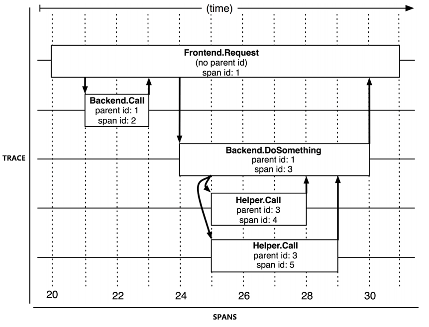
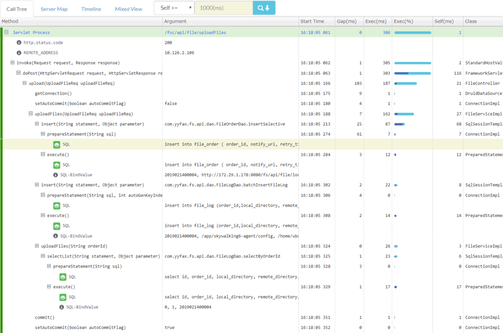

# 链路追踪

尽管2010年之前就已经有了X-Trace、Magpie等追踪系统了，但分布式链路追踪公认的起源是Google在2010年发表的论文《[Dapper : a Large-Scale Distributed Systems Tracing Infrastructure](https://static.googleusercontent.com/media/research.google.com/zh-CN//archive/papers/dapper-2010-1.pdf)》，这篇论文介绍了Google自己从2004年开始使用的分布式追踪系统Dapper的实现原理。此后，所有著名的追踪系统，无论是国外Twitter的[Zipkin](https://github.com/openzipkin/zipkin)、Naver的[Pinpoint](https://github.com/naver/pinpoint)（Naver是Line的母公司，Pinpoint出现其实早于Dapper论文发表，在Dapper论文中还提到了Pinpoint），抑或是国内阿里的鹰眼、大众点评的[CAT](https://github.com/dianping/cat)、个人开源的[SkyWalking](https://github.com/apache/skywalking)（后进入Apache基金会孵化毕业）都受到Dapper的直接影响。

广义上讲，一个完整的分布式追踪系统应该由数据收集、数据存储和数据展示三个相对独立的子系统构成，而狭义上讲的追踪则就只是特指链路追踪数据的收集部分。譬如[Spring Cloud Sleuth](https://spring.io/projects/spring-cloud-sleuth)就属于狭义的追踪系统，通常会搭配Zipkin作为数据展示，搭配Elasticsearch作为数据存储来组合使用，而前面提到的那些Dapper的徒子徒孙们大多都属于广义的追踪系统，广义的追踪系统又常被称为“APM系统”（Application Performance Management）。

为了有效地进行分布式追踪，Dapper提出了“追踪”与“跨度”的概念。链路追踪从客户发起请求抵达系统的边界开始，记录流经的每一个服务，直到到被追踪系统向客户返回响应为止，这整个过程就称为一次“追踪”（Trace，为了不与系统名称产生混淆，后文就直接使用英文Trace来指代了）。由于每个Trace都可能会调用数量不定、位置不定的服务，为了能够记录具体调用了哪些服务，以及每次调用的顺序、开始时点、执行时长等信息，调用服务时需要埋入一个调用记录，这个记录称为一个“跨度”（Span），每一个Trace实际上都是由若干个有顺序、有层级关系的Span所组成一颗追踪树（Trace Tree）。Span的数据结构应该足够简单，以便于能放在日志或者网络协议的报文头里；也应该足够完备，起码应含有时间戳、起止时间、Trace的的ID、当前Span的ID、父Span的ID等能够满足追踪需要的信息，譬如下图所示。

:::center

Trace和Spans（图片来源于[Dapper论文](https://static.googleusercontent.com/media/research.google.com/zh-CN//archive/papers/dapper-2010-1.pdf)）
:::

从目标来看，链路追踪的目的是为排查故障和分析性能提供数据支持，系统对外提供服务的过程中，持续地接受请求并处理响应，同时持续地生成Trace，按次序整理好Trace中每一个Span所记录的调用关系，便能绘制出一幅系统的服务调用拓扑图。根据拓扑图中Span记录的时间信息、请求结果（正常或异常返回）就可以定位到缓慢或者出错的服务，将Trace与历史记录进行对比统计，就可以从系统整体层面分析服务性能，定位性能优化的目标。

从实现来看，为每次服务调用记录Trace和Span，并以此构成追踪树结构，听着好像也不是很复杂，然而考虑到实际情况，追踪系统在功能和非功能性上都有不小的挑战。功能上的挑战来源于服务的异构性，各个服务采用不同程序语言，服务间交互采用不同的网络协议，每兼容一种场景，都会增加功能实现方面的工作量。而非功能性的挑战具体就包括以下这四个方面：

- **低性能损耗**：分布式追踪不能对服务本身产生明显的性能负担。追踪的主要目的之一就是为了寻找性能缺陷，越慢的服务越是需要追踪，所以工作场景都是性能敏感的地方。
- **对应用透明**：追踪系统通常是运维期才事后加入的系统，应该尽量以非侵入的方式来实现追踪，对开发人员做到透明化。
- **随应用扩缩**：现代的分布式服务集群都有根据流量压力自动扩缩的能力，这要求当业务系统扩缩时，追踪系统也能自动跟随，不需要运维人员人工参与。
- **持续的监控**：要求追踪系统必须能够7x24小时工作，否则就难以定位到系统偶尔抖动的行为。

目前，追踪系统根据数据收集方式的差异，可分为三种主流的实现方式，分别是`基于日志的追踪`（Log-Based Tracing），`基于服务的追踪`（Service-Based Tracing）和`基于边车代理的追踪`（Sidecar-Based Tracing），笔者分别介绍如下：

- 基于日志的追踪的思路是将TraceID、Span等信息直接输出到应用日志中，然后随着所有节点的日志归集过程汇聚到一起，再从全局日志信息中反推出完整的调用链拓扑。日志追踪对网络消息完全没有侵入性，对应用服务只有很少量的侵入性，对性能影响也非常低。但其缺点是对日志归集过程的直接依赖，这使得它往往不如其他两种追踪系统实现来的精确。业务服务的调用与日志的归集并不是同时完成的，也通常不由同一个进程完成，完全可能发生业务调用已经顺利结束了，但由于日志归集不及时或者精度丢失，导致日志出现延迟或缺失记录，进而导致追踪失真。这也是前面笔者介绍Elastic Stack时提到的观点，ELK在日志、追踪和度量方面都可以发挥作用，这对中小型应用确实有一定便利，但是大型系统最好还是由专业的工具做专业的事，让ELK只专注于日志处理。<br/>目前，日志追踪的代表是Spring Cloud Sleuth，下面是一段由Sleuth在调用时自动生成的日志记录，你可以从中观察到TraceID、SpanID、父SpanID等追踪信息。

  ```
  # 以下为调用端的日志输出：
  Created new Feign span [Trace: cbe97e67ce162943, Span: bb1798f7a7c9c142, Parent: cbe97e67ce162943, exportable:false]
  2019-06-30 09:43:24.022 [http-nio-9010-exec-8] DEBUG o.s.c.s.i.web.client.feign.TraceFeignClient - The modified request equals GET http://localhost:9001/product/findAll HTTP/1.1
  
  X-B3-ParentSpanId: cbe97e67ce162943
  X-B3-Sampled: 0
  X-B3-TraceId: cbe97e67ce162943
  X-Span-Name: http:/product/findAll
  X-B3-SpanId: bb1798f7a7c9c142
  
  # 以下为服务端的日志输出：
  [findAll] to a span [Trace: cbe97e67ce162943, Span: bb1798f7a7c9c142, Parent: cbe97e67ce162943, exportable:false]
  Adding a class tag with value [ProductController] to a span [Trace: cbe97e67ce162943, Span: bb1798f7a7c9c142, Parent: cbe97e67ce162943, exportable:false]
  ```

- 基于服务的追踪是目前最为常用的追踪实现方式，被Zipkin、SkyWalking等主流追踪系统广泛采用。服务追踪的实现思路是通过某些手段（针对Java应用一般就是通过Java Agent注入）给目标应用注入追踪探针（Probe），你可以把探针视为一个寄生在目标服务身上的独立微服务系统了，它一般会有自己专用的服务注册、心跳检测等功能，有专门的数据收集协议，把从目标系统中监控得到的服务调用信息，通过另一次独立的HTTP或者RPC请求发送给追踪系统。因此，基于服务的追踪会比基于日志的追踪消耗更多的资源，也有更强的侵入性，以此换来的收益是追踪的精确性与稳定性都有所保证，不必再依靠日志归集来传输追踪数据。<br/>下面是一张Pinpoint的追踪效果截图，从图中可以看到参数、变量等相当详细方法级调用信息。笔者在上一节“[日志分析](/distribution/observability/logging.html)”里把“打印追踪诊断信息”列为一种反模式，如果需要诊断需要方法参数、返回值、上下文信息，或者方法调用耗时这类数据，通过追踪系统来实现是比通过日志系统实现更加恰当的解决方案。
  :::center
  
  Pinpoint的追踪截图（图片来自网络）
  :::
  当然，也必须说明清楚的是像Pinpoint这种详细程度的追踪对应用系统的性能压力是相当大的，应该仅在除错时开启，Pinpoint本身就是比较重负载的系统（运行它必须先维护一套HBase）。目前服务追踪的其中一个发展趋势是轻量化，SkyWalking是这方面的佼佼者。

- 基于边车代理的追踪目前基本上只有[Envoy](https://www.envoyproxy.io/)一家能做，毕竟Sidecar领域并没有什么能和Envoy竞争的产品。现在主流的服务网格框架，如Istio和微软的OSM（Open Service Mesh）都是基于Envoy的。基于边车代理的追踪毫无疑问是最符合理想中的分布式追踪模型的，它对应用完全透明，无论是日志还是服务本身都不会有任何变化；它与程序语言无关，无论应用采用什么编程语言实现，只要它还是通过网络（HTTP或者gRPC）来访问服务就可以被追踪到；它有自己独立的数据通道，追踪数据通过xDS协议进行上报，避免了对服务本身网络或者日志归集的依赖，保证了精确性。如果要说这种追踪方式还有什么缺点的话，那就是服务网格现在还不够普及，未来随着云原生的发展，相信它会成为追踪系统的主流实现方式之一。另外就是Envoy本身的工作原理决定了它只能实现服务调用层面的追踪，像上面Pinpoint截图那样本地方法调用级别的追踪诊断是做不到的。<br/>Envoy也没有提供自己的界面端和存储端，所以Envoy和Sleuth一样都属于狭义的追踪系统，需要配合专门的UI来使用，现在SkyWalking、Zipkin、[Jaeger](https://www.jaegertracing.io/)、[LightStep Tracing](https://lightstep.com/products/)等系统都可以接受来自于Envoy的追踪数据，充当它的界面端。

在追踪这个领域，一方面，目前还没有像日志、度量那样出现明显具有统治力的产品，仍处于群雄混战的状态。另一方面，几乎市面上所有的追踪系统都是以Dapper的论文为原型发展出来的，基本上都算是同门师兄弟，却囿于实现细节，彼此互斥。这只能怪当初Google发表的Dapper是论文而不是有约束力的规范，说白了就是只提了思路，并没有规定细节，譬如该怎样进行埋点、Span上下文具体该有什么数据结构，怎样设计追踪系统与探针或者界面端的API接口等等。

为了平息追踪产品的混乱状况，2016年11月，CNCF技术委员会接受了OpenTracing作为基金会第三个项目。OpenTracing是一套与平台无关、与厂商无关、与语言无关的追踪协议规范，只要遵循OpenTracing规范，追踪产品就可以随时更换，也可以相互搭配使用。

OpenTracing的具体工作是制定了一个很薄的标准化层，位于应用程序与追踪系统之间，这样探针与追踪系统完全可以不是同一个厂商的产品，只要它们都支持OpenTracing协议即可互相通讯。另外，OpenTracing还规定了微服务之间发生调用时，应该如何传递Span信息（OpenTracing Payload），以上这些都如下图绿色部分所示。

:::center

符合OpenTracing的软件架构（[图片来源](https://medium.com/opentracing/towards-turnkey-distributed-tracing-5f4297d1736)）
:::

OpenTracing规范一公布，业界著名的追踪系统，如Zipkin、Jaeger、SkyWalking等都很快宣布支持OpenTracing协议，但谁也没想到的是，Google自己却在此时出来反对，提出了与OpenTracing很类似的OpenCensus规范，并随后得到了Microsoft的支持和参与。OpenCensus不仅涉及到追踪，还把下节要讲的度量也纳入进来；内容上不仅涉及到规范制定，还把数据采集的探针和收集器都一起以SDK（目前支持五种语言）的形式提供出来了。一下子大家都有点手足无措了，OpenTracing和OpenCensus又形成了两大阵营，一边是众多老牌APM系统厂商，另一边是分布式追踪概念的提出者Google，还有庞大的Microsoft。追踪规范的提出，看来并没有平息厂商竞争的混乱，反而是水被搅得更混了。

正当群众们买好西瓜搬好板凳的时候，2019年，OpenTracing和OpenCensus忽然握手言和了，它们一起发布可观测性的终极解决方案[OpenTelemetry](https://opentelemetry.io/)，并各自冻结了OpenTracing和OpenCensus的发展。OpenTelemetry不仅包括追踪规范，还包括度量规范、各种语言的SDK、以及采集系统的参考实现，但是不包括界面端和指标预警这些会与用户直接接触的后端功能，将它们留给具体产品去实现，算是没有赶尽杀绝，为一众APM厂商留了一条活路。

OpenTelemetry一诞生就带着无比炫目的光环，直接进入CNCF的孵化项目，它的目标是统一追踪、度量和日志三大领域（目前主要关注的是追踪和度量，日志方面，官方表示将放到下一阶段再去处理）。不过，OpenTelemetry毕竟是2019年才出现的新生事物，尽管背景深厚，前途无量，但未来究竟如何发展，能否打败现在已经有的众多成熟系统，目前仍然言之尚早。