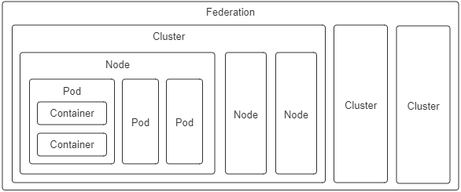
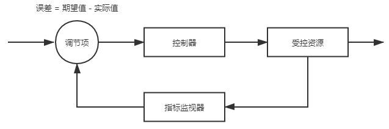
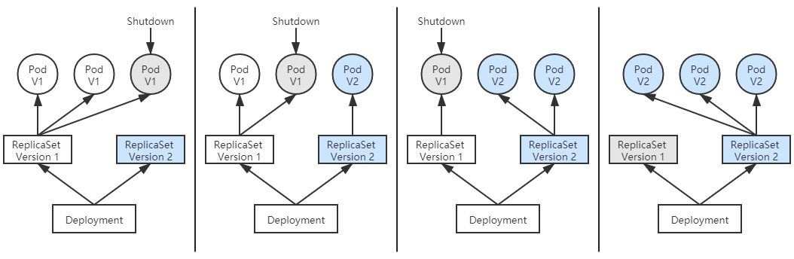

# 以容器构建系统

自从 Docker 提出“以封装应用为中心”的容器发展理念，成功取代了“以封装系统为中心”的 LXC 以后，一个容器封装一个单进程应用已经成为被广泛认可的最佳实践。然而单体时代过去之后，分布式系统里应用的概念已不再等同于进程，此时的应用需要多个进程共同协作，通过集群的形式对外提供服务，以虚拟化方法实现这个目标的过程就被称为容器编排（Container Orchestration）。

容器之间顺畅地交互通信是协作的核心需求，但容器协作并不仅仅是将容器以高速网络互相连接而已。如何调度容器，如何分配资源，如何扩缩规模，如何最大限度地接管系统中的非功能特性，让业务系统尽可能免受分布式复杂性的困扰都是容器编排框架必须考虑的问题，只有恰当解决了这一系列问题，云原生应用才有可能获得比传统应用更高的生产力。

## 隔离与协作

笔者并不打算过多介绍 Kubernetes 具体有哪些功能，向你说明 Kubernetes 由 Pod、Node、Deployment、ReplicaSet 等各种类型的资源组成可用的服务、集群管理平面与节点之间如何工作、每种资源该如何配置使用等等，并不是笔者的本意，如果你希望了解这方面信息，可以从 Kubernetes 官网的文档库或任何一本以 Kubernetes 为主题的使用手册中得到。

笔者真正希望说清楚的问题是“为什么 Kubernetes 会设计成现在这个样子？”、“为什么以容器构建系统应该这样做？”，寻找这些问题的答案最好是从它们设计的实现意图出发，为此，笔者虚构了一系列从简单到复杂的场景供你代入其中，理解并解决这些场景中的问题，并不要求你对 Kubernetes 已有多深入的了解，但要求你至少使用过 Kubernetes 和 Docker，基本了解它的核心功能与命令；此外还会涉及到一点儿 Linux 系统内核资源隔离的基础知识，别担心，只要你仔细读懂了上一节“[容器的崛起](/immutable-infrastructure/container/history.html)”，就已经完全够用了。

现在就来设想一下，如果让你来设计一套容器编排系统，协调各种容器来共同来完成一项工作，会遇到什么问题？会如何着手解决？让我们从最简单的场景出发：

> **场景一**：假设你现在有两个应用，其中一个是 Nginx，另一个是为该 Nginx 收集日志的 Filebeat，你希望将它们封装为容器镜像，以方便日后分发。

最直接的方案就将 Nginx 和 Filebeat 直接编译成同一个容器镜像，这是可以做到的，而且并不复杂，然而这样做会埋下很大隐患：它违背了 Docker 提倡的单个容器封装单进程应用的最佳实践。Docker 设计的 Dockerfile 只允许有一个 ENTRYPOINT，这并非无故添加的人为限制，而是因为 Docker 只能通过监视 PID 为 1 的进程（即由 ENTRYPOINT 启动的进程）的运行状态来判断容器的工作状态是否正常，容器退出执行清理，容器崩溃自动重启等操作都必须先判断状态。设想一下，即使我们使用了[supervisord](http://supervisord.org/)之类的进程控制器来解决同时启动 Nginx 和 Filebeat 进程的问题，如果因某种原因它们不停发生崩溃、重启，那 Docker 也无法察觉到，它只能观察到 supervisord 的运行状态，因此，以上需求会理所当然地演化成场景二。

> **场景二**：假设你现在有两个 Docker 镜像，其中一个封装了 HTTP 服务，为便于称呼，我们叫它 Nginx 容器，另一个封装了日志收集服务，我们叫它 Filebeat 容器。现在要求 Filebeat 容器能收集 Nginx 容器产生的日志信息。

场景二依然不难解决，只要在 Nginx 容器和 Filebeat 容器启动时，分别将它们的日志目录和收集目录挂载为宿主机同一个磁盘位置的 Volume 即可，这种操作在 Docker 中是十分常用的容器间信息交换手段。不过，容器间信息交换不仅仅是文件系统，假如此时我又引入了一个新的工具[confd](https://github.com/kelseyhightower/confd)——Linux 下的一种配置管理工具，作用是根据配置中心（Etcd、ZooKeeper、Consul）的变化自动更新 Nginx 的配置，这里便又会遇到新的问题。confd 需要向 Nginx 发送 HUP 信号以便[通知 Nginx](http://nginx.org/en/docs/control.html)配置已经发生了变更，而发送 HUP 信号自然要求 confd 与 Nginx 能够进行 IPC 通信才行。尽管共享 IPC 名称空间不如共享 Volume 常见，但 Docker 同样支持了该功能，docker run 提供了`--ipc`参数，用于把多个容器挂载到同一个父容器的 IPC 名称空间之下，以实现容器间共享 IPC 名称空间的需求。类似地，如果要共享 UTS 名称空间，可以使用`--uts`参数，要共享网络名称空间的话，就使用`--net`参数。

以上便是 Docker 针对场景二这种不跨机器的多容器协作所给出的解决方案，自动地为多个容器设置好共享名称空间其实就是[Docker Compose](https://docs.docker.com/compose/)提供的核心能力。这种针对具体应用需求来共享名称空间的方案，的确可以工作，却并不够优雅，也谈不上有什么扩展性。容器的本质是对 cgroups 和 namespaces 所提供的隔离能力的一种封装，在 Docker 提倡的单进程封装的理念影响下，容器蕴含的隔离性也多了仅针对于单个进程的额外局限，然而 Linux 的 cgroups 和 namespaces 原本都是针对进程组而不仅仅是单个进程来设计的，同一个进程组中的多个进程天然就可以共享着相同的访问权限与资源配额。如果现在我们把容器与进程在概念上对应起来，那容器编排的第一个扩展点，就是要找到容器领域中与“进程组”相对应的概念，这是实现容器从隔离到协作的第一步，在 Kubernetes 的设计里，这个对应物叫作 Pod。

:::quote 额外知识：Pod 名字的由来与含义

Pod 的概念在容器正式出现之前的 Borg 系统中就已经存在，从 Google 的发表的《[Large-Scale Cluster Management at Google with Borg](https://pdos.csail.mit.edu/6.824/papers/borg.pdf)》可以看出，Kubernetes 时代的 Pod 整合了 Borg 时代的“Prod”（Production Task 的缩写）与“Non-Prod”的职能。由于 Pod 一直没有权威的中文翻译，笔者在后续文章中会尽量用英文指代，偶尔需要中文的场合就使用 Borg 中 Prod 的译法，即“生产任务”来指代。

:::

有了“容器组”的概念，场景二的问题便只需要将多个容器放到同一个 Pod 中即可解决。扮演容器组的角色，满足容器共享名称空间的需求，是 Pod 的两大最基本职责之一，同处于一个 Pod 内的多个容器，相互之间以超亲密的方式协作。请注意，“超亲密”在这里并非某种带强烈感情色彩的形容词，而是有一种有具体定义的协作程度。对于普通非亲密的容器，它们一般以网络交互方式（其他譬如共享分布式存储来交换信息也算跨网络）协作；对亲密协作的容器，是指它们被调度到同一个集群节点上，可以通过共享本地磁盘等方式协作；而超亲密的协作是特指多个容器位于同一个 Pod 这种特殊关系，它们将默认共享：

- **UTS 名称空间**：所有容器都有相同的主机名和域名。
- **网络名称空间**：所有容器都共享一样的网卡、网络栈、IP 地址，等等。因此，同一个 Pod 中不同容器占用的端口不能冲突。
- **IPC 名称空间**：所有容器都可以通过信号量或者 POSIX 共享内存等方式通信。
- **时间名称空间**：所有容器都共享相同的系统时间。

同一个 Pod 的容器，只有 PID 名称空间和文件名称空间默认是隔离的。PID 的隔离令每个容器都有独立的进程 ID 编号，它们封装的应用进程就是 PID 为 1 的进程，可以通过 Pod 元数据定义中的`spec.shareProcessNamespace`来改变这点。一旦要求共享 PID 名称空间，容器封装的应用进程就不再具有 PID 为 1 的特征了，这有可能导致部分依赖该特征的应用出现异常。在文件名称空间方面，容器要求文件名称空间的隔离是很理所当然的需求，因为容器需要相互独立的文件系统以避免冲突。但容器间可以共享存储卷，这是通过 Kubernetes 的 Volume 来实现的。

:::quote 额外知识：Kubernetes 中 Pod 名称空间共享的实现细节

Pod 内部多个容器共享 UTS、IPC、网络等名称空间是通过一个名为 Infra Container 的容器来实现的，这个容器是整个 Pod 中第一个启动的容器，只有几百 KB 大小（代码只有很短的几十行，见[这里](https://github.com/kubernetes/kubernetes/tree/master/build/pause)），Pod 中的其他容器都会以 Infra Container 作为父容器，UTS、IPC、网络等名称空间实质上都是来自 Infra Container 容器。

如果容器设置为共享 PID 名称空间的话，Infra Container 中的进程将作为 PID 1 进程，其他容器的进程将以它的子进程的方式存在，此时将由 Infra Container 来负责进程管理（譬如清理[僵尸进程](https://en.wikipedia.org/wiki/Zombie_process)）、感知状态和传递状态。

由于 Infra Container 的代码除了注册 SIGINT、SIGTERM、SIGCHLD 等信号的处理器外，就只是一个以 pause()方法为循环体的无限循环，永远处于 Pause 状态，所以也常被称为“Pause Container”。

:::

Pod 的另外一个基本职责是实现原子性调度，如果容器编排不跨越集群节点，是否具有原子性都无关紧要。但是在集群环境中，容器可能跨机器调度时，这个特性就变得非常重要。如果以容器为单位来调度的话，不同容器就有可能被分配到不同机器上。两台机器之间本来就是物理隔离，依靠网络连接的，这时候谈什么名称空间共享、`cgroups`配额共享都失去了意义，我们由此从场景二又演化出以下场景三。

> **场景三**：假设你现在有 Filebeat、Nginx 两个 Docker 镜像，在一个具有多个节点的集群环境下，要求每次调度都必须让 Filebeat 和 Nginx 容器运行于同一个节点上。

两个关联的协作任务必须一起调度的需求在容器出现之前就存在已久，譬如在传统的多线程（或多进程）[并发调度](<https://en.wikipedia.org/wiki/Concurrency_(computer_science)>)中，如果两个线程（或进程）的工作是强依赖的，单独给谁分配处理时间、而另一个被挂起都会导致程序无法工作，如此就有了[协同调度](https://en.wikipedia.org/wiki/Coscheduling)（Coscheduling）的概念，以保证一组紧密联系的任务能够被同时分配资源。如果我们在容器编排中仍然坚持将容器视为调度的最小粒度，那对容器运行所需资源的需求声明就只能设定在容器上，这样集群每个节点剩余资源越紧张，单个节点无法容纳全部协同容器的概率就越大，协同的容器被分配到不同节点的可能性就越高。

协同调度是十分麻烦的，实现起来要么很低效，譬如 Apache Mesos 的 Resource Hoarding 调度策略，就要等所有需要调度的任务都完备后才会开始分配资源；要么就会实现得很复杂，譬如 Google 就曾针对 Borg 的下一代 Omega 系统发表过论文《[Omega: Flexible, Scalable Schedulers for Large Compute Clusters](https://static.googleusercontent.com/media/research.google.com/zh-CN//pubs/archive/41684.pdf)》介绍它如何使用通过乐观并发（Optimistic Concurrency）、冲突回滚的方式做到高效率，也同样高度复杂的协同调度。但是如果将运行资源的需求声明定义在 Pod 上，直接以 Pod 为最小的原子单位来实现调度的话，由于多个 Pod 之间必定不存在超亲密的协同关系，只会通过网络非亲密地协作，那就根本没有协同的说法，自然也不需要考虑复杂的调度了，关于 Kubernetes 的具体调度实现，笔者会在“[资源与调度](/immutable-infrastructure/schedule/hardware-schedule.html)”中展开讲解。

Pod 是隔离与调度的基本单位，也是我们接触的第一种 Kubernetes 资源。Kubernetes 将一切皆视为资源，不同资源之间依靠层级关系相互组合协作，这个思想是贯穿 Kubernetes 整个系统的两大核心设计理念之一，不仅在容器、Pod、主机、集群等计算资源上是这样，在工作负载、持久存储、网络策略、身份权限等其他领域中也都有着一致的体现。

:::center

图 11-4 Kubernetes 的计算资源
:::

由于 Pod 是 Kubernetes 中最重要的资源，又是资源模型中一种仅在逻辑上存在、没有物理对应的概念（因为对应的“进程组”也只是个逻辑概念），是其他编排系统没有的概念，所以笔者专门花费了一些篇幅去介绍它的设计意图，而不是像帮助手册那样直接给出它的作用和特性。对于 Kubernetes 中的其他计算资源，像 Node、Cluster 等都有切实的物理对应物，很容易就能形成共同的认知，笔者也就不必逐一介绍了，仅将它们的设计意图列举如下：

- **容器**（Container）：延续了自 Docker 以来一个容器封装一个应用进程的理念，是镜像管理的最小单位。
- **生产任务**（Pod）：补充了容器化后缺失的与进程组对应的“容器组”的概念，Pod 中容器共享 UTS、IPC、网络等名称空间，是资源调度的最小单位。
- **节点**（Node）：对应于集群中的单台机器，这里的机器即可以是生产环境中的物理机，也可以是云计算环境中的虚拟节点，节点是处理器和内存等资源的资源池，是硬件单元的最小单位。
- **集群**（Cluster）：对应于整个集群，Kubernetes 提倡理念是面向集群来管理应用。当你要部署应用的时候，只需要通过声明式 API 将你的意图写成一份元数据（Manifests），将它提交给集群即可，而无需关心它具体分配到哪个节点（尽管通过标签选择器完全可以控制它分配到哪个节点，但一般不需要这样做）、如何实现 Pod 间通信、如何保证韧性与弹性，等等，所以集群是处理元数据的最小单位。
- **集群联邦**（Federation）：对应于多个集群，通过联邦可以统一管理多个 Kubernetes 集群，联邦的一种常见应用是支持跨可用区域多活、跨地域容灾的需求。

## 韧性与弹性

笔者曾看过一部叫作《[Bubble Boy](https://movie.douban.com/subject/1296612/)》的电影，讲述了一个体内没有任何免疫系统的小男孩，终日只能生活在无菌的圆形气球里，对常人来说不值一提的细菌，都能够直接威胁到他的性命。小男孩尽管能够降生于世间，但并不能真正与世界交流，这种生命是极度脆弱的。

真实世界的软件系统与电影世界中的小男孩亦具有可比性。让容器得以相互连通，相互协作仅仅是以容器构建系统的第一步，我们不仅希望得到一个能够运行起来的系统，而且还希望得到一个能够健壮运行的系统、能够抵御意外与风险的系统。在 Kubernetes 的支持下，你确实可以直接创建 Pod 将应用运行起来，但这样的应用就如同电影中只能存活在气球中的小男孩一般脆弱，无论是软件缺陷、意外操作或者硬件故障，都可能导致在复杂协作的过程中某个容器出现异常，进而出现系统性的崩溃。为此，架构师专门设计了[服务容错](/distribution/traffic-management/failure.html)的策略和模式，Kubernetes 作为云原生时代的基础设施，也尽力帮助程序员以最小的代价来实现容错，为系统健壮运行提供底层支持。

如何实现具有韧性与弹性的系统是展示 Kubernetes 控制器设计模式的最好示例，控制器模式是继资源模型之后，本节介绍的另一个 Kubernetes 核心设计理念。下面，我们就从如何解决以下场景四的问题开始。

> **场景四**：假设有一个由数十个 Node、数百个 Pod、近千个 Container 所组成的分布式系统，要避免系统因为外部流量压力、代码缺陷、软件更新、硬件升级、资源分配等各种原因而出现中断，作为管理员，你希望编排系统能为你提供何种支持？

作为用户，当然最希望容器编排系统能自动把所有意外因素都消灭掉，让任何每一个服务都永远健康，永不出错。但永不出错的服务是不切实际的，只有凑齐七颗龙珠才有望办到。那就只能退而求其次，让编排系统在这些服务出现问题，运行状态不正确的时候，能自动将它们调整成正确的状态。这种需求听起来也是贪心的，却已经具备足够的可行性，应对的解决办法在[工业控制系统](https://en.wikipedia.org/wiki/Industrial_control_system)里已经有非常成熟的应用，叫作[控制回路](https://en.wikipedia.org/wiki/Control_loop)（Control Loop）。

[Kubernetes 官方文档](https://kubernetes.io/zh/docs/concepts/architecture/controller/)是以房间中空调自动调节温度为例子介绍了控制回路的一般工作过程的：当你设置好了温度，就是告诉空调你对温度的“期望状态”（Desired State），而传感器测量出的房间实际温度是“当前状态”（Current State）。根据当前状态与期望状态的差距，控制器对空调制冷的开关进行调节控制，就能让其当前状态逐渐接近期望状态。

:::center

图 11-5 控制回路
:::

将这种控制回路的思想迁移应用到容器编排上，自然会为 Kubernetes 中的资源附加上了期望状态与实际状态两项属性。不论是已经出现在上节的资源模型中，用于抽象容器运行环境的计算资源，还是没有登场的另一部分对应于安全、服务、令牌、网络等功能的资源，用户要想使用这些资源来实现某种需求，并不提倡像平常编程那样去调用某个或某一组方法来达成目的，而是通过描述清楚这些资源的期望状态，由 Kubernetes 中对应监视这些资源的控制器来驱动资源的实际状态逐渐向期望状态靠拢，以此来达成目的。这种交互风格被称为是 Kubernetes 的声明式 API，如果你已有过实际操作 Kubernetes 的经验，那你日常在元数据文件中的`spec`字段所描述的便是资源的期望状态。

:::quote 额外知识：Kubernates 的资源对象与控制器

目前，Kubernetes 已内置支持相当多的资源对象，并且还可以使用[CRD](/immutable-infrastructure/extension/crd.html)（Custom Resource Definition）来自定义扩充，你可以使用`kubectl api-resources`来查看它们。笔者根据用途分类列举了以下常见的资源：

- 用于描述如何创建、销毁、更新、扩缩 Pod，包括：Autoscaling（HPA）、CronJob、DaemonSet、Deployment、Job、Pod、ReplicaSet、StatefulSet
- 用于配置信息的设置与更新，包括：ConfigMap、Secret
- 用于持久性地存储文件或者 Pod 之间的文件共享，包括：Volume、LocalVolume、PersistentVolume、PersistentVolumeClaim、StorageClass
- 用于维护网络通信和服务访问的安全，包括：SecurityContext、ServiceAccount、Endpoint、NetworkPolicy
- 用于定义服务与访问，包括：Ingress、Service、EndpointSlice
- 用于划分虚拟集群、节点和资源配额，包括：Namespace、Node、ResourceQuota

这些资源在控制器管理框架中一般都会有相应的控制器来管理，笔者列举常见的控制器，按照它们的启动情况分类如下：

- 必须启用的控制器：EndpointController、ReplicationController、PodGCController、ResourceQuotaController、NamespaceController、ServiceAccountController、GarbageCollectorController、DaemonSetController、JobController、DeploymentController、ReplicaSetController、HPAController、DisruptionController、StatefulSetController、CronJobController、CSRSigningController、CSRApprovingController、TTLController
- 默认启用的可选控制器，可通过选项禁止：TokenController、NodeController、ServiceController、RouteController、PVBinderController、AttachDetachController
- 默认禁止的可选控制器，可通过选项启用：BootstrapSignerController、TokenCleanerController

:::

与资源相对应，只要是实际状态有可能发生变化的资源对象，通常都会由对应的控制器进行追踪，每个控制器至少会追踪一种类型的资源。为了管理众多资源控制器，Kubernetes 设计了统一的控制器管理框架（[kube-controller-manager](https://kubernetes.io/zh/docs/reference/command-line-tools-reference/kube-controller-manager/)）来维护这些控制器的正常运作，以及统一的指标监视器（[kube-apiserver](https://kubernetes.io/zh/docs/reference/command-line-tools-reference/kube-apiserver/)）来为控制器工作时提供其追踪资源的度量数据。

由于毕竟不是在写 Kubernetes 的操作手册，笔者只能针对两三种资源和控制器为代表来举例说明，而无法将每个控制器都详细展开讲解。这里只要将场景四进一步具体化，转换成下面的场景五，便可以得到一个很好的例子，以部署控制器（Deployment Controller）、副本集控制器（ReplicaSet Controller）和自动扩缩控制器（HPA Controller）为例来介绍 Kubernetes 控制器模式的工作原理。

> **场景五**：通过服务编排，对任何分布式系统自动实现以下三种通用的能力：
>
> 1. Pod 出现故障时，能够自动恢复，不中断服务；
> 2. Pod 更新程序时，能够滚动更新，不中断服务；
> 3. Pod 遇到压力时，能够水平扩展，不中断服务；

前文曾提到虽然 Pod 本身也是资源，完全可以直接创建，但由 Pod 直接构成的系统是十分脆弱的，犹如气球中的小男孩，生产中并不提倡。正确的做法是通过副本集（ReplicaSet）来创建 Pod。ReplicaSet 也是一种资源，是属于工作负荷一类的资源，它代表一个或多个 Pod 副本的集合，你可以在 ReplicaSet 资源的元数据中描述你期望 Pod 副本的数量（即`spec.replicas`的值）。当 ReplicaSet 成功创建之后，副本集控制器就会持续跟踪该资源，如果一旦有 Pod 发生崩溃退出，或者状态异常（默认是靠进程返回值，你还可以在 Pod 中设置探针，以自定义的方式告诉 Kubernetes 出现何种情况 Pod 才算状态异常），ReplicaSet 都会自动创建新的 Pod 来替代异常的 Pod；如果异常多出现了额外数量的 Pod，也会被 ReplicaSet 自动回收掉，总之就是确保任何时候集群中这个 Pod 副本的数量都向期望状态靠拢。

ReplicaSet 本身就能满足场景五中的第一项能力，可以保证 Pod 出现故障时自动恢复，但是在升级程序版本时，ReplicaSet 不得不主动中断旧 Pod 的运行，重新创建新版的 Pod，这会造成服务中断。对于那些不允许中断的业务，以前的 Kubernetes 曾经提供过`kubectl rolling-update`命令来辅助实现滚动更新。

所谓[滚动更新](https://en.wikipedia.org/wiki/Rolling_release)（Rolling Updates）是指先停止少量旧副本，维持大量旧副本继续提供服务，当停止的旧副本更新成功，新副本可以提供服务以后，再重复以上操作，直至所有的副本都更新成功。将这个过程放到 ReplicaSet 上，就是先创建新版本的 ReplicaSet，然后一边让新 ReplicaSet 逐步创建新版 Pod 的副本，一边让旧的 ReplicaSet 逐渐减少旧版 Pod 的副本。

之所以`kubectl rolling-update`命令会被淘汰，是因为这样的命令式交互完全不符合 Kubernetes 的设计理念（这是台面上的说法，笔者觉得淘汰的根本原因主要是因为它不够好用），如果你希望改变某个资源的某种状态，应该将期望状态告诉 Kubernetes，而不是去教 Kubernetes 具体该如何操作。因此，新的部署资源（Deployment）与部署控制器被设计出来，可以由 Deployment 来创建 ReplicaSet，再由 ReplicaSet 来创建 Pod，当你更新 Deployment 中的信息（譬如更新了镜像的版本）以后，部署控制器就会跟踪到你新的期望状态，自动地创建新 ReplicaSet，并逐渐缩减旧的 ReplicaSet 的副本数，直至升级完成后彻底删除掉旧 ReplicaSet，如图 11-6 所示。

:::center

图 11-6 Deployment 滚动更新过程
:::

对于场景五的最后一种情况，遇到流量压力时，管理员完全可以手动修改 Deployment 中的副本数量，或者通过`kubectl scale`命令指定副本数量，促使 Kubernetes 部署更多的 Pod 副本来应对压力，然而这种扩容方式不仅需要人工参与，且只靠人类经验来判断需要扩容的副本数量，不容易做到精确与及时。为此 Kubernetes 又提供了 Autoscaling 资源和自动扩缩控制器，能够自动根据度量指标，如处理器、内存占用率、用户自定义的度量值等，来设置 Deployment（或者 ReplicaSet）的期望状态，实现当度量指标出现变化时，系统自动按照“Autoscaling→Deployment→ReplicaSet→Pod”这样的顺序层层变更，最终实现根据度量指标自动扩容缩容。

故障恢复、滚动更新、自动扩缩这些特性，在云原生中时代里常被概括成服务的弹性（Elasticity）与韧性（Resilience），ReplicaSet、Deployment、Autoscaling 的用法，也属于是所有 Kubernetes 教材资料都会讲到的“基础必修课”。如果你准备学习 Kubernetes 或者其他云原生相关技术，笔者建议最好不要死记硬背地学习每个资源的元数据文件该如何编写、有哪些指令、有哪些功能，更好的方式是站在解决问题的角度去理解为什么 Kubernetes 要设计这些资源和控制器，理解为什么这些资源和控制器会被设计成现在这种样子。

如果你觉得已经理解了前面的几种资源和控制器的例子，那不妨思考一下以下几个问题：假设我想限制某个 Pod 持有的最大存储卷数量，应该会如何设计？假设集群中某个 Node 发生硬件故障，Kubernetes 要让调度任务避开这个 Node，应该如何设计？假设一旦这个 Node 重新恢复，Kubernetes 要能尽快利用上面的资源，又该如何去设计？只要你真正接受了资源与控制器是贯穿整个 Kubernetes 的两大设计理念，即便不去查文档手册，也应该能推想出个大概轮廓，以此为基础当你再去看手册或者源码时，想必就能够事半功倍
