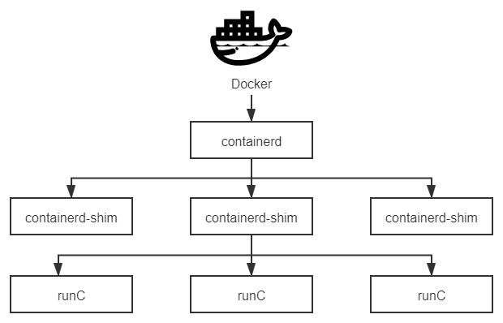
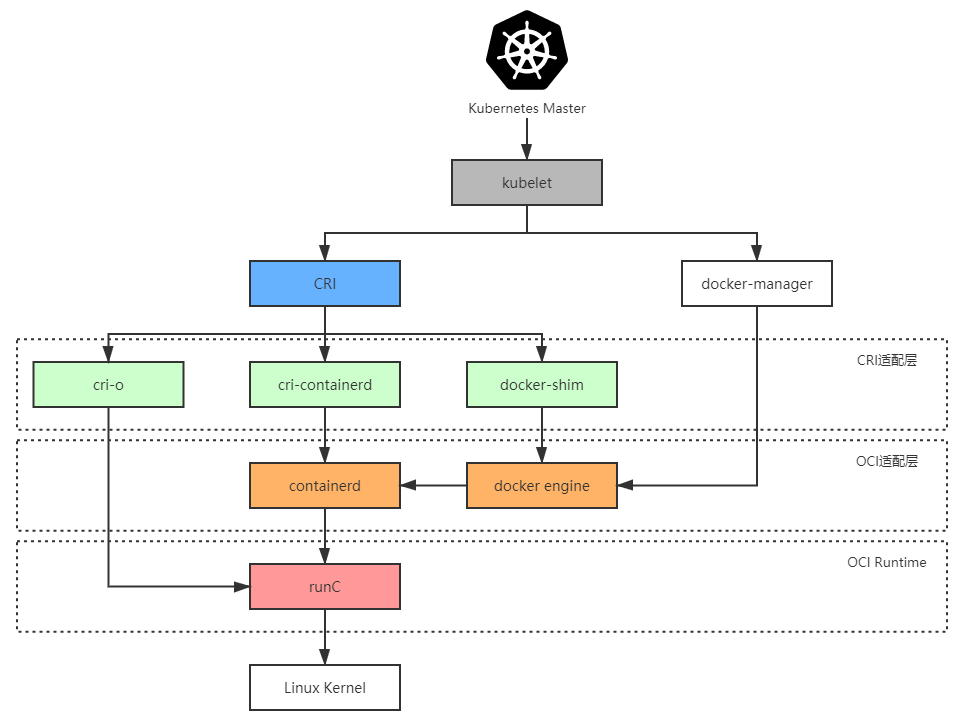

# 容器的崛起

容器的最初的目的不是为了部署软件，而是为了隔离计算机中的各类资源，以便降低软件开发、测试阶段可能产生的误操作风险，或者专门充当[蜜罐](<https://en.wikipedia.org/wiki/Honeypot_(computing)>)，吸引黑客的攻击，以便监视黑客的行为。下面，笔者将以容器发展历史为线索，介绍容器技术在不同历史阶段中的主要关注点。

## 隔离文件：chroot

容器的起点可以追溯到 1979 年[Version 7 UNIX](https://en.wikipedia.org/wiki/Version_7_Unix)系统中提供的`chroot`命令，这个命令是英文单词“Change Root”的缩写，功能是当某个进程经过`chroot`操作之后，它的根目录就会被锁定在命令参数所指定的位置，以后它或者它的子进程将不能再访问和操作该目录之外的其他文件。

1991 年，世界上第一个监控黑客行动的蜜罐程序就是使用`chroot`来实现的，那个参数指定的根目录当时被作者戏称为“Chroot 监狱”（Chroot Jail），黑客突破`chroot`限制的方法就称为 Jailbreak。后来，FreeBSD 4.0 系统重新实现了`chroot`命令，用它作为系统中进程沙箱隔离的基础，并将其命名为[FreeBSD jail](https://en.wikipedia.org/wiki/FreeBSD_jail)，再后来，苹果公司又以 FreeBSD 为基础研发出了举世闻名的 iOS 操作系统，此时，黑客们就将绕过 iOS 沙箱机制以 root 权限任意安装程序的方法称为“[越狱](https://en.wikipedia.org/wiki/IOS_jailbreaking)”（Jailbreak），这些故事都是题外话了。

2000 年，Linux Kernel 2.3.41 版内核引入了`pivot_root`技术来实现文件隔离，`pivot_root`直接切换了[根文件系统](https://en.wikipedia.org/wiki/Filesystem_Hierarchy_Standard)（rootfs），有效地避免了`chroot`命令可能出现的安全性漏洞。本文后续提到的容器技术，如 LXC、Docker 等也都是优先使用`pivot_root`来实现根文件系统切换的。

时至今日，`chroot`命令依然活跃在 UNIX 系统与几乎所有主流的 Linux 发行版中，同时以命令行工具（[chroot(8)](https://linux.die.net/man/8/linux-user-chroot)）或者系统调用（[chroot(2)](https://linux.die.net/man/2/chroot)）的形式存在，但无论是`chroot`命令抑或是`pivot_root`，都并不能提供完美的隔离性。原本按照 UNIX 的设计哲学，[一切资源都可以视为文件](https://en.wikipedia.org/wiki/Everything_is_a_file)（In UNIX，Everything is a File），一切处理都可以视为对文件的操作，理论上，只要隔离了文件系统，一切资源都应该被自动隔离才对。可是哲学归哲学，现实归现实，从硬件层面暴露的低层次资源，如磁盘、网络、内存、处理器，到经操作系统层面封装的高层次资源，如 UNIX 分时（UNIX Time-Sharing，UTS）、进程 ID（Process ID，PID）、用户 ID（User ID，UID）、进程间通信（Inter-Process Communication，IPC）都存在大量以非文件形式暴露的操作入口，因此，以`chroot`为代表的文件隔离，仅仅是容器崛起之路的起点而已。

## 隔离访问：namespaces

2002 年，Linux Kernel 2.4.19 版内核引入了一种全新的隔离机制：[Linux 名称空间](https://en.wikipedia.org/wiki/Linux_namespaces)（Linux Namespaces）。名称空间的概念在很多现代的高级程序语言中都存在，用于避免不同开发者提供的 API 相互冲突，相信作为一名开发人员的你肯定不陌生。

Linux 的名称空间是一种由内核直接提供的全局资源封装，是内核针对进程设计的访问隔离机制。进程在一个独立的 Linux 名称空间中朝系统看去，会觉得自己仿佛就是这方天地的主人，拥有这台 Linux 主机上的一切资源，不仅文件系统是独立的，还有着独立的 PID 编号（譬如拥有自己的 0 号进程，即系统初始化的进程）、UID/GID 编号（譬如拥有自己独立的 root 用户）、网络（譬如完全独立的 IP 地址、网络栈、防火墙等设置），等等，此时进程的心情简直不能再好了。

Linux 的名称空间是受“[贝尔实验室九号项目](https://en.wikipedia.org/wiki/Plan_9_from_Bell_Labs)”（一个分布式操作系统，“九号”项目并非代号，操作系统的名字就叫“Plan 9 from Bell Labs”，充满了赛博朋克风格）的启发而设计的，最初的目的依然只是为了隔离文件系统，而非为了什么容器化的实现。这点从 2002 年发布时只提供了 Mount 名称空间，并且其构造参数为“CLONE_NEWNS”（即 Clone New Namespace 的缩写）而非“CLONE_NEWMOUNT”便能看出一些端倪。后来，要求系统隔离其他访问操作的呼声愈发强烈，从 2006 年起，内核陆续添加了 UTS、IPC 等名称空间隔离，直到目前最新的 Linux Kernel 5.6 版内核为止，Linux 名称空间支持以下八种资源的隔离（内核的官网[Kernel.org](https://www.kernel.org/)上仍然只列出了[前六种](https://www.kernel.org/doc/html/latest/admin-guide/namespaces/compatibility-list.html)，从 Linux 的 Man 命令能查到[全部八种](https://man7.org/linux/man-pages/man7/namespaces.7.html)）。

:::center

表 11-1 Linux 名称空间支持以下八种资源的隔离

:::

| 
名称空间
 | 隔离内容                                                                                                                                              | 
内核版本
 |
| :------------------------------------- | ----------------------------------------------------------------------------------------------------------------------------------------------------- | -------------------------------------- |
| Mount                                  | 隔离文件系统，功能上大致可以类比`chroot`                                                                                                              | 2.4.19                                 |
| UTS                                    | 隔离主机的[Hostname](https://en.wikipedia.org/wiki/Hostname)、[Domain names](https://en.wikipedia.org/wiki/Domain_name)                               | 2.6.19                                 |
| IPC                                    | 隔离进程间通信的渠道（详见“[远程服务调用](/architect-perspective/general-architecture/api-style/rpc.html)”中对 IPC 的介绍）                           | 2.6.19                                 |
| PID                                    | 隔离进程编号，无法看到其他名称空间中的 PID，意味着无法对其他进程产生影响                                                                              | 2.6.24                                 |
| Network                                | 隔离网络资源，如网卡、网络栈、IP 地址、端口，等等                                                                                                     | 2.6.29                                 |
| User                                   | 隔离用户和用户组                                                                                                                                      | 3.8                                    |
| Cgroup                                 | 隔离`cgroups`信息，进程有自己的`cgroups`的根目录视图（在/proc/self/cgroup 不会看到整个系统的信息）。`cgroups`的话题很重要，稍后笔者会安排一整节来介绍 | 4.6                                    |
| Time                                   | 隔离系统时间，2020 年 3 月最新的 5.6 内核开始支持进程独立设置系统时间                                                                                 | 5.6                                    |

如今，对文件、进程、用户、网络等各类信息的访问，都被囊括在 Linux 的名称空间中，即使今天仍有一些没被隔离的访问（譬如[syslog](https://en.wikipedia.org/wiki/Syslog)就还没被隔离，容器内可以看到容器外其他进程产生的内核 syslog），日后也可以随内核版本的更新纳入到这套框架之内，现在距离完美的隔离性就只差最后一步了：资源的隔离。

## 隔离资源：cgroups

如果要让一台物理计算机中的各个进程看起来像独享整台虚拟计算机的话，不仅要隔离各自进程的访问操作，还必须能独立控制分配给各个进程的资源使用配额，不然的话，一个进程发生了内存溢出或者占满了处理器，其他进程就莫名其妙地被牵连挂起，这样肯定算不上是完美的隔离。

Linux 系统解决以上问题的方案是[控制群组](https://en.wikipedia.org/wiki/Cgroups)（Control Groups，目前常用的简写为`cgroups`），它与名称空间一样都是直接由内核提供的功能，用于隔离或者说分配并限制某个进程组能够使用的资源配额，资源配额包括处理器时间、内存大小、磁盘 I/O 速度，等等，具体可以参见表 11-2 所示。

:::center

表 11-2 Linux 控制群组子系统

:::

| 控制组子系统 | 功能                                                                                        |
| ------------ | ------------------------------------------------------------------------------------------- |
| blkio        | 为块设备（如磁盘，固态硬盘，USB 等等）设定 I/O 限额。                                       |
| cpu          | 控制`cgroups`中进程的处理器占用比率。                                                       |
| cpuacct      | 自动生成`cgroups`中进程所使用的处理器时间的报告。                                           |
| cpuset       | 为`cgroups`中的进程分配独立的处理器（包括多路系统的处理器，多核系统的处理器核心）。         |
| devices      | 设置`cgroups`中的进程访问某个设备的权限（读、写、创建三种权限）。                           |
| freezer      | 挂起或者恢复`cgroups`中的进程。                                                             |
| memory       | 设定`cgroups`中进程使用内存的限制，并自动生成内存资源使用报告。                             |
| net_cls      | 使用等级识别符标记网络数据包，可允许 Linux 流量控制程序识别从具体 `cgroups`中生成的数据包。 |
| net_prio     | 用来设置网络流量的优先级。                                                                  |
| hugetlb      | 主要针对于 HugeTLB 系统进行限制。                                                           |
| perf_event   | 允许 Perf 工具基于`cgroups`分组做性能监测。                                                 |

`cgroups`项目最早是由 Google 的工程师（主要是 Paul Menage 和 Rohit Seth）在 2006 年发起的，当时取的名字就叫作“进程容器”（Process Containers），不过“容器”（Container）这个名词的定义在那时候尚不如今天清晰，不同场景中常有不同所指，为避免混乱，2007 年这个项目才被重命名为`cgroups`，在 2008 年合并到 2.6.24 版的内核后正式对外发布，这一阶段的`cgroups`被称为“第一代`cgroups`”。2016 年 3 月发布的 Linux Kernel 4.5 中，搭载了由 Facebook 工程师（主要是 Tejun Heo）重新编写的“第二代`cgroups`”，其关键改进是支持统一层级管理（[Unified Hierarchy](https://www.kernel.org/doc/Documentation/cgroup-v2.txt)），使得管理员能更加清晰精确地控制资源的层级关系。目前这两个版本的`cgroups`在 Linux 内核代码中是并存的，稍后介绍的 Docker 暂时仅支持第一代的`cgroups`。

## 封装系统：LXC

当文件系统、访问、资源都可以被隔离后，容器已经有它降生所需的全部前置支撑条件，并且 Linux 的开发者们也已经明确地看到了这一点。为降低普通用户综合使用`namespaces`、`cgroups`这些低级特性的门槛，2008 年 Linux Kernel 2.6.24 内核刚刚开始提供`cgroups`的同一时间，就马上发布了名为[Linux 容器](https://en.wikipedia.org/wiki/LXC)（LinuX Containers，LXC）的系统级虚拟化功能。

此前，在 Linux 上并不是没有系统级虚拟化的解决方案，譬如传统的[OpenVZ](https://zh.wikipedia.org/wiki/OpenVZ)和[Linux-VServer](https://en.wikipedia.org/wiki/Linux-VServer)都能够实现容器隔离，并且只会有很低的性能损失（按 OpenVZ 提供的数据，只会有 1-3%的损失），但它们都是非官方的技术，使用它们最大的阻碍是系统级虚拟化必须要有内核的支持，为此它们就只能通过非官方内核补丁的方式修改标准内核，才能获得那些原本在内核中不存在的能力。

LXC 带着令人瞩目的光环登场，它的出现促使“容器”从一个阳春白雪的只流传于开发人员口中的技术词汇，逐渐向整个软件业的公共概念、共同语言发展，就如同今天的“服务器”、“客户端”和“互联网”一样。相信你现在肯定会好奇为什么现在一提到容器，大家首先联想到的是 Docker 而不是 LXC？为什么去问 10 个开发人员，至少有 9 个听过 Docker，但如果问 LXC，可能只有 1 个人会听说过？

LXC 的出现肯定受到了 OpenVZ 和 Linux-VServer 的启发，摸着巨人的肩膀过河这并没有什么不对。可惜的是，LXC 在设定自己的发展目标时，也被前辈们的影响所局限住。LXC 眼中的容器的定义与 OpenVZ 和 Linux-VServer 并无差别，是一种封装系统的轻量级虚拟机，而 Docker 眼中的容器的定义则是一种封装应用的技术手段。这两种封装理念在技术层面并没有什么本质区别，但应用效果就差异巨大。举个具体例子，如果你要建设一个[LAMP](<https://en.wikipedia.org/wiki/LAMP_(software_bundle)>)（Linux、Apache、MySQL、PHP）应用，按照 LXC 的思路，你应该先编写或者寻找到[LAMP 的 template](https://gist.github.com/ralt/492a09d9f9fea64fb28b)（可以暂且不准确地类比为 LXC 版本的 Dockerfile 吧），以此构造出一个安装了 LAMP 的虚拟系统。如果按部署虚拟机的角度来看，这还算挺方便的，作为那个时代（距今也就十年）的系统管理员，所有软件、补丁、配置都是自己搞定的，部署一台新虚拟机要花费一两天时间都很正常，有 LXC 的 template，一下子帮你把 LAMP 都安装好了，还想要啥自行车？但是，作为一名现代的系统管理员，这里问题就相当大，如果我想把 LAMP 改为 LNMP（Linux、Nginx、MySQL、PHP）该怎么办？如果我想把 LAMP 里的 MySQL 5 调整为 MySQL 8 该怎么办？都得找到或者自己编写新的 template 来解决。好吧，那这台机的软件、版本都配置对了，下一台机我要构建[LYME](<https://en.wikipedia.org/wiki/LYME_(software_bundle)>)或者[MEAN](<https://en.wikipedia.org/wiki/MEAN_(solution_stack)>)，又该怎么办？以封装系统为出发点，仍是按照先装系统然再装软件的思路，就永远无法做到一两分钟甚至十几秒钟就构造出一个合乎要求的软件运行环境，也决定了 LXC 不可能形成今天的容器生态的，所以，接下来舞台的聚光灯终于落到了 Docker 身上。

## 封装应用：Docker

2013 年宣布开源的 Docker 毫无疑问是容器发展历史上里程碑式的发明，然而 Docker 的成功似乎没有太多技术驱动的成分。至少对开源早期的 Docker 而言，确实没有什么能构成壁垒的技术。它的容器化能力直接来源于 LXC，它镜像分层组合的文件系统直接来源于[AUFS](https://en.wikipedia.org/wiki/Aufs)，Docker 开源后不久，就有人仅用了一百多行 Shell 脚本便实现了 Docker 的核心功能（名为[Bocker](https://github.com/p8952/bocker)，提供了`docker build/pull/images/ps/run/exec/logs/commit/rm/rmi`等功能）。

那为何历史选择了 Docker，而不是 LXC 或者其他容器技术呢？对于这个问题，笔者引用（转述非直译，有所精简）DotCloud 公司（当年创造 Docker 的公司，已于 2016 年倒闭）创始人 Solomon Hykes 在[Stackoverflow 上的一段问答](https://stackoverflow.com/questions/17989306/what-does-docker-add-to-lxc-tools-the-userspace-lxc-tools/)：

:::quote 为什么要用 Docker 而不是 LXC？（Why would I use Docker over plain LXC？）

Docker 除了包装来自 Linux 内核的特性之外，它的价值还在于：

- **跨机器的绿色部署**：Docker 定义了一种将应用及其所有的环境依赖都打包到一起的格式，仿佛它原本就是[绿色软件](https://en.wikipedia.org/wiki/Portable_application)一样。LXC 并没有提供这样的能力，使用 LXC 部署的新机器很多细节都依赖人的介入，虚拟机的环境几乎肯定会跟你原本部署程序的机器有所差别。
- **以应用为中心的封装**：Docker 封装应用而非封装机器的理念贯穿了它的设计、API、界面、文档等多个方面。相比之下，LXC 将容器视为对系统的封装，这局限了容器的发展。
- **自动构建**：Docker 提供了开发人员从在容器中构建产品的全部支持，开发人员无需关注目标机器的具体配置，即可使用任意的构建工具链，在容器中自动构建出最终产品。
- **多版本支持**：Docker 支持像 Git 一样管理容器的连续版本，进行检查版本间差异、提交或者回滚等操作。从历史记录中你可以查看到该容器是如何一步一步构建成的，并且只增量上传或下载新版本中变更的部分。
- **组件重用**：Docker 允许将任何现有容器作为基础镜像来使用，以此构建出更加专业的镜像。
- **共享**：Docker 拥有公共的镜像仓库，成千上万的 Docker 用户在上面上传了自己的镜像，同时也使用他人上传的镜像。
- **工具生态**：Docker 开放了一套可自动化和自行扩展的接口，在此之上，还有很多工具来扩展其功能，譬如容器编排、管理界面、持续集成等等。

:::right

—— Solomon Hykes，[Stackoverflow](https://stackoverflow.com/questions/17989306/what-does-docker-add-to-lxc-tools-the-userspace-lxc-tools/)，2013

:::

以上这段回答也同时被收录到了[Docker 官网的 FAQ](https://docs.docker.com/engine/faq/)上，从 Docker 开源至今从未改变。促使 Docker 的一问世就惊艳世间的，不是什么黑科技式的秘密武器，而是其符合历史潮流的创意与设计理念，还有充分开放的生态运营。可见，在正确的时候，正确的人手上有一个优秀的点子，确实有机会引爆一个时代。

:::center

图 11-1 受到广泛认可的 Docker 以上是 Docker 开源一年后（截至 2014 年 12 月）获得的成绩，图片来自[Docker 官网](https://www.docker.com/company/aboutus/)
:::

从开源到现在也只过了短短数年时间，Docker 已成为软件开发、测试、分发、部署等各个环节都难以或缺的基础支撑，自身的架构也发生了相当大的改变，Docker 被分解为由 Docker Client、Docker Daemon、Docker Registry、Docker Container 等子系统，以及 Graph、Driver、libcontainer 等各司其职的模块组成，此时再说一百多行脚本能实现 Docker 核心功能，再说 Docker 没有太高的技术含量，就已经不再合适了。

2014 年，Docker 开源了自己用 Golang 开发的[libcontainer](https://github.com/opencontainers/runc/tree/master/libcontainer)，这是一个越过 LXC 直接操作`namespaces`和`cgroups`的核心模块，有了 libcontainer 以后，Docker 就能直接与系统内核打交道，不必依赖 LXC 来提供容器化隔离能力了。

2015 年，在 Docker 的主导和倡议下，多家公司联合制定了“[开放容器交互标准](https://en.wikipedia.org/wiki/Open_Container_Initiative)”（Open Container Initiative，OCI），这是一个关于容器格式和运行时的规范文件，其中包含运行时标准（[runtime-spec](https://github.com/opencontainers/runtime-spec/blob/master/spec.md) ）、容器镜像标准（[image-spec](https://github.com/opencontainers/image-spec/blob/master/spec.md)）和镜像分发标准（[distribution-spec](https://github.com/opencontainers/distribution-spec/blob/master/spec.md)，分发标准还未正式发布）。运行时标准定义了应该如何运行一个容器、如何管理容器的状态和生命周期、如何使用操作系统的底层特性（`namespaces`、`cgroup`、`pivot_root`等）；容器镜像标准规定了容器镜像的格式、配置、元数据的格式，可以理解为对镜像的静态描述；镜像分发标准则规定了镜像推送和拉取的网络交互过程。

为了符合 OCI 标准，Docker 推动自身的架构继续向前演进，首先将 libcontainer 独立出来，封装重构成[runC 项目](https://github.com/opencontainers/runc)，并捐献给了 Linux 基金会管理。runC 是 OCI Runtime 的首个参考实现，提出了“让标准容器无所不在”（Make Standard Containers Available Everywhere）的口号。为了能够兼容所有符合标准的 OCI Runtime 实现，Docker 进一步重构了 Docker Daemon 子系统，将其中与运行时交互的部分抽象为[containerd 项目](https://containerd.io/)，这是一个负责管理容器执行、分发、监控、网络、构建、日志等功能的核心模块，内部会为每个容器运行时创建一个 containerd-shim 适配进程，默认与 runC 搭配工作，但也可以切换到其他 OCI Runtime 实现上（然而实际并没做到，最后 containerd 仍是紧密绑定于 runC）。2016 年，Docker 把 containerd 捐献给了 CNCF 管理，runC 与 containerd 两个项目的捐赠托管，即带有 Docker 对开源信念的追求，也带有 Docker 在众多云计算大厂夹击下自救的无奈，这两个项目将成为未来 Docker 消亡和存续的伏笔（看到本节末尾你就能理解这句矛盾的话了）。

:::center

图 11-2 Docker、containerd 和 runC 的交互关系
:::

以上笔者列举的这些 Docker 推动的开源与标准化工作，既是对 Docker 为开源乃至整个软件业做出贡献的赞赏，也是为后面介绍容器编排时，讲述当前容器引擎的混乱关系做的前置铺垫。Docker 目前无疑在容器领域具有统治地位，但统治的稳固程度不仅没到高枕无忧，说是危机四伏都不为过。目前已经有了可见的、足以威胁动摇 Docker 地位的潜在可能性正在酝酿，风险源于虽然 Docker 赢得了容器战争，但 Docker Swarm 却输掉了容器编排战争。从结果回望当初，Docker 赢得容器战争有一些偶然，Docker Swarm 输掉的编排战争却是必然的。

## 封装集群：Kubernetes

如果说以 Docker 为代表的容器引擎将软件的发布流程从分发二进制安装包转变为直接分发虚拟化后的整个运行环境，令应用得以实现跨机器的绿色部署；那以 Kubernetes 为代表的容器编排框架，就是把大型软件系统运行所依赖的集群环境也进行了虚拟化，令集群得以实现跨数据中心的绿色部署，并能够根据实际情况自动扩缩。

容器的崛起之路讲到 Docker 和 Kubernetes 这阶段，已经不再是介绍历史了，从这里开始发生的变化，都是近几年软件业界中的热点事件，也是这章要讨论的主要话题。现在笔者暂时不打算介绍 Kubernetes 的技术细节，它们将会被留到后面的文章中更详细的解析。这节里，我们首先从宏观层面去理解 Kubernetes 的诞生与演变的驱动力，这对正确理解未来云原生的发展方向至关重要。

Kubernetes 可谓出身名门，前身是 Google 内部已运行多年的集群管理系统 Borg，2014 年 6 月使用 Golang 完全重写后开源。自诞生之日起，只要与云计算能稍微扯上关系的业界巨头都对 Kubernetes 争相追捧，IBM、RedHat、Microsoft、VMware 和华为都是它最早期的代码贡献者。此时，云计算从实验室到工业化应用已经有十个年头，然而大量应用使用云计算的方式仍停滞在传统 IDC（Internet Data Center）时代，仅仅是用云端的虚拟机代替了传统的物理机。尽管早在 2013 年，Pivotal（持有着 Spring Framework 和 Cloud Foundry 的公司）就提出了“云原生”的概念，但是要实现服务化、具备韧性（Resilience）、弹性（Elasticity）、可观测性（Observability）的软件系统十分困难，在当时基本只能依靠架构师和程序员高超的个人能力，云计算本身帮不上什么忙。在云的时代不能充分利用云的强大能力，这让云计算厂商无比遗憾，也无比焦虑。直到 Kubernetes 横空出世，大家终于等到了破局的希望，认准了这就是云原生时代的操作系统，是让复杂软件在云计算下获得韧性、弹性、可观测性的最佳路径，也是为厂商们推动云计算时代加速到来的关键引擎之一。

2015 年 7 月，Kubernetes 发布了第一个正式版本 1.0 版，更重要的事件是 Google 宣布与 Linux 基金会共同筹建[云原生基金会](https://www.cncf.io/)（Cloud Native Computing Foundation，CNCF），并且将 Kubernetes 托管到 CNCF，成为其第一个项目。随后，Kubernetes 以摧枯拉朽之势覆灭了容器编排领域的其他竞争对手，哪怕 Docker Swarm 有着 Docker 在容器引擎方面的先天优势，DotCloud 后来甚至将 Swarm 直接内置入 Docker 之中都未能稍稍阻挡 Kubernetes 的前进的步伐。

Kubernetes 的成功与 Docker 的成功并不相同，Docker 靠的是优秀的理念，以一个“好点子”引爆了一个时代。笔者相信就算没有 Docker 也会有 Cocker 或者 Eocker 的出现，但由成立仅三年的 DotCloud 公司（三年后又倒闭）做成了这样的产品确实有一定的偶然性。而 Kubernetes 的成功不仅有 Google 深厚的技术功底作支撑，有领先时代的设计理念，更加关键的是 Kubernetes 的出现符合所有云计算大厂的切身利益，有着业界巨头不遗余力的广泛支持，它的成功便是一种必然。

:::center

图 11-3 Kubernetes 与容器引擎的调用关系
:::

Kubernetes 与 Docker 两者的关系十分微妙，把握住两者关系的变化过程，是理解 Kubernetes 架构演变与 CRI、OCI 规范的良好线索。在 Kubernetes 开源的早期，它是完全依赖且绑定 Docker 的，并没有过多考虑够日后有使用其他容器引擎的可能性。直至 Kubernetes 1.5 之前，Kubernetes 管理容器的方式都是通过内部的 DockerManager 向 Docker Engine 以 HTTP 方式发送指令，通过 Docker 来操作镜像的增删改查的，如上图最右边线路的箭头所示（图中的 kubelet 是集群节点中的代理程序，负责与管理集群的 Master 通信，其他节点的含义在后文介绍到时都会有解释）。将这个阶段 Kubernetes 与容器引擎的调用关系捋直，并结合上一节提到的 Docker 捐献 containerd 与 runC 后重构的调用，完整的调用链条如下所示：

:::center

> Kubernetes Master --> kubelet --> DockerManager --> Docker Engine --> containerd --> runC
:::

2016 年，Kubernetes 1.5 版本开始引入“[容器运行时接口](https://kubernetes.io/blog/2016/12/container-runtime-interface-cri-in-kubernetes/)”（Container Runtime Interface，CRI），这是一个定义容器运行时应该如何接入到 kubelet 的规范标准，从此 Kubernetes 内部的 DockerManager 就被更为通用的 KubeGenericRuntimeManager 所替代（实际上在 1.6.6 之前都仍然可以看到 DockerManager），kubelet 与 KubeGenericRuntimeManager 之间通过 gRPC 协议通信。由于 CRI 是在 Docker 之后才发布的规范，Docker 是肯定不支持 CRI 的，所以 Kubernetes 又提供了 DockerShim 服务作为 Docker 与 CRI 的适配层，由它与 Docker Engine 以 HTTP 形式通信，实现了原来 DockerManager 的全部功能。此时，Docker 对 Kubernetes 来说只是一项默认依赖，而非之前的无可或缺了，它们的调用链为：

:::center

> Kubernetes Master --> kubelet --> KubeGenericRuntimeManager --> DockerShim --> Docker Engine --> containerd --> runC
:::

2017 年，由 Google、RedHat、Intel、SUSE、IBM 联合发起的[CRI-O](https://github.com/cri-o/cri-o)（Container Runtime Interface Orchestrator）项目发布了首个正式版本。从名字就可以看出，它肯定是完全遵循 CRI 规范进行实现的，另一方面，它可以支持所有符合 OCI 运行时标准的容器引擎，默认仍然是与 runC 搭配工作的，若要换成[Clear Containers](https://github.com/clearcontainers)、[Kata Containers](https://katacontainers.io/)等其他 OCI 运行时也完全没有问题。虽然开源版 Kubernetes 是使用 CRI-O、cri-containerd 抑或是 DockerShim 作为 CRI 实现，完全可以由用户自由选择（根据用户宿主机的环境选择），但在 RedHat 自己扩展定制的 Kubernetes 企业版，即[OpenShift 4](https://en.wikipedia.org/wiki/OpenShift)中，调用链已经没有了 Docker Engine 的身影：

:::center

> Kubernetes Master --> kubelet --> KubeGenericRuntimeManager --> CRI-O--> runC
:::

由于此时 Docker 在容器引擎中的市场份额仍然占有绝对优势，对于普通用户来说，如果没有明确的收益，并没有什么动力要把 Docker 换成别的引擎，所以 CRI-O 即使摆出了直接挖掉 Docker 根基的凶悍姿势，其实也并没有给 Docker 带来太多即时可见的影响，不过能够想像此时 Docker 心中肯定充斥了难以言喻的危机感。

2018 年，由 Docker 捐献给 CNCF 的 containerd，在 CNCF 的精心孵化下发布了 1.1 版，1.1 版与 1.0 版的最大区别是此时它已完美地支持了 CRI 标准，这意味着原本用作 CRI 适配器的 cri-containerd 从此不再需要。此时，再观察 Kubernetes 到容器运行时的调用链，你会发现调用步骤会比通过 DockerShim、Docker Engine 与 containerd 交互的步骤要减少两步，这又意味着用户只要愿意抛弃掉 Docker 情怀的话，在容器编排上便可至少省略一次 HTTP 调用，获得性能上的收益，且根据 Kubernetes 官方给出的[测试数据](https://kubernetes.io/blog/2018/05/24/kubernetes-containerd-integration-goes-ga/)，这些免费的收益还相当地可观。Kubernetes 从 1.10 版本宣布开始支持 containerd 1.1，在调用链中已经能够完全抹去 Docker Engine 的存在：

:::center

> Kubernetes Master --> kubelet --> KubeGenericRuntimeManager --> containerd --> runC
:::

今天，要使用哪一种容器运行时取决于你安装 Kubernetes 时宿主机上的容器运行时环境，但对于云计算厂商来说，譬如国内的[阿里云 ACK](https://cn.aliyun.com/product/kubernetes)、[腾讯云 TKE](https://cloud.tencent.com/product/tke)等直接提供的 Kubernetes 容器环境，采用的容器运行时普遍都已是 containerd，毕竟运行性能对它们来说就是核心生产力和竞争力。

未来，随着 Kubernetes 的持续发展壮大，Docker Engine 经历从不可或缺、默认依赖、可选择、直到淘汰是大概率事件，这件事情表面上是 Google、RedHat 等云计算大厂联手所为，实际淘汰它的还是技术发展的潮流趋势，就如同 Docker 诞生时依赖 LXC，到最后用 libcontainer 取代掉 LXC 一般。同时，我们也该看到事情的另一面，现在连 LXC 都还没有挂掉，反倒还发展出了更加专注于与 OpenVZ 等系统级虚拟化竞争的[LXD](https://linuxcontainers.org/lxd/introduction/)，相信 Docker 本身也很难彻底消亡的，已经养成习惯的 CLI 界面，已经形成成熟生态的镜像仓库等都应该会长期存在，只是在容器编排领域，未来的 Docker 很可能只会以 runC 和 containerd 的形式存续下去，毕竟它们最初都源于 Docker 的血脉。
