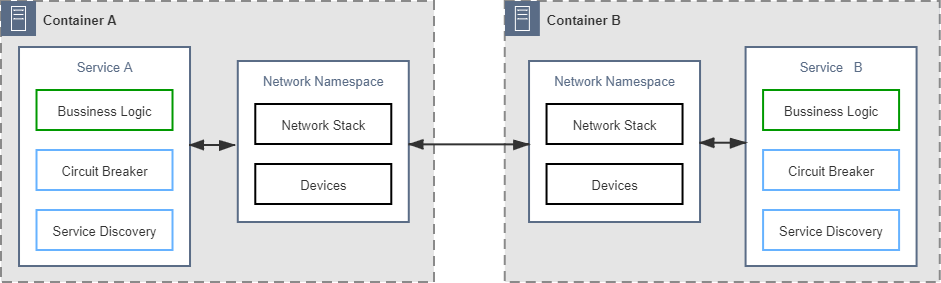
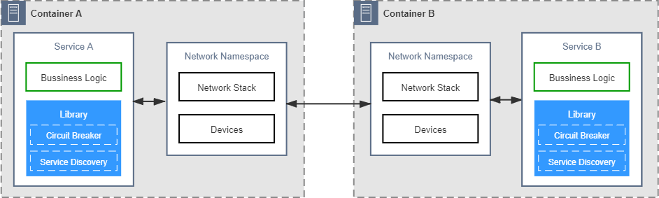
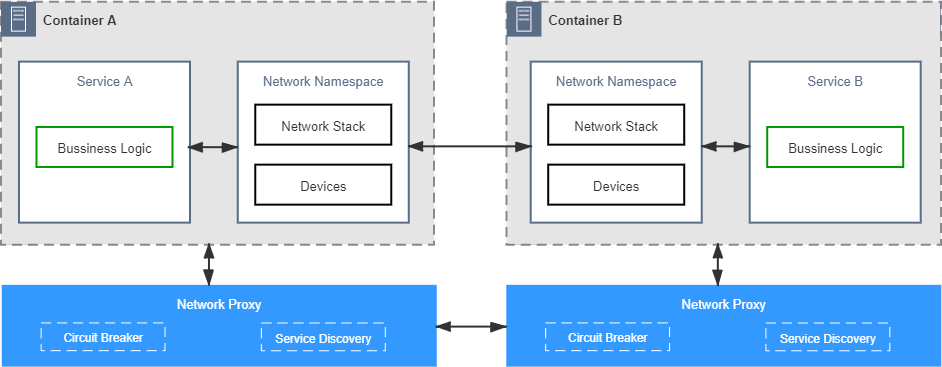
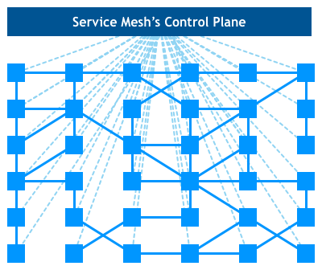
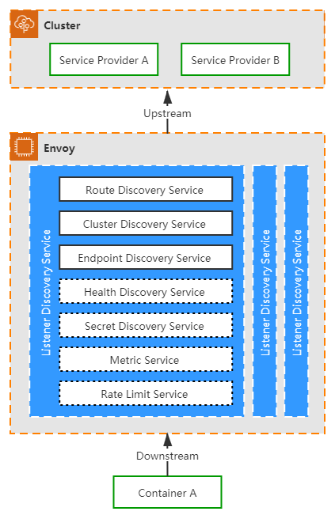

# 透明通信的涅槃

:::tip 被分布式舍弃的 Unix 的设计哲学

原始分布式时代提出的构建“符合 Unix 的设计哲学的”、“如同本地调用一般简单透明的”分布式系统这个目标，是软件开发者对分布式系统最初的美好愿景，迫于现实，它会在一定时期内被妥协、被舍弃，分布式将会经过一段越来越复杂的发展进程。但是，到了三十多年以后的将来，随着分布式架构的逐渐成熟完善，取代单体成为大型软件的主流架构风格以后，这个美好的愿景终将还是会重新被开发者拾起。

:::right

—— [服务架构演进史](/architecture/architect-history/) · [原始分布式时代](/architecture/architect-history/primitive-distribution.html)

:::

Kubernetes 为它管理的工作负载提供了工业级的韧性与弹性，也为每个处于运行状态的 Pod 维护了相互连通的虚拟化网络。不过，程序之间的通信不同于简单地在网络上拷贝数据，具备可连通的网络环境仅仅是程序间能够可靠通信的必要但非充分的条件，作为一名经历过 SOA、微服务、云原生洗礼的分布式程序员，你必定已深谙路由、容错、限流、加密、认证、授权、跟踪、度量等问题在分布式系统中都是无可回避的。

在本书开篇的“[远程服务调用](/architect-perspective/general-architecture/api-style/rpc.html#通信的成本)”一节里，笔者曾以“通信的成本”为题，讲述了三十多年计算机科学家们对“远程服务调用是否可能实现为透明通信”的一场声势浩大的争论。今天，服务网格的诞生在某种意义上可以说便是当年透明通信的重生，服务网格试图以容器、虚拟化网络、边车代理等技术所构筑的新一代通信基础设施为武器，重新对已盖棺定论三十多年的程序间远程通信不是透明的原则发起冲击。今天，这场关于通信的变革仍然在酝酿发展当中，最后到底会是成功的逆袭，抑或是另一场失败，笔者不敢妄言定论，但是作为程序通信发展历史的一名见证者，笔者丝毫不吝对服务网格投去最高的期许与最深的祝愿。

## 通信的成本

程序间通信作为分布式架构的核心内容，第一章“[服务架构演进史](/architecture/architect-history/)”中笔者就已从宏观角度讲述过它的演进过程。这节里，我们会从更微观更聚焦的角度，分析不同时期应用程序如何看待与实现通信方面的非功能性需求，如何做到可靠的通信的，通过以下五个阶段的变化，理解分布式服务的通信是如何逐步演化成本章主角服务网格。

- **第一阶段：将通信的非功能性需求视作业务需求的一部分，通信的可靠性由程序员来保障**。<br/>本阶段是软件企业刚刚开始尝试分布式时选择的早期技术策略。这类系统原本所具有的通信能力一般并不是作为系统功能的一部分被设计出来的，而是遇到问题后修补累积所形成的。开始时，系统往往只具最基本的网络 API，譬如集成了 OKHTTP、gRPC 这样库来访问远程服务，如果远程访问接收到异常，就编写对应的重试或降级逻辑去应对处理。在系统进入生产环境以后，遇到并解决的一个个通信问题，逐渐在业务系统中留下了越来越多关于通信的代码逻辑。这些通信的逻辑由业务系统的开发人员直接编写，与业务逻辑直接共处在一个进程空间之中，如图 15-1 所示（注：本图与后面一系列图片中，笔者均以“断路器”和“服务发现”这两个常见的功能来泛指所有的分布式通信所需的能力，实际上并不局限于这两个功能）。

  :::center
  
  图 15-1 控制逻辑和业务逻辑耦合
  :::

  这一阶段的主要矛盾是绝大多数擅长业务逻辑的开发人员都并不擅长处理通信方面的问题，要写出正确、高效、健壮的分布式通信代码，是一项专业性极强的工作。由此决定了大多数的普通软件企业都很难在这个阶段支撑起一个靠谱的分布式系统来。另一方面，把专业的通信功能强加于普通开发人员，无疑为他们带来了更多工作量，尤其是这些“额外的工作”与原有的业务逻辑耦合在一起，让系统越来越复杂，也越来越容易出错。

- **第二阶段：将代码中的通信功能抽离重构成公共组件库，通信的可靠性由专业的平台程序员来保障**。<br/>
  开发人员解耦依赖的一贯有效办法是抽取分离代码与封装重构组件。微服务的普及离不开一系列封装了分布式通信能力的公共组件库，代表性产品有 Twitter 的 Finagle、Spring Cloud 中的许多组件等。这些公共的通信组件由熟悉分布式的专业开发人员编写和维护，不仅效率更高、质量更好，一般还都提供了经过良好设计的 API 接口，让业务代码既可以使用它们的能力，又无需把处理通信的逻辑散布于业务代码当中。

  :::center
  
  图 15-2 抽取公共的分布式通信组件
  :::

  分布式通信组件让普通程序员开发出靠谱的微服务系统成为可能，这是无可抹杀的成绩，但普通程序员使用它们的成本依然很高，不仅要学习分布式的知识、要学习这些公共组件的功能应该如何使用，最麻烦的是，对于同一种问题往往还需学习多种不同的组件才能解决。这是因为通信组件首先是一段特定编程语言开发出来的程序，是与语言绑定的，一个由 Python 编写的组件再优秀，对 Java 系统来说也没有太多的实用价值。目前，基于公共组件库开发微服务仍然是应用最为广泛的解决方案，但肯定不是一种完美的解决方案，这是微服务基础设施完全成熟之前必然会出现的应用形态，同时也一定是微服务进化过程中必然会被替代的过渡形态。

- **第三阶段：将负责通信的公共组件库分离到进程之外，程序间通过网络代理来交互，通信的可靠性由专门的网络代理提供商来保障**。<br/>为了能够把分布式通信组件与具体的编程语言脱钩，也为了避免程序员还要去专门学习这些组件的编程模型与 API 接口，这一阶段进化出了能专门负责可靠通信的网络代理。这些网络代理不再与业务逻辑部署于同一个进程空间，但仍然与业务系统处于同一个容器或者虚拟机当中，可以通过回环设备甚至是[UDS](https://en.wikipedia.org/wiki/Unix_domain_socket)（Unix Domain Socket）进行交互，具备相当高的网络性能。只要让网络代理接管掉程序七层或四层流量，就能够在代理上完成断路、容错等几乎所有的分布式通信功能，前面提到过的 Netflix Prana 就属于这类产品的典型代表。

  :::center
  
  图 15-3 通过网络代理获得可靠的通信能力
  :::

  通过网络代理来提升通信质量的思路提出以后，它本身使用范围其实并不算特别广泛，但它的方向是正确的。这种思路后来演化出了两种改进形态：一方面，如果将网络代理从进程身边拉远，让它与进程分别处于不同的机器上，这样就可以同时给多个进程提供可靠通信的代理服务，这条路线逐渐形成了今天常见的微服务网关，在网关上同样可以实现流控、容错等功能。另一方面，如果将网络代理往进程方向推近，不仅让它与进程处于一个共享了网络名称空间的容器组之中，还要让它透明并强制地接管通讯，这便形成了下一阶段所说的边车代理。

- **第四阶段：将网络代理以边车的形式注入到应用容器，自动劫持应用的网络流量，通信的可靠性由专门的通信基础设施来保障**。<br/>与前一阶段的独立代理相比，以边车模式运作的网络代理拥有两个无可比拟的优势：第一个优势是它对流量的劫持是强制性的，通常是靠直接写容器的 iptables 转发表来实现。此前，独立的网络代理只有程序首先去访问它，它才能被动地为程序提供可靠通信服务，只要程序依然有选择不访问它的可能性，代理就永远只能充当服务者而不能成为管理者，上阶段的图中保留了两个容器网络设备直接连接的箭头就代表这种可能性，而这一阶段图中，服务与网络名称空间的虚线箭头代表被劫持后应用程序以为存在，但实际并不存在的流量。<br/>另一个优势是边车代理对应用是透明的，无需对已部署的应用程序代码进行任何改动，不需要引入任何的库（这点并不是绝对的，有部分边车代理也会要求有轻量级的 SDK），也不需要程序专门去访问某个特定的网络位置。这意味着它对所有现存程序都具备开箱即用的适应性，无需修改旧程序就能直接享受到边车代理的服务，这样它的适用面就变得十分广泛。目前边车代理的代表性产品有 Linkerd、Envoy、MOSN 等。

  :::center
  
  图 15-4 边车代理模式
  :::

  如果说边车代理还有什么不足之处的话，那大概就是来自于运维人员的不满了。边车代理能够透明且具有强制力地解决可靠通信的问题，但它本身也需要有足够的信息才能完成这项工作，譬如获取可用服务的列表，譬如得到每个服务名称对应的 IP 地址，等等。这些信息不会从天上掉下来自动到边车里去，是需要由管理员主动去告知代理，或者代理主动从约定好的位置获取。可见，管理代理本身也会产生额外的通信需求。如果没有额外的支持，这些管理方面的通信都得由运维人员去埋单，由此而生的不满便可以理解。为了管理与协调边车代理，程序间通信进化到了最后一个阶段：服务网格。

- **第五阶段：将边车代理统一管控起来实现安全、可控、可观测的通信，将数据平面与控制平面分离开来，实现通用、透明的通信，这项工作就由专门的服务网格框架来保障**。<br/>从总体架构看，服务网格包括两大块内容，分别是由一系列与微服务共同部署的边车代理，以及用于控制这些代理的管理器所构成。代理与代理之间需要通信，用以转发程序间通信的数据包；代理与管理器之间也需要通信，用以传递路由管理、服务发现、数据遥测等控制信息。服务网格使用[数据平面](https://en.wikipedia.org/wiki/Forwarding_plane)（Data Plane）通信和[控制平面](https://en.wikipedia.org/wiki/Control_plane)（Control Plane）通信来形容这两类流量，下图中实线就表示数据平面通信，虚线表示控制平面通信。

  :::center
  
  图 15-5 服务网格的控制平面通信与数据平面通信（[图片来源](https://philcalcado.com/2017/08/03/pattern_service_mesh.html)）
  :::

  数据平面与控制平面并不是什么新鲜概念，它最初就是用在计算机网络之中的术语，通常是指网络层次的划分，软件定义网络中将解耦数据平面与控制平面作为其最主要特征之一。服务网格把计算机网络的经典概念引入到程序通信之中，既可以说是对程序通信的一种变革创新，也可以说是对网络通信的一种发展传承。<br/>分离数据平面与控制平面的实质是将“程序”与“网络”进行解耦，将网络可能出现的问题（譬如中断后重试、降级），与可能需要的功能（譬如实现追踪度量）的处理过程从程序中拿出，放到由控制平面指导的数据平面通信中去处理，制造出一种“这些问题在程序间通信中根本不存在”的假象，仿佛网络和远程服务都是完美可靠的。这种完美的假象，让应用之间可以非常简单地交互而不必过多考虑异常情况，也能够在不同的程序框架、不同的云服务提供商环境之间平稳地迁移；同时，还能让管理者能够不依赖程序支持就得到遥测所需的全部信息，能够根据角色、权限进行统一的访问控制，这些都是服务网格的价值所在。

## 数据平面

在“数据平面”和“控制平面”这两节里，笔者会延续服务网格将“程序”与“网络”解耦的思路，介绍几个数据平面通信与控制平面通信中的核心问题是如何解决的。在工业界，数据平面已有 Linkerd、Nginx、Envoy 等产品，控制平面也有 Istio、Open Service Mesh、Consul 等产品，后文中笔者主要是以目前市场占有率最高的 Istio 与 Envoy 为目标进行讲述，但讲述的目的是介绍两种平面通信的技术原理，而不是介绍 Istio 和 Envoy 的功能与用法，这里涉及到的原理在各种服务网格产品中一般都是通用的，并不局限于哪一种具体实现。

数据平面由一系列边车代理所构成，核心职责是转发应用的入站（Inbound）和出站（Outbound）数据包，因此数据平面也有个别名叫[转发平面](https://en.wikipedia.org/wiki/Forwarding_plane)（Forwarding Plane）。同时，为了在不可靠的物理网络中保证程序间通信最大的可靠性，数据平面必须根据控制平面下发策略的指导，在应用无感知的情况下自动完成服务路由、健康检查、负载均衡、认证鉴权、产生监控数据等一系列工作。为了达成上述的工作目标，至少需要妥善解决以下三个关键问题：

- 代理注入：边车代理是如何注入到应用程序中的？
- 流量劫持：边车代理是如何劫持应用程序的通信流量的？
- 可靠通信：边车代理是如何保证应用程序的通信可靠性的？

### 代理注入

从职责上说，注入边车代理是控制平面的工作，但从本章的叙述逻辑上，将其放在数据平面中介绍更合适。把边车代理注入到应用的过程并不一定全都是透明的，现在的服务网格产品存在有以下三种方式将边车代理接入到应用程序中：

- **基座模式**（Chassis）：这种方式接入的边车代理对程序就是不透明的，它至少会包括一个轻量级的 SDK，通信由 SDK 中的接口去处理。基座模式的好处是在程序代码的帮助下，有可能达到更好的性能，功能也相对更容易实现，但坏处是对代码有侵入性，对编程语言有依赖性。这种模式的典型产品是由华为开源后捐献给 Apache 基金会的[ServiceComb Mesher](https://github.com/apache/servicecomb-mesher)。采用基座模式的接入目前并不属于主流方式，笔者也不展开介绍了。
- **注入模式**（Injector）：根据注入方式不同，又可以分为：
  - **手动注入模式**：这种接入方式对使用者来说不透明，但对程序来说是透明的。由于边车代理的定义就是一个与应用共享网络名称空间的辅助容器，这天然就契合了 Pod 的设定，因此在 Kubernetes 中要进行手动注入是十分简单的——就只是为 Pod 增加一个额外容器而已，即使没有工具帮助，自己修改 Pod 的 Manifest 也能轻易办到。如果你以前未曾尝试过，不妨找一个 Pod 的配置文件，用`istioctl kube-inject -f YOUR_POD.YAML`命令来查看一下手动注入会对原有的 Pod 产生什么变化。
  - **自动注入模式**：这种接入方式对使用者和程序都是透明的，也是 Istio 推荐的代理注入方式。在 Kubernetes 中，服务网格一般是依靠“[动态准入控制](https://kubernetes.io/zh/docs/reference/access-authn-authz/extensible-admission-controllers/)”（Dynamic Admission Control）中的[Mutating Webhook](https://kubernetes.io/zh/docs/reference/access-authn-authz/admission-controllers/#mutatingadmissionwebhook)控制器来实现自动注入的。

:::quote 额外知识

[istio-proxy](https://github.com/istio/proxy)是 Istio 对 Envoy 代理的包装容器，其中包含用 Golang 编写的`pilot-agent`和用 C++编写的`envoy`两个进程。[pilot-agent](https://istio.io/v1.6/docs/reference/commands/pilot-agent/)进程负责 Envoy 的生命周期管理，譬如启动、重启、优雅退出等，并维护 Envoy 所需的配置信息，譬如初始化配置，随时根据控制平面的指令热更新 Envoy 的配置等。

:::

笔者以 Istio 自动注入边车代理（istio-proxy 容器）的过程为例，介绍一下自动注入的具体的流程。只要对 Istio 有基本了解的同学都知道，对任何设置了`istio-injection=enabled`标签的名称空间，Istio 都会自动为其中新创建的 Pod 注入一个名为 istio-proxy 的容器。之所以能做到自动这一点，是因为 Istio 预先在 Kubernetes 中注册了一个类型为`MutatingWebhookConfiguration`的资源，它的主要内容如下所示：

```yaml
apiVersion: admissionregistration.k8s.io/v1beta1
kind: MutatingWebhookConfiguration
metadata:
  name: istio-sidecar-injector
  .....
webhooks:
- clientConfig:
    service:
      name: istio-sidecar-injector
      namespace: istio-system
      path: /inject
  name: sidecar-injector.istio.io
  namespaceSelector:
    matchLabels:
      istio-injection: enabled
  rules:
  - apiGroups:
    - ""
    apiVersions:
    - v1
    operations:
    - CREATE
    resources:
    - pods
```

以上配置告诉 Kubernetes，对于符合标签`istio-injection: enabled`的名称空间，在 Pod 资源进行 CREATE 操作时，应该先自动触发一次 Webhook 调用，调用的位置是`istio-system`名称空间中的服务`istio-sidecar-injector`，调用具体的 URL 路径是`/inject`。在这次调用中，Kubernetes 会把拟新建 Pod 的元数据定义作为参数发送给此 HTTP Endpoint，然后从服务返回结果中得到注入了边车代理的新 Pod 定义，以此自动完成注入。

### 流量劫持

边车代理做流量劫持最典型的方式是基于 iptables 进行的数据转发，笔者曾在“[Linux 网络虚拟化](/immutable-infrastructure/network/linux-vnet.html#干预网络通信)”中介绍过 Netfilter 与 iptables 的工作原理。这里仍然以 Istio 为例，它在注入边车代理后，除了生成封装 Envoy 的 istio-proxy 容器外，还会生成一个 initContainer，它的作用就是自动修改容器的 iptables，具体内容如下所示：

```yaml
initContainers:
  image: docker.io/istio/proxyv2:1.5.1
  name: istio-init
- command:
  - istio-iptables -p "15001" -z "15006"-u "1337" -m REDIRECT -i '*' -x "" -b '*' -d 15090,15020
```

以上命令行中的[istio-iptables](https://github.com/istio/cni/blob/master/tools/packaging/common/istio-iptables.sh)是 Istio 提供的用于配置 iptables 的 Shell 脚本，这行命令的意思是让边车代理拦截所有的进出 Pod 的流量，包括的动作为：拦截除 15090、15020 端口（这两个分别是 Mixer 和 Ingress Gateway 的端口，关于 Istio 占用的固定端口可参考[官方文档](https://istio.io/zh/docs/ops/deployment/requirements/)所列）外的所有入站流量，全部转发至 15006 端口（Envoy 入站端口），经 Envoy 处理后，再从 15001 端口（Envoy 出站端口）发送出去。该命令会在 iptables 中的 PREROUTING 和 OUTPUT 链中挂载相应的转发规则，以使用`iptables -t nat -L -v`命令可以查看到如下所示配置信息：

```bash
Chain PREROUTING
 pkts bytes target				prot opt in     out     source               destination
 2701  162K ISTIO_INBOUND		tcp  --  any    any     anywhere             anywhere

Chain OUTPUT
 pkts bytes target				prot opt in     out     source               destination
   15   900 ISTIO_OUTPUT		tcp  --  any    any     anywhere             anywhere

Chain ISTIO_INBOUND (1 references)
 pkts bytes target				prot opt in     out     source               destination
    0     0 RETURN				tcp  --  any    any     anywhere             anywhere             tcp dpt:ssh
    2   120 RETURN				tcp  --  any    any     anywhere             anywhere             tcp dpt:15090
 2699  162K RETURN				tcp  --  any    any     anywhere             anywhere             tcp dpt:15020
    0     0 ISTIO_IN_REDIRECT	tcp  --  any    any     anywhere             anywhere

Chain ISTIO_IN_REDIRECT (3 references)
 pkts bytes target				prot opt in     out     source               destination
    0     0 REDIRECT			tcp  --  any    any     anywhere             anywhere             redir ports 15006

Chain ISTIO_OUTPUT (1 references)
 pkts bytes target				prot opt in     out     source               destination
    0     0 RETURN				all  --  any    lo      127.0.0.6            anywhere
    0     0 ISTIO_IN_REDIRECT	all  --  any    lo      anywhere            !localhost            owner UID match 1337
    0     0 RETURN				all  --  any    lo      anywhere             anywhere             ! owner UID match 1337
   15   900 RETURN				all  --  any    any     anywhere             anywhere             owner UID match 1337
    0     0 ISTIO_IN_REDIRECT	all  --  any    lo      anywhere            !localhost            owner GID match 1337
    0     0 RETURN				all  --  any    lo      anywhere             anywhere             ! owner GID match 1337
    0     0 RETURN				all  --  any    any     anywhere             anywhere             owner GID match 1337
    0     0 RETURN				all  --  any    any     anywhere             localhost
    0     0 ISTIO_REDIRECT		all  --  any    any     anywhere             anywhere

Chain ISTIO_REDIRECT (1 references)
 pkts bytes target				prot opt in     out     source               destination
    0     0 REDIRECT			tcp  --  any    any     anywhere             anywhere             redir ports 15001
```

用 iptables 进行流量劫持是最经典、最通用的手段，不过，iptables 重定向流量必须通过[回环设备](https://en.wikipedia.org/wiki/Loopback)（Loopback）交换数据，流量不得不多穿越一次协议栈，如图 15-6 所示。

:::center

图 15-6 经过 iptables 转发的通信
:::

这种方案在网络 I/O 不构成主要瓶颈的系统中并没有什么不妥，但在网络敏感的大并发场景下会因转发而损失一定的性能。目前，如何实现更优化的数据平面流量劫持，是服务网格发展的前沿研究课题之一，其中一种可行的优化方案是使用[eBPF](https://en.wikipedia.org/wiki/Berkeley_Packet_Filter)（Extended Berkeley Packet Filter）技术，在 Socket 层面直接完成数据转发，而不需要再往下经过更底层的 TCP/IP 协议栈的处理，从而减少数据在通信链路的路径长度。

:::center

图 15-7 经过 eBPF 直接转发的通信
:::

另一种可以考虑的方案是让服务网格与 CNI 插件配合来实现流量劫持，譬如 Istio 就有提供[自己实现的 CNI 插件](https://github.com/istio/istio/tree/master/cni)。只要安装了这个 CNI 插件，整个虚拟化网络都由 Istio 自己来控制，那自然就无需再依赖 iptables，也不必存在 initContainers 配置和 istio-init 容器了。这种方案有很高的上限与自由度，不过，要实现一个功能全面、管理灵活、性能优秀、表现稳定的 CNI 网络插件决非易事，连 Kubernetes 自己都迫不及待想从网络插件中脱坑，其麻烦程度可见一斑，因此目前这种方案使用得也并不算广泛。

流量劫持技术的发展与服务网格的落地效果密切相关，有一些服务网格通过基座模式中的 SDK 也能达到很好的转发性能，但考虑到应用程序通用性和环境迁移等问题，无侵入式的低时延、低管理成本的流量劫持方案仍然是研究的主流方向。

### 可靠通信

注入边车代理，劫持应用流量，最终的目的都是为了代理能够接管应用程序的通信，然而，代理接管了应用的通信之后，它会做什么呢？这个问题的答案是：不确定。代理的行为需要根据控制平面提供的策略来决定，传统的代理程序，譬如 HAProxy、Nginx 是使用静态配置文件来描述转发策略的，这种静态配置很难跟得上应用需求的变化与服务扩缩时网络拓扑结构的变动。Envoy 在这方面进行了创新，它将代理的转发的行为规则抽象成 Listener、Router、Cluster 三种资源，以此为基础，又定义了应该如何发现和访问这些资源的一系列 API，现在这些资源和 API 被统称为“xDS 协议族”。自此以后，数据平面就有了如何描述各种配置和策略的事实标准，控制平面也有了与数据平面交互的标准接口。目前 xDS v3.0 协议族已经包含有以下具体协议：

:::center

表 15-1 xDS v3.0 协议族

:::

| 简称</div>                        | 全称                               | 服务描述           |
| :-------------------------------- | :--------------------------------- | :----------------- |
| <div style="width:60px">LDS</div> | Listener Discovery Service         | 监听器发现服务     |
| RDS                               | Route Discovery Service            | 路由发现服务       |
| CDS                               | Cluster Discovery Service          | 集群发现服务       |
| EDS                               | Endpoint Discovery Service         | 集群成员发现服务   |
| ADS                               | Aggregated Discovery Service       | 聚合发现服务       |
| HDS                               | Health Discovery Service           | 健康度发现服务     |
| SDS                               | Secret Discovery Service           | 密钥发现服务       |
| MS                                | Metric Service                     | 度量指标服务       |
| RLS                               | Rate Limit Service                 | 速率限制服务       |
| ALS                               | gRPC Access Log Service            | gRPC 访问日志服务  |
| LRS                               | Load Reporting service             | 负载报告服务       |
| RTDS                              | Runtime Discovery Service          | 运行时发现服务     |
| CSDS                              | Client Status Discovery Service    | 客户端状态发现服务 |
| ECDS                              | Extension Config Discovery Service | 扩展配置发现服务   |

笔者不能逐一介绍这些协议，但可以说明清楚它们一致的运作原理，其中的关键是解释清楚这些协议的共同基础，即 Listener、Router、Cluster 三种资源的具体含义：

- **Listener**：Listener 可以简单理解为 Envoy 的一个监听端口，用于接收来自下游应用程序（Downstream）的数据。Envoy 能够同时支持多个 Listener，不同的 Listener 之间的策略配置是相互隔离的。<br/>自动发现 Listener 的服务被称为 LDS（Listener Discovery Service），它是所有其他 xDS 协议的基础，如果没有 LDS（也没有在 Envoy 启动时静态配置 Listener 的话），其他所有 xDS 服务也就失去了意义，因为没有监听端口的 Envoy 不能为任何应用提供服务。

- **Cluster**：Cluster 是 Envoy 能够连接到的一组逻辑上提供相同服务的上游（Upstream）主机。Cluster 包含该服务的连接池、超时时间、Endpoints 地址、端口、类型等信息。具体到 Kubernetes 环境下，可以认为 Cluster 与 Service 是对等的概念，Cluster 实际上承担了[服务发现](/distribution/connect/service-discovery.html)的职责。<br/>自动发现 Cluster 的服务被称为 CDS（Cluster Discovery Service），通常情况下，控制平面会将它从外部环境中获取的所有可访问服务全量推送给 Envoy。与 CDS 紧密相关的另一种服务是 EDS（Endpoint Discovery Service）。当 Cluster 的类型被标识为需要 EDS 时，则说明该 Cluster 的所有 Endpoints 地址应该由 xDS 服务下发，而不是依靠 DNS 服务去解析。

- **Router**：Listener 负责接收来自下游的数据，Cluster 负责将数据转发送给上游的服务，而 Router 则决定 Listener 在接收到下游的数据之后，具体应该将数据交给哪一个 Cluster 处理，由此定义可知，Router 实际上是承担了[服务网关](/distribution/connect/service-routing.html)的职责。<br/>自动发现 Router 的服务被称为 RDS（Router Discovery Service），Router 中最核心信息是目标 Cluster 及其匹配规则，即实现网关的路由职能。此外，视 Envoy 中的插件配置情况，也可能包含重试、分流、限流等动作，实现网关的过滤器职能。

:::center

图 15-8 xDS 协议运作模型
:::

Envoy 的另外一个设计重点是它的 Filter 机制，Filter 通俗地讲就是 Envoy 的插件，通过 Filter 机制 Envoy 提供了强大的可扩展能力，插件不仅是无关重要的外围功能，很多 Envoy 的核心功能都使用 Filter 来实现的。譬如对 HTTP 流量的治理、Tracing 机制、多协议支持，等等。利用 Filter 机制，Envoy 理论上可以实现任意协议的支持以及协议之间的转换，可以对请求流量进行全方位的修改和定制，同时还保持较高的可维护性。

## 控制平面

如果说数据平面是行驶中的车辆，那控制平面就是车辆上的导航系统；如果说数据平面是城市的交通道路，那控制平面就是路口的指示牌与交通信号灯。控制平面的特点是不直接参与程序间通信，而只会与数据平面中的代理通信，在程序不可见的背后，默默地完成下发配置和策略，指导数据平面工作。由于服务网格（暂时）没有大规模引入计算机网络中[管理平面](https://en.wikipedia.org/wiki/Management_plane)（Management Plane）等其他概念，所以控制平面通常也会附带地实现诸如网络行为的可视化、配置传输等一系列管理职能（其实还是有专门的管理平面工具的，譬如[Meshery](https://github.com/layer5io/meshery)、[ServiceMeshHub](https://github.com/solo-io/gloo-mesh)）。笔者仍然以 Istio 为例具体介绍一下控制平面的主要功能。

Istio 在 1.5 版本之前，Istio 自身也是采用微服务架构开发的，将控制平面的职责分解为 Mixer、Pilot、Galley、Citadel 四个模块去实现，其中 Mixer 负责鉴权策略与遥测；Pilot 负责对接 Envoy 的数据平面，遵循 xDS 协议进行策略分发；Galley 负责配置管理，为服务网格提供外部配置感知能力；Citadel 负责安全加密，提供服务和用户层面的认证和鉴权、管理凭据和 RBAC 等安全相关能力。不过，经过两、三年的实践应用，很多用户都有反馈 Istio 的微服务架构有过度设计的嫌疑，lstio 在定义项目目标时，曾非常理想化的提出控制平面的各个组件都应可以独立部署，然而在实际应用场景里却并非如此，独立的组件反而带来了部署复杂、职责划分不清晰等问题。

:::center

图 15-9 Istio 1.5 版本之后的架构（图片来自[Istio 官方文档](https://istio.io/latest/docs/ops/deployment/architecture/)）
:::

从 1.5 版本起，Istio 重新回归单体架构，将 Pilot、Galley、Citadel 的功能全部集成到新的 Istiod 之中。当然，这也并不是说完全推翻之前的设计，只是将原有的多进程形态优化成单进程的形态，之前各个独立组件变成了 Istiod 的内部逻辑上的子模块而已。单体化之后出现的新进程 Istiod 就承担所有的控制平面职责，具体包括有：

- **数据平面交互**：这部分是满足服务网格正常工作所需的必要工作，具体有：
  - **边车注入**：在 Kubernetes 中注册 Mutating Webhook 控制器，实现代理容器的自动注入，并生成 Envoy 的启动配置信息。
  - **策略分发**：接手了原来 Pilot 的核心工作，为所有的 Envoy 代理提供符合 xDS 协议的策略分发的服务。
  - **配置分发**：接手了原来 Galley 的核心工作，负责监听来自多种支持配置源的数据，譬如 kube-apiserver，本地配置文件，或者定义为[网格配置协议](https://github.com/istio/api/tree/master/mcp)（Mesh Configuration Protocol，MCP）的配置信息。原来 Galley 需要处理的 API 校验和配置转发功能也包含在内。
- **流量控制**：这通常是用户使用服务网格的最主要目的，具体包括以下几个方面：
  - **请求路由**：通过[VirtualService](https://istio.io/latest/docs/reference/config/networking/virtual-service/)、[DestinationRule](https://istio.io/latest/docs/reference/config/networking/destination-rule/)等 Kubernetes CRD 资源实现了灵活的服务版本切分与规则路由。譬如根据服务的迭代版本号（如 v1.0 版、v2.0 版）、根据部署环境（如 Development 版、Production 版）作为路由规则来控制流量，实现诸如金丝雀发布这类应用需求。
  - **流量治理**：包括熔断、超时、重试等功能，譬如通过修改 Envoy 的最大连接数，实现对请求的流量控制；通过修改负载均衡策略，在轮询、随机、最少访问等方式间进行切换；通过设置异常探测策略，将满足异常条件的实例从负载均衡池中摘除，以保证服务的稳定性，等等。
  - **调试能力**：包括故障注入和流量镜像等功能，譬如在系统中人为的设置一些故障，来测试系统的容错稳定性和系统恢复的能力。又譬如通过复制一份请求流量，把它发送到镜像服务，从而满足[A/B 验证](https://en.wikipedia.org/wiki/A/B_testing)的需要。
- **通信安全**：包括通信中的加密、凭证、认证、授权等功能，具体有：
  - **生成 CA 证书**：接手了原来 Galley 的核心工作，负责生成通信加密所需私钥和 CA 证书。
  - **SDS 服务代理**：最初 Istio 是通过 Kubernetes 的 Secret 卷的方式将证书分发到 Pod 中的，从 Istio 1.1 之后改为通过 SDS 服务代理来解决，这种方式保证了私钥证书不会在网络中传输，仅存在于 SDS 代理和 Envoy 的内存中，证书刷新轮换也不需要重启 Envoy。
  - **认证**：提供基于节点的服务认证和基于请求的用户认证，这项功能笔者曾在服务安全的“[认证](/distribution/secure/service-security.html#认证)”中详细介绍过。
  - **授权**：提供不同级别的访问控制，这项功能笔者也曾在服务安全的“[授权](/distribution/secure/service-security.html#授权)”中详细介绍过。
- **可观测性**：包括日志、追踪、度量三大块能力，具体有：
  - **日志收集**：程序日志的收集并不属于服务网格的处理范畴，通常会使用 ELK Stack 去完成，这里是指远程服务的访问日志的收集，对等的类比目标应该是以前 Nginx、Tomcat 的访问日志。
  - **链路追踪**：为请求途经的所有服务生成分布式追踪数据并自动上报，运维人员可以通过 Zipkin 等追踪系统从数据中重建服务调用链，开发人员可以借此了解网格内服务的依赖和调用流程。
  - **指标度量**：基于四类不同的监控标识（响应延迟、流量大小、错误数量、饱和度）生成一系列观测不同服务的监控指标，用于记录和展示网格中服务状态。
