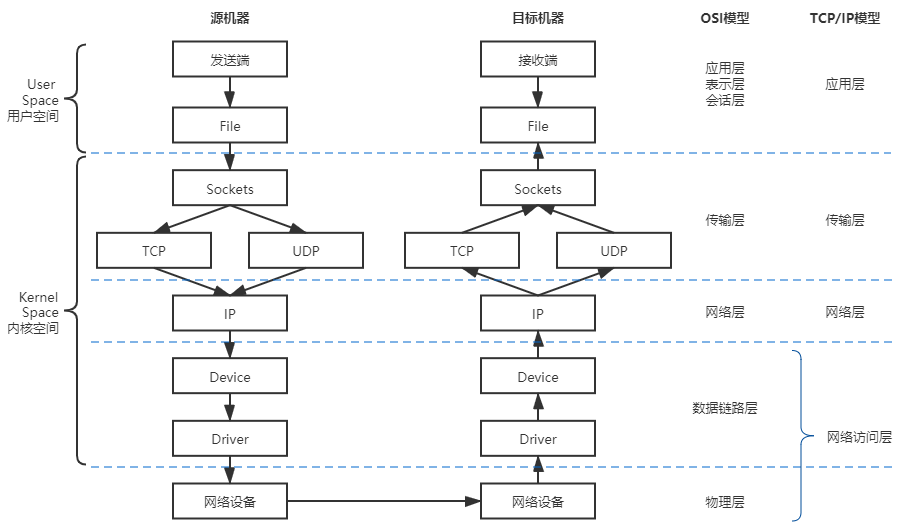
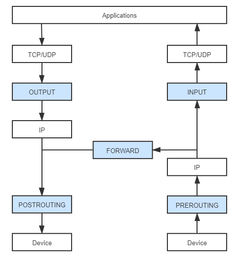
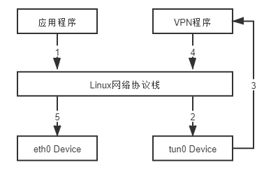
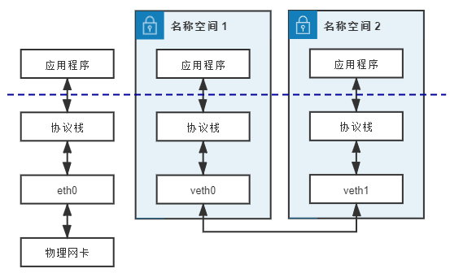
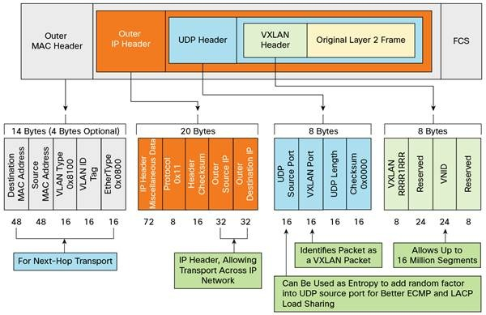
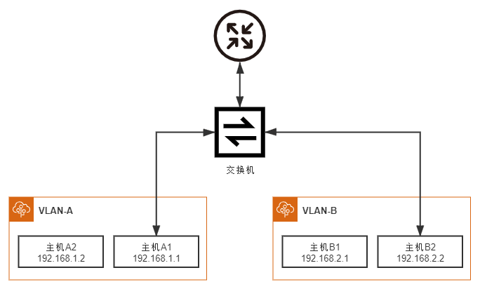
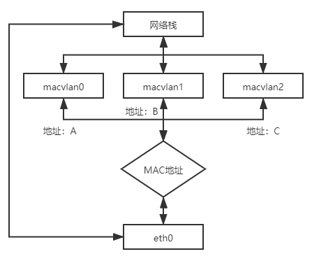

# Linux 网络虚拟化

Linux 目前提供的八种名称空间里，网络名称空间无疑是隔离内容最多的一种，它为名称空间内的所有进程提供了全套的网络设施，包括独立的设备界面、路由表、ARP 表，IP 地址表、iptables/ebtables 规则、协议栈，等等。虚拟化容器是以 Linux 名称空间的隔离性为基础来实现的，那解决隔离的容器之间、容器与宿主机之间、乃至跨物理网络的不同容器间通信问题的责任，很自然也落在了 Linux 网络虚拟化技术的肩上。本节里，我们暂时放下容器编排、云原生、微服务等这些上层概念，走入 Linux 网络的底层世界，去学习一些与设备、协议、通信相关的基础网络知识。

本节的阅读对象设定为以实现业务功能为主、平常并不直接接触网络设备的普通开发人员，对于平台基础设施的开发者或者运维人员，可能会显得有点过于啰嗦或过于基础了，如果你已经提前掌握了这些知识，完全可以快速阅读，或者直接跳过部分内容。

## 网络通信模型

如果抛开虚拟化，只谈网络的话，那首先应该了解的知识笔者认为是 Linux 系统的网络通信模型，即信息是如何从程序中发出，通过网络传输，再被另一个程序接收到的。整体上看，Linux 系统的通信过程无论按理论上的 OSI 七层模型，还是以实际上的 TCP/IP 四层模型来解构，都明显地呈现出“逐层调用，逐层封装”的特点，这种逐层处理的方式与栈结构，譬如程序执行时的方法栈很类似，因此它通常被称为“[Linux 网络协议栈](https://en.wikipedia.org/wiki/Protocol_stack)”，简称“网络栈”，有时也称“协议栈”。图 12-1 体现了 Linux 网络通信过程与 OSI 或者 TCP/IP 模型的对应关系，也展示了网络栈中的数据流动的路径。

:::center

图 12-1 Linux 系统下的网络通信模型
:::

图中传输模型的左侧，笔者特别标示出了网络栈在用户与内核空间的部分，可见几乎整个网络栈（应用层以下）都位于系统内核空间之中，之所以采用这种设计，主要是从数据安全隔离的角度出发来考虑的。由内核去处理网络报文的收发，无疑会有更高的执行开销，譬如数据在内核态和用户态之间来回拷贝的额外成本，因此会损失一些性能，但是能够保证应用程序无法窃听到或者去伪造另一个应用程序的通信内容。针对特别关注收发性能的应用场景，也有直接在用户空间中实现全套协议栈的旁路方案，譬如开源的[Netmap](https://github.com/luigirizzo/netmap)以及 Intel 的[DPDK](https://en.wikipedia.org/wiki/Data_Plane_Development_Kit)，都能做到零拷贝收发网络数据包。

图中传输模型的箭头展示的是数据流动的方向，它体现了信息从程序中发出以后，到被另一个程序接收到之前，将经历如下几个阶段：

- **Socket**：应用层的程序是通过 Socket 编程接口来和内核空间的网络协议栈通信的。Linux Socket 是从 BSD Socket 发展而来的，现在 Socket 已经不局限于某个操作系统的专属功能，成为各大主流操作系统共同支持的通用网络编程接口，是网络应用程序实际上的交互基础。应用程序通过读写收、发缓冲区（Receive/Send Buffer）来与 Socket 进行交互，在 UNIX 和 Linux 系统中，出于“一切皆是文件”的设计哲学，对 Socket 操作被实现为对文件系统（socketfs）的读写访问操作，通过文件描述符（File Descriptor）来进行。
- **TCP/UDP**：传输层协议族里最重要的协议无疑是[传输控制协议](https://en.wikipedia.org/wiki/Transmission_Control_Protocol)（Transmission Control Protocol，TCP）和[用户数据报协议](https://en.wikipedia.org/wiki/User_Datagram_Protocol)（User Datagram Protocol，UDP）两种，它们也是在 Linux 内核中被直接支持的协议。此外还有[流控制传输协议](https://en.wikipedia.org/wiki/Stream_Control_Transmission_Protocol)（Stream Control Transmission Protocol，SCTP）、[数据报拥塞控制协议](https://en.wikipedia.org/wiki/Datagram_Congestion_Control_Protocol)（Datagram Congestion Control Protocol，DCCP）等等。<br/>不同的协议处理流程大致是一样的，只是封装的报文以及头、尾部信息会有所不同，这里以 TCP 协议为例，内核发现 Socket 的发送缓冲区中有新的数据被拷贝进来后，会把数据封装为 TCP Segment 报文，常见网络协议的报文基本上都是由报文头（Header）和报文体（Body，也叫荷载“Payload”）两部分组成。系统内核将缓冲区中用户要发送出去的数据作为报文体，然后把传输层中的必要控制信息，譬如代表哪个程序发、由哪个程序收的源、目标端口号，用于保证可靠通信（重发与控制顺序）的序列号、用于校验信息是否在传输中出现损失的校验和（Check Sum）等信息封装入报文头中。
- **IP**：网络层协议最主要就是[网际协议](https://en.wikipedia.org/wiki/Internet_Protocol)（Internet Protocol，IP），其他还有[因特网组管理协议](https://en.wikipedia.org/wiki/Internet_Group_Management_Protocol)（Internet Group Management Protocol，IGMP）、大量的路由协议（EGP、NHRP、OSPF、IGRP、……）等等。<br/>以 IP 协议为例，它会将来自上一层（本例中的 TCP 报文）的数据包作为报文体，再次加入自己的报文头，譬如指明数据应该发到哪里的路由地址、数据包的长度、协议的版本号，等等，封装成 IP 数据包后发往下一层。关于 TCP 和 IP 协议报文的内容，笔者曾在“[负载均衡](/architect-perspective/general-architecture/diversion-system/load-balancing.html)”中详细讲解过，有需要的读者可以参考。
- **Device**：网络设备（Device）是网络访问层中面向系统一侧的接口，这里所说的设备与物理硬件设备并不是同一个概念，Device 只是一种向操作系统端开放的接口，其背后既可能代表着真实的物理硬件，也可能是某段具有特定功能的程序代码，譬如即使不存在物理网卡，也依然可以存在回环设备（Loopback Device）。许多网络抓包工具，如[tcpdump](https://en.wikipedia.org/wiki/Tcpdump)、[Wirshark](https://en.wikipedia.org/wiki/Wireshark)便是在此处工作的，前面介绍微服务[流量控制](/distribution/traffic-management/traffic-control.html)时曾提到过的网络流量整形，通常也是在这里完成的。Device 主要的作用是抽象出统一的界面，让程序代码去选择或影响收发包出入口，譬如决定数据应该从哪块网卡设备发送出去；还有就是准备好网卡驱动工作所需的数据，譬如来自上一层的 IP 数据包、[下一跳](<https://en.wikipedia.org/wiki/Hop_(networking)>)（Next Hop）的 MAC 地址（这个地址是通过[ARP Request](https://en.wikipedia.org/wiki/Address_Resolution_Protocol)得到的）等等。
- **Driver**：网卡驱动程序（Driver）是网络访问层中面向硬件一侧的接口，网卡驱动程序会通过[DMA](https://en.wikipedia.org/wiki/Direct_memory_access)将主存中的待发送的数据包复制到驱动内部的缓冲区之中。数据被复制的同时，也会将上层提供的 IP 数据包、下一跳 MAC 地址这些信息，加上网卡的 MAC 地址、VLAN Tag 等信息一并封装成为[以太帧](https://en.wikipedia.org/wiki/Ethernet_frame)（Ethernet Frame），并自动计算校验和。对于需要确认重发的信息，如果没有收到接收者的确认（ACK）响应，那重发的处理也是在这里自动完成的。

上面这些阶段是信息从程序中对外发出时经过协议栈的过程，接收过程则是从相反方向进行的逆操作。程序发送数据做的是层层封包，加入协议头，传给下一层；接受数据则是层层解包，提取协议体，传给上一层，你可以类比来理解数据包接收过程，笔者就不再专门列举一遍数据接收步骤了。

## 干预网络通信

网络协议栈的处理是一套相对固定和封闭的流程，整套处理过程中，除了在网络设备这层能看到一点点程序以设备的形式介入处理的空间外，其他过程似乎就没有什么可供程序插手的余地了。然而事实并非如此，从 Linux Kernel 2.4 版开始，内核开放了一套通用的、可供代码干预数据在协议栈中流转的过滤器框架。这套名为 Netfilter 的框架是 Linux 防火墙和网络的主要维护者 Rusty Russell 提出并主导设计的，它围绕网络层（IP 协议）的周围，埋下了五个[钩子](https://en.wikipedia.org/wiki/Hooking)（Hooks），每当有数据包流到网络层，经过这些钩子时，就会自动触发由内核模块注册在这里的回调函数，程序代码就能够通过回调来干预 Linux 的网络通信。笔者先将这五个钩子的名字与含义列出：

- PREROUTING：来自设备的数据包进入协议栈后立即触发此钩子。PREROUTING 钩子在进入 IP 路由之前触发，这意味着只要接收到的数据包，无论是否真的发往本机，都会触发此钩子。一般用于目标网络地址转换（Destination NAT，DNAT）。
- INPUT：报文经过 IP 路由后，如果确定是发往本机的，将会触发此钩子，一般用于加工发往本地进程的数据包。
- FORWARD：报文经过 IP 路由后，如果确定**不**是发往本机的，将会触发此钩子，一般用于处理转发到其他机器的数据包。
- OUTPUT：从本机程序发出的数据包，在经过 IP 路由前，将会触发此钩子，一般用于加工本地进程的输出数据包。
- POSTROUTING：从本机网卡出去的数据包，无论是本机的程序所发出的，还是由本机转发给其他机器的，都会触发此钩子，一般用于源网络地址转换（Source NAT，SNAT）。

:::center

图 12-2 应用收、发数据包所经过的 Netfilter 钩子
:::

Netfilter 允许在同一个钩子处注册多个回调函数，因此向钩子注册回调函数时必须提供明确的优先级，以便触发时能按照优先级从高到低进行激活。由于回调函数会存在多个，看起来就像挂在同一个钩子上的一串链条，因此钩子触发的回调函数集合就被称为“回调链”（Chained Callbacks），这个名字导致了后续基于 Netfilter 设计的 Xtables 系工具，如稍后介绍的 iptables 均有使用到“链”（Chain）的概念。虽然现在看来 Netfilter 只是一些简单的事件回调机制而已，然而这样一套简单的设计，却成为了整座 Linux 网络大厦的核心基石，Linux 系统提供的许多网络能力，如数据包过滤、封包处理（设置标志位、修改 TTL 等）、地址伪装、网络地址转换、透明代理、访问控制、基于协议类型的连接跟踪，带宽限速，等等，都是在 Netfilter 基础之上实现的。

以 Netfilter 为基础的应用有很多，其中使用最广泛的毫无疑问要数 Xtables 系列工具，譬如[iptables](https://en.wikipedia.org/wiki/Iptables)、ebtables、arptables、ip6tables 等等。这里面至少 iptables 应该是用过 Linux 系统的开发人员都或多或少会使用过，它常被称为是 Linux 系统“自带的防火墙”，然而 iptables 实际能做的事情已远远超出防火墙的范畴，严谨地讲，比较贴切的定位应是能够代替 Netfilter 多数常规功能的 IP 包过滤工具。iptables 的设计意图是因为 Netfilter 的钩子回调虽然很强大，但毕竟要通过程序编码才能够使用，并不适合系统管理员用来日常运维，而它的价值便是以配置去实现原本用 Netfilter 编码才能做到的事情。iptables 先把用户常用的管理意图总结成具体的行为预先准备好，然后在满足条件时自动激活行为。以下列出了部分 iptables 预置的行为：

- DROP：直接将数据包丢弃。
- REJECT：给客户端返回 Connection Refused 或 Destination Unreachable 报文。
- QUEUE：将数据包放入用户空间的队列，供用户空间的程序处理。
- RETURN：跳出当前链，该链里后续的规则不再执行。
- ACCEPT：同意数据包通过，继续执行后续的规则。
- JUMP：跳转到其他用户自定义的链继续执行。
- REDIRECT：在本机做端口映射。
- MASQUERADE：地址伪装，自动用修改源或目标的 IP 地址来做 NAT
- LOG：在/var/log/messages 文件中记录日志信息。
- ……

这些行为本来能够被挂载到 Netfilter 钩子的回调链上，但 iptables 又进行了一层额外抽象，不是把行为与链直接挂钩，而是根据这些底层操作的目的，先总结为更高层次的规则。举个例子，假设你挂载规则目的是为了实现网络地址转换（NAT），那就应该对符合某种特征的流量（譬如来源于某个网段、从某张网卡发送出去）、在某个钩子上（譬如做 SNAT 通常在 POSTROUTING，做 DNAT 通常在 PREROUTING）进行 MASQUERADE 行为，这样具有相同目的的规则，就应该放到一起才便于管理，由此便形成“规则表”的概念。iptables 内置了五张不可扩展的规则表（其中 security 表并不常用，很多资料只计算了前四张表），如下所列：

1. raw 表：用于去除数据包上的[连接追踪机制](https://en.wikipedia.org/wiki/Netfilter#Connection_tracking)（Connection Tracking）。
2. mangle 表：用于修改数据包的报文头信息，如服务类型（Type Of Service，ToS）、生存周期（Time to Live，TTL）以及为数据包设置 Mark 标记，典型的应用是链路的服务质量管理（Quality Of Service，QoS）。
3. nat 表：用于修改数据包的源或者目的地址等信息，典型的应用是网络地址转换（Network Address Translation）。
4. filter 表：用于对数据包进行过滤，控制到达某条链上的数据包是继续放行、直接丢弃或拒绝（ACCEPT、DROP、REJECT），典型的应用是防火墙。
5. security 表：用于在数据包上应用[SELinux](https://en.wikipedia.org/wiki/Security-Enhanced_Linux)，这张表并不常用。

以上五张规则表是具有优先级的：raw→mangle→nat→filter→security，也即是上面列举它们的顺序。在 iptables 中新增规则时，需要按照规则的意图指定要存入到哪张表中，如果没有指定，默认将会存入 filter 表。此外，每张表能够使用到的链也有所不同，具体表与链的对应关系如表 12-1 所示。

:::center

表 12-1 表与链的对应关系

:::

|                    | PREROUTING | POSTROUTING | FORWARD | INPUT | OUTPUT |
| ------------------ | :--------: | :---------: | :-----: | :---: | :----: |
| raw                |     √      |      ×      |    ×    |   ×   |   √    |
| mangle             |     √      |      √      |    √    |   √   |   √    |
| nat（Source）      |     ×      |      √      |    ×    |   √   |   ×    |
| nat（Destination） |     √      |      ×      |    ×    |   ×   |   √    |
| filter             |     ×      |      ×      |    √    |   √   |   √    |
| security           |     ×      |      ×      |    √    |   √   |   √    |

从名字上就能看出预置的五条链直接源自于 Netfilter 的钩子，它们与五张规则表的对应关系是固定的，用户不能增加自定义的表，或者修改已有表与链的关系，但可以增加自定义的链，新增的自定义链与 Netfilter 的钩子没有天然的对应关系，换而言之就是不会被自动触发，只有显式使用 JUMP 行为，从默认的五条链中跳转过去才能被执行。

iptables 不仅仅是 Linux 系统自带的一个网络工具，它在容器间通信中扮演相当重要的角色，譬如 Kubernetes 用来管理 Service 的 Endpoints 的核心组件 kube-proxy，就依赖 iptables 来完成 ClusterIP 到 Pod 的通信（也可以采用 IPVS，IPVS 同样是基于 Netfilter 的），这种通信的本质就是一种 NAT 访问。对于 Linux 用户，以上都是相当基础的网络常识，但如果你平常较少在 Linux 系统下工作，就可能需要一些用 iptables 充当防火墙过滤数据、充当作路由器转发数据、充当作网关做 NAT 转换的实际例子来帮助理解，由于这些操作在网上很容易就能找到，笔者便不专门去举例说明了。

行文至此，本章用了两个小节的篇幅去介绍 Linux 下网络通信的协议栈模型，以及程序如何干涉在协议栈中流动的信息，它们与虚拟化并没有什么直接关系，是整个 Linux 网络通信的必要基础。从下一节开始，我们就要开始专注于与网络虚拟化密切相关的内容了。

## 虚拟化网络设备

虚拟化网络并不需要完全遵照物理网络的样子来设计，不过，由于已有大量现成的代码原本就是面向于物理存在的网络设备来编码实现的，也有出于方便理解和知识继承的方面的考虑，虚拟化网络与物理网络中的设备还是有相当高的相似性。所以，笔者准备从网络中那些与网卡、交换机、路由器等对应的虚拟设施，以及如何使用这些虚拟设施来组成网络入手，来介绍容器间网络的通信基础设施。

### 网卡：tun/tap、veth

目前主流的虚拟网卡方案有[tun/tap](https://www.kernel.org/doc/Documentation/networking/tuntap.txt)和[veth](https://man7.org/linux/man-pages/man4/veth.4.html)两种，在时间上 tun/tap 出现得更早，它是一组通用的虚拟驱动程序包，里面包含了两个设备，分别是用于网络数据包处理的虚拟网卡驱动，以及用于内核空间与用户空间交互的[字符设备](https://en.wikipedia.org/wiki/Device_file#Character_devices)（Character Devices，这里具体指`/dev/net/tun`）驱动。大概在 2000 年左右，Solaris 系统为了实现[隧道协议](https://en.wikipedia.org/wiki/Tunneling_protocol)（Tunneling Protocol）开发了这套驱动，从 Linux Kernel 2.1 版开始移植到 Linux 内核中，当时是源码中的可选模块，2.4 版之后发布的内核都会默认编译 tun/tap 的驱动。

tun 和 tap 是两个相对独立的虚拟网络设备，其中 tap 模拟了以太网设备，操作二层数据包（以太帧），tun 则模拟了网络层设备，操作三层数据包（IP 报文）。使用 tun/tap 设备的目的是实现把来自协议栈的数据包先交由某个打开了`/dev/net/tun`字符设备的用户进程处理后，再把数据包重新发回到链路中。你可以通俗地将它理解为这块虚拟化网卡驱动一端连接着网络协议栈，另一端连接着用户态程序，而普通的网卡驱动则是一端连接则网络协议栈，另一端连接着物理网卡。只要协议栈中的数据包能被用户态程序截获并加工处理，程序员就有足够的舞台空间去玩出各种花样，譬如数据压缩、流量加密、透明代理等功能都能够以此为基础来实现，以最典型的 VPN 应用程序为例，程序发送给 tun 设备的数据包，会经过如图 12-3 所示的顺序流进 VPN 程序：

:::center

图 12-3 VPN 中数据流动示意图
:::

应用程序通过 tun 设备对外发送数据包后，tun 设备如果发现另一端的字符设备已被 VPN 程序打开（这就是一端连接着网络协议栈，另一端连接着用户态程序），便会把数据包通过字符设备发送给 VPN 程序，VPN 收到数据包，会修改后再重新封装成新报文，譬如数据包原本是发送给 A 地址的，VPN 把整个包进行加密，然后作为报文体，封装到另一个发送给 B 地址的新数据包当中。这种将一个数据包套进另一个数据包中的处理方式被形象地形容为“隧道”（Tunneling），隧道技术是在物理网络中构筑逻辑网络的经典做法。而其中提到的加密，也有标准的协议可遵循，譬如[IPSec](https://en.wikipedia.org/wiki/IPsec)协议。

使用 tun/tap 设备传输数据需要经过两次协议栈，不可避免地会有一定的性能损耗，如果条件允许，容器对容器的直接通信并不会把 tun/tap 作为首选方案，一般是基于稍后介绍的 veth 来实现的。但是 tun/tap 没有 veth 那样要求设备成对出现、数据要原样传输的限制，数据包到用户态程序后，程序员就有完全掌控的权力，要进行哪些修改，要发送到什么地方，都可以编写代码去实现，因此 tun/tap 方案比起 veth 方案有更广泛的适用范围。

veth 是另一种主流的虚拟网卡方案，在 Linux Kernel 2.6 版本，Linux 开始支持网络名空间隔离的同时，也提供了专门的虚拟以太网（Virtual Ethernet，习惯简写做 veth）让两个隔离的网络名称空间之间可以互相通信。直接把 veth 比喻成是虚拟网卡其实并不十分准确，如果要和物理设备类比，它应该相当于由[交叉网线](https://en.wikipedia.org/wiki/Ethernet_over_twisted_pair)连接的**一对**物理网卡。

:::quote 额外知识：直连线序、交叉线序

交叉网线是指一头是 T568A 标准，另外一头是 T568B 标准的网线。直连网线则是两头采用同一种标准的网线。

网卡对网卡这样的同类设备需要使用交叉线序的网线来连接，网卡到交换机、路由器就采用直连线序的网线，不过现在的网卡大多带有线序翻转功能，直连线也可以网卡对网卡地连通了。

:::

veth 实际上不是一个设备，而是一对设备，因而也常被称作 veth pair。要使用 veth，必须在两个独立的网络名称空间中进行才有意义，因为 veth pair 是一端连着协议栈，另一端彼此相连的，在 veth 设备的其中一端输入数据，这些数据就会从设备的另外一端原样不变地流出，它工作时数据流动如图 12-4 所示：

:::center

图 12-4 veth pair 工作示意图
:::

由于两个容器之间采用 veth 通信不需要反复多次经过网络协议栈，这让 veth 比起 tap/tun 具有更好的性能，也让 veth pair 的实现变的十分简单，内核中只用了几十行代码实现了一个数据复制函数就完成了 veth 的主体功能。veth 以模拟网卡直连的方式很好地解决了两个容器之间的通信问题，然而对多个容器间通信，如果仍然单纯只用 veth pair 的话，事情就会变得非常麻烦，让每个容器都为与它通信的其他容器建立一对专用的 veth pair 并不实际，这时就迫切需要有一台虚拟化的交换机来解决多容器之间的通信问题了。

### 交换机：Linux Bridge

既然有了虚拟网卡，很自然也会联想到让网卡接入到交换机里，实现多个容器间的相互连接。[Linux Bridge](https://www.kernel.org/doc/html/latest/networking/bridge.html)便是 Linux 系统下的虚拟化交换机，虽然它以“网桥”（Bridge）而不是“交换机”（Switch）为名，然而使用过程中，你会发现 Linux Bridge 的目的看起来像交换机，功能使用起来像交换机、程序实现起来也像交换机，实际就是一台虚拟交换机。

Linux Bridge 是在 Linux Kernel 2.2 版本开始提供的二层转发工具，由`brctl`命令创建和管理。Linux Bridge 创建以后，便能够接入任何位于二层的网络设备，无论是真实的物理设备（譬如 eth0）抑或是虚拟的设备（譬如 veth 或者 tap）都能与 Linux Bridge 配合工作。当有二层数据包（以太帧）从网卡进入 Linux Bridge，它将根据数据包的类型和目标 MAC 地址，按如下规则转发处理：

- 如果数据包是广播帧，转发给所有接入网桥的设备。
- 如果数据包是单播帧：
  - 且 MAC 地址在地址转发表中不存在，则[洪泛](<https://en.wikipedia.org/wiki/Flooding_(computer_networking)>)（Flooding）给所有接入网桥的设备，并将响应设备的接口与 MAC 地址学习（MAC Learning）到自己的 MAC 地址转发表中。
  - 且 MAC 地址在地址转发表中已存在，则直接转发到地址表中指定的设备。
- 如果数据包是此前转发过的，又重新发回到此 Bridge，说明冗余链路产生了环路。由于以太帧不像 IP 报文那样有 TTL 来约束，因此一旦出现环路，如果没有额外措施来处理的话就会永不停歇地转发下去。对于这种数据包就需要交换机实现[生成树协议](https://en.wikipedia.org/wiki/Spanning_Tree_Protocol)（Spanning Tree Protocol，STP）来交换拓扑信息，生成唯一拓扑链路以切断环路。

上面提到的这些名词，譬如二层转发、泛洪、STP、MAC 学习、地址转发表，等等，都是物理交换机中极为成熟的概念，它们在 Linux Bridge 中都有对应的实现，所以说 Linux Bridge 不仅用起来像交换机，实现起来也像交换机。不过，它与普通的物理交换机也还是有一点差别的，普通交换机只会单纯地做二层转发，Linux Bridge 却还支持把发给它自身的数据包接入到主机的三层的协议栈中。

对于通过`brctl`命令显式接入网桥的设备，Linux Bridge 与物理交换机的转发行为是完全一致的，也不允许给接入的设备设置 IP 地址，因为网桥是根据 MAC 地址做二层转发的，就算设置了三层的 IP 地址也毫无意义。然而 Linux Bridge 与普通交换机的区别是除了显式接入的设备外，它自己也无可分割地连接着一台有着完整网络协议栈的 Linux 主机，因为 Linux Bridge 本身肯定是在某台 Linux 主机上创建的，可以看作 Linux Bridge 有一个与自己名字相同的隐藏端口，隐式地连接了创建它的那台 Linux 主机。因此，Linux Bridge 允许给自己设置 IP 地址，比普通交换机多出一种特殊的转发情况：

- 如果数据包的目的 MAC 地址为网桥本身，并且网桥有设置了 IP 地址的话，那该数据包即被认为是收到发往创建网桥那台主机的数据包，此数据包将不会转发到任何设备，而是直接交给上层（三层）协议栈去处理。

此时，网桥就取代了 eth0 设备来对接协议栈，进行三层协议的处理。设置这条特殊转发规则的好处是：只要通过简单的 NAT 转换，就可以实现一个最原始的单 IP 容器网络。这种组网是最基本的容器间通信形式，笔者举个具体例子来帮助你理解。假设现有如下设备，它们的连接情况如图所示，具体配置为：

- 网桥 br0：分配 IP 地址 192.168.31.1；
- 容器：三个网络名称空间（容器），分别编号为 1、2、3，均使用 veth pair 接入网桥，且有如下配置：
  - 在容器一端的网卡名为 veth0，在网桥一端网卡名为 veth1、veth2、veth3；
  - 三个容器中的 veth0 网卡分配 IP 地址：192.168.1.10、192.168.1.11、192.168.1.12；
  - 三个容器中的 veth0 网卡设置网关为网桥，即 192.168.31.1；
  - 网桥中的 veth1、veth2、veth3 无 IP 地址；
- 物理网卡 eth0：分配的 IP 地址 14.123.254.86；
- 外部网络：外部网络中有一台服务器，地址为 122.246.6.183

:::center

图 12-5 Linux Bridge 构建单 IP 容器网络
:::

如果名称空间 1 中的应用程序想访问外网地址为 122.246.6.183 的服务器，由于容器没有自己的公网 IP 地址，程序发出的数据包必须经过如下步骤处理后，才能最终到达外网服务器：

1. 应用程序调用 Socket API 发送数据，此时生成的原始数据包为：

   > - 源 MAC：veth0 的 MAC
   > - 目标 MAC：网关的 MAC（即网桥的 MAC）
   > - 源 IP：veth0 的 IP，即 192.168.31.1
   > - 目标 IP：外网的 IP，即 122.246.6.183

2. 从 veth0 发送的数据，会在 veth1 中原样出来，网桥将会从 veth1 中接收到一个目标 MAC 为自己的数据包，并且网桥有配置 IP 地址，由此触发了 Linux Bridge 的特殊转发规则。这个数据包便不会转发给任何设备，而是转交给主机的协议栈处理。<br/>注意，从这步以后就是三层路由了，已不在网桥的工作范围之内，是由 Linux 主机依靠 Netfilter 进行 IP 转发（IP Forward）去实现的。
3. 数据包经过主机协议栈，Netfilter 的钩子被激活，预置好的 iptables NAT 规则会修改数据包的源 IP 地址，将其改为物理网卡 eth0 的 IP 地址，并在映射表中记录设备端口及两个 IP 地址之间的对应关系，经过 SNAT 之后的数据包，最终会从 eth0 出去，此时报文头中的地址为：

   > - 源 MAC：eth0 的 MAC
   > - 目标 MAC：下一跳（Hop）的 MAC
   > - 源 IP：eth0 的 IP，即 14.123.254.86
   > - 目标 IP：外网的 IP，即 122.246.6.183

4. 可见，经过主机协议栈后，数据包的源和目标 IP 地址均为公网的 IP，这个数据包在外部网络中可以根据 IP 正确路由到目标服务器手上。当目标服务器处理完毕，对该请求发出响应后，返回数据包的目标地址也是公网 IP。当返回的数据包经过链路所有跳点，由 eth0 达到网桥时，报文头中的地址为：

   > - 源 MAC：eth0 的 MAC
   > - 目标 MAC：网桥的 MAC
   > - 源 IP：外网的 IP，即 122.246.6.183
   > - 目标 IP：eth0 的 IP，即 14.123.254.86

5. 可见，这同样是一个以网桥 MAC 地址为目标的数据包，同样会触发特殊转发规则，交由协议栈处理。此时 Linux 将根据映射表中的转换关系做 DNAT 转换，把目标 IP 地址从 eth0 替换回 veth0 的 IP，最终 veth0 收到的响应数据包为：
   > - 源 MAC：网桥的 MAC
   > - 目标 MAC：veth0 的 MAC
   > - 源 IP：外网的 IP，即 122.246.6.183
   > - 目标 IP：veth0 的 IP，即 192.168.31.1

在以上处理过程中，Linux 主机独立承担了三层路由的职责，一定程度上扮演了路由器的角色。由于有 Netfilter 的存在，对网络层的路由转发，就无须像 Linux Bridge 一样专门提供`brctl`这样的命令去创建一个虚拟设备，通过 Netfilter 很容易就能在 Linux 内核完成根据 IP 地址进行路由的功能，你也可以理解为 Linux Bridge 是一个人工创建的虚拟交换机，而 Linux 内核则是一个天然的虚拟路由器。

限于篇幅，笔者仅举例介绍 Linux Bridge 这一种虚拟交换机的方案，此外还有 OVS（Open vSwitch）等同样常见，而且更强大、更复杂的方案这里就不再涉及了。

### 网络：VXLAN

有了虚拟化网络设备后，下一步就是要使用这些设备组成网络，容器分布在不同的物理主机上，每一台物理主机都有物理网络相互联通，然而这种网络的物理拓扑结构是相对固定的，很难跟上云原生时代的分布式系统的逻辑拓扑结构变动频率，譬如服务的扩缩、断路、限流，等等，都可能要求网络跟随做出相应的变化。正因如此，软件定义网络（Software Defined Network，SDN）的需求在云计算和分布式时代变得前所未有地迫切，SDN 的核心思路是在物理的网络之上再构造一层虚拟化的网络，将控制平面和数据平面分离开来，实现流量的灵活控制，为核心网络及应用的创新提供良好的平台。SDN 里位于下层的物理网络被称为 Underlay，它着重解决网络的连通性与可管理性，位于上层的逻辑网络被称为 Overlay，它着重为应用提供与软件需求相符的传输服务和网络拓扑。

软件定义网络已经发展了十余年时间，远比云原生、微服务这些概念出现得更早。网络设备商基于硬件设备开发出了 EVI（Ethernet Virtualization Interconnect）、TRILL（Transparent Interconnection of Lots of Links)、SPB（Shortest Path Bridging）等大二层网络技术；软件厂商也提出了 VXLAN（Virtual eXtensible LAN）、NVGRE（Network Virtualization Using Generic Routing Encapsulation）、STT（A Stateless Transport Tunneling Protocol for Network Virtualization）等一系列基于虚拟交换机实现的 Overlay 网络。由于跨主机的容器间通信，用的大多是 Overlay 网络，本节里，笔者会以 VXLAN 为例去介绍 Overlay 网络的原理。

VXLAN 你有可能没听说过，但[VLAN](https://en.wikipedia.org/wiki/Virtual_LAN)相信只要从事计算机专业的人都有所了解。VLAN 的全称是“虚拟局域网”（Virtual Local Area Network），从名称来看它也算是网络虚拟化技术的早期成果之一了。由于二层网络本身的工作特性决定了它非常依赖于广播，无论是广播帧（如 ARP 请求、DHCP、RIP 都会产生广播帧），还是泛洪路由，其执行成本都随着接入二层网络设备数量的增长而等比例增加，当设备太多，广播又频繁的时候，很容易就会形成[广播风暴](https://en.wikipedia.org/wiki/Broadcast_radiation)（Broadcast Radiation）。因此，VLAN 的首要职责就是划分广播域，将连接在同一个物理网络上的设备区分开来，划分的具体方法是在以太帧的报文头中加入 VLAN Tag，让所有广播只针对具有相同 VLAN Tag 的设备生效。这样既缩小了广播域，也附带提高了安全性和可管理性，因为两个 VLAN 之间不能直接通信。如果确有通信的需要，就必须通过三层设备来进行，譬如使用[单臂路由](https://en.wikipedia.org/wiki/Router_on_a_stick)（Router on a Stick）或者三层交换机。

然而 VLAN 有两个明显的缺陷，第一个缺陷在于 VLAN Tag 的设计，定义 VLAN 的[802.1Q 规范](https://en.wikipedia.org/wiki/IEEE_802.1Q)是在 1998 年提出的，当时的网络工程师完全不可能预料到未来云计算会如此地普及，因而只给 VLAN Tag 预留了 32 Bits 的存储空间，其中还要分出 16 Bits 存储标签协议识别符（Tag Protocol Identifier）、3 Bits 存储优先权代码点（Priority Code Point）、1 Bit 存储标准格式指示（Canonical Format Indicator），剩下的 12 Bits 才能用来存储 VLAN ID（Virtualization Network Identifier，VNI），换而言之，VLAN ID 最多只能有 2^12^=4096 种取值。当云计算数据中心出现后，即使不考虑虚拟化的需求，单是需要分配 IP 的物理设备都有可能数以万计甚至数以十万计，这样 4096 个 VLAN 肯定是不够用的。后来 IEEE 的工程师们又提出[802.1AQ 规范](https://zh.wikipedia.org/wiki/IEEE_802.1ad)力图补救这个缺陷，大致思路是给以太帧连续打上两个 VLAN Tag，每个 Tag 里仍然只有 12 Bits 的 VLAN ID，但两个加起来就可以存储 2^24^=16,777,216 个不同的 VLAN ID 了，由于两个 VLAN Tag 并排放在报文头上，802.1AQ 规范还有了个 QinQ（802.1Q in 802.1Q）的昵称别名。

QinQ 是 2011 年推出的规范，但是直到现在都并没有特别普及，除了需要设备支持外，它还解决不了 VLAN 的第二个缺陷：跨数据中心传递。VLAN 本身是为二层网络所设计的，但是在两个独立数据中心之间，信息只能够通过三层网络传递，由于云计算的发展普及，大型分布式系统已不局限于单个数据中心，完全有跨数据中心运作的可能性，此时如何让 VLAN Tag 在两个数据中心间传递又成了不得不考虑的麻烦事。

为了统一解决以上两个问题，IETF 定义了 VXLAN 规范，这是[三层虚拟化网络](https://datatracker.ietf.org/wg/nvo3/about/)（Network Virtualization over Layer 3，NVO3）的标准技术规范之一，是一种典型的 Overlay 网络。VXLAN 采用 L2 over L4 （MAC in UDP）的报文封装模式，把原本在二层传输的以太帧放到四层 UDP 协议的报文体内，同时加入了自己定义的 VXLAN Header。在 VXLAN Header 里直接就有 24 Bits 的 VLAN ID，同样可以存储 1677 万个不同的取值，VXLAN 让二层网络得以在三层范围内进行扩展，不再受数据中心间传输的限制。VXLAN 的整个报文结构如图 12-6 所示：

:::center

VXLAN 报文结构<br/>（图片来源：[Orchestrating EVPN VXLAN Services with Cisco NSO](https://www.ciscolive.com/c/dam/r/ciscolive/emea/docs/2019/pdf/DEVWKS-1445.pdf)）
:::

VXLAN 对网络基础设施的要求很低，不需要专门的硬件提供的特别支持，只要三层可达的网络就能部署 VXLAN。VXLAN 网络的每个边缘入口上布置有一个 VTEP（VXLAN Tunnel Endpoints）设备，它既可以是物理设备，也可以是虚拟化设备，负责 VXLAN 协议报文的封包和解包。[互联网号码分配局](https://en.wikipedia.org/wiki/Internet_Assigned_Numbers_Authority)（Internet Assigned Numbers Authority，IANA）专门分配了 4789 作为 VTEP 设备的 UDP 端口（以前 Linux VXLAN 用的默认端口是 8472，目前这两个端口在许多场景中仍有并存的情况）。

从 Linux Kernel 3.7 版本起，Linux 系统就开始支持 VXLAN。到了 3.12 版本，Linux 对 VXLAN 的支持已达到完全完备的程度，能够处理单播和组播，能够运行于 IPv4 和 IPv6 之上，一台 Linux 主机经过简单配置之后，便可以把 Linux Bridge 作为 VTEP 设备使用。

VXLAN 带来了很高的灵活性、扩展性和可管理性，同一套物理网络中可以任意创建多个 VXLAN 网络，每个 VXLAN 中接入的设备都仿佛是在一个完全独立的二层局域网中一样，不会受到外部广播的干扰，也很难遭受外部的攻击，这使得 VXLAN 能够良好地匹配分布式系统的弹性需求。不过，VXLAN 也带来了额外的复杂度和性能开销，具体表现在：

- 传输效率的下降，如果你仔细数过前面 VXLAN 报文结构中 UDP、IP、以太帧报文头的字节数，会发现经过 VXLAN 封装后的报文，新增加的报文头部分就整整占了 50 Bytes（VXLAN 报文头占 8 Bytes，UDP 报文头占 8 Bytes，IP 报文头占 20 Bytes，以太帧的 MAC 头占 14 Bytes），而原本只需要 14 Bytes 而已，而且现在这 14 Bytes 的消耗也还在，被封到了最里面的以太帧中。以太网的[MTU](https://en.wikipedia.org/wiki/Maximum_transmission_unit)是 1500 Bytes，如果是传输大量数据，额外损耗 50 Bytes 并不算很高的成本，但如果传输的数据本来就只有几个 Bytes 的话，那传输消耗在报文头上的成本就很高昂了。

- 传输性能的下降，每个 VXLAN 报文的封包和解包操作都属于额外的处理过程，尤其是用软件来实现的 VTEP，额外的运算资源消耗有时候会成为不可忽略的性能影响因素。

### 副本网卡：MACVLAN

理解了 VLAN 和 VXLAN 的原理后，我们就有足够的前置知识去了解[MACVLAN](https://github.com/moby/libnetwork/blob/master/docs/macvlan.md)这最后一种网络设备虚拟化的方式了。

前文中提到过，两个 VLAN 之间是完全二层隔离的，不存在重合的广播域，因此要通信就只能通过三层设备，最简单的三层通信就是靠单臂路由了。笔者以图 12-7 所示的网络拓扑结构来举个具体例子，介绍单臂路由是如何工作的：

:::center

图 12-7 VLAN 单臂路由原理
:::

假设位于 VLAN-A 中的主机 A1 希望将数据包发送给 VLAN-B 中的主机 B2，由于 A、B 两个 VLAN 之间二层链路不通，因此引入了单臂路由，单臂路由不属于任何 VLAN，它与交换机之间的链路允许任何 VLAN ID 的数据包通过，这种接口被称为 TRUNK。这样，A1 要和 B2 通信，A1 就将数据包先发送给路由（只需把路由设置为网关即可做到），然后路由根据数据包上的 IP 地址得知 B2 的位置，去掉 VLAN-A 的 VLAN Tag，改用 VLAN-B 的 VLAN Tag 重新封装数据包后发回给交换机，交换机收到后就可以顺利转发给 B2 了。这个过程并没什么复杂的地方，但你是否注意到一个问题，路由器应该设置怎样的 IP 地址呢？由于 A1、B2 各自处于独立的网段上，它们又各自要将同一个路由作为网关使用，这就要求路由器必须同时具备 192.168.1.0/24 和 192.168.2.0/24 的 IP 地址。如果真的就只有 VLAN-A、VLAN-B 两个 VLAN，那把路由器上的两个接口分别设置不同的 IP 地址，然后用两条网线分别连接到交换机上也勉强算是一个解决办法，但 VLAN 最多支持 4096 个 VLAN，如果要接四千多条网线就太离谱了。为了解决这个问题，802.1Q 规范中专门定义了子接口（Sub-Interface）的概念，其作用是允许在同一张物理网卡上，针对不同的 VLAN 绑定不同的 IP 地址。

MACVLAN 借用了 VLAN 子接口的思路，并且在这个基础上更进一步，不仅允许对同一个网卡设置多个 IP 地址，还允许对同一张网卡上设置多个 MAC 地址，这也是 MACVLAN 名字的由来。原本 MAC 地址是网卡接口的“身份证”，应该是严格的一对一关系，而 MACVLAN 打破这层关系，方法是在物理设备之上、网络栈之下生成多个虚拟的 Device，每个 Device 都有一个 MAC 地址，新增 Device 的操作本质上相当于在系统内核中注册了一个收发特定数据包的回调函数，每个回调函数都能对一个 MAC 地址的数据包进行响应，当物理设备收到数据包时，会先根据 MAC 地址进行一次判断，确定交给哪个 Device 来处理，如图 12-8 所示。以交换机一侧的视角来看，这个端口后面仿佛是另一台已经连接了多个设备的交换机一样。

:::center

图 12-8 MACVLAN 原理
:::

用 MACVLAN 技术虚拟出来的副本网卡，在功能上和真实的网卡是完全对等的，此时真正的物理网卡实际上确实承担着类似交换机的职责，收到数据包后，根据目标 MAC 地址判断这个包应转发给哪块副本网卡处理，由同一块物理网卡虚拟出来的副本网卡，天然处于同一个 VLAN 之中，可以直接二层通信，不需要将流量转发到外部网络。

与 Linux Bridge 相比，这种以网卡模拟交换机的方法在目标上并没有本质的不同，但 MACVLAN 在内部实现上要比 Linux Bridge 轻量得多。从数据流来看，副本网卡的通信只比物理网卡多了一次判断而已，能获得很高的网络通信性能；从操作步骤来看，由于 MAC 地址是静态的，所以 MACVLAN 不需要像 Linux Bridge 那样考虑 MAC 地址学习、STP 协议等复杂的算法，这进一步突出了 MACVLAN 的性能优势。

除了模拟交换机的 Bridge 模式外，MACVLAN 还支持虚拟以太网端口聚合模式（Virtual Ethernet Port Aggregator，VEPA）、Private 模式、Passthru 模式、Source 模式等另外几种工作模式，有兴趣的读者可以参考相关资料，笔者就不再逐一介绍了。

## 容器间通信

经过对虚拟化网络基础知识的一番铺垫后，在最后这个小节里，我们尝试使用这些知识去解构容器间的通信原理了，毕竟运用知识去解决问题才是笔者介绍网络虚拟化的根本目的。这节我们先以 Docker 为目标，谈一谈[Docker 所提供的容器通信方案](https://docs.docker.com/network/)。下一节介绍过 CNI 下的 Kubernetes 网络插件生态后，你也许会觉得 Docker 的网络通信相对简单，对于某些分布式系统的需求来说甚至是过于简陋了，然而，容器间的网络方案多种多样，但通信主体都是固定的，不外乎没有物理设备的虚拟主体（容器、Pod、Service、Endpoints 等等）、不需要跨网络的本地主机、以及通过网络连接的外部主机三种层次，所有的容器网络通信问题，都可以归结为本地主机内部的多个容器之间、本地主机与内部容器之间和跨越不同主机的多个容器之间的通信问题，其中的许多原理都是相通的，所以 Docker 网络的简单，在作为检验前面网络知识有没有理解到位时倒不失为一种优势。

Docker 的网络方案在操作层面上是指能够直接通过`docker run --network`参数指定的网络，或者先`docker network create`创建后再被容器使用的网络。安装 Docker 过程中会自动在宿主机上创建一个名为 docker0 的网桥，以及三种不同的 Docker 网络，分别是 bridge、host 和 none，你可以通过`docker network ls`命令查看到这三种网络，具体如下所示：

```bash
$ docker network ls
NETWORK ID          NAME                                    DRIVER              SCOPE
2a25170d4064        bridge                                  bridge              local
a6867d58bd14        host                                    host                local
aeb4f8df39b1        none                                    null                local
```

这三种网络，对应着 Docker 提供的三种开箱即用的网络方案，它们分别为：

- **桥接模式**，使用`--network=bridge`指定，这种也是未指定网络参数时的默认网络。桥接模式下，Docker 会为新容器分配独立的网络名称空间，创建好 veth pair，一端接入容器，另一端接入到 docker0 网桥上。Docker 为每个容器自动分配好 IP 地址，默认配置下地址范围是 172.17.0.0/24，docker0 的地址默认是 172.17.0.1，并且设置所有容器的网关均为 docker0，这样所有接入同一个网桥内的容器直接依靠二层网络来通信，在此范围之外的容器、主机就必须通过网关来访问，具体过程笔者在介绍 Linux Bridge 时已经举例详细讲解过。
- **主机模式**，使用`--network=host`指定。主机模式下，Docker 不会为新容器创建独立的网络名称空间，这样容器一切的网络设施，如网卡、网络栈等都直接使用宿主机上的真实设施，容器也就不会拥有自己独立的 IP 地址。此模式下与外界通信无须进行 NAT 转换，没有性能损耗，但缺点也十分明显，没有隔离就无法避免网络资源的冲突，譬如端口号就不允许重复。
- **空置模式**，使用`--network=none`指定，空置模式下，Docker 会给新容器创建独立的网络名称空间，但是不会创建任何虚拟的网络设备，此时容器能看到的只有一个回环设备（Loopback Device）而已。提供这种方式是为了方便用户去做自定义的网络配置，如自己增加网络设备、自己管理 IP 地址，等等。

除了三种开箱即用的网络外，Docker 还支持以下由用户自行创建的网络：

- **容器模式**，创建容器后使用`--network=container:容器名称`指定。容器模式下，新创建的容器将会加入指定的容器的网络名称空间，共享一切的网络资源，但其他资源，如文件、PID 等默认仍然是隔离的。两个容器间可以直接使用回环地址（localhost）通信，端口号等网络资源不能有冲突。
- **MACVLAN 模式**：使用`docker network create -d macvlan`创建，此网络允许为容器指定一个副本网卡，容器通过副本网卡的 MAC 地址来使用宿主机上的物理设备，在追求通信性能的场合，这种网络是最好的选择。Docker 的 MACVLAN 只支持 Bridge 通信模式，因此在功能表现上与桥接模式相类似。
- **Overlay 模式**：使用`docker network create -d overlay`创建，Docker 说的 Overlay 网络实际上就是特指 VXLAN，这种网络模式主要用于 Docker Swarm 服务之间进行通信。然而由于 Docker Swarm 败于 Kubernetes，并未成为主流，所以这种网络模式实际很少使用。
