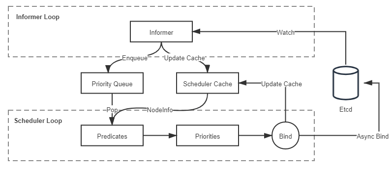

# 资源与调度

调度是容器编排系统最核心的功能之一，“编排”一词本身便包含有“调度”的含义。调度是指为新创建出来的 Pod 寻找到一个最恰当的宿主机节点来运行它，这个过程成功与否、结果恰当与否，关键取决于容器编排系统是如何管理与分配集群节点的资源的。可以认为调度是必须以容器编排系统的资源管控为前提，那我们就首先从 Kubernetes 的资源模型谈起。

## 资源模型

开篇先来理清一个概念：资源是什么。资源在 Kubernetes 中是极为常用的术语，广义上讲，Kubernetes 系统中所有你能够接触的方方面面都被抽象成了资源，譬如表示工作负荷的资源（Pod、ReplicaSet、Service、……），表示存储的资源（Volume、PersistentVolume、Secret、……），表示策略的资源（SecurityContext、ResourceQuota、LimitRange、……），表示身份的资源（ServiceAccount、Role、ClusterRole、……），等等。“一切皆为资源”的设计是 Kubernetes 能够顺利施行声明式 API 的必要前提，Kubernetes 以资源为载体，建立了一套同时囊括了抽象元素（如策略、依赖、权限）和物理元素（如软件、硬件、网络）的[领域特定语言](https://en.wikipedia.org/wiki/Domain-specific_language)。通过不同层级间资源的使用关系来描述上至整个集群甚至是集群联邦，下至某一块内存区域或者一小部分的处理器核心的状态，这些对资源状态的描述的集合，共同构成了一幅信息系统工作运行的全景图。

在“[以容器构建系统](/immutable-infrastructure/container/container-build-system.html)”一节里，笔者首次提到 Kubernetes 的资源模型，将它与控制器模式一并列为 Kubernetes 中最重要的两个设计思想。本节，我们将再次讨论资源模型，但是这里所说的主要是狭义上的物理资源，特指排除了广义上那些逻辑上的抽象资源，只包括能够与真实物理底层硬件对应起来的资源，譬如处理器资源、内存资源、磁盘存储资源，等等。由于我们讨论的话题是调度，作为调度最基本单位的 Pod，只会与这些和物理硬件直接相关的资源产生供需关系，所以后文中提到资源，如无额外说明的话，均是特指狭义上的物理资源。

从编排系统的角度来看，Node 是资源的提供者，Pod 是资源的使用者，调度是将两者进行恰当的撮合。Node 通常能够提供的三方面的资源：计算资源（如处理器、图形处理器、内存）、存储资源（如磁盘容量、不同类型的介质）和网络资源（如带宽、网络地址），其中与调度关系最密切的是处理器和内存，虽然它们同属于计算资源，但两者在调度时又有一些微妙的差别：处理器这样的资源被称作可压缩资源（Compressible Resources），特点是当可压缩资源不足时，Pod 只会处于“饥饿状态”，运行变慢，但不会被系统杀死，即容器被直接终止，或被要求限时退出。而像内存这样的资源，则被称作不可压缩资源（Incompressible Resources），特点是当不可压缩资源不足，或者超过了容器自己声明的最大限度时，Pod 就会因为内存溢出（Out-Of-Memory，OOM）而被系统直接杀掉。

Kubernetes 给处理器资源设定的默认计量单位是“逻辑处理器的个数”。至于具体“一个逻辑处理器”应该如何理解，就要取决于节点的宿主机是如何解释的，通常会是`/proc/cpuinfo`中看到的处理器数量。它有可能会是多路处理器系统上的一个处理器、多核处理器中的一个核心、云计算主机上的一个[虚拟化处理器](https://en.wikipedia.org/wiki/Central_processing_unit#Virtual_CPUs)（Virtual CPU，vCPU），或者处理器核心里的一条[超线程](https://en.wikipedia.org/wiki/Hyper-threading)（Hyper-Threading）。总之，Kubernetes 只负责保证 Pod 能够使用到“一个处理器”的计算能力，对不同硬件环境构成的 Kubernetes 集群，乃至同一个集群中不同硬件的宿主机节点来说，“一个处理器”所代表的真实算力完全有可能是不一样的。

在具体设置方面，Kubernetes 沿用了云计算中处理器限额设置的一贯做法。如果不明确标注单位，譬如直接写 0.5，默认单位就是`Core`，即 0.5 个处理器；也可以明确使用`Millcores`为单位，譬如写成 500 m 同样代表 0.5 个处理器，因为 Kubernetes 规定了`1 Core = 1000 Millcores`。而对于内存来说，它早已经有了广泛使用的计量单位，即 Bytes，如果设置中不明确标注单位就会默认以 Bytes 计数。为了实际设置的方便，Kubernetes 还支持`Ei`、`Pi`、`Ti`、`Gi`、`Mi`、`Ki`，以及`E`、`P`、`T`、`G`、`M`、`K`为单位，这两者略微有一点点差别，以`Mi`和`M`为例，它们分别是`Mebibytes`与`Megabytes`的缩写，前者表示 1024×1024 Bytes，后者表示 1000×1000 Bytes。

## 服务质量与优先级

设定资源计量单位的目的是为了管理员能够限制某个 Pod 对资源的过度占用，避免影响到其他 Pod 的正常运行。Pod 是由一到多个容器所组成，资源最终是交由 Pod 的各个容器去使用，所以资源的需求是设定在容器上的，具体的配置是 Pod 的`spec.containers[].resource.limits/requests.cpu/memory`字段。但是对资源需求的配额则不是针对容器的，而是针对 Pod 整体，Pod 的资源配额无需手动设置，它就是它包含的每个容器资源需求的累加值。

为容器设定最大的资源配额的做法从 cgroups 诞生后已经屡见不鲜，但你是否注意到 Kubernetes 给出的配置中有`limits`和`requests`两个设置项？这两者的区别其实很简单：`requests`是给调度器用的，Kubernetes 选择哪个节点运行 Pod，只会根据`requests`的值来进行决策；`limits`才是给 cgroups 用的，Kubernetes 在向 cgroups 的传递资源配额时，会按照`limits`的值来进行设置。

Kubernetes 采用这样的设计完全是基于“心理学”的原因，是因为 Google 根据 Borg 和 Omega 系统长期运行的实践经验，总结出了一条经验法则：用户提交工作负载时设置的资源配额，并不是容器调度一定必须严格遵守的值，因为根据实际经验，大多数的工作负载运行过程中真正使用到的资源，其实都远小于它所请求的资源配额。

:::quote Purchase Quota

Even though we encourage users to purchase no more quota than they need, many users overbuy because it insulates them against future shortages when their application’s user base grows.

即使我们已经努力建议用户不要过度申请资源配额，但仍难免有大量用户过度消费，他们总希望避免因用户增长而产生资源不足的现象。

:::right

—— [Large-Scale Cluster Management at Google with Borg](https://pdos.csail.mit.edu/6.824/papers/borg.pdf)，Google

:::

“多多益善”的想法完全符合人类的心理，大家提交的资源需求通常都是按照可能面临的最大压力去估计的，甚至考虑到了未来用户增长所导致的新需求。为了避免服务因资源不足而中断，都会往大了去申请，这点我们可以理解，但如果直接按照申请的资源去分配限额，所导致的结果必然是服务器一方面在大多数时间里都会有大量硬件资源闲置，另一方面这些闲置资源又已经分配出去，有了明确的所有者，不能再被其他人利用，难以真正发挥价值。

不大可能仅仅是因为 Kubernetes 将一个资源配额的设置，拆分成`limits`和`requests`两个设置项就能解决这个矛盾的，Kubernetes 为此还进行了许多额外的处理。一旦选择不按照最保守、最安全的方式去分配资源，就意味着容器编排系统必须为有可能出现的极端情况而买单，如果允许节点给 Pod 分配资源总和超过自己最大的可提供资源的话，假如某个时刻这些 Pod 的总消耗真的超标了，便会不可避免地导致节点无法继续遵守调度时对 Pod 许下的资源承诺，此时，Kubernetes 迫不得已要杀掉一部分 Pod 腾出资源来保证其余 Pod 能正常运行，这个操作就是稍后会介绍的**驱逐机制**（Eviction）。要进行驱逐，首先 Kubernetes 就必须拿出资源不足时该先牺牲哪些 Pod、该保留哪些 Pod 的明确准则，由此就形成了 Kubernetes 的**服务质量等级**（Quality of Service Level，QoS Level）和**优先级**（Priority）的概念。试想 Kubernetes 若不是为了理性对抗人类“多多益善”的心理，尽可能提高硬件利用效率，而是直接按申请的最大资源去安排调度，那原本它是无需理会这些麻烦事的。

质量等级是 Pod 的一个隐含属性，也是 Kubernetes 优先保障重要的服务，放弃一些没那么重要的服务的衡量准绳。不知道你是否想到这样一个细节：如果不去设置`limits`和`requests`会怎样？答案是不设置处理器和内存的资源，就意味着没有上限，该 Pod 可以使用节点上所有可用的计算资源。但你先别高兴得太早，这类 Pod 能以最灵活的方式去使用资源，但也正是这类 Pod 扮演着最不稳定的风险来源的角色。在论文《[Large-Scale Cluster Management at Google with Borg](https://pdos.csail.mit.edu/6.824/papers/borg.pdf)》中，Google 明确地提出了针对这类 Pod 的一种近乎带惩罚性质的处理建议：当节点硬件资源不足时，优先杀掉这类 Pod，说得文雅一点的话，就是给予这类 Pod 最低的服务质量等级。

Kubernetes 目前提供的服务质量等级一共分为三级，由高到低分别为 Guaranteed、Burstable 和 BestEffort。如果 Pod 中所有的容器都设置了`limits`和`requests`，且两者的值相等，那此 Pod 的服务质量等级便为最高的 Guaranteed；如果 Pod 中有部分容器的 requests 值小于`limits`值，或者只设置了`requests`而未设置`limits`，那此 Pod 的服务质量等级为第二级 Burstable；如果是刚才说的那种情况，`limits`和`requests`两个都没设置就是最低的 BestEffort 了。

通常建议将数据库应用等有状态的应用，或者一些重要的要保证不能中断的业务的服务质量等级定为 Guaranteed，这样除非 Pod 使用超过了它们的`limits`所描述的不可压缩资源，或者节点的内存压力大到 Kubernetes 已经杀光所有等级更低的 Pod 了，否则它们都不会被系统自动杀死。相对地，应将一些临时的、不那么重要的任务设置为 BestEffort，这样有利于它们调度时能在更大的节点范围中寻找宿主机，也利于它们在宿主机中利用更多的资源快速地完成任务，然后退出，尽量缩减影响范围；当然，遇到系统资源紧张时，它们也更容易被系统杀掉。

:::quote 小说《动物庄园》：

All animals are equal, but some animals are more equal than others.

所有动物生来平等，但有些动物比其他动物更加平等。

:::right

—— [Animal Farm: A Fairy Story](https://en.wikipedia.org/wiki/Animal_Farm)，[George Orwell](https://en.wikipedia.org/wiki/George_Orwell), 1945

:::

除了服务质量等级以外，Kubernetes 还允许系统管理员自行决定 Pod 的优先级，这是通过类型为 PriorityClass 的资源来实现的。优先级决定了 Pod 之间并不是平等的关系，而且这种不平等还不是谁会占用更多一点的资源的问题，而是会直接影响 Pod 调度与生存的关键。

优先级会影响调度这很容易理解，它是指当多个 Pod 同时被调度的话，高优先级的 Pod 会优先被调度。Pod 越晚被调度，就越大概率因节点资源已被占用而不能成功。但优先级影响更大的另一方面是指 Kubernetes 的**抢占机制**（Preemption），正常未设置优先级的情况下，如果 Pod 调度失败，就会暂时处于 Pending 状态被搁置起来，直到集群中有新节点加入或者旧 Pod 退出。但是，如果有一个被设置了明确优先级的 Pod 调度失败无法创建的话，Kubernetes 就会在系统中寻找出一批牺牲者（Victims），将它们杀掉以便给更高优先级的 Pod 让出资源。寻找的原则是根据在优先级低于待调度 Pod 的所有已调度 Pod 里，按照优先级从低到高排序，从最低的杀起，直至腾出的资源足以满足待调度 Pod 的成功调度为止，或者已经找不到更低优先级的 Pod 为止。

## 驱逐机制

前面笔者动不动就提要杀掉某个 Pod，听起来实在是欠优雅的，在 Kubernetes 中专业的称呼是“驱逐”（Eviction，即资源回收）。Pod 的驱逐机制是通过 kubelet 来执行的，kubelet 是部署在每个节点的集群管理程序，由于本身就运行在节点中，所以最容易感知到节点的资源实时耗用情况。kubelet 一旦发现某种不可压缩资源将要耗尽，就会主动终止节点上较低服务质量等级的 Pod，以保证其他更重要的 Pod 的安全。被驱逐的 Pod 中所有的容器都会被终止，Pod 的状态会被更改为 Failed。

我们已经接触过内存这一种最重要的不可压缩资源，默认配置下，前面所说的“资源即将耗尽”的“即将”，具体阈值是可用内存小于 100 Mi。除了可用内存（`memory.available`）外，其他不可压缩资源还包括有：宿主机的可用磁盘空间（`nodefs.available`）、文件系统可用[inode](https://en.wikipedia.org/wiki/Inode)数量（`nodefs.inodesFree`），以及可用的容器运行时镜像存储空间（`imagefs.available`）。后面三个的阈值都是按照实际容量的百分比来计算的，具体的默认值如下：

```
memory.available < 100Mi
nodefs.available < 10%
nodefs.inodesFree < 5%
imagefs.available < 15%
```

管理员可以在 kubelet 启动时，通过命令行参数来修改这些默认值，譬如可用内存只剩余 100 Mi 时才启动驱逐对于多数生产系统来说都过于危险了，笔者建议在生产环境中考虑通过以下命令调整为剩余 10%内存时即开始驱逐：

```bash
$ kubelet --eviction-hard=memory.available<10%
```

如果你是一名 Java、C#、Golang 等习惯了自动内存管理机制的程序员，笔者还要提醒你 Kubernetes 的驱逐不能完全等同于编程语言中的垃圾收集器。垃圾收集是安全的内存回收行为，而驱逐 Pod 是一种毁坏性的清理行为，有可能会导致服务产生中断，必须更加谨慎。譬如，要同时兼顾到硬件资源可能只是短时间内间歇性地超过了阈值的场景，以及资源正在被快速消耗，很快就会危及高服务质量的 Pod 甚至是整个节点稳定的场景。因此，驱逐机制中就有了**软驱逐**（Soft Eviction）、**硬驱逐**（Hard Eviction）以及**优雅退出期**（Grace Period）的概念：

- **软驱逐**：通常配置一个较低的警戒线（譬如可用内存仅剩 20%），触及此线时，系统将进入一段观察期。如果只是暂时的资源抖动，在观察期内能够恢复到正常水平的话，那就不会真正启动驱逐操作。否则，资源持续超过警戒线一段时间，就会触发 Pod 的优雅退出（Grace Shutdown），系统会通知 Pod 进行必要的清理工作（譬如将缓存的数据落盘），然后自行结束。在优雅退出期结束后，系统会强制杀掉还未曾自行了断的 Pod。
- **硬驱逐**：通常配置一个较高的终止线（譬如可用内存仅剩 10%），一旦触及此红线，立即强制杀掉 Pod，不理会优雅退出。

软驱逐是为了减少资源抖动对服务的影响，硬驱逐是为了保障核心系统的稳定，它们并不矛盾，一般会同时使用，譬如以下例子所示：

```bash
$ kubelet --eviction-hard=memory.available<10% \
		  --eviction-soft=memory.available<20% \
		  --eviction-soft-grace-period=memory.available=1m30s \
		  --eviction-max-pod-grace-period=600
```

Kubernetes 的驱逐与编程语言中垃圾收集器另一个不同之处是垃圾收集可以“应收尽收”，而驱逐显然不行，不能无缘无故把整个节点中所有可驱逐的 Pod 都清空掉。但是，通常也不能只清理到刚刚低于警戒线就停止，必须考虑到驱逐之后的新 Pod 调度与旧 Pod 运行的新增消耗。譬如 kubelet 驱逐了若干个 Pod，让资源使用率勉强低于阈值，那么很可能在极短的时间内，资源使用率又会因某个 Pod 稍微占用了些许资源而重新超过阈值，再产生新一次驱逐，如此往复。为此，Kubernetes 提供了`--eviction-minimum-reclaim`参数用于设置一旦驱逐发生之后，至少清理出来多少资源才会终止。

不过，问题到这里还是没有全部解决，Kubernetes 中很少会单独创建 Pod，通常都是由 ReplicaSet、Deployment 等更高层资源来管理的，这意味着当 Pod 被驱逐之后，它不会从此彻底消失，Kubernetes 将自动生成一个新的 Pod 来取代，并经过调度选择一个节点继续运行。如果没有额外的处理，那很大概率这个 Pod 会被系统调度到当前这个节点上重新创建，因为上一次调度就选择了这个节点，而且这个节点刚刚驱逐完一批 Pod 得到了空闲资源，那它显然应该符合此 Pod 的调度需求。为了避免被驱逐的 Pod 出现“阴魂不散”的问题，Kubernetes 还提供了另一个参数`--eviction-pressure-transition-period`来约束调度器，在驱逐发生之后多长时间内不得往该节点调度 Pod。

关于驱逐机制，你还应该意识到，这些措施既然被设计为以参数的形式开启，就说明了它们一定不是放之四海皆准的通用准则。举个例子，假设当前 Pod 是由 DaemonSet 控制的，一旦该 Pod 被驱逐，你又强行不允许节点在一段时间内接受调度，那显然这就有违 DaemonSet 的语义。目前 Kubernetes 并没有办法区分 Pod 是由 DaemonSet 抑或是别的高层次资源创建的，因此这种假设情况确实有可能发生，比较合理的方案是让 DaemonSet 创建 Guaranteed 而不是 BestEffort 的 Pod。总而言之，在 Kubernetes 还没有成熟到变为“傻瓜式”容器编排系统之前，因地制宜地合理配置和运维是都非常必要的。

最后，关于服务质量、优先级、驱逐机制这些概念，都是在 Pod 层面上限制资源，是仅针对单个 Pod 的低层次约束，现实中我们还常会遇到面向更高层次去控制资源的需求，譬如，想限制由多个 Pod 构成的微服务系统耗用的总资源，或者是由多名成员组成的团队耗用的总资源。举个具体例子，想要在拥有 32 GiB 内存和 16 个处理器的集群里，允许 A 团队使用 20 GiB 内存和 10 个处理器的资源，再允许 B 团队使用 10 GiB 内存和 4 个处理器的资源，再预留 2 GiB 内存和 2 个处理器供将来分配。要满足这种资源限制的需求，Kubernetes 的解决方案是应该先为它们建立一个专用的名称空间，然后再在名称空间里建立 ResourceQuota 对象来描述如何进行整体的资源约束。

但是 ResourceQuota 与调度就没有直接关系了，它针对的对象也不是 Pod，所以这里所说的资源可以是广义上的资源，不仅能够设置处理器、内存等物理资源的限额，还可以设置诸如 Pod 最大数量、ReplicaSet 最大数量、Service 最大数量、全部 PersistentVolumeClaim 的总存储容量等各种抽象资源的限额。甚至当 Kubernetes 预置的资源模型不能满足约束需要时，还能够根据实际情况去拓展，譬如要控制 GPU 的使用数量，完全可以通过 Kubernetes 的设备插件（Device Plugin）机制拓展出诸如`nvidia.com/gpu: 4`这样的配置来。

## 默认调度器

本节的最后一部分，我们回过头来探讨开篇提出的问题：Kubernetes 是如何撮合 Pod 与 Node 的，这其实也是最困难的一个问题。调度是为新创建出来的 Pod 寻找到一个最恰当的宿主机节点去运行它，这句话里就包含有“运行”和“恰当”两个调度中关键过程，它们具体是指：

1. **运行**：从集群所有节点中找出一批剩余资源可以满足该 Pod 运行的节点。为此，Kubernetes 调度器设计了一组名为 Predicate 的筛选算法。
2. **恰当**：从符合运行要求的节点中找出一个最适合的节点完成调度。为此，Kubernetes 调度器设计了一组名为 Priority 的评价算法。

这两个算法的具体内容稍后笔者会详细解释，这里要先说明白一点：在几个、十几个节点的集群里进行调度，调度器怎么实现都不会太困难，但是对于数千个乃至更多节点的大规模集群，要实现高效的调度就绝不简单。请你想象一下，若一个由数千节点组成的集群，每次 Pod 的创建都必须依据各节点的实时资源状态来确定调度的目标节点，然而各节点的资源是随着程序运行无时无刻都在变动的，资源状况只有它本身才清楚，如果每次调度都要发生数千次的远程访问来获取这些信息的话，那压力与耗时都难以降下来。结果不仅会令调度器成为集群管理的性能瓶颈，还会出现因耗时过长，某些节点上资源状况已发生变化，调度器的资源信息过时而导致调度结果不准确等问题。

:::quote Scheduler

Clusters and their workloads keep growing, and since the scheduler’s workload is roughly proportional to the cluster size, the scheduler is at risk of becoming a scalability bottleneck.

由于调度器的工作负载与集群规模大致成正比，随着集群和它们的工作负载不断增长，调度器很有可能会成为扩展性瓶颈所在。

:::right

—— [Omega: Flexible, Scalable Schedulers for Large Compute Clusters](https://static.googleusercontent.com/media/research.google.com/zh-CN//pubs/archive/41684.pdf)，Google

:::

针对以上问题，Google 在论文《[Omega: Flexible, Scalable Schedulers for Large Compute Clusters](https://static.googleusercontent.com/media/research.google.com/zh-CN//pubs/archive/41684.pdf)》里总结了自身的经验，并参考了当时[Apache Mesos](https://en.wikipedia.org/wiki/Apache_Mesos)和[Hadoop on Demand](https://hadoop.apache.org/docs/r1.0.4/cn/hod.html)（HOD）的实现，提出了一种共享状态（Shared State）的双循环调度机制。这种调度机制后来不仅应用在 Google 的 Omega 系统（Borg 的下一代集群管理系统）中，也同样被 Kubernetes 继承了下来，它整体的工作流程如图 14-1 所示：

:::center

图 14-1 状态共享的双循环
:::

状态共享的双循环中第一个控制循环可被称为“Informer Loop”，它是一系列[Informer](https://godoc.org/k8s.io/client-go/informers)的集合，这些 Informer 持续监视 Etcd 中与调度相关资源（主要是 Pod 和 Node）的变化情况，一旦 Pod、Node 等资源出现变动，就会触发对应 Informer 的 Handler。Informer Loop 的职责是根据 Etcd 中的资源变化去更新调度队列（Priority Queue）和调度缓存（Scheduler Cache）中的信息，譬如当有新 Pod 生成，就将其入队（Enqueue）到调度队列中，如有必要，还会根据优先级触发上一节提到的插队和抢占操作。又譬如有新的节点加入集群，或者已有节点资源信息发生变动，Informer 也会将这些信息更新同步到调度缓存之中。

另一个控制循环可被称为“Scheduler Loop”，它的核心逻辑是不停地将调度队列中的 Pod 出队（Pop），然后使用 Predicate 算法进行节点选择。Predicate 本质上是一组节点过滤器（Filter），它根据预设的过滤策略来筛选节点，Kubernetes 中默认有三种过滤策略，分别是：

- **通用过滤策略**：最基础的调度过滤策略，用来检查节点是否能满足 Pod 声明中需要的资源。譬如处理器、内存资源是否满足，主机端口与声明的 NodePort 是否存在冲突，Pod 的选择器或者[nodeAffinity](https://kubernetes.io/docs/concepts/scheduling-eviction/assign-pod-node/#node-affinity)指定的节点是否与目标相匹配，等等。
- **卷过滤策略**：与存储相关的过滤策略，用来检查节点挂载的 Volume 是否存在冲突（譬如将一个块设备挂载到两个节点上），或者 Volume 的[可用区域](/distribution/connect/load-balancing.html#地域与区域)是否与目标节点冲突，等等。在“[Kubernetes 存储设计](/immutable-infrastructure/storage/storage-evolution.html)”中提到的 Local PersistentVolume 的调度检查，便是在这里处理的。
- **节点过滤策略**：与宿主机相关的过滤策略，最典型的是 Kubernetes 的[污点与容忍度机制](https://kubernetes.io/docs/concepts/scheduling-eviction/taint-and-toleration/)（Taints and Tolerations），譬如默认情况下 Kubernetes 会设置 Master 节点不允许被调度，这就是通过在 Master 中施加污点来避免的。之前提到的控制节点处于驱逐状态，或者在驱逐后一段时间不允许调度，也是在这个策略里实现的。

Predicate 算法所使用的一切数据均来自于调度缓存，绝对不会去远程访问节点本身。只有 Informer Loop 与 Etcd 的监视操作才会涉及到远程调用，Scheduler Loop 中除了最后的异步绑定要发起一次远程的 Etcd 写入外，其余全部都是进程内访问，这一点是调度器执行效率的重要保证。

调度缓存就是两个控制循环的共享状态（Shared State），这样的设计避免了每次调度时主动去轮询所有集群节点，保证了调度器的执行效率。但是并不能完全避免因节点信息同步不及时而导致调度过程中实际资源发生变化的情况，譬如节点的某个端口在获取调度信息后、发生实际调度前被意外占用了。为此，当调度结果出来以后，kubelet 真正创建 Pod 以前，还必须执行一次 Admit 操作，在该节点上重新做一遍 Predicate 来进行二次确认。

经过 Predicate 算法筛选出来符合要求的节点集，会交给 Priorities 算法来打分（0-10 分）排序，以便挑选出“最恰当”的一个。“恰当”是带有主观色彩的词语，Kubernetes 也提供了不同的打分规则来满足不同的主观需求，譬如最常用的 LeastRequestedPriority 规则，它的计算公式是：

```
score = (cpu((capacity-sum(requested))×10/capacity) + memory((capacity-sum(requested))×10/capacity))/2
```

从公式上很容易看出这就是在选择处理器和内存空闲资源最多的节点，因为这些资源剩余越多，得分就越高。经常与它一起工作的是 BalancedResourceAllocation 规则，它的公式是：

```
score = 10 - variance(cpuFraction,memoryFraction,volumeFraction)×10
```

此公式中 cpuFraction、memoryFraction、volumeFraction 的含义分别是 Pod 请求的处理器、内存和存储资源占该节点上对应可用资源的比例，variance 函数的作用是计算资源之间的差距，差距越大，函数值越大。由此可知 BalancedResourceAllocation 规则的意图是希望调度完成后，所有节点里各种资源分配尽量均衡，避免节点上出现诸如处理器资源被大量分配、而内存大量剩余的尴尬状况。Kubernetes 内置的其他的评分规则还有 ImageLocalityPriority、NodeAffinityPriority、TaintTolerationPriority 等等，有兴趣的话可以阅读 Kubernetes 的源码，笔者就不再逐一解释了。

经过 Predicate 的筛选、Priorities 的评分之后，调度器已经选出了调度的最终目标节点，最后一步是通知目标节点的 kubelet 可以去创建 Pod 了。调度器并不会直接与 kubelet 通讯来创建 Pod，它只需要把待调度的 Pod 的`nodeName`字段更新为目标节点的名字即可，kubelet 本身会监视该值的变化来接手后续工作。不过，从调度器在 Etcd 中更新`nodeName`，到 kubelet 从 Etcd 中检测到变化，再执行 Admit 操作二次确认调度可行性，最后到 Pod 开始实际创建，这个过程可能会持续一段不短的时间，如果一直等待这些工作都完成了才宣告调度最终完成，那势必也会显著影响调度器的效率。实际上 Kubernetes 调度器采用了乐观绑定（Optimistic Binding）的策略来解决此问题，它会同步地更新调度缓存中 Pod 的`nodeName`字段，并异步地更新 Etcd 中 Pod 的`nodeName`字段，这个操作被称为绑定（Binding）。如果最终调度成功了，那 Etcd 与调度缓存中的信息最终必定会保持一致，否则，如果调度失败了，那将会由 Informer 来根据 Pod 的变动，将调度成功却没有创建成功的 Pod 清空`nodeName`字段，重新同步回调度缓存中，以便促使另外一次调度的开始。

最后，请注意笔者在这一个部分的小标题用的是“**默认**调度器”，这是强调以上行为仅是 Kubernetes 默认的行为。对调度过程的大部分行为，你都可以通过 Scheduler Framework 暴露的接口来进行扩展和自定义，如下图所示，绿色的部分就是 Scheduler Framework 暴露的扩展点。由于 Scheduler Framework 属于 Kubernetes 内部的扩展机制（通过 Golang 的 Plugin 机制来实现的，需静态编译），通用性与本章提到的其他扩展机制（CRI、CNI、CSI 那些）无法相提并论，属于较为高级的 Kubernetes 管理技能了，这里笔者仅在这里简单地提一下，就不多做介绍了。

:::center

图 14-2 Scheduler Framework 的可扩展性（[图片来源](https://medium.com/dev-genius/kubernetes-scheduling-system-f8705e7ee226)）
:::
