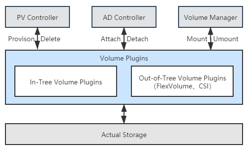
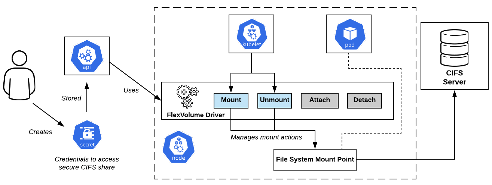
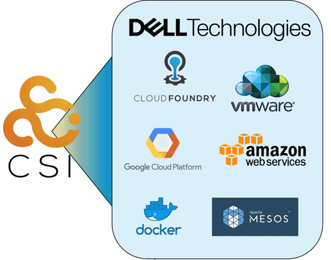
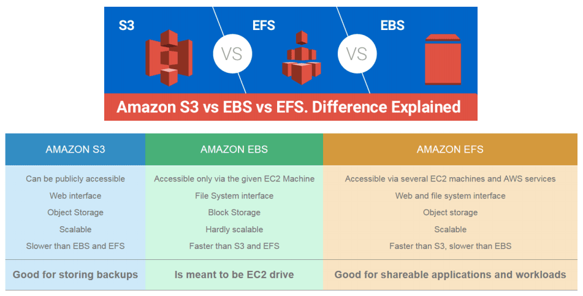

# 容器存储与生态

容器存储具有很强的多样性，如何对接后端实际的存储系统，并且完全发挥出它所有的性能与功能并不是Kubernetes团队所擅长的，这件事情只有存储提供商自己才能做到最好。由此可以理解容器编排系统为何会有很强烈的意愿想把存储功能独立到外部去实现，在前面的讲解中，笔者已经反复提到过多次In-Tree、Out-of-Tree插件，在这节里，就会以它们为线索来一睹Kubernetes的容器存储生态。

## Kubernetes存储架构

在介绍Kubernetes的In-Tree、Out-of-Tree存储插件以前，我们有必要先去了解下Kubernetes的存储架构，大体上弄清一个真实的存储系统是如何接入到新创建的Pod中，成为可以读写访问的Volume的；以及当Pod被销毁时，Volume如何被回收到存储系统之中的。Kubernetes参考了传统操作系统接入或移除新存储设备做法，把这件事情分解为以下三个操作：

- 首先，决定应**准备**（Provision）何种存储，Provision可类比为给操作系统扩容而购买了新的存储设备。这步确定了接入存储的来源、容量、性能以及其他技术参数，它的逆操作是**移除**（Delete）存储。
- 然后，将准备好的存储**附加**（Attach）到系统中，Attach可类比为将存储设备接入操作系统，此时尽管设备还不能使用，但你已经可以用操作系统的`fdisk -l`命令查看到设备。这步确定了存储的设备名称、驱动方式等面向系统一侧的信息，它的逆操作是**分离**（Detach）存储设备。
- 最后，将附加好的存储**挂载**（Mount）到系统中，Mount可类比为将设备挂载到系统的指定位置，也就是操作系统中`mount`命令的作用。这步确定了存储的访问目录、文件系统格式等面向应用一侧的信息，它的逆操作是**卸载**（Unmount）存储设备。

以上提到的Provision、Delete、Attach、Detach、Mount、Unmount六种操作，其实际行为均是在存储插件中完成的，它们会分别被Kubernetes通过两个控制器及一个管理器来进行调用，这些控制器、管理器的作用分别是：

- **PV控制器**（PersistentVolume Controller）：“[以容器构建系统](/immutable-infrastructure/container/container-build-system.html#韧性与弹性)”一节中介绍过，Kubernetes里所有的控制器都遵循着相同的工作模式：让实际状态尽可能接近期望状态。PV控制器的期望状态有两个，分别是“所有未绑定的PersistentVolume都能处于可用状态”以及“所有处于等待状态的PersistentVolumeClaim都能配对到与之绑定的PersistentVolume”，它内部也有两个相对独立的核心逻辑（ClaimWorker和VolumeWorker）来分别跟踪这两种期望状态，可以简单地理解为PV控制器实现了PersistentVolume和PersistentVolumeClaim的生命周期管理职能，在这个过程中，会根据需要调用存储驱动插件的Provision/Delete操作。
- **AD控制器**（Attach/Detach Controller）：AD控制器的期望状态是“所有被调度到准备新创建Pod的节点，都附加好了要使用的存储；当Pod被销毁后，原本运行Pod的节点都分离了不再被使用的存储”，如果实际状态不符合该期望，会根据需要调用存储驱动插件的Attach/Detach操作。
- **Volume管理器**（Volume Manager）：Volume管理器实际上是kubelet的一部分，是kubelet中众多管理器的一个，它主要是用来支持本节点中Volume执行Attach/Detach/Mount/Unmount操作。你可能注意到这里也出现了Attach/Detach操作，它是历史原因导致的，由于最初的版本中并没有AD控制器，Attach/Detach的职责也在kubelet中完成。现在kubelet默认情况下已经不再会去Attach/Detach了，但有少量旧程序已经依赖了由kubelet来实现Attach/Detach的内部实现，所以kubelet不得不设计一个`--enable-controller-attach-detach`参数，如果将其设置为false的话就会回到旧的兼容模式上，由kubelet代替AD控制器来完成Attach/Detach。

:::center

Kubernetes存储架构
:::

后端的真实存储依次经过Provision、Attach、Mount操作之后，就形成了可以在容器中挂载的Volume，当容器销毁时，依次经过Unmount、Detach、Delete操作之后，Volume便能够被存储系统回收。对于某些存储来说，其中有一些操作是无效的，譬如NFS，实际使用并不需要Attach，此时将Attach实现为空操作即可。

## FlexVolume与CSI

Kubernetes目前同时支持[FlexVolume](https://github.com/kubernetes/community/blob/master/contributors/devel/sig-storage/flexvolume.md)与[CSI](https://github.com/container-storage-interface/spec/blob/master/spec.md)（Container Storage Interface）两套独立的存储扩展机制。FlexVolume是Kubernetes很早期版本（1.2版开始提供，1.8版达到GA状态）就开始支持的扩展机制，它是只针对Kubernetes的私有的存储扩展，目前已经处于冻结状态，不再发展新功能了。CSI则是从Kubernetes 1.9开始加入（1.13版本达到GA状态）的扩展机制，如同之前介绍过的CRI和CNI那样，CSI是公开的规范，任何容器运行时、容器编排引擎只要愿意支持，都可以使用CSI规范去扩展自己的存储能力，是目前Kubernetes重点发展的扩展机制。

由于是专门为Kubernetes量身订造的，所以FlexVolume的实现逻辑与刚刚介绍的Kubernetes存储架构高度一致。FlexVolume驱动其实就是一个实现了Attach、Detach、Mount、Unmount操作的可执行文件（甚至可能仅是个Shell脚本）而已，该可执行文件应该存放在集群每个节点的`/usr/libexec/kubernetes/kubelet-plugins/volume/exec`目录里，其工作过程也就是当AD控制器和Volume管理器需要进行Attach、Detach、Mount、Unmount操作时自动调用它的对应方法而已，如下图所示。

:::center

FlexVolume Driver工作过程（[图片来源](https://laptrinhx.com/kubernetes-volume-plugins-evolution-from-flexvolume-to-csi-2724482856/)）
:::

如果仅仅考虑支持最基本的Static Provisioning，那实现一个FlexVolume Driver确实是非常简单的。然而也是由于FlexVolume过于简单了，导致它应用起来有许多不便之处，譬如：

- FlexVolume并不是全功能的驱动：FlexVolume不包含Provision和Delete操作，也就无法直接用于Dynamic Provisioning，除非你愿意再单独编写一个External Provisioner。
- FlexVolume部署维护都相对繁琐：FlexVolume是独立于Kubernetes的可执行文件，当集群节点增加时，需要手工在新节点上部署FlexVolume Driver，有经验的系统管理员通常会专门编写一个DaemonSet来代替人工来完成这项任务。
- FlexVolume实现复杂交互也相对繁琐：FlexVolume的每一次操作，都是对插件可执行文件的一次独立调用，这种插件实现方式在各种操作需要相互通讯时很会别扭。譬如你希望在执行Mount操作的时候，生成一些额外的状态信息，这些信息在后面执行Unmount操作时去使用，那就只能把信息记录在某个约定好的临时文件中，这样的做法实在是过于简陋了。

相比起FlexVolume的种种不足，CSI可算是一个十分完善的存储扩展规范，这里“十分完善”不是客套话，根据GitHub的自动代码行统计，FlexVolume的规范文档仅有155行，而CSI则长达2704行。总体上看，CSI规范可以分为需要容器系统去实现的组件以及需要存储提供商去实现的组件两大部分。前者包括了存储整体架构、Volume的生命周期模型、驱动注册、Volume创建、挂载、扩容、快照、度量等内容，这些Kubernetes都已经完整地实现了，大致上包括以下几个组件：

- [Driver Register](https://github.com/kubernetes-csi/driver-registrar)：负责注册第三方插件，CSI 0.3版本之后已经处于Deprecated状态，将会被[Node Driver Register](https://kubernetes-csi.github.io/docs/node-driver-registrar.html)所取代。
- [External Provisioner](https://github.com/kubernetes-csi/external-provisioner)：调用第三方插件的接口来完成数据卷的创建与删除功能。
- [External Attacher](https://github.com/kubernetes-csi/external-attacher)：调用第三方插件的接口来完成数据卷的挂载和操作。
- [External Resizer](https://github.com/kubernetes-csi/external-resizer)：调用第三方插件的接口来完成数据卷的扩容操作。
- [External Snapshotter](https://github.com/kubernetes-csi/external-snapshotter)：调用第三方插件的接口来完成快照的创建和删除。
- [External Health Monitor](https://github.com/kubernetes-csi/external-health-monitor)：调用第三方插件的接口来提供度量监控数据。

后者才是CSI的主体部分，即上面反复提到的“第三方插件”。这部分着重定义了外部存储挂载到容器过程中所涉及操作的抽象接口及其通讯方式，主要是以下三个gRPC接口：

- **CSI Identity接口**：用于描述插件的基本信息，譬如插件版本号、插件所支持的CSI规范版本、插件是否支持存储卷创建、删除功能、是否支持存储卷挂载功能，等等。此外Identity接口还用于检查插件的健康状态，开发者可以通过实现Probe接口对外提供存储的健康状况信息。
- **CSI Controller接口**：用于从存储系统的角度对存储资源进行管理，譬如准备和移除存储（Provision、Delete操作）、附加与分离存储（Attach、Detach操作）、对存储进行快照，等等。并不一定要实现所有的方法，对于存储本身就不支持的功能，可以在CSI Identity接口中声明。
- **CSI Node接口**：用于从集群节点的角度对存储资源进行操作，譬如存储卷的分区和格式化、将存储卷挂载到指定目录上、或者将存储卷从指定目录上卸载，等等。

:::center

CSI组件架构（[图片来源](https://medium.com/google-cloud/understanding-the-container-storage-interface-csi-ddbeb966a3b)）
:::

与FlexVolume以单独可执行程序的存在形式不同，CSI插件本身便是标准的Kubernetes工作负载，CSI Controller接口是一个以StatefulSet方式部署的gRPC服务器，CSI Node接口则是基于DaemonSet方式部署的gRPC服务器。这意味着虽然CSI实现起来比FlexVolume复杂，但是却很容易安装——如同安装CNI插件及其它应用那样，直接载入Manifest文件即可。也不会遇到FlexVolume那样需要人工运维，或者自己编写DaemonSet来维护集群节点变更的问题。此外，通过gRPC协议传递参数比通过命令行参数传递参数更加严谨，灵活和可靠，最起码不会出现多个接口之间协作只能写临时文件这样的尴尬状况。

## 容器插件生态

现在几乎所有云计算厂商都支持自家的容器通过CSI规范去接入外部存储，能够应用于CSI与FlexVolume的存储更是多达数十上百种，其中部分如下图所示，已经算是形成了初步的生态环境。篇幅原因，笔者不打算去谈论各种CSI存储插件的细节，这节会采取与CNI网络插件类似的讲述方式，以存储类型为主线，介绍其中有代表性的实现。

:::center

部分容器存储提供商（[图片来源](https://blog.dellemc.com/en-us/kubernetes-data-protection-hits-mainstream-with-container-storage-interface-csi-117/)）
:::

目前出现过的存储系统和设备均可以划分到块存储、文件存储和对象存储这三种存储类型之中，划分的根本依据其实并非各种存储是如何储存数据的，那完全是存储系统私有的事情。真正的依据是各种存储提供何种形式的接口供外部访问数据，不同的外部访问接口将直接影响到存储的内部结构、性能与功能表现。虽然块存储、文件存储和对象存储可以彼此协同工作，但它们各自都有自己明确的擅长领域与优缺点，理解其基本原理，因地制宜地选择最适合的存储才能让系统达到最佳的工作状态。笔者按照它们出现的时间顺序分别介绍如下：

- **块存储**：块存储是数据存储的最古老形式，数据都储存在固定长度的一个或多个[块](https://en.wikipedia.org/wiki/Block_(data_storage))（Block）中，想要读写访问数据，就应该使用与存储相匹配的协议（SCSI、SATA、SAS、FCP、FCoE、iSCSI……）来进行的。如果你是按顺序阅读本章内容的话，那笔者建议你对比上一节网络通讯中[网络栈](/immutable-infrastructure/network/linux-vnet.html#网络通讯模型)的数据流动过程，把存储设备中由块构成的信息流与网络设备中由数据包构成的信息流进行类比，事实上，像iSCSI这种协议真的就是建设在传统的TCP/IP网络之上，上层以SCSI作为应用层协议对外提供服务的。

  我们熟悉的硬盘就是最经典的块存储设备，以机械硬盘为例，一个块就是一个扇区，大小通常在512 Bytes至4096 Bytes之间。老式机械硬盘用[柱面-磁头-扇区号](https://en.wikipedia.org/wiki/Cylinder-head-sector)（Cylinder-Head-Sector，CHS）组成的编号进行寻址，现代机械硬盘用一个[逻辑块编号](https://en.wikipedia.org/wiki/Logical_block_addressing)（Logical Block Addressing，LBA）进行寻址。为了便于管理，硬盘通常会以多个块（这些块甚至可以来自不同的物理设备，譬如磁盘阵列的情况）来组成一个逻辑分区（Partition），将分区进行[高级格式化](https://en.wikipedia.org/wiki/Disk_formatting#High-level_formatting)之后就形成了卷（Volume），这便与上节“[Kubernetes存储设计](/immutable-infrastructure/storage/storage-evolution.html)”中提到“Volume是源于操作系统的概念”衔接了起来。

  块存储由于贴近底层硬件，没有文件、目录、访问权限等的牵绊，所以性能通常都是最优秀的，吞吐量高，时延低。尽管人类作为信息系统的最终用户，并不会直接面对块来操作数据，多数应用程序也是基于文件而不是块来读写数据的，但是操作系统内核中许多地方就直接通过[块设备](https://en.wikipedia.org/wiki/Device_file#BLOCKDEV)（Block Device）接口来访问硬盘，一些追求I/O性能的软件，譬如高性能的数据库也会支持直接读写块设备以提升磁盘I/O。块存储的主要缺点排它性，一旦块设备被某个客户端挂载后，其它客户端就无法再访问上面的数据了，因此，Kubernetes中挂载的块存储大多访问模式都要求必须是RWO（ReadWriteOnce）的。

- **文件存储**：文件存储是最贴近人类用户的数据存储形式，数据存储在长度不固定的文件之中，用户可以针对文件进行新增、写入、追加、移动、复制、删除、重命名等各种操作，通常文件存储还会提供有文件查找、目录管理、权限控制等额外的高级功能。文件存储的访问不像块存储那样有五花八门的协议，[POSIX](https://en.wikipedia.org/wiki/POSIX)接口（Portable Operating System Interface，POSIX）已经成为了事实标准，被各种商用的存储系统和操作系统共同支持。具体POSIX的文件操作接口笔者就不去举例了，你可以类比Linux下的各种文件管理命令来自行想象。

  绝大多数传统的文件存储都是基于块存储之上去实现的，“文件”这个概念的出现是因为“块”对人类用户来说实在是太难以使用、难以管理了。可以近似认为文件是由块所组成的更高级存储单位。对于固定不会发生变动的文件，直接让每个文件连续占用若干个块，在文件头尾加入标志区分即可，磁带、CD-ROM、DVD-ROM就采用了由连续块来构成文件的存储方案；但对于可能发生变动的场景，就必须支持跨多个不连续的块来构成为文件。这种需求在数据结构角度看只需在每个块中记录好下一个块的地址，形成链表结构即可满足。但是链表只能依次顺序访问，这样访问文件中任何内容都要从头读取多个块，显然过于低效了。典型的解决方案是把形成链表的指针整合起来统一存放，这便形成了文件分配表（File Allocation Table，FAT）。既然已经形成了专门组织块结构来构成文件的分配表，那在表中再加入其他信息，就能很方便地扩展出更多的高级功能，譬如除了文件占用的块地址信息外，加上文件的逻辑位置就形成了目录，加上文件的访问标志就形成了权限，还可以再加上文件的名称、创建时间、所有者、修改者，等一系列的元数据信息。人们把定义文件分配表应该如何实现、储存哪些信息、提供什么功能的标准称为[文件系统](https://en.wikipedia.org/wiki/File_system)（File System），FAT32、NTFS、exFAT、ext2/3/4、XFS、BTRFS等都是常见的文件系统。而前面提到的对分区进行高级格式化操作，实际上就是在初始化一套空白的文件系统，供后续用户与应用程序访问。

  文件存储相对于块存储来说是更高层次的存储类型，加入目录、权限等元素后形成的树状结构以及路径访问方式虽然方便人类理解、记忆和访问；文件系统能够提供哪个进程打开或正在读写某个文件的信息，这也有利于文件的共享。但在另一方面，计算机需要把路径进行分解，然后逐级向下查找，最后才能查找到需要的文件，要从文件分配表中确定具体数据存储的位置，要判断文件的访问权限，要记录每次修改文件的用户与时间，这些额外操作对于性能产生负面影响是无可避免的，因此，如果一个系统选择**不**采用文件存储的话，磁盘I/O性能往往是很重要的决定因素。

- **对象储存**：[对象存储](https://en.wikipedia.org/wiki/Object_storage)是最新的数据存储形式，是一种随着云数据中心的兴起而发展起来的存储，是以非结构化数据为目标的存储方案。这里的“对象”可以理解为一个元数据及其配对的一个逻辑数据块，元数据提供了对象所包含信息的上下文，譬如数据的类型、大小、权限、创建人、创建时间，等等。你可以简单地理解为数据和元数据这两样东西共同构成了一个对象。每个对象都有属于自己的全局唯一标识，这个标识会直接开放给最终用户使用，作为访问该对象的主要凭据，通常会是UUID的形式。对象存储的访问接口就是根据该唯一标识，对逻辑数据块进行的读写删除操作，通常接口都会比较简单，一般连修改操作都不会提供。

  对象存储基本上只会实现在分布式存储系统之上，由于它天生就有明确的“元数据”概念，不必依靠文件系统来提供数据的描述信息，因此，完全可以将一大批对象的元数据集中存放在某一台（组）服务器上，再辅以多台OSD（Object Storage Device）服务器来存储对象的数据部分。当外部要访问对象时，多台OSD能够同时对外发送数据，因此对象存储不仅易于共享、容量庞大，还能提供非常高的吞吐量。不过由于需要先经过元数据查询确定OSD存放对象的确切位置，该过程可能涉及多次网络传输，时延方面就会表现得相对较弱。
  
  由于对象的元数据仅描述对象本身的信息，与其他对象都没有关联，换而言之每个对象都是相对独立的，自然也就不存在目录的概念，可见对象存储应该是扁平化的（不过许多对象存储会提供Bucket的概念，用户可以把它作为“单层的目录”使用），与系统中很常见的K/V访问相类似。由于对象存储天生的分布式特性，以及极其低廉的扩展成本，使它很适合于[CDN](/architect-perspective/general-architecture/diversion-system/cdn.html)应用，拿来存放图片、音视频等媒体内容，以及网页、脚本等静态资源。

理解了三种存储类型的基本原理后，接下来又到了解决选择困难症的环节。主流的云计算厂商，譬如国内的阿里云、腾讯云、华为云都有自己专门的块存储、文件存储和对象存储服务，关于选择服务提供商的问题，笔者不作建议，你根据价格、合作关系、技术和品牌知名度等因素自行去处理。关于应该选择三种存储类型中哪一种的问题，笔者就以世界云计算市场占有率第一的亚马逊为例，简要对比介绍一下：

- 亚马逊的块存储服务是[Amazon Elastic Block Store](https://amazonaws-china.com/cn/ebs)（AWS EBS），你购买EBS之后，在EC2（亚马逊的云计算主机）中看见的是一块原始的、未格式化的块设备。这点就决定了EBS并不能做为一个独立存储而存在，它总是和EC2同时被创建的，EC2的操作系统也只能安装在EBS之上。EBS的大小理论上取决于建立的分区方案，即块大小乘以块数量。MBR分区的块数量是2^32^，块大小通常是512 Bytes，总容量2 TB；GPT分区的块数量是2^64^，块大小通常是4096 Bytes，总容量64 ZB（不会有操作系统支持这种离谱的容量，AWS也设置了上限是16 TB），实际上只取决于你的预算额度；EBS的性能取决于你选择的存储介质类型（SSD、HDD）还有优化类型（通用性、预置型、吞吐量优化、冷存储优化等）。

  EBS适合作为系统引导卷，适合追求磁盘I/O的大型工作负载以及追求低时延的应用，譬如Oracle等可以直接访问块设备的大型数据库更是尤其合适。但EBS只能被单个节点挂载，难以被共享，这在以前单机时代是天经地义的，但在云计算和分布式时代就成为了很致命的缺陷。除了少数特殊的工作负载外，笔者并不建议将它作为容器编排系统的主要外置存储去使用。

- 亚马逊的文件存储服务是[Amazon Elastic File System](https://amazonaws-china.com/cn/efs/)（AWS EFS），你购买EFS之后，只要在EFS控制台上创建好文件系统，并且管理好网络信息（譬如IP地址、子网）就可以直接使用。EFS本质是完全托管在云端的[网络文件系统](https://en.wikipedia.org/wiki/Network_File_System)（Network File System，NFS），可以在任何兼容POSIX的操作系统中直接挂载它，而不会在`/dev`中看到新设备存在。按照本节开头Kubernetes存储架构中的操作来说就是你只需要考虑Mount，无需考虑Attach了。

  得益于NFS的天然特性，EFS的扩缩可以是完全自动、实时的，创建新文件时无需预置存储，删除已有文件时也不必手动缩容以节省费用。在高性能网络的支持下，EFS的性能已经能够达到非常高的水平，尽管由于额外的网络访问，最高水平的EFS依然比不过最高水平的EBS，但已经能充分满足绝大多数应用运行的需要。还有最重要的一点是由于脱离了块设备的束缚，EFS能够轻易地被成百上千个EC2实例共享，考虑到EFS的性能、动态弹性、可共享这些因素，笔者给出的明确结论是它可以作为大部分容器工作负载的首选存储。

- 亚马逊的文件存储服务是[Amazon Simple Storage Service](https://amazonaws-china.com/cn/s3/)（AWS S3），S3通常是以REST Endpoint的形式对外部提供文件访问服务的，这种方式下你应该直接使用程序代码来访问S3，而不是靠操作系统或者容器编排系统去挂载它。如果你真的希望这样做，也可以通过存储网关（譬如[AWS Storage Gateway](https://amazonaws-china.com/cn/storagegateway)）将S3的存储能力转换为NFS、SMB、iSCSI等访问协议，经过转换后，操作系统或者容器就能够将其作为Volume来挂载了。

  S3也许是AWS最出名、使用面最广的存储服务，这个结果不是由于它的性能优异，是事实上S3的性能相对EBS和EFS来说是最差的，但如同它名字中“Simple”所标榜的简单，我们挂载外部存储的目的往往就是为了给程序提供存储服务，使用S3不用写一行代码就能够直接通过Web进行读写访问，且完全不需要考虑容量、维护和数据丢失的风险，这就是简单。S3的另一大优势就是它的价格相对于EBS和EFS来说往往要低一至两个数量级，因此程序的备份还原、数据归档、灾难恢复、静态页面的托管、多媒体分发等功能就非常适合使用S3来完成。

下图是截取自亚马逊销售材料中三种存储的对比，大概不会有什么存储方案能够包打天下。不同业务系统的场景需求不同，对存储的诉求会不同，选择自然会不同。

:::center

AWS的S3、EFS、EBS对比（图片来自AWS的[销售材料](https://blog.dellemc.com/en-us/kubernetes-data-protection-hits-mainstream-with-container-storage-interface-csi-117/)）
:::

