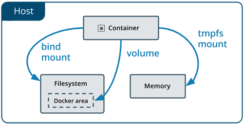
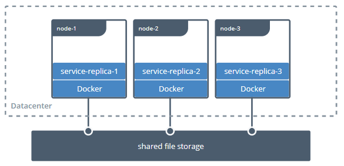
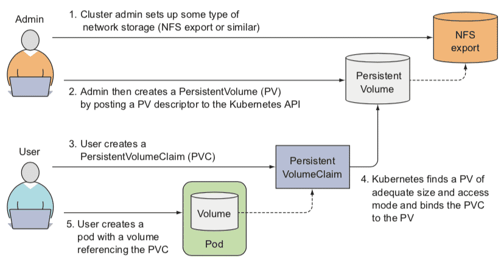

# Kubernetes 存储设计

Kubernetes 在规划持久化存储能力的时候，依然遵循着它的一贯设计哲学，用户负责以资源和声明式 API 来描述自己的意图，Kubernetes 负责根据用户意图来完成具体的操作。不过，就算仅仅是描述清楚用户的存储意图也并不是一件容易的事，相比起 Kubernetes 提供其他能力的资源，其内置的存储资源显得格外地复杂，甚至可以说是有些烦琐的。如果你是 Kubernetes 的拥趸，无法认同笔者对 Kubernetes 的批评，那不妨来看一看下列围绕着“Volume”所衍生出的概念，它们仅仅是 Kubernetes 存储相关的概念的一个子集而已，请你思考一下这些概念是否全都是必须的，是否还有整合的空间，是否有化繁为简的可能性：

> - **概念**：[Volume](https://kubernetes.io/docs/concepts/storage/volumes/)、[PersistentVolume](https://kubernetes.io/docs/concepts/storage/persistent-volumes/)、[PersistentVolumeClaim](https://v1-17.docs.kubernetes.io/docs/concepts/storage/persistent-volumes/#persistentvolumeclaims)、[Provisioner](https://kubernetes.io/docs/concepts/storage/dynamic-provisioning/)、[StorageClass](https://v1-17.docs.kubernetes.io/docs/concepts/storage/storage-classes/)、[Volume Snapshot](https://v1-17.docs.kubernetes.io/docs/concepts/storage/volume-snapshots/)、[Volume Snapshot Class](https://v1-17.docs.kubernetes.io/docs/concepts/storage/volume-snapshot-classes/)、[Ephemeral Volumes](https://kubernetes.io/docs/concepts/storage/ephemeral-volumes/)、[FlexVolume Driver](https://github.com/kubernetes/community/blob/master/contributors/devel/sig-storage/flexvolume.md)、[Container Storage Interface](https://github.com/container-storage-interface/spec/blob/master/spec.md)、[CSI Volume Cloning](https://v1-17.docs.kubernetes.io/docs/concepts/storage/volume-pvc-datasource/)、[Volume Limits](https://v1-17.docs.kubernetes.io/docs/concepts/storage/storage-limits/)、[Volume Mode](https://kubernetes.io/docs/concepts/storage/persistent-volumes/#volume-mode)、[Access Modes](https://kubernetes.io/docs/concepts/storage/persistent-volumes/#volume-mode)、[Storage Capacity](https://kubernetes.io/docs/concepts/storage/storage-capacity/)……
> - **操作**：[Mount](https://kubernetes.io/docs/concepts/storage/persistent-volumes/#mount-options)、[Bind](https://kubernetes.io/docs/concepts/storage/persistent-volumes/#using)、[Use](https://kubernetes.io/docs/concepts/storage/persistent-volumes/#using)、[Provision](https://kubernetes.io/docs/concepts/storage/persistent-volumes/#provisioning)、[Claim](https://kubernetes.io/docs/concepts/storage/persistent-volumes/#claims-as-volumes)、[Reclaim](https://kubernetes.io/docs/concepts/storage/persistent-volumes/#reclaiming)、[Reserve](https://kubernetes.io/docs/concepts/storage/persistent-volumes/#reserving-a-persistentvolume)、[Expand](https://kubernetes.io/docs/concepts/storage/persistent-volumes/#expanding-persistent-volumes-claims)、[Clone](https://kubernetes.io/docs/concepts/storage/volume-pvc-datasource/#usage)、[Schedule](https://kubernetes.io/docs/concepts/storage/storage-capacity/#scheduling)、[Reschedule](https://kubernetes.io/docs/concepts/storage/storage-capacity/#rescheduling)……

诚然，Kubernetes 摆弄出如此多关于存储的术语概念，最重要的原因是存储技术本来就门类众多，为了尽可能多地兼容各种存储，Kubernetes 不得不预置了很多 In-Tree（意思是在 Kubernetes 的代码树里）插件来对接，让用户根据自己业务按需选择。同时，为了兼容那些不在预置范围内的需求场景，支持用户使用 FlexVolume 或者 CSI 来定制 Out-of-Tree（意思是在 Kubernetes 的代码树之外）的插件，实现更加丰富多样的存储能力。表 13-1 列出了部分 Kubernetes 目前提供的存储与扩展：

:::center
表 13-1：Kubernetes 目前提供的存储
:::

| Temp     | Ephemeral（Local）                                                      | Persistent（Network）                                                                                                                                                                    | Extension          |
| -------- | ----------------------------------------------------------------------- | ---------------------------------------------------------------------------------------------------------------------------------------------------------------------------------------- | ------------------ |
| EmptyDir | HostPath<br/>GitRepo<br/>Local<br/>Secret<br/>ConfigMap<br/>DownwardAPI | AWS Elastic Block Store<br/>GCE Persistent Disk<br/>Azure Data Disk<br/>Azure File Storage<br/>vSphere<br/>CephFS and RBD<br/>GlusterFS<br/>iSCSI<br/>Cinder<br/>Dell EMC ScaleIO<br/>…… | FlexVolume<br/>CSI |

迫使 Kubernetes 存储设计成如此复杂，还有另外一个非技术层面的原因：Kubernetes 是一个工业级的、面向生产应用的容器编排系统，这意味着即使发现某些已存在的功能有更好的实现方式，直到旧版本被淘汰出生产环境以前，原本已支持的功能都不允许突然间被移除或者替换掉，否则，如果生产系统一更新版本，已有的功能就出现异常，那对产品累积良好的信誉是相当不利的。

为了兼容而导致的烦琐，在一定程度上可以被谅解，但这样的设计的确令 Kubernetes 的学习曲线变得更加陡峭。Kubernetes 官方文档的主要作用是参考手册，它并不会告诉你 Kubernetes 中各种概念的演化历程、版本发布新功能的时间线、改动的缘由与背景等信息。Kubernetes 的文档系统只会以“平坦”的方式来陈述所有目前可用的功能，这有利于熟练的管理员快速查询到关键信息，却不利于初学者去理解 Kubernetes 的设计思想，由于难以理解那些概念和操作的本意，往往只能死记硬背，也很难分辨出它们应该如何被“更正确”的使用。介绍 Kubernetes 设计理念的职责，只能由[Kubernetes 官方的 Blog](https://kubernetes.io/blog/)这类定位超越了帮助手册的信息渠道，或者其他非官方资料去完成。本节，笔者会以 Volume 概念从操作系统到 Docker，再到 Kubernetes 的演进历程为主线，去梳理前面提及的那些概念与操作，以此帮助大家理解 Kubernetes 的存储设计。

## Mount 和 Volume

Mount 和 Volume 都是来源自操作系统的常用术语，Mount 是动词，表示将某个外部存储挂载到系统中，Volume 是名词，表示物理存储的逻辑抽象，目的是为物理存储提供有弹性的分割方式。容器源于对操作系统层的虚拟化，为了满足容器内生成数据的外部存储需求，也很自然地会将 Mount 和 Volume 的概念延拓至容器中。我们去了解容器存储的发展，不妨就以 Docker 的 Mount 操作为起始点。

目前，Docker 内建支持了三种挂载类型，分别是 Bind（`--mount type=bind`）、Volume（`--mount type=volume`）和 tmpfs（`--mount type=tmpfs`），如图 13-1 所示。其中 tmpfs 用于在内存中读写临时数据，与本节主要讨论的对象持久化存储并不相符，所以后面我们只着重关注 Bind 和 Volume 两种挂载类型。

:::center

图 13-1 Docker 的三种挂载类型（图片来自[Docker 官网文档](https://docs.docker.com/storage/)）
:::

Bind Mount 是 Docker 最早提供的（发布时就支持）挂载类型，作用是把宿主机的某个目录（或文件）挂载到容器的指定目录（或文件）下，譬如以下命令中参数`-v`表达的意思就是将外部的 HTML 文档挂到 Nginx 容器的默认网站根目录下：

```bash
docker run -v /icyfenix/html:/usr/share/nginx/html nginx:latest
```

请注意，虽然命令中`-v`参数是`--volume`的缩写，但`-v`最初只是用来创建 Bind Mount 而不是创建 Volume Mount 的，这种迷惑的行为也并非 Docker 的本意，只是由于 Docker 刚发布时考虑得不够周全，随随便便就在参数中占用了“Volume”这个词，到后来真的需要扩展 Volume 的概念来支持 Volume Mount 时，前面的`-v`已经被用户广泛使用了，所以也就只得如此将就着继续用。从 Docker 17.06 版本开始，它在 Docker Swarm 中借用了`--mount`参数过来，这个参数默认创建的是 Volume Mount，可以通过明确的 type 子参数来指定另外两种挂载类型。上面命令可以等价于`--mount`版本如下形式：

```bash
docker run --mount type=bind,source=/icyfenix/html,destination=/usr/share/nginx/html nginx:latest
```

从 Bind Mount 到 Volume Mount，实质是容器发展过程中对存储抽象能力提升的外在表现。从“Bind”这个名字，以及 Bind Mount 的实际功能可以合理地推测，Docker 最初认为“Volume”就只是一种“外部宿主机的磁盘存储到内部容器存储的映射关系”，但后来眉头一皱发现事情并没有那么简单：存储的位置并不局限只在外部宿主机、存储的介质并不局限只是物理磁盘、存储的管理也并不局限只有映射关系。

譬如，Bind Mount 只能让容器与本地宿主机之间建立了某个目录的映射，如果想要在不同宿主机上的容器共享同一份存储，就必须先把共享存储挂载到每一台宿主机操作系统的某个目录下，然后才能逐个挂载到容器内使用，这种跨宿主机共享存储的场景如图 13-2 所示。

:::center

图 13-2 跨主机的共享存储需求（图片来自[Docker 官网文档](https://docs.docker.com/storage/volumes/)）
:::

这种存储范围超越了宿主机的共享存储，配置过程却要涉及到大量与宿主机环境相关的操作，只能由管理员人工去完成，不仅烦琐，而且每台宿主机环境的差异导致还很难自动化。

又譬如即便只考虑单台宿主机的情况，基于可管理性的需求，Docker 也完全有支持 Volume Mount 的必要。Bind Mount 的设计里，Docker 只有容器的控制权，存放容器生产数据的主机目录是完全独立的，与 Docker 没有任何关系，既不受 Docker 保护，也不受 Docker 管理。数据很容易被其他进程访问到，甚至是被修改和删除。如果用户想对挂载的目录进行备份、迁移等管理运维操作，也只能在 Docker 之外靠管理员人工进行，这都增加了数据安全与操作意外的风险。因此，Docker 希望能有一种抽象的资源来代表在宿主机或网络中存储的区域，以便让 Docker 能管理这些资源，由此就很自然地联想到了操作系统里 Volume 的概念。

最后，提出 Volume 最核心的一个目的是为了提升 Docker 对不同存储介质的支撑能力，这同时也是为了减轻 Docker 本身的工作量。存储并不是仅有挂载在宿主机上的物理存储这一种介质，云计算时代，网络存储渐成数据中心的主流选择，不同的网络存储有各自的协议和交互接口，而且并非所有存储系统都适合先挂载到操作系统，然后再挂载到容器的，如果 Docker 想要越过操作系统去支持挂载某种存储系统，首先必须要知道该如何访问它，然后才能将容器中的读写操作自动转移到该位置。Docker 把解决如何访问存储的功能模块称为存储驱动（Storage Driver）。通过`docker info`命令，你能查看到当前 Docker 所支持的存储驱动。虽然 Docker 已经内置了市面上主流的 OverlayFS 驱动，譬如 Overlay、Overlay2、AUFS、BTRFS、ZFS，等等，但面对云计算的快速迭代，仅靠 Docker 自己来支持全部云计算厂商的存储系统是完全不现实的，为此，Docker 提出了与 Storage Driver 相对应的 Volume Driver（卷驱动）的概念。用户可以通过`docker plugin install`命令安装[外部的卷驱动](https://docs.docker.com/engine/extend/legacy_plugins/)，并在创建 Volume 时指定一个与其存储系统相匹配的卷驱动，譬如希望数据存储在 AWS Elastic Block Store 上，就找一个 AWS EBS 的驱动，如果想存储在 Azure File Storage 上，也是找一个对应的 Azure File Storage 驱动即可。如果创建 Volume 时不指定卷驱动，那默认就是 local 类型，在 Volume 中存放的数据会存储在宿主机的`/var/lib/docker/volumes/`目录之中。

## 静态存储分配

现在我们把讨论主角转回容器编排系统上。Kubernetes 同样将操作系统和 Docker 的 Volume 概念延续了下来，并且对其进一步细化。Kubernetes 将 Volume 分为持久化的 PersistentVolume 和非持久化的普通 Volume 两类。为了不与前面定义的 Volume 这个概念产生混淆，后面特指 Kubernetes 中非持久化的 Volume 时，都会带着“普通”前缀。

普通 Volume 的设计目标不是为了持久地保存数据，而是为同一个 Pod 中多个容器提供可共享的存储资源，因此 Volume 具有十分明确的生命周期——与挂载它的 Pod 相同的生命周期，这意味着尽管普通 Volume 不具备持久化的存储能力，但至少比 Pod 中运行的任何容器的存活期都更长，Pod 中不同的容器能共享相同的普通 Volume，当容器重新启动时，普通 Volume 中的数据也会能够得到保留。当然，一旦整个 Pod 被销毁，普通 Volume 也将不复存在，数据在逻辑上也会被销毁掉，至于实质上会否会真正删除数据，就取决于存储驱动具体是如何实现 Unmount、Detach、Delete 接口的，由于本节的主题为“持久化存储”，所以无持久化能力的普通 Volume 就不再展开了。

从操作系统里传承下来的 Volume 概念，在 Docker 和 Kubernetes 中继续按照一致的逻辑延伸拓展，只不过 Kubernetes 为将其与普通 Volume 区别开来，专门取了 PersistentVolume 这个名字，你可以从从图 13-3 中直观地看出普通 Volume、PersistentVolume 和 Pod 之间的关系差异。

:::center

图 13-3 普通 Volume 与 PersistentVolume 的差别
:::

从“Persistent”这个单词就能顾名思义，PersistentVolume 是指能够将数据进行持久化存储的一种资源对象，它可以独立于 Pod 存在，生命周期与 Pod 无关，因此也决定了 PersistentVolume 不应该依附于任何一个宿主机节点，否则必然会对 Pod 调度产生干扰限制。前面表 13-1 中“Persistent”一列里看到的都是网络存储便是很好的印证。

::: quote 额外知识：Local PersistentVolume

对于部署在云端数据中心的系统，通过网络访问同一个可用区中的远程存储，速度是完全可以接受的。但对于私有部署的系统，基于性能考虑，使用本地存储往往会更为常见。

考虑到这样的实际需求，从 1.10 版起，Kubernetes 开始支持[Local PersistentVolume](https://kubernetes.io/blog/2019/04/04/kubernetes-1.14-local-persistent-volumes-ga/)，这是一种将一整块本地磁盘作为 PersistentVolume 供容器使用的专用方案。“专用方案”就是字面意思，它并不适用于全部应用，Local PersistentVolume 只是针对以磁盘 I/O 为瓶颈的特定场景的解决方案，副作用十分明显：由于不能保证这种本地磁盘在每个节点中都一定存在，所以 Kubernetes 在调度时就必须考虑到 PersistentVolume 分布情况，只能把使用了 Local PersistentVolume 的 Pod 调度到有这种 PersistentVolume 的节点上。调度器中专门有个[Volume Binding Mode](https://kubernetes.io/docs/concepts/storage/storage-classes/#volume-binding-mode)模式来支持这项处理，尽管如此，一旦使用了 Local PersistentVolume，无疑是会限制 Pod 的可调度范围。

:::

将 PersistentVolume 与 Pod 分离后，便需要专门考虑 PersistentVolume 该如何被 Pod 所引用的问题。原本在 Pod 中引用其他资源是常有的事，要么直接通过资源名称直接引用，要么通过[标签选择器](https://kubernetes.io/docs/concepts/overview/working-with-objects/labels/)（Selectors）间接引用。但是类似的方法在这里却都不太妥当，至于原因，请你想一下“Pod 该使用何种存储”这件事情，应该是系统管理员（运维人员）说的算，还是由用户（开发人员）说的算？最合理的答案是他们一起说的才算，因为只有开发能准确评估 Pod 运行需要消耗多大的存储空间，只有运维能清楚知道当前系统可以使用的存储设备状况，为了让他们得以各自提供自己擅长的信息，Kubernetes 又额外设计出了 PersistentVolumeClaim 资源。Kubernetes 官方给出的概念定义也特别强调了 PersistentVolume 是由管理员（运维人员）负责维护的，用户（开发人员）通过 PersistentVolumeClaim 来匹配到合乎需求的 PersistentVolume。

:::quote PersistentVolume & PersistentVolumeClaim

A PersistentVolume （PV） is a piece of storage in the cluster that has been provisioned **by an administrator**. <br/>A PersistentVolumeClaim （PVC） is a request for storage **by a user**.

PersistentVolume 是由管理员负责提供的集群存储。<br/>PersistentVolumeClaim 是由用户负责提供的存储请求。

::: right

—— Kubernetes Reference Documentation，[Persistent Volumes](https://jamesdefabia.github.io/docs/user-guide/persistent-volumes/)

:::

PersistentVolume 是 Volume 这个抽象概念的具象化表现，通俗地说就它是已经被管理员分配好的具体的存储，这里的“具体”是指有明确的存储系统地址，有明确的容量、访问模式、存储位置等信息；而 PersistentVolumeClaim 则是 Pod 对其所需存储能力的声明，通俗地说就是满足这个 Pod 正常运行要满足怎样的条件，譬如要消耗多大的存储空间、要支持怎样的访问方式。因此两者并不是谁引用谁的固定关系，而是根据实际情况动态匹配的，两者配合工作的具体过程如下。

1. 管理员准备好要使用的存储系统，它应是某种网络文件系统（NFS）或者云储存系统，一般来说应该具备跨主机共享的能力。
2. 管理员根据存储系统的实际情况，手工预先分配好若干个 PersistentVolume，并定义好每个 PersistentVolume 可以提供的具体能力。譬如以下例子所示：
   ```yaml
   apiVersion: v1
   kind: PersistentVolume
   metadata:
     name: nginx-html
   spec:
     capacity:
       storage: 5Gi                          # 最大容量为5GB
     accessModes:
       - ReadWriteOnce                       # 访问模式为RWO
     persistentVolumeReclaimPolicy: Retain	  # 回收策略是Retain
     nfs:                                    # 存储驱动是NFS
       path: /html
       server: 172.17.0.2
   ```
   以上 YAML 中定义的存储能力具体为：
   - 存储的最大容量是 5GB。
   - 存储的访问模式是“只能被一个节点读写挂载”（ReadWriteOnce，RWO），另外两种可选的访问模式是“可以被多个节点以只读方式挂载”（ReadOnlyMany，ROX）和“可以被多个节点读写挂载”（ReadWriteMany，RWX）。
   - 存储的回收策略是 Retain，即在 Pod 被销毁时并不会删除数据。另外两种可选的回收策略分别是 Recycle ，即在 Pod 被销毁时，由 Kubernetes 自动执行`rm -rf /volume/*`这样的命令来自动删除资料；以及 Delete，它让 Kubernetes 自动调用 AWS EBS、GCE PersistentDisk、OpenStack Cinder 这些云存储的删除指令。
   - 存储驱动是 NFS，其他常见的存储驱动还有 AWS EBS、GCE PD、iSCSI、RBD（Ceph Block Device）、GlusterFS、HostPath，等等。
3. 用户根据业务系统的实际情况，创建 PersistentVolumeClaim，声明 Pod 运行所需的存储能力。譬如以下例子所示：
   ```yaml
   kind: PersistentVolumeClaim
   apiVersion: v1
   metadata:
     name: nginx-html-claim
   spec:
     accessModes:
       - ReadWriteOnce    # 支持RWO访问模式
     resources:
       requests:
         storage: 5Gi     # 最小容量5GB
   ```
   以上 YAML 中声明了要求容量不得小于 5GB，必须支持 RWO 的访问模式。
4. Kubernetes 创建 Pod 的过程中，会根据系统中 PersistentVolume 与 PersistentVolumeClaim 的供需关系对两者进行撮合，如果系统中存在满足 PersistentVolumeClaim 声明中要求能力的 PersistentVolume 则撮合成功，将它们绑定。如果撮合不成功，Pod 就不会被继续创建，直至系统中出现新的或让出空闲的 PersistentVolume 资源。
5. 以上几步都顺利完成的话，意味着 Pod 的存储需求得到满足，继续 Pod 的创建过程，整个过程如图 13-4 所示。

:::center

图 13-4 PersistentVolumeClaim 与 PersistentVolume 运作过程（图片来自《[Kubernetes in Action](https://www.manning.com/books/kubernetes-in-action)》）
:::

Kubernetes 对 PersistentVolumeClaim 与 PersistentVolume 撮合的结果是产生一对一的绑定关系，“一对一”的意思是 PersistentVolume 一旦绑定在某个 PersistentVolumeClaim 上，直到释放以前都会被这个 PersistentVolumeClaim 所独占，不能再与其他 PersistentVolumeClaim 进行绑定。这意味着即使 PersistentVolumeClaim 申请的存储空间比 PersistentVolume 能够提供的要少，依然要求整个存储空间都为该 PersistentVolumeClaim 所用，这有可能会造成资源的浪费。譬如，某个 PersistentVolumeClaim 要求 3GB 的存储容量，当前 Kubernetes 手上只剩下一个 5GB 的 PersistentVolume 了，此时 Kubernetes 只好将这个 PersistentVolume 与申请资源的 PersistentVolumeClaim 进行绑定，平白浪费了 2GB 空间。假设后续有另一个 PersistentVolumeClaim 申请 2GB 的存储空间，那它也只能等待管理员分配新的 PersistentVolume，或者有其他 PersistentVolume 被回收之后才被能成功分配。

## 动态存储分配

对于中小规模的 Kubernetes 集群，PersistentVolume 已经能够满足有状态应用的存储需求，PersistentVolume 依靠人工介入来分配空间的设计算是简单直观，却算不上是先进，一旦应用规模增大，PersistentVolume 很难被自动化的问题就会突显出来。这是由于 Pod 创建过程中去挂载某个 Volume，要求该 Volume 必须是真实存在的，否则 Pod 启动可能依赖的数据（如一些配置、数据、外部资源等）都将无从读取。Kubernetes 有能力随着流量压力和硬件资源状况，自动扩缩 Pod 的数量，但是当 Kubernetes 自动扩展出一个新的 Pod 后，并没有办法让 Pod 去自动挂载一个还未被分配资源的 PersistentVolume。想解决这个问题，要么允许多个不同的 Pod 都共用相同的 PersistentVolumeClaim，这种方案确实只靠 PersistentVolume 就能解决，却损失了隔离性，难以通用；要么就要求每个 Pod 用到的 PersistentVolume 都是已经被预先建立并分配好的，这种方案靠管理员提前手工分配好大量的存储也可以实现，却损失了自动化能力。

无论哪种情况，都难以符合 Kubernetes 工业级编排系统的产品定位，对于大型集群，面对成百上千，乃至成千上万的 Pod，靠管理员手工分配存储肯定是捉襟见肘疲于应付的。在 2017 年 Kubernetes 发布 1.6 版本后，终于提供了今天被称为动态存储分配（Dynamic Provisioning）的解决方案，让系统管理员摆脱了人工分配的 PersistentVolume 的窘境，与之相对，人们把此前的分配方式称为静态存储分配（Static Provisioning）。

所谓的动态存储分配方案，是指在用户声明存储能力的需求时，不是期望通过 Kubernetes 撮合来获得一个管理员人工预置的 PersistentVolume，而是由特定的资源分配器（Provisioner）自动地在存储资源池或者云存储系统中分配符合用户存储需要的 PersistentVolume，然后挂载到 Pod 中使用，完成这项工作的资源被命名为 StorageClass，它的具体工作过程如下：

1. 管理员根据储系统的实际情况，先准备好对应的 Provisioner。Kubernetes 官方已经提供了一系列[预置的 In-Tree Provisioner](https://kubernetes.io/docs/concepts/storage/storage-classes/)，放置在`kubernetes.io`的 API 组之下。其中部分 Provisioner 已经有了官方的 CSI 驱动，譬如 vSphere 的 Kubernetes 自带驱动为`kubernetes.io/vsphere-volume`，VMware 的官方驱动为`csi.vsphere.vmware.com`。
2. 管理员不再是手工去分配 PersistentVolume，而是根据存储去配置 StorageClass。Pod 是可以动态扩缩的，而存储则是相对固定的，哪怕使用的是具有扩展能力的云存储，也会将它们视为存储容量、IOPS 等参数可变的固定存储来看待，譬如你可以将来自不同云存储提供商、不同性能、支持不同访问模式的存储配置为各种类型的 StorageClass，这也是它名字中“Class”（类型）的由来，譬如以下例子所示：
   ```yaml
   apiVersion: storage.k8s.io/v1
   kind: StorageClass
   metadata:
     name: standard
   provisioner: kubernetes.io/aws-ebs  #AWS EBS的Provisioner
   parameters:
     type: gp2
   reclaimPolicy: Retain
   ```
3. 用户依然通过 PersistentVolumeClaim 来声明所需的存储，但是应在声明中明确指出该由哪个 StorageClass 来代替 Kubernetes 处理该 PersistentVolumeClaim 的请求，譬如以下例子所示：
   ```yaml
   apiVersion: v1
   kind: PersistentVolumeClaim
   metadata:
     name: standard-claim
   spec:
     accessModes:
     - ReadWriteOnce
     storageClassName: standard  #明确指出该由哪个StorageClass来处理该PersistentVolumeClaim的请求
     resource:
       requests:
         storage: 5Gi
   ```
4. 如果 PersistentVolumeClaim 中要求的 StorageClass 及它用到的 Provisioner 均是可用的话，那这个 StorageClass 就会接管掉原本由 Kubernetes 撮合 PersistentVolume 与 PersistentVolumeClaim 的操作，按照 PersistentVolumeClaim 中声明的存储需求，自动产生出满足该需求的 PersistentVolume 描述信息，并发送给 Provisioner 处理。
5. Provisioner 接收到 StorageClass 发来的创建 PersistentVolume 请求后，会操作其背后存储系统去分配空间，如果分配成功，就生成并返回符合要求的 PersistentVolume 给 Pod 使用。
6. 以上几步都顺利完成的话，意味着 Pod 的存储需求得到满足，继续 Pod 的创建过程，整个过程如图 13-5 所示。

:::center

图 13-5 StorageClass 运作过程（图片来自《[Kubernetes in Action](https://www.manning.com/books/kubernetes-in-action)》）
:::

Dynamic Provisioning 与 Static Provisioning 并不是各有用途的互补设计，而是对同一个问题先后出现的两种解决方案。你完全可以只用 Dynamic Provisioning 来实现所有的 Static Provisioning 能够实现的存储需求，包括那些不需要动态分配的场景，甚至之前例子里使用 HostPath 在本地静态分配存储，都可以指定`no-provisioner`作为 Provisioner 的 StorageClass，以 Local Persistent Volume 来代替，譬如以下例子所示：

```yaml
apiVersion: storage.k8s.io/v1
kind: StorageClass
metadata:
  name: local-storage
provisioner: kubernetes.io/no-provisioner
volumeBindingMode: WaitForFirstConsumer
```

使用 Dynamic Provisioning 来分配存储无疑是更合理的设计，不仅省去了管理员的人工操作的中间层，也不再需要将 PersistentVolume 这样的概念暴露给最终用户，因为 Dynamic Provisioning 里的 PersistentVolume 只是处理过程的中间产物，用户不再需要接触和理解它，只需要知道由 PersistentVolumeClaim 去描述存储需求，由 StorageClass 去满足存储需求即可。只描述意图而不关心中间具体的处理过程是声明式编程的精髓，也是流程自动化的必要基础。

由 Dynamic Provisioning 来分配存储还能获得更高的可管理性，譬如前面提到的回收策略，当希望 PersistentVolume 跟随 Pod 一同被销毁时，以前经常会配置回收策略为 Recycle 来回收空间，即让系统自动执行`rm -rf /volume/*`命令，这种方式往往过于粗暴，遇到更精细的管理需求，譬如“删除到回收站”或者“敏感信息粉碎式彻底删除”这样的功能实现起来就很麻烦。而 Dynamic Provisioning 中由于有 Provisioner 的存在，如何创建、如何回收都是由 Provisioner 的代码所管理的，这就带来了更高的灵活性。现在 Kubernetes 官方已经明确建议废弃掉 Recycle 策略，如有这类需求就应改由 Dynamic Provisioning 去实现了。

Static Provisioning 的主要使用场景已局限于管理员能够手工管理存储的小型集群，它符合很多小型系统，尤其是私有化部署系统的现状，但并不符合当今运维自动化所提倡的思路。Static Provisioning 的存在，某种意义上也可以视为是对历史的一种兼容，在可见的将来，Kubernetes 肯定仍会把 Static Provisioning 作为用户分配存储的一种主要方案供用户选用。
