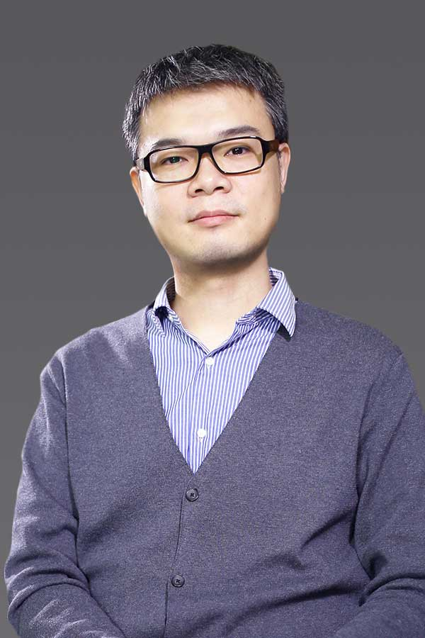
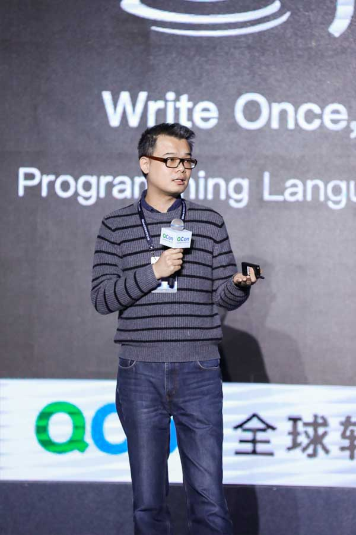

<h1>周志明 Felix</h1>

1983 年 | 微信号:icyfenix | <a href="icyfenix@gmail.com">icyfenix@gmail.com</a> 
企业数智化、AI、云原生基础设施、架构设计与技术团队管理、研究与影响力构建 
<a href="https://icyfenix.cn" target="_blank">https://icyfenix.cn</a> | <a href="https://ai.icyfenix.cn" target="_blank">https://ai.icyfenix.cn</a> | <a href="https://github.com/fenixsoft" target="_blank">https://github.com/fenixsoft</a>

## 个人总结

### 云原生与智能技术专家

- **大型企业系统研发、大型技术团队管理**
  - 作为产品线的负责人，主导可行性评估、技术选型、架构设计等工作。负责的产品已应用于国内的电子制造、电力能源等领域，为央国企管理着中国近五分之一的国有资产（2021年前）。
  - 作为总工程师（职级 22 级），深度参与了华为公司 [MetaERP](https://www.huawei.com/cn/news/2023/4/metaerp-press-release)、MetaCRM 等重要企业数字化变革项目（2021年后）。

- **主导企业数字化、智能化转型项目**
  - 作为系统设计 COE Leader，深度参与了华为 IPD-IT 流程建设项目，牵引 IPD 流程向智能化转型。
  - 作为华为 IT 软件开发方向最高级别的专家（任职 7 级）和任职资格组长，推动 AI 对软件架构设计、开发实现等方面的效能改进，制定 AI 技术赋能企业研发的策略。

- **扎实的技术功底**
  - 对 Java 技术体系有全面的认知，具有辽阔的视野和格局。撰写的《[深入理解 Java 虚拟机](https://book.douban.com/subject/34907497/)》目前是国内编程语言领域最具影响的书籍之一，重印 40 余次，销售码洋 3000 余万元。
  - 对编程与技术发自内心的热爱，从未脱离技术一线，年均 [GitHub](https://github.com/fenixsoft) 提交 500+，最高单项目 Star 数 10K+，个人 Followers 6K+。

- **云原生构设计能力**
  - 熟悉分布式的系统设计原理；熟悉 Monolithic、SOA、Microservices、ServiceMesh、Serverless 等架构风格；熟悉远程服务访问、缓存、安全架构、负载均衡、容错流控、分布式事务等技术实现；熟悉 Docker、Kubernetes、Istio 等基础设施的应用。
  - 获国内三大云计算厂商的最具价值技术专家认证：[阿里云最有价值技术专家（MVP）](https://mvp.aliyun.com/mvp/detail/487)、[腾讯云最有价值技术专家（TVP）](https://cloud.tencent.com/tvp/132)、[华为云最有价值技术专家（MVP）](https://developer.huaweicloud.com/mvp/member)。

### 研究员

- 机器学习方向博士，华为企业应用教研室主任，曾任远光软件研究院院长，澳科大-远光人工智能联合实验室主任。负责主持下一代新技术的探索和创新工作，同时负责公司与高校、科研院所合作项目的管理，拓展并维护国内外高校及学术团体的合作关系。
  - [澳门科技大学](https://www.must.edu.mo/) 博士学位，研究方向为机器学习自动化特征选择。发表 SCI、EI、核心期刊论文 9 篇，其中 SCI 一作 2 篇，并有国家发明专利 11 项。
  - [澳门科大-远光人工智能联合实验室](https://www.must.edu.mo/cn/fi/labs/research/ygsoft)主任，主持并完成粤港澳大湾区合作专项、产业核心和关键技术攻关项目以及央企科技项目共 13 项，参与国家 863 课题 1 项，2020 年获[广东省科技厅 100 万元科研经费资助](http://gdstc.gd.gov.cn/zwgk_n/tzgg/content/post_3094436.html)。
  - 负责外部技术资源整合，与清华大学、南方科技大学、西安交通大学、澳门科技大学等多所高校建有校企联合项目或联合实验室。

### 计算机作家

- 优秀的归纳总结和文字写作能力，十五年间出版了九部技术专著，撰写过两部开源文档，口碑和销量均得到业内认可，其中六本书在豆瓣上获得了 9.0 分或以上的评价。
  - 2026 年 《[设计机器学习应用系统](https://ai.icyfenix.cn)》（进行中）
  - 2025 年 《[智慧的疆界：从图灵机到人工智能（第二版）](https://book.douban.com/subject/37357392/)》（豆瓣 9.1）
  - 2021 年 《[凤凰架构：构建可靠的大型软件系统](https://icyfenix.cn/introduction/about-book.html)》（评分 9.4）
  - 2020 年 《[软件架构探索：The Fenix Project](https://icyfenix.cn/)》 （开源文档）
  - 2019 年 《[深入理解 Java 虚拟机：JVM 高级特性与最佳实践（第三版）](https://book.douban.com/subject/34907497/)》（评分 9.5）
  - 2018 年 《[智慧的疆界：从图灵机到人工智能](https://book.douban.com/subject/30379536/)》（评分 9.4）
  - 2016 年 《[深入理解 Java 虚拟机：JVM 高级特性与最佳实践（第二版）](https://book.douban.com/subject/24722612/)》（评分 9.1）
  - 2015 年 《[Java 虚拟机规范 （Java SE 8 中文版）](https://book.douban.com/subject/26418340/)》（评分 8.2）
  - 2014 年 《[Java 虚拟机规范 （Java SE 7 中文版）](https://book.douban.com/subject/25792515/)》（评分 9.0）
  - 2013 年 《[深入理解 OSGi：Equinox 原理、应用与最佳实践](https://book.douban.com/subject/21324330/)》（评分 7.7）
  - 2011 年 《[深入理解 Java 虚拟机：JVM 高级特性与最佳实践（第一版）](https://book.douban.com/subject/6522893/)》（评分 8.6）

### 开发布道师

- 优秀的演讲和表达能力，开发布道师、开源技术的积极倡导者、技术专栏撰稿人，善于沟通，乐于分享；作为组织者或主讲人，参与过多场线上直播、线下的 Workshop、Meetup、技术大会。
  - [QCon 全球软件开发大会主题明星讲师](https://qcon.infoq.cn/2020/shenzhen/)、[ArchSummit 全球架构师峰会主题演讲嘉宾](https://archsummit.infoq.cn/2021/shenzhen/presentation/4104)、[HuaweiConnect 华为全连接大会专题讲师](https://www.huawei.com/cn/events/huaweiconnect/agenda?type=%E4%B8%93%E9%A2%98%E6%BC%94%E8%AE%B2)
  - [Java 核心技术大会会议主席](https://ke.segmentfault.com/course/1650000041954414)、[极客时间布道师](https://time.geekbang.org/opencourse/intro/100064201)、[华章课程讲师](https://xie.infoq.cn/article/36ec9efa0697377af0d043b1e)
  - [IBM DeveloperWorks 撰稿人]()、[InfoQ.CN 专栏撰稿人](https://www.infoq.cn/profile/CD59DD20F93F11/publish)

## 工作经历

### 华为技术有限公司

2021 年 7 月  至今
总工程师（个人职级 22 级） - 企业应用总工办 - 质量与流程 IT 

华为技术有限公司是全球领先的信息与通信技术解决方案供应商，2020 年排名世界 500 强第 96 位。华为的产品和解决方案已经应用于全球 170 多个国家，服务全球运营商 50 强中的 45 家及全球 1/3 的人口。 

- 产品建设方面，作为华为企业应用总工程师、企业应用教研室主任，负责华为企业管理信息系统的架构与研发，是华为 MetaERP 和 MetaCRM 的主要设计者之一，分别参与到华为"采供制"与"营销服"两大领域的核心变革。在采购、供应、制造领域，以自研 MetaERP 系统代替 Oracle EBS，消除业务连续性风险。在营销、销售、服务领域，担任 MetaCRM 变革项目总体组组长，是该项目的发起人之一，主导了华为新一代营销服能力从立项到研发、落地的全过程。两个变革项目为华为的业务决策提供准确专业的支撑，联动了从销售到生产制造的部门深度协同。
- 能力建设方面，作为系统设计 COE Leader、IT 软件开发任职组长，推动华为传统的 IT 研发模式向 AI 转型，是华为 IPD-IT 流程改进项目的主要参与者之一。主导搭建以智能化为基础的研发体系，探索在 AI 场景下，企业产品的设计、实现、评估等过程的转型变革，并将技术创新转化为落地成果，最终固化为企业价值流和使能流。以此为目标，通过任职资格、赋能计划等手段，牵引企业研发人员向 AI 方向转型。

### 远光软件股份有限公司

2006 年 1 月 - 2021 年 7 月
技术负责人/研究院院长（汇报对象为公司总裁） - 远光研究院，DAP研发中心

远光软件是国家电网旗下七家上市企业之一（SZ:002063），国务院国资委为公司实际控制人，规模约 5000 名员工，主营业务为面向大型集团企业的管理信息系统。 
毕业进入公司后，曾担任过程序员、开发经理、研发部部门经理、设计部部门经理、平台部部门经理，产品线技术副总，兼任公司研究院院长。曾参与过多个国家级大型央企的信息化项目，负责研发过程中的管理和技术工作，并直接参与核心模块的开发和关键问题的解决。这些项目已累计为公司创造了逾百亿元收入，占全司历年总营收的 75% 以上，令集团企业信息化业务成为公司的核心业务。企业快速发展的同时，自身也在研发团队管理和技术研究方面积累了丰富的实践经验。

## 教育经历

- **理学博士**：澳门科技大学，计算机技术与应用，2017 年 9 月 - 2021 年 4 月。
- **工学硕士**：北京师范大学，软件工程，2006 年 9 月 - 2009 年 7 月。
- **工学学士**：北京师范大学，计算机科学与技术，2002 年 9 月 - 2006 年 7 月。

:::not-print
 
<swiper :autoPlay='false'  :showIndicator='true' >
<slide></slide>
<slide></slide>
<slide></slide>
<slide></slide>
</swiper>

:::
