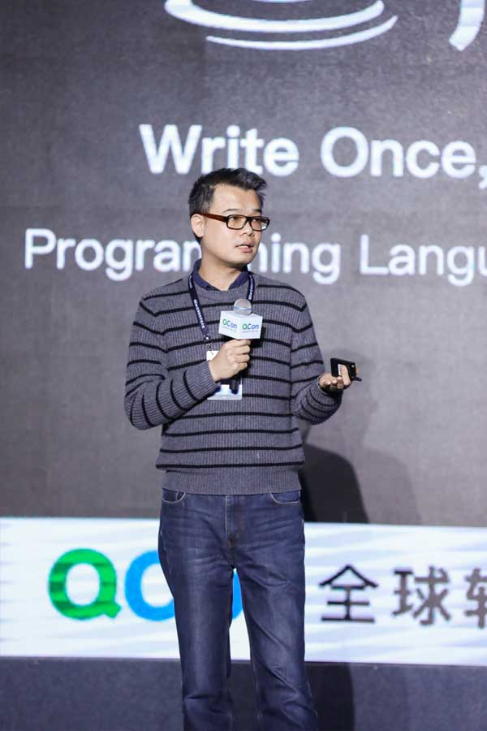

# 关于作者

<b>周志明</b>

Ph.D、Full Stack Programmer、Computer Book Writer、Technical Evangelist、Cloud Native Architect、Most Valuable Professional、HLLVM/PLDI Enthusiast

- 程序员 
  兼职一些管理与研究工作的程序员，工作中主要从事大型企业级软件的架构与研发；业余里对计算机科学相关的多个领域都有持续跟进。

- 研究员 理学博士，曾担任远光软件研究院院长，澳门科大-远光人工智能联合实验室主任，研究方向为机器学习自动化特征选择。

- 计算机技术作家 出版过八部计算机技术书籍，撰写过两部开源文档，口碑和销量均得到业内认可。其中五本书在[豆瓣](https://www.douban.com/)上获得了 9.0 分及以上的评价，“深入理解 Java 虚拟机”系列重印超过 45 次，销量逾 40 万册。
  - 2021 年 《[凤凰架构：构建可靠的大型分布式系统](https://icyfenix.cn/introduction/about-book.html)》（豆瓣 9.2）
  - 2020 年 《[软件架构探索：The Fenix Project](https://icyfenix.cn/)》 （开源文档）
  - 2019 年 《[深入理解 Java 虚拟机：JVM 高级特性与最佳实践（第三版）](https://book.douban.com/subject/34907497/)》（豆瓣 9.5）
  - 2018 年 《[智慧的疆界：从图灵机到人工智能](https://book.douban.com/subject/30379536/)》（豆瓣 9.1）
  - 2016 年 《[深入理解 Java 虚拟机：JVM 高级特性与最佳实践（第二版）](https://book.douban.com/subject/24722612/)》（豆瓣 9.0）
  - 2015 年 《[Java 虚拟机规范（Java SE 8 中文版）](https://book.douban.com/subject/26418340/)》（官方授权翻译，豆瓣 8.4）
  - 2014 年 《[Java 虚拟机规范（Java SE 7 中文版）](https://book.douban.com/subject/25792515/)》（官方授权翻译，豆瓣 9.0）
  - 2013 年 《[深入理解 OSGi：Equinox 原理、应用与最佳实践](https://book.douban.com/subject/21324330/)》（豆瓣 7.7）
  - 2011 年 《[深入理解 Java 虚拟机：JVM 高级特性与最佳实践（第一版）](https://book.douban.com/subject/6522893/)》（豆瓣 8.6）
  - 2011 年 《[Java 虚拟机规范（Java SE 7 中文版）](https://www.iteye.com/topic/1117824)》 （开源文档）

- 技术布道师 
  开源技术的积极倡导者和推动者，国内主流云计算厂商的最有价值技术专家，媒体撰稿人，会议讲师。
  - [阿里云最有价值技术专家（MVP）](https://mvp.aliyun.com/mvp/detail/487)
  - [腾讯云最有价值技术专家（TVP）](https://cloud.tencent.com/tvp/132)
  - [华为云最有价值技术专家（MVP）](https://developer.huaweicloud.com/mvp/member)
  - [IBM DeveloperWorks 撰稿人]()、[InfoQ.CN 专栏撰稿人](https://www.infoq.cn/profile/CD59DD20F93F11/publish)
  - [极客时间布道师](https://time.geekbang.org/opencourse/intro/100064201)、[华章 25 周年公益课程讲师](https://xie.infoq.cn/article/36ec9efa0697377af0d043b1e)
  - [QCon全球软件开发大会明星讲师](https://qcon.infoq.cn/2020/shenzhen/)、[ArchSummit全球架构师峰会主题演讲嘉宾](https://archsummit.infoq.cn/2021/shenzhen/presentation/4104)

 

:::not-print
<swiper :autoPlay='false'  :showIndicator='true' >
<slide></slide>
<slide></slide>
<slide></slide>
<slide></slide>
</swiper>
:::

:::tip 招聘&内推
  对大型软件架构、云原生、实时大数据、企业级软件研发感兴趣的同学，欢迎投简历至：felix.zhouzhiming[at]huawei[dot]com。 
  团队气氛、水平都很好，对标范围华为18-22级，正编非OD。
:::

