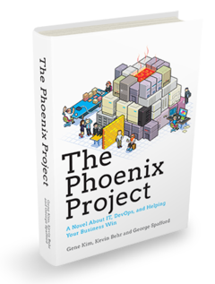

# 什么是“The Fenix Project”？

“Phoenix”这个词东方人不常用，但在西方的软件工程读物——尤其是关于Agile、DevOps话题的作品中时常出现。软件工程小说《[The Phoenix Project](https://book.douban.com/subject/20644908/)》讲述了徘徊在死亡边缘的Phoenix项目在精益方法下浴火重生的故事；马丁·福勒（Martin Fowler）对《[Continuous Delivery](https://book.douban.com/subject/4327796/)》的诠释里，曾多次提到“[Phoenix Server](https://martinfowler.com/bliki/PhoenixServer.html)”（取其能够“涅槃重生”之意）与“[Snowflake Server](https://martinfowler.com/bliki/SnowflakeServer.html)”（取其“世界上没有相同的两片雪花”之意）的互相比对。这大概是东西方的文化的差异，尽管有“失败是成功之母”这样的谚语，但我们东方人的骨子里更注重的还是一次把事做对做好，尽量别出乱子；而西方人则要“更看得开”一些，把出错看做正常甚至是必须的发展过程，只要出了问题能够兜底使其重回正轨便好。

图1 The Phoenix Project

只要时间足够长，人就总会疏忽犯错，代码就总会携有缺陷，电脑就总会宕机崩溃，网络就总会堵塞中断……如果一项工程需要大量的人员，共同去研发某个大规模的软件产品，并使其分布在网络中大量的服务器节点中同时运行，随着项目规模的增大、运作时间变长，其必然会受到*墨菲定律*的无情打击。

> Murphy's Law：Anything that can go wrong will go wrong

为了得到高质量的软件产品，我们是应该把精力更多地集中在提升其中每一个人员、过程、产出物的能力和质量上，还是该把更多精力放在整体流程和架构上？

首先，笔者给这个问题一个“合稀泥”式的回答：这两者都重要。前者重术，后者重道；前者更多与编码能力相关，后者更多与软件架构相关；前者主要由开发者个体水平决定，后者主要由技术决策者水平决定；

然后，笔者也必须强调另外一点：这两者的理解路径和抽象程度是不一样的。如何学习一项具体的语言、框架，工具，譬如Java、Spring、Vue.js……都是相对具象的，不论其蕴含的内容多少，复杂程度高低，它是至少能看得见摸得着。而如何学习某一种风格的架构方法，譬如单体、微服务、服务网格、无服务、云原生……则是相对抽象的，谈论它们可能要面临则“一百个人眼中有一百个哈姆雷特”的困境。谈这方面的话题，若要言之有物，就不能只陈述经验。笔者想来，回到这些架构根本的出发点和问题上，真正去使用这些不同风格的架构方法来实现某些共同的需求，然后在实践中观察它们的异同优劣，会是一种很好的，也许是最好的讲述方式。笔者想说一下这些架构，而且还想说得透彻明白，于是，便有了这个项目。

## 可靠的系统

我们再来思考一个问题，构建一个大规模但依然可靠的软件系统，是否是可行的？

这个问题令人听起来的第一感觉也许会有点荒谬：废话。如果这个事情从理论上来说就是根本不可能的话，那我们这些软件开发从业人员现在还在瞎忙活个啥？但你再仔细想想，前面才提到的“墨菲定律”和在“大规模”这个前提下一定会遇到的各种不靠谱的人员、代码、硬件、网络等因素，从中能得出的一个听起来颇为符合逻辑直觉的推论遍是：如果这某件事情要经过一个个“不靠谱”的过程，其误差应会不断地叠加，导致结果不可能收敛稳定才对。

其次，这个问题也并非杞人忧天庸人自扰式的瞎操心，计算机之父冯·诺依曼（John von Neumann）在1940年代末，曾经花费了大约两年时间，研究这个问题并且拿出了一门理论《自复制自动机》（Theory of Self-Reproducing Automata），这个理论以机器应该如何从基本的部件中构造出与自身相同的另一台机器引出，其目的并不是想模拟或者理解生物体的自我复制，也并不是简单想制造自我复制的计算机，他的最终目的就是想回答一个理论问题：如何用一些不可靠的部件来构造出一个可靠的系统。

图2 当年自复制机的艺术表示

自复制机恰好就是一个最好的用不可靠部件构造的可靠的系统例子。这里，“不可靠部件”可以理解为构成生命的大量细胞、甚至是分子。由于热力学扰动、生物复制差错等因素干扰，这些分子本身并不可靠。但是生命系统之所以可靠的本质，恰是因为它可以使用不可靠的部件来完成遗传迭代。这其中的关键便是承认细胞等这些零部件可能会出错，某个具体的零部件可能会崩溃消亡，但在存续生命的微生态系统中一定会有其后代的出现，重新代替该零部件的工作，以维持系统的整体稳定。在这个微生态里，每一个部件都可以看作一只不死鸟，它会老迈，而之后又能涅槃重生。

## 架构的趋势

软件架构风格从大型机（Mainframe），到多层单体架构（Monolithic），到微服务（Micro Services），到服务网格（Service Mesh），到无服务（Serverless），架构上确实有着从大到小的发展趋势。当近年来微服务兴起以后，便有各种文章去总结、赞美微服务带来的种种好处，譬如简化部署、逻辑拆分更清晰、便于技术异构、易于伸缩拓展应对更高的性能等等，这些当然都是重要优点和动力。可是，从宏观角度来看，上面这些都属于锦上添花的原因，未涉本质，架构演变最重要的驱动力，或者这种“从大到小”的最根本的驱动力，始终都是为了方便某个服务能够顺利地“死去”而设计的。

举个例子，譬如某企业中应用的单体架构的Java系统，其更新、升级都必须要有固定的停机计划，在特定的时间窗口内才能开始并按时结束软件更新。如果出现了非计划的宕机，那便是生产事故。但是软件Bug并不会遵循领导定下的更新计划来安排时间出错，为了应对变化，曾经搞出了OSGi和JVMTI Instrumentation等这样复杂的HotSwap方案，以实现给奔跑中的大巴更换轮胎这样的需求；而在微服务架构的视角下，不过只是在线更新程序而已，先停掉1/3的机器，升级新的软件版本，导流测试，有条不紊地做金丝雀发布，这是再正常不过的事情；而在无服务架构的视角下，甚至都不会去关心服务所运行的基础设施，停机升级什么的就根本无从谈起了。

流水不腐，有出错，有死亡，有重生，有更迭才是正常生态的运作规律。请想像一下吧，如果你得系统中每个部件都符合Phoenix的特性，哪怕其中某个部件是由不靠谱的人员所开发的不靠谱程序，譬如存有严重的内存泄漏问题，最多只能服务3分钟就会崩溃。但即便这样，由于架构上有了恰当的阻断错误、重建服务的机制，在系统外部看来，整体上仍然是能够表现得稳定、健壮的。

## The Fenix Project

在软件开发中，当一项新技术发布时，常有伴以该技术开发的”宠物店（PetStore）”作为演示的传统（[J2EE PetStore](https://www.oracle.com/technetwork/java/petstore1-3-1-02-139690.html)、[.NET PetStore](https://archive.codeplex.com/?p=petshopmvc)、[Spring PetClinic](https://github.com/spring-projects/spring-petclinic)等等）。作为不同架构风格的演示时，笔者也希望遵循此传统，但无奈从来没养过宠物，因此改行开了书店，里面出售了几本笔者撰写的书籍，算是夹带一点私货，也避免了使用素材时的版权问题。

尽管相信没有人会误解，但笔者还多强调一句，Oracle（Sun）、Microsoft、Pivotal等公司设计宠物店的目的绝不是为了在网上贩卖小猫小狗，而是为了技术演示。所以也请勿以“实现这种学生毕业设计复杂度的需求，引入这种设计/技术/框架，肯定是过度设计”的目光来看待接下来的“BookStore”项目。相反，如果可能的话，笔者会在有新的技术框架发布出来时，学习并以恰当的形式添加到项目的不同版本上去，希望把这些新的、不断发展的知识，融合进已有的知识框架之中。让自己学习、理解、思考，能够将这些技术连同自己的想法，传播给有需要的人。

最后，也算缘分，网名“IcyFenix”在我高中时代就开始使用，最初它是来源于暴雪RTS游戏星际争霸的Protoss英雄[Fenix](https://starcraft.fandom.com/wiki/Fenix)——如名字所预示的那样，他曾经是Zealot，牺牲后以Dragoon的形式重生，带领Protoss与刀锋女王Kerrigan继续抗争。尽管高中时期我已经笃定自己未来肯定会在IT行业工作，但显然不可能预计到未来我会写下这些文字。

所以，既然我们要开始一个关于“Phoenix”的代码与故事，那就叫它“The Fenix Project”如何？

