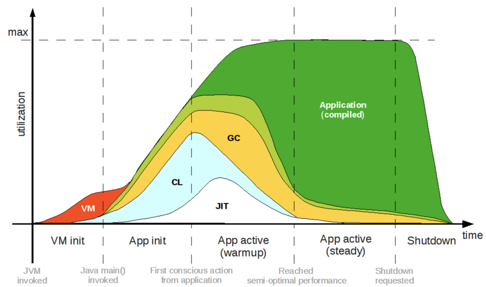
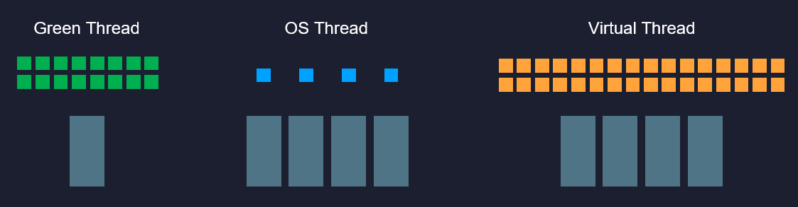

# QCon2020 主题演讲：云原生时代，Java 的危与机

:::tip 视频公开课

本节笔者有公开课介绍：[《QCon2020 主题演讲：云原生时代，Java 的危与机》](https://time.geekbang.org/opencourse/detail/100067401)

:::

今天，25 岁的 Java 仍然是最具有统治力的编程语言，长期占据编程语言排行榜的首位，拥有一千二百万的庞大开发者群体，全世界有四百五十亿部物理设备使用着 Java 技术，同时，在云端数据中心的虚拟化环境里，还运行着超过两百五十亿个 Java 虚拟机的进程实例 （[数据来自 Oracle 的 WebCast](https://go.oracle.com/LP=96777)）。

以上这些数据是 Java 过去 25 年巨大成就的功勋佐证，更是 Java 技术体系维持自己“天下第一”编程语言的坚实壁垒。Java 与其他语言竞争，底气从来不在于语法、类库有多么先进好用，而是来自它庞大的用户群和极其成熟的软件生态，这在朝夕之间难以撼动。然而，这个现在看起来仍然是坚不可摧的 Java 帝国，其统治地位的稳固程度不仅没有高枕无忧，说是危机四伏也不为过。目前已经有了可预见的、足以威胁动摇其根基的潜在可能性正在酝酿，正在随云原生时代而降临。

## Java 的危机

Java 与云原生的矛盾，来源于 Java 诞生之初，植入到它基因之中的一些基本的前提假设已经逐渐开始被动摇，甚至已经不再成立。

我举个例子，每一位 Java 的使用者都听说过“一次编写，到处运行”（Write Once, Run Anywhere）这句口号。20 多年前，Java 成熟之前，开发者如果希望程序能够在 Linux、Solaris、Windows 等不同平台，在 x86、AMD64、SPARC、MIPS、ARM 等不同指令集架构上都能正常运行，就必须针对每种组合，编译出对应的二进制发行包，或者索性直接分发源代码，由使用者在自己的平台上进行编译。

面对这个问题，Java 通过[语言层虚拟化](https://zh.wikipedia.org/wiki/%E8%99%9B%E6%93%AC%E5%8C%96#程式語言等級的虛擬化（Programming_Language_Level）)的方式，令每一个 Java 应用都自动取得平台无关（Platform Independent）、架构中立（Architecture Neutral）的先天优势，让同一套程序格式得以在不同指令集架构、不同操作系统环境下都能运行且得到一致的结果，不仅方便了程序的分发，还避免了各种平台下内存模型、线程模型、字节序等底层细节差异对程序编写的干扰。在当年，Java 的这种设计带有令人趋之若鹜的强大吸引力，直接开启了托管语言（Managed Language，如 Java、.NET）一段兴盛期。

面对相同的问题，今天的云原生选择以[操作系统层虚拟化](https://en.wikipedia.org/wiki/OS-level_virtualization)的方式，通过容器实现的不可变基础设施去解决。不可变基础设施这个概念出现得比云原生要早，原本是指该如何避免由于运维人员对服务器运行环境所做的持续的变更而导致的意想不到的副作用。但在云原生时代，它的内涵已不再局限于方便运维、程序升级和部署的手段，而是升华为一种向应用代码隐藏环境复杂性的手段，是分布式服务得以成为一种可普遍推广的普适架构风格的必要前提。

将程序连同它的运行环境一起封装到稳定的镜像里，现已是一种主流的应用程序分发方式。Docker 同样提出过“一次构建，到处运行”（Build Once, Run Anywhere）的口号，尽管它只能提供环境兼容性和有局限的平台无关性（指系统内核功能以上的 ABI 兼容），且完全不可能支撑架构中立性，所以将“一次构建，到处运行”与“一次编写，到处运行”对立起来并不严谨恰当，但是无可否认，今天 Java 技术“一次编译，到处运行”的优势，已经被容器大幅度地削弱，已不再是大多数服务端开发者技术选型的主要考虑因素了。

如果仅仅是优势的削弱，并不足以成为 Java 的直接威胁，充其量只是一个潜在的不利因素，但更加迫在眉睫的风险来自于那些与技术潮流直接冲突的假设。譬如，Java 总体上是面向大规模、长时间的服务端应用而设计的，严(luō)谨(suō)的语法利于约束所有人写出较一致的代码；静态类型动态链接的语言结构，利于多人协作开发，让软件触及更大规模；即时编译器、性能制导优化、垃圾收集子系统等 Java 最具代表性的技术特征，都是为了便于长时间运行的程序能享受到硬件规模发展的红利。

另一方面，在微服务的背景下，提倡服务围绕业务能力而非技术来构建应用，不再追求实现上的一致，一个系统由不同语言，不同技术框架所实现的服务来组成是完全合理的；服务化拆分后，很可能单个微服务不再需要再面对数十、数百 GB 乃至 TB 的内存；有了高可用的服务集群，也无须追求单个服务要 7×24 小时不可间断地运行，它们随时可以中断和更新。同时，微服务又对应用的容器化亲和性，譬如镜像体积、内存消耗、启动速度，以及达到最高性能的时间等方面提出了新的要求，在这两年的网红概念 Serverless 也进一步增加这些因素的考虑权重，而这些却正好都是 Java 的弱项：哪怕再小的 Java 程序也要带着完整的虚拟机和标准类库，使得镜像拉取和容器创建效率降低，进而使整个容器生命周期拉长。基于 Java 虚拟机的执行机制，使得任何 Java 的程序都会有固定的基础内存开销，以及固定的启动时间，而且 Java 生态中广泛采用的依赖注入进一步将启动时间拉长，使得容器的冷启动时间很难缩短。

软件工业中已经出现过不止一起因 Java 这些弱点而导致失败的案例，如 JRuby 编写的[Logstash](https://www.elastic.co/cn/logstash)，原本是同时承担部署在节点上的收集端（Shipper）和专门转换处理的服务端（Master）的职责，后来因为资源占用的原因，被[Elstaic.co](https://www.elastic.co/)用 Golang 的[Filebeat](https://www.elastic.co/cn/beats/filebeat)代替了 Shipper 部分的职能；又如 Scala 语言编写的边车代理[Linkerd](https://github.com/linkerd/linkerd)，作为服务网格概念的提出者，却最终被[Envoy](https://www.envoyproxy.io/)所取代，其主要弱点之一也是由于 Java 虚拟机的资源消耗所带来的劣势。

虽然在云原生时代依然有很多适合 Java 发挥的领域，但是具备弹性与韧性，随时可以中断重启的微型服务的确已经形成了一股潮流，在逐步蚕食大型系统的领地。正是由于潮流趋势的改变，新一代的语言与技术尤其重视轻量化和快速响应能力，大多又重新回归到了原生语言（Native Language，如 Golang、Rust）之上。

## Java 的变革

面对挑战，Java 的开发者和社区都没有退缩，它们在各自的领域给出了很多优秀的解决方案。涌现了如[Quarkus](https://quarkus.io/)、[Micronaut](https://micronaut.io/)、[Helidon](https://helidon.io/)等一大批以提升 Java 在云原生环境下的适应性为卖点的框架。不过，今天我们的主题将聚焦在由 Java 官方本身所推进的项目上，在围绕 Java 25 周年的研讨和布道活动中，官方的设定是以“面向未来的变革”（Innovating for the Future）为基调，你有可能在此之前已经听说过其中某个（某些）项目的名字和改进点，但这里我们不仅关心这些项目改进的是什么，还更关心它们背后的动机与困难，带来的收益，以及要付出的代价。

:::center

Innovating for the Future
:::

### Project Leyden

对于原生语言的挑战，最有力最彻底的反击手段无疑是将字节码直接编译成可以脱离 Java 虚拟机的原生代码。如果真的能够生成脱离 Java 虚拟机运行的原生程序，将意味着启动时间长的问题能够彻底解决，因为此时已经不存在初始化虚拟机和类加载的过程；也意味着程序马上就能达到最佳的性能，因为此时已经不存在即时编译器运行时编译，所有代码都是在编译期编译和优化好的（如下图所示）；没有了 Java 虚拟机、即时编译器这些额外的部件，也就意味着能够省去它们原本消耗的那部分内存资源与镜像体积。

:::center

Java Performance Matrices（[图片来源](https://itu.dk/people/thdy/teaching/pcpp2019/Week_3/lecture.pdf)）
:::

但同时，这也是风险系数最高，实现难度最大的方案。Java 并非没有尝试走过这条路，从 Java 2 之前的[GCJ](https://en.wikipedia.org/wiki/GNU_Compiler_for_Java)（GNU Compiler for Java），到后来的[Excelsior JET](https://en.wikipedia.org/wiki/Excelsior_JET)，再到 2018 年 Oracle Labs 启动的[GraalVM](https://www.graalvm.org/)中的[SubstrateVM](https://www.graalvm.org/reference-manual/native-image/SubstrateVM/)模块，最后到 2020 年中期刚建立的[Leyden 项目](https://mail.openjdk.java.net/pipermail/discuss/2020-April/005429.html)，都在朝着以[提前编译](https://en.wikipedia.org/wiki/Ahead-of-time_compilation)（Ahead-of-Time Compilation，AOT）生成原生程序这个目标迈进。

Java 支持提前编译最大的困难在于它是一门动态链接的语言，它假设程序的代码空间是开放的（Open World），允许在程序的任何时候通过类加载器去加载新的类，作为程序的一部分运行。要进行提前编译，就必须放弃这部分动态性，假设程序的代码空间是封闭的（Closed World），所有要运行的代码都必须在编译期全部可知。这一点不仅仅影响到了类加载器的正常运作，除了无法再动态加载外，反射（通过反射可以调用在编译期不可知的方法）、动态代理、字节码生成库（如 CGLib）等一切会运行时产生新代码的功能都不再可用，如果将这些基础能力直接抽离掉，Helloworld 还是能跑起来，但 Spring 肯定跑不起来，Hibernate 也跑不起来，大部分的生产力工具都跑不起来，整个 Java 生态中绝大多数上层建筑都会轰然崩塌。

要获得有实用价值的提前编译能力，只有依靠提前编译器、组件类库和开发者三方一起协同才有可能办到。由于 Leyden 刚刚开始，几乎没有公开的资料，所以下面我是以 SubstrateVM 为目标对象进行的介绍：

- 有一些功能，像反射这样的基础特性是不可能妥协的，折衷的解决办法是由用户在编译期，以配置文件或者编译器参数的形式，明确告知编译器程序代码中有哪些方法是只通过反射来访问的，编译器将方法添加到静态编译的范畴之中。同理，所有使用到动态代理也的地方，也必须在事先列明，在编译期就将动态代理的字节码全部生成出来。其他所有无法通过程序指针分析（Points-To Analysis）得到的信息，譬如程序中用到的资源、配置文件等等，也必须照此处理。
- 另一些功能，如动态生成字节码也十分常用，但用户自己也往往无法得知那些动态字节码的具体信息，就只能由用到 CGLib、javassist 等库的程序去妥协放弃。在 Java 世界中也许最典型的场景就是 Spring 用 CGLib 来进行类增强，默认情况下，每一个 Spring 管理的 Bean 都要用到 CGLib。从 Spring Framework 5.2 开始增加了`@proxyBeanMethods`注解来排除对 CGLib 的依赖，仅使用标准的动态代理去增强类。

2019 年起，Pivotal 的 Spring 团队与 Oracle Labs 的 GraalVM 团队共同孵化了 Spring GraalVM Native 项目，这个目前仍处于 Experimental / Alpha 状态的项目，能够让程序先以传统方式运行（启动）一次，自动化地找出程序中的反射、动态代理的代码，代替用户向编译器提供绝大部分所需的信息，并能将允许启动时初始化的 Bean 在编译期就完成初始化，直接绕过 Spring 程序启动最慢的阶段，这样从启动到程序可以提供服务，耗时竟能够低于 0.1 秒。

:::center

Spring Boot Startup Time（[数据来源](https://www.infoq.com/presentations/spring-boot-graalvm/)）
:::

以原生方式运行后，缩短启动时间的效果立竿见影，一般会有了数十倍甚至更高的改善，程序容量和内存消耗也有一定程度的下降。不过至少目前而言，程序的运行效率还是要弱于传统基于 Java 虚拟机的方式，虽然即时编译器有编译时间的压力，但由于可以进行基于假设的激进优化和运行时性能度量的制导优化，使得即时编译器的效果仍要优于提前编译器，这方面需要 GraalVM 编译器团队的进一步努力，也需要从语言改进上入手，让 Java 变得更适合被编译器优化。

### Project Valhalla

Java 语言上可感知的语法变化，多数来自于[Amber 项目](https://openjdk.java.net/projects/amber/)，它的项目目标是持续优化语言生产力，近期（JDK 15、16）会有很多来自这个项目的特性，如 Records、Sealed Class、Pattern Matching、Raw String Literals 等实装到生产环境。然而语法不仅与编码效率相关，与运行效率也有很大关系。“程序=代码+数据”这个提法至少在衡量运行效率上是合适的，无论是托管语言还是原生语言，最终产物都是处理器执行的指令流和内存存储的数据结构，Java、.NET、C、C++、Golang、Rust 等各种语言谁更快，取决于特定场景下，编译器生成指令流的优化效果，以及数据在内存中的结构布局。

Java 的即时编译器的优化效果拔群，但是由于 Java“一切皆为对象”的前提假设，导致在处理一系列不同类型的小对象时，内存访问性能非常拉垮，这点是 Java 在游戏、图形处理等领域一直难有建树的重要制约因素，也是 Java 建立[Valhalla 项目](https://wiki.openjdk.java.net/display/valhalla/Main)的目标初衷。这里举个例子来说明此问题，如果我想描述空间里面若干条线段的集合，在 Java 中定义的代码会是这样的：

```java
public record Point(float x, float y, float z) {}
public record Line(Point start, Point end) {}
Line[] lines;
```

面向对象的内存布局中，[对象标识符](<https://en.wikipedia.org/wiki/Identity_(object-oriented_programming)>)（Object Identity）存在的目的是为了允许在不暴露对象结构的前提下，依然可以引用其属性与行为，这是面向对象编程中多态性的基础。在 Java 中堆内存分配和回收、空值判断、引用比较、同步锁等一系列功能都会涉及到对象标识符，内存访问也是依靠对象标识符来进行链式处理的，譬如上面代码中的“若干条线段的集合”，在堆内存中将构成如下图的引用关系：

:::center

Object Identity / Memory Layout
:::

计算机硬件经过 25 年的发展，内存与处理器虽然都在进步，但是内存延迟与处理器执行性能之间的[冯诺依曼瓶颈](https://en.wikipedia.org/wiki/Von_Neumann_architecture#Von_Neumann_bottleneck)（Von Neumann Bottleneck）不仅没有缩减，反而还在持续加大，“[RAM Is the New Disk](https://medium.com/thought-frameworks/ram-is-the-new-disk-b94df9bbd7b)”已经从嘲讽梗逐渐成为了现实。一次内存访问（将主内存数据调入处理器 Cache）大约需要耗费数百个时钟周期，而大部分简单指令的执行只需要一个[时钟周期](https://en.wikipedia.org/wiki/Cycles_per_instruction)而已。因此，在程序执行性能这个问题上，如果编译器能减少一次内存访问，可能比优化掉几十、几百条其他指令都来得更有效果。

:::quote 额外知识：冯诺依曼瓶颈

不同处理器（现代处理器都集成了内存管理器，以前是在[北桥芯片](<https://en.wikipedia.org/wiki/Northbridge_(computing)>)中）的内存延迟大概是 40-80 纳秒（ns，十亿分之一秒），而根据不同的时钟频率，一个时钟周期大概在 0.2-0.4 纳秒之间，如此短暂的时间内，即使真空中传播的光，也仅仅能够行进 10 厘米左右。

数据存储与处理器执行的速度矛盾是冯诺依曼架构的主要局限性之一，1977 年的图灵奖得主[John Backus](https://en.wikipedia.org/wiki/John_Backus)提出了“冯诺依曼瓶颈”这个概念，专门用来描述这种局限性。

:::

编译器的确在努力减少内存访问，从 JDK 6 起，HotSpot 的即时编译器就尝试通过[逃逸分析](https://en.wikipedia.org/wiki/Escape_analysis)来做标量替换（Scalar Replacement）和栈上分配（Stack Allocations）优化，基本原理是如果能通过分析，得知一个对象不会传递到方法之外，那就不需要真实地在内存中创建完整的对象布局，完全可以绕过对象标识符，将它拆散为基本的原生数据类型来创建，甚至是直接在栈内存中分配空间（HotSpot 并没有这样做），方法执行完毕后随着栈帧一起销毁掉。

不过，逃逸分析是一种[过程间优化](https://en.wikipedia.org/wiki/Interprocedural_optimization)（Interprocedural Optimization），非常耗时，也很难处理那些理论有可能但实际不存在的情况。相同的问题在 C、C++中却并不存在，上面场景中，程序员只要将 Point 和 Line 都定义为 struct 即可，C#中也有 struct，是依靠.NET 的值类型（Value Type）来实现的，Valhalla 项目的核心改进就是提供类似的值类型支持，提供一个新的关键字（inline），让用户可以在不需要向方法外部暴露对象、不需要多态性支持、不需要将对象用作同步锁的场合中，将类标识为值类型，此时编译器就能够绕过对象标识符，以平坦的、紧凑的方式去为对象分配内存。

有了值类型的支持后，现在 Java 泛型中令人诟病的不支持原数据类型（Primitive Type）、频繁装箱问题也就随之迎刃而解，现在 Java 的包装类，理所当然地会以代表原生类型的值类型来重新定义，这样 Java 泛型的性能会得到明显的提升，因为此时 Integer 与 int 的访问，在机器层面看完全可以达到一致的效率。

### Project Loom

Java 语言抽象出来隐藏了各种操作系统线程差异性的统一线程接口，这曾经是它区别于其他编程语言（C/C++表示有被冒犯到）的一大优势，不过，统一的线程模型不见得永远都是正确的。Java 目前主流的线程模型是直接映射到操作系统内核上的[1:1 模型](<https://en.wikipedia.org/wiki/Thread_(computing)#1:1_(kernel-level_threading)>)，这对于计算密集型任务这很合适，既不用自己去做调度，也利于一条线程跑满整个处理器核心；但对于 I/O 密集型任务，譬如访问磁盘、访问数据库占主要时间的任务，这种模型就显得成本高昂，主要在于内存消耗和上下文切换上：64 位 Linux 上 HotSpot 的线程栈容量默认是 1MB，线程的内核元数据（Kernel Metadata）还要额外消耗 2-16KB 内存，所以单个虚拟机的最大线程数量一般只会设置到 200 至 400 条，当程序员把数以百万计的请求往线程池里面灌时，系统即便能处理得过来，其中的切换损耗也是相当可观的。

Loom 项目的目标是让 Java 支持额外的[N:M 线程模型](<https://en.wikipedia.org/wiki/Thread_(computing)#M:N_(hybrid_threading)>)，请注意是“额外支持”，而不是像当年从绿色线程过渡到内核线程那样的直接替换，也不是像 Solaris 平台的 HotSpot 虚拟机那样通过参数让用户二选其一。Loom 项目新增加一种“虚拟线程”（Virtual Thread，以前以 Fiber 为名进行宣传过，但因为要频繁解释啥是 Fiber 所以现在放弃了），本质上它是一种有栈协程（Stackful Coroutine），多条虚拟线程可以映射到同一条物理线程之中，在用户空间中自行调度，每条虚拟线程的栈容量也可由用户自行决定。

:::center

Virtual Thread
:::

同时，Loom 项目的另一个目标是要尽最大可能保持原有统一线程模型的交互方式，通俗地说就是原有的 Thread、J.U.C、NIO、Executor、Future、ForkJoinPool 等这些多线程工具都应该能以同样的方式支持新的虚拟线程，原来多线程中你理解的概念、编码习惯大多数都能够继续沿用。为此，虚拟线程将会与物理线程一样使用`java.lang.Thread`来进行抽象，只是在创建线程时用到的参数或者方法稍有不同（譬如给 Thread 增加一个`Thread.VIRTUAL_THREAD`参数，或者增加一个`startVirtualThread()`方法）。这样现有的多线程代码迁移到虚拟线程中的成本就会变得很低，而代价就是 Loom 的团队必须做更多的工作以保证虚拟线程在大部分涉及到多线程的标准 API 中都能够兼容，甚至在调试器上虚拟线程与物理线程看起来都会有一致的外观。但很难全部都支持，譬如调用 JNI 的本地栈帧就很难放到虚拟线程上，所以一旦遇到本地方法，虚拟线程就会被绑定（Pinned）到一条物理线程上。

Loom 的另一个重点改进是支持[结构化并发](https://en.wikipedia.org/wiki/Structured_concurrency)（Structured Concurrency），这是 2016 年才提出的新的并发编程概念，但很快就被诸多编程语言所吸纳。它是指程序的并发行为会与代码的结构对齐，譬如以下代码所示，按照传统的编程观念，如果没有额外的处理（譬如无中生有地弄一个 await 关键字），那在`task1`和`task2`提交之后，程序应该继续向下执行：

```java
ThreadFactory factory = Thread.builder().virtual().factory();
try (var executor = Executors.newThreadExecutor(factory)) {
   executor.submit(task1);
   executor.submit(task2);
} // blocks and waits
```

但是在结构化并发的支持下，只有两个并行启动的任务线程都结束之后，程序才会继续向下执行，很好地以同步的编码风格，来解决异步的执行问题，事实上，“Code like sync，Work like async”正是 Loom 简化并发编程的核心理念。

### Project Portola

Portola 项目的目标是将 OpenJDK 向 Alpine Linux 移植。Alpine Linux 是许多 Docker 容器首选的基础镜像，因为它只有 5 MB 大小，比起其他 Cent OS、Debain 等动辄一百多 MB 的发行版来说，更适合用于容器环境。不过 Alpine Linux 为了尽量瘦身，默认是用[musl](https://en.wikipedia.org/wiki/Musl)作为 C 标准库的，而非传统的[glibc](https://en.wikipedia.org/wiki/GNU_C_Library)（GNU C library），因此要以 Alpine Linux 为基础制作 OpenJDK 镜像，必须先安装 glibc，此时基础镜像大约有 12 MB。Portola 计划将 OpenJDK 的上游代码移植到 musl，并通过兼容性测试。使用 Portola 制作的标准 Java SE 13 镜像仅有 41 MB，不仅远低于 Cent OS 的 OpenJDK（大约 396 MB），也要比官方的 slim 版（约 200 MB）要小得多。

```bash
$ sudo docker build .
Sending build context to Docker daemon   2.56kB
Step 1/8 : FROM alpine:latest as build
latest: Pulling from library/alpine
bdf0201b3a05: Pull complete
Digest: sha256:28ef97b8686a0b5399129e9b763d5b7e5ff03576aa5580d6f4182a49c5fe1913
Status: Downloaded newer image for alpine:latest
 ---> cdf98d1859c1
Step 2/8 : ADD https://download.java.net/java/early_access/alpine/16/binaries/openjdk-13-ea+16_linux-x64-musl_bin.tar.gz /opt/jdk/
Downloading [==================================================>]  195.2MB/195.2MB
 ---> Using cache
 ---> b1a444e9dde9
Step 3/7 : RUN tar -xzvf /opt/jdk/openjdk-13-ea+16_linux-x64-musl_bin.tar.gz -C /opt/jdk/
 ---> Using cache
 ---> ce2721c75ea0
Step 4/7 : RUN ["/opt/jdk/jdk-13/bin/jlink", "--compress=2",      "--module-path", "/opt/jdk/jdk-13/jmods/",      "--add-modules", "java.base",      "--output", "/jlinked"]
 ---> Using cache
 ---> d7b2793ed509
Step 5/7 : FROM alpine:latest
 ---> cdf98d1859c1
Step 6/7 : COPY --from=build /jlinked /opt/jdk/
 ---> Using cache
 ---> 993fb106f2c2
Step 7/7 : CMD ["/opt/jdk/bin/java", "--version"] - to check JDK version
 ---> Running in 8e1658f5f84d
Removing intermediate container 8e1658f5f84d
 ---> 350dd3a72a7d
Successfully built 350dd3a72a7d

$ sudo docker tag 350dd3a72a7d jdk-13-musl/jdk-version:v1

$ sudo docker images
REPOSITORY                TAG                 IMAGE ID            CREATED              SIZE
jdk-13-musl/jdk-version   v1                  350dd3a72a7d        About a minute ago   41.7MB
alpine                    latest              cdf98d1859c1        2 weeks ago          5.53MB
```

## Java 的未来

云原生时代，Java 技术体系的许多前提假设都受到了挑战，“一次编译，到处运行”、“面向长时间大规模程序而设计”、“从开放的代码空间中动态加载”、“一切皆为对象”、“统一线程模型”，等等。技术发展迭代不会停歇，没有必要坚持什么“永恒的真理”，旧的原则被打破，只要合理，便是创新。

Java 语言意识到了挑战，也意识到了要面向未来而变革。文中提到的这些项目，Amber 和 Portola 已经明确会在 2021 年 3 月的 Java 16 中发布，至少也会达到 Feature Preview 的程度：

- [JEP 394](http://openjdk.java.net/jeps/394)：Pattern Matching for instanceof
- [JEP 395](http://openjdk.java.net/jeps/395)：Records
- [JEP 397](http://openjdk.java.net/jeps/397)：Sealed Classes
- [JEP 386](http://openjdk.java.net/jeps/386)：Alpine Linux Port

至于更受关注，同时也是难度更高的 Valhalla 和 Loom 项目，目前仍然没有明确的版本计划信息，尽管它们已经开发了数年时间，非常希望能够赶在 Java 17 这个 LTS 版本中面世，但前路还是困难重重。至于难度最高、创建时间最晚的 Leyden 项目，目前还完全处于特性讨论阶段，连个胚胎都算不上，对于 Java 的原生编译，我们中短期内只可能寄希望于 Oracle 的 GraalVM。

未来一段时间，是 Java 重要的转型窗口期，如果作为下一个 LTS 版的 Java 17，能够成功集 Amber、Portola、Valhalla、Loom 和 Panama（用于[外部函数接口](https://en.wikipedia.org/wiki/Foreign_function_interface)访问，本文没有提到）的新能力、新特性于一身，GraalVM 也能给予足够强力支持的话，那 Java 17 LTS 大概率会是一个里程碑式的版本，带领着整个 Java 生态从大规模服务端应用，向新的云原生时代软件系统转型，可能成为比肩当年从面向嵌入式设备与浏览器 Web Applets 的 Java 1，到确立现代 Java 语言方向（Java SE/EE/ME 和 JavaCard）雏形的 Java 2 转型那样的里程碑。但是，如果 Java 不能加速自己的发展步伐，那由强大生态所构建的护城河终究会消耗殆尽，被 Golang、Rust 这样的新生语言，以及 C、C++、C#、Python 等老对手蚕食掉很大一部分市场份额，以至被迫从“天下第一”编程语言的宝座中退位。

Java 的未来是继续向前，再攀高峰，还是由盛转衰，锋芒挫缩，你我拭目以待。
