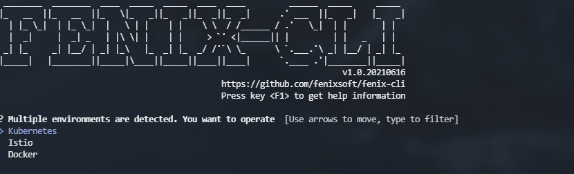
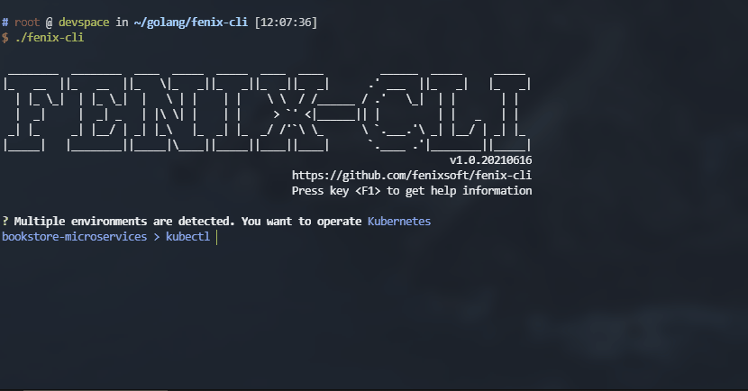
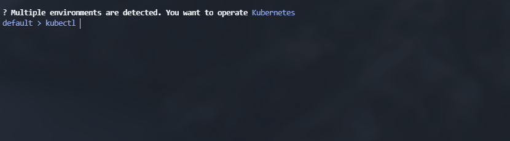
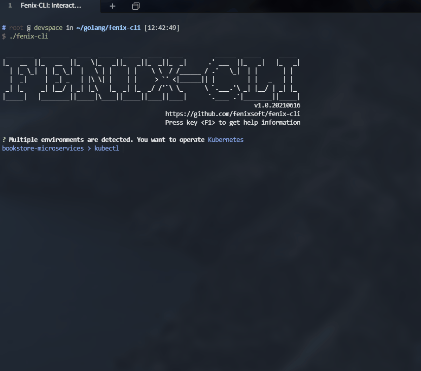
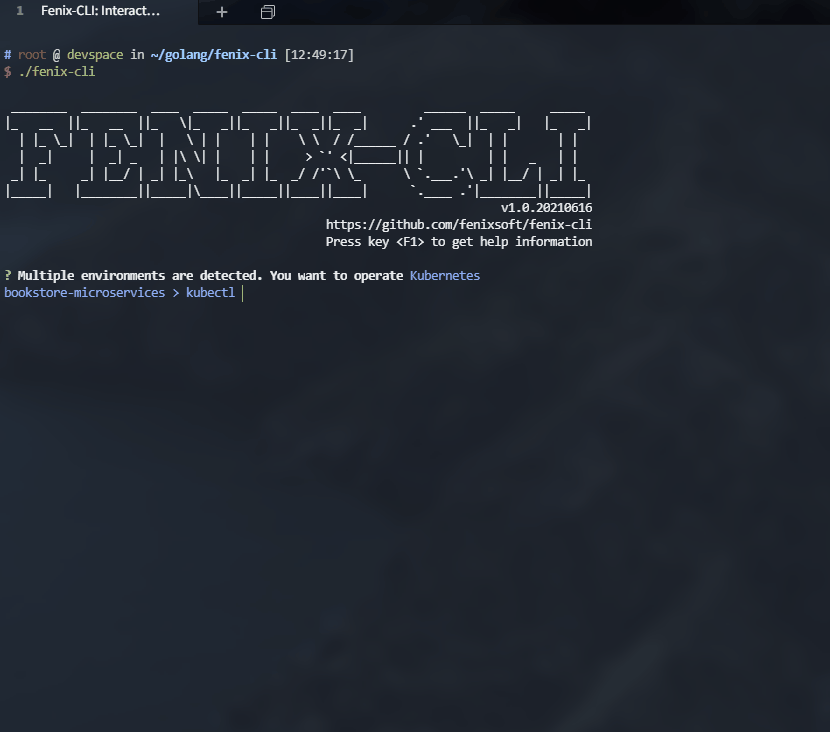
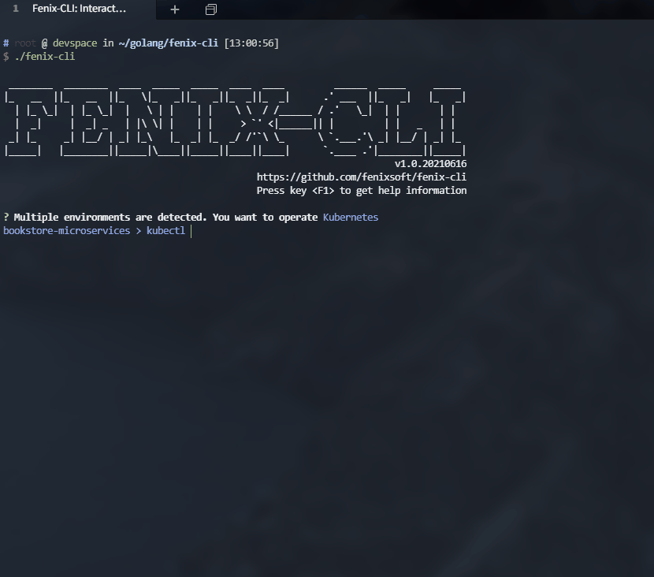

# Fenix-CLI：交互式云原生客户端

<a href="https://travis-ci.com/fenixsoft/fenix-cli" target="_blank" style="display:inline-block" class="not-print"></a>
<a href="https://icyfenix.cn/introduction/about-me.html" target="_blank" style="display:inline-block"></a>
<a href="https://www.apache.org/licenses/LICENSE-2.0" target="_blank" style="display:inline-block"></a>
<a href="https://github.com/fenixsoft/fenix-cli/releases" target="_blank" style="display:inline-block"></a>

Fenix-CLI是一款交互式的云原生运行环境客户端，目标是取代Docker的`docker cli`、Kubernetes的`kubectl`以及Istio的`istioctl`等命令行工具，提供具备操作一致性、具有额外指令增强、支持智能感知的交互式的终端界面。

## 特性

对比Docker、Kubernetes、Istio官方原版的客户端，Fenix-CLI具有如下特性：

1. **多运行环境支持**<br/>Fenix-CLI目前支持Docker、Kubernetes和Istio三种执行环境，后续计划扩展到OpenShift、Rancher、Podman、Containerd等其他常用的云原生环境。启动时会自动进行检测，列出已安装的环境供用户选择，运行时也可以使用快捷键`F2`随时切换。



2. **静态指令自动补全功能**<br/>Fenix-CLI支持官方原版客户端的所有指令、参数，并对指令和参数选项提供有自动补全与提示功能。其中大部分指令的介绍提示来源于以下官方参考文档：
   - [https://docs.docker.com/engine/reference/commandline/cli/](https://docs.docker.com/engine/reference/commandline/cli/)
   - [https://kubernetes.io/docs/reference/generated/kubectl/kubectl-commands](https://kubernetes.io/docs/reference/generated/kubectl/kubectl-commands)
   - [https://istio.io/latest/docs/reference/commands/istioctl/](https://istio.io/latest/docs/reference/commands/istioctl/)



3. **动态上下文数据的智能感知**<br/>除了静态的指令提示外，Fenix-CLI还能对当前环境中的动态数据进行感知。譬如Docker中的容器和镜像名称、运行状态；Kubernetes中的Pod、Deployment、Service等各类资源名称及状态；还有端口号、操作系统的文件目录信息进行提示和自动补全。目前支持的动态数据包括有：
   - Docker：
     - 镜像名称及状态信息
     - 容器名称及状态信息
     - 内部信息，如：容器暴露的端口号、文件路径等的提示
   - Kubernetes / Istio：
     - 各种资源的名称及状态：Pod、ComponentStatus、ConfigMap、Context、DeamonSet、Deployment、Endpoint、Ingress、Job、LimitRange、Node、Namespace、PersistentVolume、PodSecurityPolicy、PodTemplete、ReplicataSet、ReplicationController、ResourceQuota、ServiceAccount、Container、Events
     - 全局信息，如：集群上下文和命名空间等的提示
     - 内部信息，如：服务的暴露的端口号、文件路径等的提示


4. **交互式的批量操作**<br/>为方便同时管理多项资源，Fenix-CLI提供了交互式的CUI操作，支持单选、复选、快速过滤等功能，以满足一次性对多个资源进行同类操作。


5. **X指令**<br/>除了直接支持原版客户端全部标准指令之外，Fenix-CLI还额外扩展了一系列以`x-`开头的专有指令。这些X指令是Fenix-CLI的主要价值所在，具体可通过`F1`或者`x-help`进行查看。<br/>Fenix-CLI中有不少X指令依赖于开源的Krew Plugin来支持，为最大限度简化插件安装，Fenix-CLI的代码已集成Kubernetes的[Krew](https://github.com/kubernetes-sigs/krew)插件框架，因此无需任何额外操作即可使用全部Krew插件。下面对部分X指令功能列举如下：
   - 切换Kubernetes集群上下文和名称空间<br/>`x-context`用于切换当前Kubernetes客户端所管理的集群，适用于同一个客户端管理多个服务端集群的场合。<br/>`x-namespace`用于切换当前Kubernetes客户端所使用的名称空间，以简化在每个命令中都要带有`--namespace <ns>`参数的繁琐操作。当前的名称空间将会在命令提示符之前列出。
     
   - 批量管理资源<br/>`x-batch`用于批量管理资源，可以用于Docker环境下的容器和镜像，以及Kubernetes环境下的Pod、Deployment、Service等十余种常用资源。前面对交互式CUI的介绍中已演示了`x-batch`指令的用法。
   - 网络流量跟踪<br/>`x-sniff`用于记录Pod的网络流量。对于Gateway节点的流量，我们通常可以很方便地在浏览器上进行查看，但对微服务集群内部节点的网络访问，则较为不便，通常需要专门的追踪工具。`x-sniff`在无需安装任何追踪系统的前提下，通过自动注入tcpdump，将流量信息发送到TShark或者Wireshark进行分析（所以你的机器上还是需要安装了TShark或者Wireshark的）。同时，为简化TShark的复杂参数，默认提供了`summary`（只显示调用请求摘要）和`detail`（显示HTTP Header、Body全文）两种显示形式。该指令基于sniff插件实现：[https://github.com/eldadru/ksniff](https://github.com/eldadru/ksniff)
     
   - 查看各资源间关系<br/>`x-lens`指令用于通过Pod查询并显示相关资源之间的所有者关系。该指令基于pod-lens插件实现：[https://github.com/sunny0826/kubectl-pod-lens](https://github.com/sunny0826/kubectl-pod-lens)
     
   - 快速访问服务<br/>`x-open`用于根据服务暴露的端口，自动建立端口转发，并打开客户端中已安装的浏览器，直接访问该服务。该指令基于open-svc插件实现：[https://github.com/superbrothers/kubectl-open-svc-plugin](https://github.com/superbrothers/kubectl-open-svc-plugin)
   - 查看集群服务状态<br/>`x-status`用于查看当前Kubernetes集群中哪些资源运行正常、哪些存在问题，简化了反复多次`kubectl get`的麻烦。该指令基于status插件实现：[https://github.com/bergerx/kubectl-status](https://github.com/bergerx/kubectl-status)
     
   - ……

## 安装

- 自动安装：通过以下脚本，自动安装最新版的Fenix-CLI：

   ```bash
   curl -sL https://icyfenix.cn/fenix-cli/dl.sh | sh -
   ```

- 手动安装：如需其他版本，可在[GitHub Release](https://github.com/fenixsoft/fenix-cli/releases)页面获取Fenix-CLI的可执行文件。

- 使用：安装后输入`fenix-cli`进行使用

   ```bash
   fenix-cli
   ```

- Fenix-CLI仅支持Linux操作系统

## 规划

Fenix-CLI后续版本主要特性规划如下：

- 计划重构智能提示架构。目前静态指令的提示直接内置在程序代码之中，是以Docker v20.10.7（2021年6月）、Kubernetes v1.21（2021年4月）、Istio v1.10（2021年5月）为基准来实现的。随着官方客户端功能的不断发展扩充，靠程序代码去跟随必然难以为继。所幸目前主流的云原生客户端都是使用[spf13/cobra](spf13/cobra)作为CLI框架的，因此下个大版本计划重构Fenix-CLI的智能提示架构，支持通过外部DSL来进行驱动，并实现直接从运行机器上的Docker、Kubernetes等环境中实时取得指令与参数信息，自动生成DSL，以此达到自动跟随官方客户端的升级的目的。
- 计划支持更多云原生运行环境，如OpenShift、Rancher、Podman、Containerd等。
- 计划支持更丰富的X指令，譬如：
  - `x-log`：自动聚合Pod的日志输出。目前`kubectl logs`只能监视单个Pod，计划提供一个命令，将微服务相关的多个Pod日志聚合到一个屏幕上滚动跟踪。
  - `x-debug`：容器高级调试能力。从Kubernetes 1.18起，提供了`kubectl debug`指令为Pod注入调试容器（1.15-1.17是Ephemeral Feature），计划寻找或制作一个带有常用网络工具又足够精简的瑞士军刀式调试镜像，让Fenix-CLI能够调用该镜像快速进入Pod进行问题诊断。
  - ……
- 计划支持运行环境自动安装功能。由于中国网络状况限制，Kubernetes等环境需要访问Google仓库，安装十分不便，因此考虑在Fenix-CLI中提供运行环境一键部署的能力。此特性客户端的工作量不大，但服务端做自动从国外拉取镜像的机器人较为繁琐。
- 计划支持多语言，至少会提供中文语言的支持，有一定翻译工作量。
- 计划补全单元测试和E2E测试。
- 计划提供一些真实环境中使用Fenix-CLI去运维、诊断、出错的具体案例。

## 交流

- 建议：
  - 如对Fenix-CLI本身的功能有问题或者建议，欢迎在此Repository中提出Issues。
  - 如对Fenix-CLI所使用的Krew Plugin有问题或者建议，可在介绍里列出的这些Plugin的原Repository中提出。
- 贡献：
  - 欢迎pull request、feature request，欢迎任何形式的协作。
- 致谢：
  - 特别致谢[c-bata](https://github.com/c-bata)：Fenix-CLI项目的命令行提示框架基于[c-bata/go-prompt](https://github.com/c-bata/go-prompt)实现，部分Kubernetes提示功能直接使用到了[c-bata/kube-prompt](https://github.com/c-bata/kube-prompt)代码。

## 协议

- 本文档代码部分采用 Apache 2.0 协议进行许可。遵循许可的前提下，你可以自由地对代码进行修改，再发布，可以将代码用作商业用途。但要求你：
  - **署名**：在原有代码和衍生代码中，保留原作者署名及代码来源信息。
  - **保留许可证**：在原有代码和衍生代码中，保留 Apache 2.0 协议文件。

