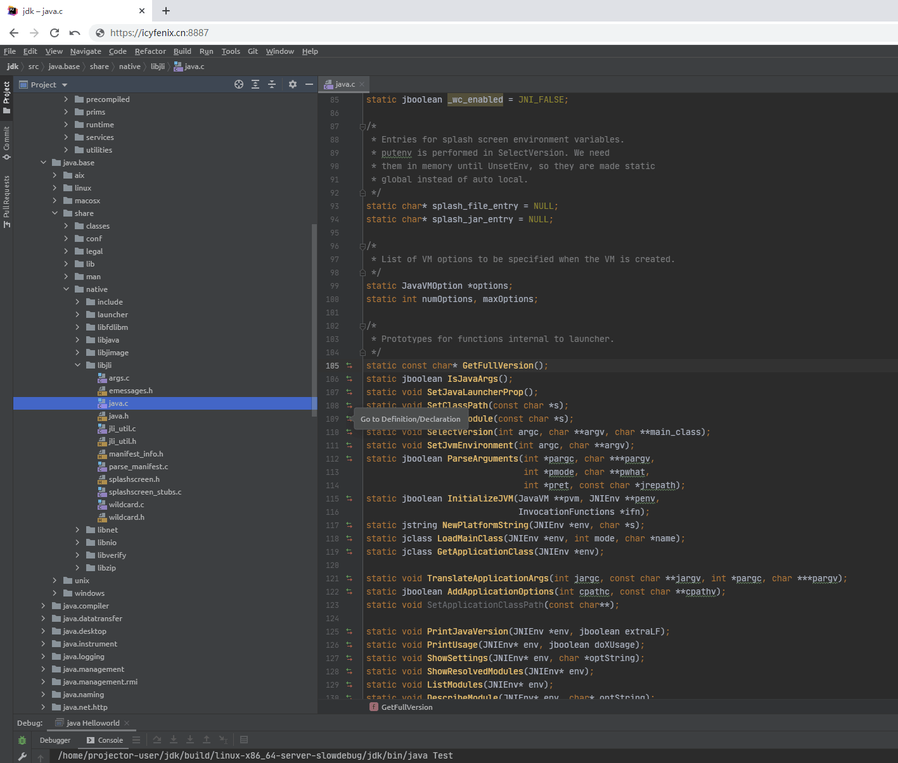
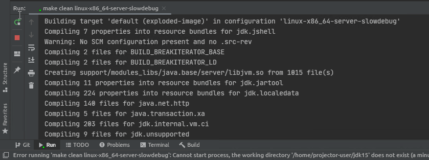
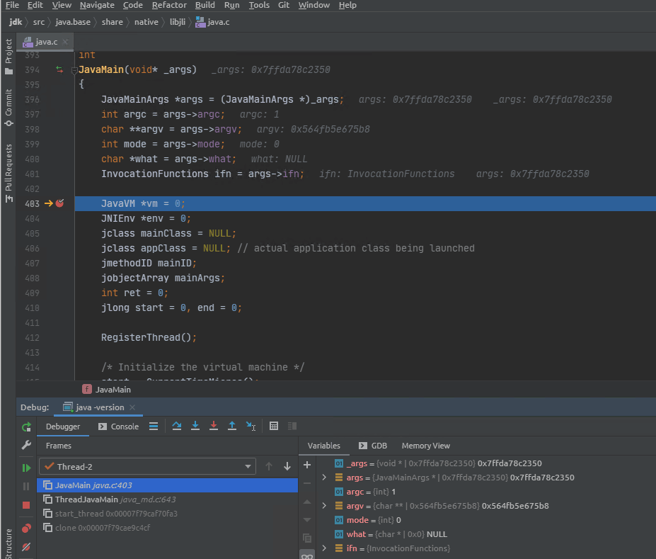

# OpenJDK with CLion懒人包

一组快速环境构建、编译、修改、裁剪、调试OpenJDK的懒人包。

本工程是笔者在[JetBrains Projector](https://github.com/JetBrains/projector-server)项目基础上修改的headlessly集成开发环境。目标是客户端可以仅通过浏览器，实现在CLion图形化集成开发环境中进行OpenJDK的开发调试工作。JetBrains Projector提供了比直接使用X11 Forwarding、RDP或VNC更高效的远程图形性能，在本机环境或者局域网环境中使用时，能获得几乎与Native IDE相同的响应速度和操作体验。可以说此懒人包确是偷懒的方案，但并非玩具，能够作为VSC Remote之外，另一种本机编码远端编译运行的解决方案，实际应用于生产之中。

## 使用方法

1. 运行以下Docker镜像：
    ```bash
    docker run -it --rm -p 8887:8887 icyfenix/openjdk-clion:latest
    ```
    此镜像支持Linux、Windows、WSL2、MacOS等宿主环境，不过编译结果与宿主环境无关，编译输出均是Linux-Server-64 Bits的OpenJDK，如需调整，可参见“编译镜像”一节。
    出于OpenJDK编译本身[资源需求](https://hg.openjdk.java.net/jdk/jdk/raw-file/tip/doc/building.html#build-hardware-requirements)，此容器要求可使用的资源至少应为2 Cores、4 GB RAM、6 GB Disk。

2. 容器启动后，在浏览器中打开[http://localhost:8887](http://localhost:8887)，出现如下界面：
   :::center
   
   :::
   CLion并没有像IDEA那样提供免费的社区版，所以这步买了JetBrains产品同学的填账号，没有买的就选择"Evaluate for free"试用30天。JetBrains IDE[允许](https://github.com/JetBrains/projector-docker#license)以Projector方式封装为Docker镜像去使用，但IDE本身是收费的，JetBrains对学生、开源作者都有免费授权，产品也极为优秀，希望你能支持正版。

3. 进入主界面，选择Open，笔者在HOME目录下放了一份JDK15源码，此源码在镜像编译时已自动生成了Slow Debug配置项，并生成好了对应的[Compilation Database](https://hg.openjdk.java.net/jdk/jdk/raw-file/tip/doc/ide.html)和CLion的工程配置，因此你可以直接在IDE中导入这个工程。
    :::center
    
    :::

4. 打开工程，待IDE自动更新符号表、索引文件结束之后（视宿主机的性能不同，可能要几分钟时间），你即可以：
    - 阅读浏览OpenJDK源码。<br/>CLion的各种代码导航、辅助功能可以帮助你更方便地了解工程结构。
    - 修改OpenJDK源码并重编译。<br/>通过Build菜单中的Build Project或Rebuild Project选项，可增量编译或全量编译源码。全量编译可能需要十分钟以上的时间，但增量编译一般较快，所以在Run/Debug Configurations中默认也会进行增量编译，如果你不希望这样做，可自行在Before Luanch菜单中移除。
      :::center
      
      :::
      另再次强调笔者预置的编译配置项为Slow Debug，保留了符号表，禁用了大部分优化，这意味着它很适合调试，但不适合真正地应用于生产环境。如果你需要发布正式产品，请自行建立Release配置项，做法可参见“编译镜像”一节。。

    - 跟踪调试HotSpot虚拟机。
      笔者预置提供了`java -version`和`java Helloworld`两个运行配置。如果你是刚刚开始接触OpenJDK源码，不妨在`~/jdk/java.base/share/native/libjli/java.c`的`JavaMain(void * _args)`方法上打个断点，由此开启你学习HotSpot内部实现的旅程。
      :::center
      
      :::
      在开始调试之前，你最好至少进行过一次编译，生成了二进制的可运行程序，否则将会在首次运行时自动进行全量编译。

    - 调试自己的Java代码。
      笔者在`/playgrounds`中预置了一个Helloworld Class供测试之用，倘若你跟踪HotSpot的目的是想解决学习工作中预见的真实问题，那可以把你自己的Class或者Jar文件映射到容器中进行调试，譬如：
        ```bash
      docker run -it --rm -p 8887:8887 -v JAVA-APP-PATH:/home/projector-user/playgrounds icyfenix/openjdk-clion:latest
        ```


## 编译镜像

本镜像是以Debian 10为基座，整合了JetBrains Projector Server、JetBrains Clion 2020.3、OpenJDK 15（作为Bootstrap JDK）二进制包，以及一份OpenJDK 15的源码，内容多，容量大，所以编译镜像必须具备良好的网络条件，尤其是科学上网。编译步骤倒是颇为简单，具体为：

1. 克隆本工程。
   ```bash
   git clone https://github.com/fenixsoft/openjdk-for-dummies.git
   ```
   **建议**：创建一个空目录，然后在该目录中克隆本工程。由于镜像编译时还会克隆Projector Server与OpenJDK项目，因此它的Docker Build Context是父目录而不是通常的当前目录。如果父目录中有其他内容，将会导致发送给Docker Daemon的内容变多，导致编译时间变长。

2. 克隆Projector Server与OpenJDK。
   ```bash
   ./clone-core.sh
   ```

3. 编译镜像。
   ```bash
   ./build-container.sh
   ```
镜像编译的过程是完全傻瓜式的，但是实际内容很多，时间也很长，不妨先浏览一下`Dockerfile`文件，看看镜像具体做了什么事情，有时候一些小的修改会提高很多的编译效率，譬如脚本中出于版本兼容性考虑，关闭了[Docker BuildKit](https://docs.docker.com/develop/develop-images/build_enhancements/)，打开会使得重复编译的速度有很大提升。

你可能会基于以下目的，希望编译、定制一份新的镜像：

- 希望将它作为正式的工作环境，想保存JetBrains账号、个人习惯配置等信息。笔者建议是你完成配置之后，采用`docker commit`命令来保存变更，无必要从头开始构建，这样会快捷许多。

- 希望变更内置的JDK源码的版本。JDK的源码是通过`clone-core.sh`文件下载的，可以通过修改此文件中JDK的GitHub地址来切换不同的版本，如下：

  ```bash
  git clone https://github.com/openjdk/jdk15.git ../jdk-source
  ```

- 希望采用不同的编译配置，譬如编译32 Bits版本，譬如交叉编译出其他系统的JDK版本、譬如建立Fast Debug、Release等其他编译配置项等。这些信息定义在`Dockerfile`的`configure`中，你可以调整此行的参数来实现：

  ```bash
  ./configure --with-boot-jdk=/usr/lib/jvm/openjdk-15-jdk --with-debug-level=slowdebug --disable-warnings-as-errors --build=x86_64-unknown-linux-gnu --host=x86_64-unknown-linux-gnu --with-version-opt=icyfenix.cn
  ```

- 希望切换IDE版本、加入其他辅助软件或者IDE Plugins。CLion IDE的下载地址`build-container.sh`之中，你可以在[这里](https://github.com/JetBrains/projector-installer/blob/master/projector_installer/compatible_ide.json)找到其他兼容的IDE列表，更换其中的下载地址即可。

  ```bash
  downloadUrl=${2:-https://download.jetbrains.com/cpp/CLion-2020.3.2.tar.gz}
  ```

  IDE也可以直接在市场中安装Plugins，但想支持独立于IDE的其他软件（譬如中文输入法）则有较大困难。由于Projector本质上是一种AWT的实现，因此只可能支持Swing应用以headlessly形式运行，在获得良好交互性能的同时，也决定了它不太可能像RDP、VNC那样实现与应用无关的全面兼容性。

## 其他

- 如果打算使用此镜像用作实际工作环境，建议采用JetBrains专门提供的PWA外壳（[Projector Luancher](https://github.com/JetBrains/projector-client/releases)）来代替Chrome、Safari浏览器。否则在浏览器中写代码总会遇到一些冲突问题，譬如查找代码`Ctrl+F`却弹出了浏览器的搜索框等。
- 如果你打算以iPad作为编码客户端，那服务器就不能使用SSL（仅能用HTTP，不能用HTTPS），因为iPad不支持[Self-Signed](https://en.wikipedia.org/wiki/Self-signed_certificate) WebSockets。
- 如果响应好的话，后续笔者可能会再做一些别的复杂环境，譬如Kubernetes（应该会是K3S）配GoLand之类的源码IDE镜像。
- 镜像压缩后有2.08 GB，Keep Patient。

## 协议

- 本文档代码部分采用[Apache 2.0协议](https://www.apache.org/licenses/LICENSE-2.0)进行许可。遵循许可的前提下，你可以自由地对代码进行修改，再发布，可以将代码用作商业用途。但要求你：
  - **署名**：在原有代码和衍生代码中，保留原作者署名及代码来源信息。
  - **保留许可证**：在原有代码和衍生代码中，保留Apache 2.0协议文件。
